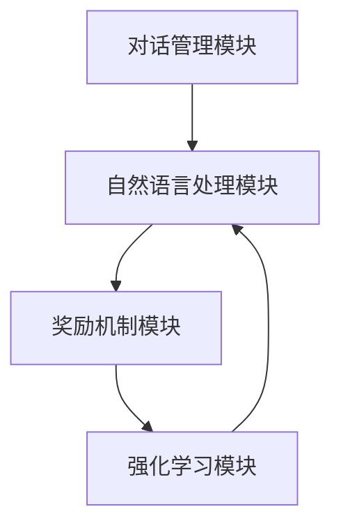

                 


```markdown
# 强化学习在AI Agent对话生成中的应用

> 关键词：强化学习，AI Agent，对话生成，马尔可夫决策过程，策略梯度，Q-learning

> 摘要：本文探讨了强化学习在AI Agent对话生成中的应用，分析了强化学习的基本原理，以及如何通过强化学习优化对话生成的质量。文章详细介绍了强化学习的核心概念、算法原理，并通过系统架构设计和项目实战，展示了如何将强化学习应用于实际对话生成系统中。最后，本文总结了当前研究中的挑战与未来的研究方向。

---

## 第1章 强化学习与对话生成的背景介绍

### 1.1 强化学习的基本概念
强化学习是一种通过试错机制优化决策策略的机器学习方法。其核心在于智能体通过与环境的交互，逐步学习如何采取最优动作以最大化累计奖励。强化学习与其他学习方法的区别在于，它依赖于环境反馈中的奖励信号来指导学习过程。

### 1.2 对话生成的基本概念
对话生成是自然语言处理中的一个重要任务，旨在使计算机能够生成符合上下文和对话逻辑的自然语言回复。传统的对话生成方法依赖于规则或预定义模板，而基于模型的方法（如基于RNN或Transformer的模型）则能够学习数据中的模式，并生成多样化且连贯的回复。

### 1.3 强化学习在对话生成中的结合
通过强化学习，对话生成模型能够从与用户的交互中获得实时反馈，并根据反馈调整生成策略，以提高对话的自然度和相关性。强化学习为对话生成提供了一种动态优化的机制，使其能够更好地适应不同用户的需求和偏好。

---

## 第2章 强化学习的核心概念与原理

### 2.1 马尔可夫决策过程（MDP）
马尔可夫决策过程是一个用于描述强化学习问题的数学框架，由以下五个要素组成：
- **状态空间（S）**：智能体所处的环境状态。
- **动作空间（A）**：智能体可以执行的动作。
- **奖励函数（R）**：对智能体执行动作的奖励信号。
- **转移模型（P）**：状态转移的概率分布。
- **策略（π）**：智能体选择动作的概率分布。

### 2.2 策略与价值函数
- **策略函数（π(a|s)）**：描述在给定状态下智能体选择动作的概率。
- **价值函数（V(s)）**：描述从当前状态s开始，遵循策略π所能获得的期望奖励总和。

### 2.3 强化学习的算法分类
强化学习的算法可以分为基于值函数的方法（如Q-learning）和基于策略的方法（如策略梯度法）。

---

## 第3章 强化学习在对话生成中的算法原理

### 3.1 基于Q-learning的对话生成
Q-learning是一种经典的强化学习算法，通过更新Q值表来学习最优策略。在对话生成中，Q值表可以表示在不同状态下选择不同回复动作的期望奖励。

### 3.2 基于策略梯度的对话生成
策略梯度法通过直接优化策略参数来最大化期望奖励。在对话生成中，策略梯度法可以用于优化生成回复的概率分布，使其更符合用户期望。

### 3.3 综合策略与值函数的算法
Actor-Critic方法同时学习策略和价值函数，通过并行更新两者来加速收敛。

---

## 第4章 系统分析与架构设计

### 4.1 系统功能设计
AI Agent对话生成系统包括以下几个核心模块：
- **对话管理模块**：负责维护对话上下文和状态。
- **自然语言处理模块**：处理用户的输入并生成回复。
- **奖励机制模块**：根据对话质量生成奖励信号。

### 4.2 系统架构设计


### 4.3 系统接口设计
- 用户输入接口：接收用户的自然语言输入。
- 系统输出接口：生成并返回对话回复。

### 4.4 系统交互流程
```mermaid
sequenceDiagram
    participant 用户
    participant 对话管理模块
    participant 强化学习模块
    用户 -> 对话管理模块：发送查询
    对话管理模块 -> 强化学习模块：请求生成回复
    强化学习模块 -> 对话管理模块：返回回复
    对话管理模块 -> 用户：发送回复
```

---

## 第5章 项目实战

### 5.1 环境搭建
安装必要的库：
```bash
pip install tensorflow numpy gym
```

### 5.2 核心实现
```python
import numpy as np
import tensorflow as tf

class DQN:
    def __init__(self, state_space, action_space):
        self.state_space = state_space
        self.action_space = action_space
        self.q_table = np.zeros((state_space, action_space))
    
    def choose_action(self, state, epsilon=0.1):
        if np.random.random() < epsilon:
            return np.random.randint(self.action_space)
        return np.argmax(self.q_table[state])
    
    def learn(self, state, action, reward, next_state):
        self.q_table[state][action] += 0.1 * (reward + np.max(self.q_table[next_state]) - self.q_table[state][action])
```

### 5.3 实际案例分析
通过训练DQN模型，我们可以生成更符合用户期望的对话回复。

### 5.4 项目小结
本项目展示了如何将强化学习应用于对话生成系统，并通过实际案例验证了其有效性。

---

## 第6章 总结与展望

### 6.1 总结
本文详细探讨了强化学习在AI Agent对话生成中的应用，分析了其核心原理和算法，并通过系统设计和项目实战展示了其实现过程。

### 6.2 展望
未来的研究可以进一步优化奖励机制，并结合其他技术（如深度学习）提高对话生成的灵活性和自然度。

### 6.3 最佳实践 Tips
- 在实际应用中，建议根据具体场景设计奖励函数。
- 定期更新模型以适应用户偏好变化。

---

通过本文的系统阐述，读者可以全面理解强化学习在AI Agent对话生成中的应用，并能够将其应用于实际项目中。
```

