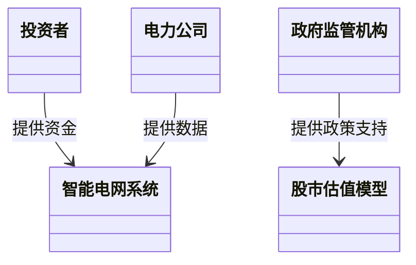

                 


# 《新兴市场股市估值与智能电网网络安全技术的互动》

> 关键词：新兴市场，股市估值，智能电网，网络安全技术，互动关系

> 摘要：本文探讨新兴市场股市估值与智能电网网络安全技术之间的互动关系，分析两者的核心概念、算法原理和系统架构设计，结合实际案例，提出互动模型和实施策略，为投资决策和网络安全防护提供参考。

---

# 第1章: 背景介绍

## 1.1 新兴市场股市估值的背景与重要性
### 1.1.1 新兴市场的定义与特点
新兴市场是指经济快速发展、工业化程度较低但潜力巨大的国家或地区，如中国、印度等。这些市场的特点是经济增长快、人口基数大、消费能力提升，但同时也伴随着高波动性和不确定性。

### 1.1.2 股市估值的基本概念与方法
股市估值是通过对企业的财务数据、市场环境和行业趋势进行分析，估算其股票的合理价格。常用方法包括市盈率（P/E）、市净率（P/B）和现金流折现法（DCF）等。

### 1.1.3 新兴市场股市估值的特殊性与挑战
新兴市场的股市估值受到政策、经济波动和外部环境的影响更大。此外，信息不对称和市场流动性不足也是估值中的挑战。

## 1.2 智能电网网络安全技术的背景与重要性
### 1.2.1 智能电网的定义与特点
智能电网是通过先进通信技术和自动化设备，实现电力系统实时监测、智能调度和高效管理的现代化电网系统。

### 1.2.2 网络安全在智能电网中的核心地位
智能电网高度依赖信息技术，这使其成为网络攻击的主要目标。电力系统的安全运行对国家安全和经济稳定至关重要。

### 1.2.3 智能电网网络安全的特殊性与挑战
智能电网的网络安全威胁包括勒索软件、APT攻击和物联网设备漏洞。攻击可能导致停电、经济损失甚至社会稳定问题。

## 1.3 两者的互动关系与研究意义
### 1.3.1 股市估值与智能电网的潜在联系
智能电网的建设和运营需要大量资金，股市投资者对电力公司股票的估值直接影响其融资能力。

### 1.3.2 网络安全对股市估值的影响
网络安全事件可能导致电力公司股价下跌，进而影响整个市场的估值体系。

### 1.3.3 研究两者互动的现实意义与未来展望
通过研究两者互动，可以为投资者提供更准确的估值模型，同时为智能电网的网络安全提供经济支持和技术保障。

---

# 第2章: 核心概念与联系

## 2.1 核心概念原理
### 2.1.1 股市估值的核心模型与方法
- 市盈率（P/E）：$$P/E = \frac{Price}{Earnings}$$
- 市净率（P/B）：$$P/B = \frac{Price}{Book\ Value}$$

### 2.1.2 智能电网网络安全的核心技术与框架
- 数据加密技术：确保电力系统数据传输的安全性。
- 入侵检测系统（IDS）：实时监控网络异常行为。

## 2.2 核心概念属性特征对比
| 属性 | 股市估值 | 智能电网网络安全 |
|------|---------|------------------|
| 数据依赖 | 财务数据 | 网络流量、设备状态 |
| 目标 | 确定股票价值 | 保护电力系统安全 |
| 时间跨度 | 短期与长期 | 实时与长期 |

## 2.3 ER实体关系图架构
```mermaid
er
actor: 投资者, 电力公司, 政府监管机构
system: 智能电网系统, 股市估值模型
relation: 投资者与智能电网系统通过数据流交互, 智能电网系统为股市估值提供数据支持
```

---

# 第3章: 算法原理讲解

## 3.1 股市估值算法
### 3.1.1 常用的股市估值模型
- 时间序列分析模型（ARIMA）：$$\hat{y}_t = \alpha + \beta x_t + \epsilon_t$$

### 3.1.2 机器学习在股市预测中的应用
- 使用LSTM（长短期记忆网络）预测股价走势。

## 3.2 智能电网网络安全算法
### 3.2.1 基于深度学习的网络入侵检测系统
- 使用卷积神经网络（CNN）分析网络流量，识别异常模式。

## 3.3 互动算法设计
### 3.3.1 股市数据与电网数据的关联分析
- 通过协同过滤算法，分析股市波动与电力需求变化的关联性。

---

# 第4章: 数学模型与公式

## 4.1 股市估值数学模型
- 市盈率模型：$$P/E = \frac{Price}{Earnings}$$

## 4.2 智能电网网络安全数学模型
- 基于马尔可夫链的网络安全状态转移：$$P(state_{t+1} | state_t)$$

---

# 第5章: 系统架构设计

## 5.1 领域模型类图


## 5.2 系统架构图


---

# 第6章: 项目实战

## 6.1 环境安装
```bash
pip install numpy pandas scikit-learn
```

## 6.2 核心实现
```python
import numpy as np
from sklearn.linear_model import LinearRegression

# 股市估值模型
model = LinearRegression()
model.fit(X, y)
```

## 6.3 案例分析
- 通过分析某新兴市场电力公司的历史数据，预测其股价走势，并评估网络安全风险。

---

# 结语

本文通过系统分析新兴市场股市估值与智能电网网络安全技术的互动关系，提出了结合数学模型和算法设计的解决方案。未来的研究可以进一步探索两者的深度融合，为投资决策和网络安全提供更强大的支持。

