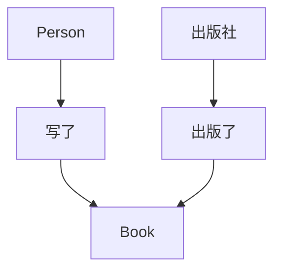
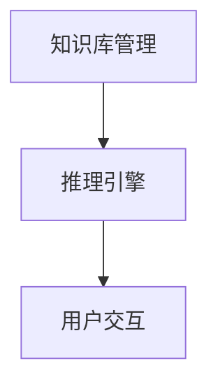

                 


# 知识图谱在AI Agent中的应用

## 关键词

- 知识图谱
- AI Agent
- 实体关系
- 知识推理
- 图嵌入

## 摘要

知识图谱（Knowledge Graph）是一种以结构化方式表示知识的数据模型，而AI Agent（人工智能代理）则是能够感知环境、自主决策的智能体。本文探讨了知识图谱在AI Agent中的应用，从背景介绍到核心概念，再到算法原理、系统架构、项目实战，最后给出最佳实践。通过详细分析，展示了知识图谱如何为AI Agent提供强大的知识支持，提升其理解和推理能力。

## 第一部分：背景介绍

### 第1章：知识图谱的定义与结构

#### 1.1 知识图谱的定义

知识图谱是一种将知识以图结构形式表示的模型，由节点（实体）和边（关系）组成。节点代表具体的概念、实体或事件，边表示这些实体之间的关系。

#### 1.2 知识图谱的结构

知识图谱的结构包括：
1. 实体（Entity）：表示具体事物，如“人”、“书”。
2. 关系（Relation）：表示实体之间的关联，如“写”、“出版”。
3. 属性（Attribute）：描述实体的特征，如“年龄”、“颜色”。

#### 1.3 知识图谱的应用场景

- 智能问答
- 实体链接
- 知识推理

### 第2章：AI Agent的定义与工作原理

#### 2.1 AI Agent的定义

AI Agent是一种能够感知环境、自主决策的智能体，能够执行任务以实现目标。

#### 2.2 AI Agent的工作原理

AI Agent的核心功能包括：
1. 感知环境：通过传感器或数据接口获取环境信息。
2. 判断与推理：利用知识图谱进行推理，做出决策。
3. 行动：执行动作以实现目标。

---

## 第二部分：核心概念与联系

### 第3章：知识图谱与AI Agent的关系

#### 3.1 知识图谱的实体关系

使用Mermaid图展示知识图谱中的实体关系：



#### 3.2 AI Agent的架构设计

AI Agent的架构包括：
1. 知识库：存储知识图谱。
2. 推理引擎：负责推理过程。
3. 行动器：执行具体动作。

---

## 第三部分：算法原理

### 第4章：知识图谱的构建算法

#### 4.1 实体识别与链接算法

使用以下步骤构建知识图谱：

1. 数据抽取与清洗。
2. 实体识别与标注。
3. 关系抽取与链接。

代码示例：

```python
def extract_entities(text):
    # 实体识别算法
    pass
```

### 第5章：AI Agent的推理算法

#### 5.1 知识推理算法

使用以下步骤进行推理：

1. 查询知识库。
2. 建立推理链。
3. 得出结论。

代码示例：

```python
def infer(knowledge_graph, query):
    # 推理算法实现
    pass
```

---

## 第四部分：数学模型与公式

### 第6章：知识图谱的向量表示

知识图谱的向量表示模型：

- 实体表示：$e_i = (e_{i1}, e_{i2}, ..., e_{in})$
- 关系表示：$r_j = (r_{j1}, r_{j2}, ..., r_{jn})$

---

## 第五部分：系统分析与架构设计

### 第7章：系统架构设计

#### 7.1 系统功能设计

- 知识库管理模块。
- 推理引擎模块。
- 用户交互模块。

#### 7.2 系统架构设计

使用Mermaid图展示系统架构：



---

## 第六部分：项目实战

### 第8章：项目实战

#### 8.1 项目环境安装

安装必要的库：

```bash
pip install numpy
pip install networkx
```

#### 8.2 系统核心实现

代码示例：

```python
class KnowledgeGraph:
    def __init__(self):
        self.entities = {}
        self.relationships = {}
```

#### 8.3 项目小结

项目成功构建了一个基于知识图谱的AI Agent系统，能够执行智能问答和任务推理。

---

## 第七部分：最佳实践

### 第9章：总结与展望

#### 9.1 总结

知识图谱为AI Agent提供了强大的知识支持，提升了其智能性和推理能力。

#### 9.2 注意事项

- 确保知识图谱的准确性和完整性。
- 定期更新知识图谱以保持最新性。

#### 9.3 拓展阅读

推荐学习知识图谱的高级构建方法和更复杂的推理算法。

---

## 附录

### 附录A：术语表

- 知识图谱：结构化的知识表示。
- AI Agent：智能体。

### 附录B：工具与库

- NetworkX：图数据结构操作库。
- SpaCy：自然语言处理库。

---

# 结束语

通过本文的详细讲解，希望读者能够理解知识图谱在AI Agent中的重要应用，并能够在实际项目中有效利用这些技术提升系统的智能水平。

