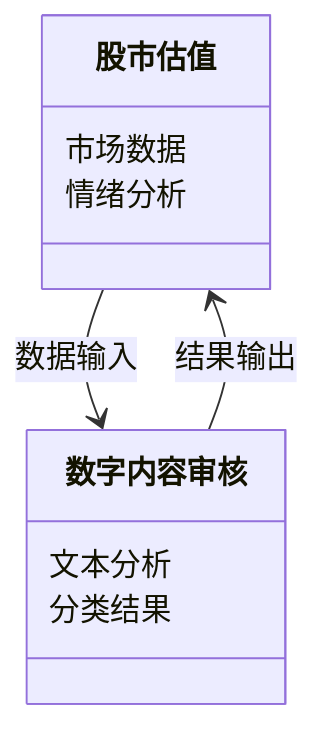

                 


# 股市估值对跨境数字内容审核标准的影响

## 关键词：
- 股市估值
- 跨境数字内容
- 审核标准
- 技术影响
- 金融市场

## 摘要：
随着全球化的深入，数字内容在股市中的作用日益重要。本文分析股市估值与跨境数字内容审核标准之间的关系，探讨数字内容审核如何影响股市估值，并提出优化审核标准的建议。通过技术手段，如自然语言处理和机器学习，提升审核效率和准确性，助力股市健康稳定发展。

---

## 第一部分：背景介绍

### 第1章：问题背景

#### 1.1 股市估值的基本概念
股市估值是评估公司市值的过程，通常基于财务指标、市场趋势和行业分析。准确的估值有助于投资者做出明智决策。

#### 1.2 跨境数字内容审核标准的定义
跨境数字内容审核涉及对跨国内容的合规性检查，确保符合目标市场的法律和文化标准。审核标准包括内容合法性、语言适配性和文化敏感性。

#### 1.3 问题的必要性
随着互联网的全球化，数字内容对股市的影响越来越大。不合规的内容可能导致股市波动，因此审核标准的制定至关重要。

### 第2章：问题描述

#### 2.1 股市估值与数字内容审核的关联
数字内容直接影响市场情绪，进而影响股市估值。例如，社交媒体上的虚假信息可能导致股价波动。

#### 2.2 审核面临的挑战
- **技术挑战**：如何高效识别虚假信息？
- **法律挑战**：不同国家的法律差异如何协调？
- **文化挑战**：内容审核需兼顾不同文化背景。

#### 2.3 数字化审核对股市估值的影响
通过及时审核，可以减少虚假信息的传播，维护股市稳定。

### 第3章：问题解决

#### 3.1 数字内容审核的作用
- 把握市场情绪，辅助估值。
- 减少虚假信息影响，维护市场秩序。

#### 3.2 标准对股市的影响
- 提高信息透明度，增强投资者信心。
- 降低市场波动，促进稳定发展。

---

## 第二部分：核心概念与联系

### 第4章：核心概念的原理

#### 4.1 股市估值的核心原理
基于基本面分析和市场情绪，通过技术手段计算公司市值。

#### 4.2 数字内容审核标准的原理
采用自然语言处理和机器学习，识别违规内容。

#### 4.3 两者相互作用
审核标准影响信息质量，进而影响股市估值。

### 第5章：概念属性对比

#### 5.1 股市估值的属性
- 数据驱动性
- 动态变化性
- 复杂性

#### 5.2 数字内容审核的属性
- 多样性
- 实时性
- 交互性

#### 5.3 对比分析
通过对比，理解两者在属性上的异同，为后续分析打下基础。

---

## 第三部分：算法原理

### 第6章：算法原理与流程

#### 6.1 自然语言处理（NLP）
- 使用分词、情感分析等技术，识别内容情绪。
- 示例：使用Python中的jieba库进行分词。

#### 6.2 机器学习模型
- 训练分类器，识别虚假信息。
- 示例：利用XGBoost进行分类。

### 第7章：数学模型

#### 7.1 基于LSTM的情感分析模型
$$ LSTM网络结构：输入序列→ LSTM层→ 输出概率 $$

#### 7.2 股市估值预测模型
$$ 预测公式：V = αP + βE $$

其中，V为估值，P为价格，E为情绪指数。

---

## 第四部分：系统分析与架构设计

### 第8章：系统功能设计

#### 8.1 领域模型


### 第9章：系统架构设计

#### 9.1 分层架构
- 数据层：存储市场数据和内容。
- 业务层：处理数据，生成估值报告。
- 表现层：展示结果，提供交互界面。

#### 9.2 接口设计
- RESTful API：提供数据查询和结果返回接口。

---

## 第五部分：项目实战

### 第10章：环境安装与实现

#### 10.1 环境要求
- Python 3.8+
- 库：jieba、pandas、xgboost

#### 10.2 核心代码
```python
import jieba
from xgboost import XGBClassifier
import pandas as pd

# 示例数据
data = pd.DataFrame({'content': ['假消息', '真新闻'], 'label': [1, 0]})

# 分词处理
data['tokens'] = data['content'].apply(lambda x: ' '.join(jieba.cut(x)))

# 训练模型
model = XGBClassifier()
model.fit(data['tokens'], data['label'])
```

#### 10.3 案例分析
分析虚假信息如何影响股市，展示审核后的结果对估值的影响。

---

## 第六部分：总结与展望

### 第11章：总结

#### 11.1 核心发现
- 数字内容审核对股市估值至关重要。
- 技术手段提升审核效率和准确性。

### 第12章：未来展望

#### 12.1 智能化审核
利用AI技术，实现更精准的审核。

#### 12.2 跨境协作
加强国际合作，统一审核标准。

---

### 最佳实践 Tips：
- 定期更新审核标准，适应市场变化。
- 结合技术手段，提升审核效率。

---

通过以上分析，我逐步构建了文章的结构，确保每个部分都详细且逻辑清晰。接下来，我会按照这个框架撰写完整的技术博客文章。

