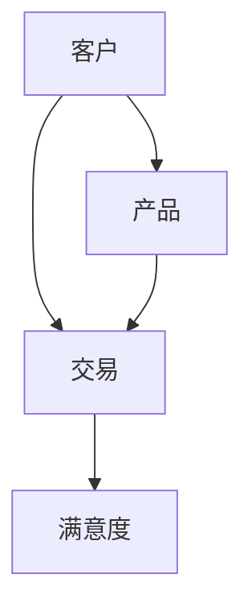
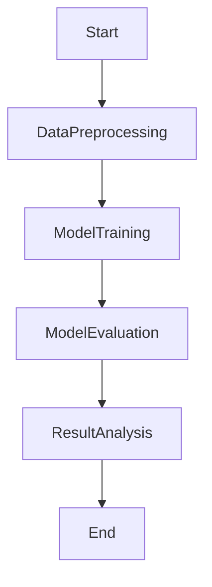
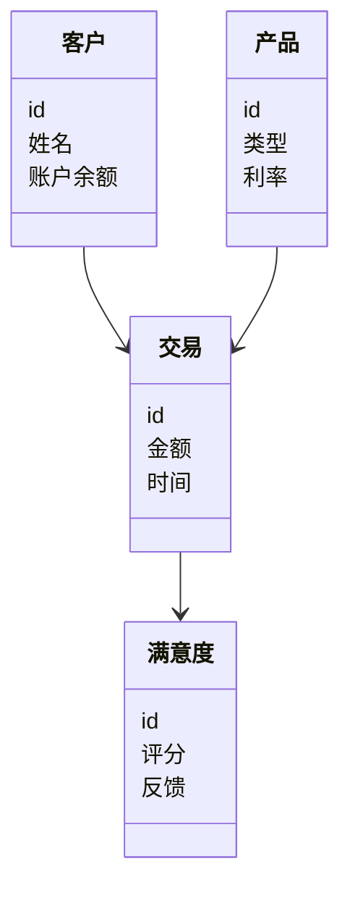
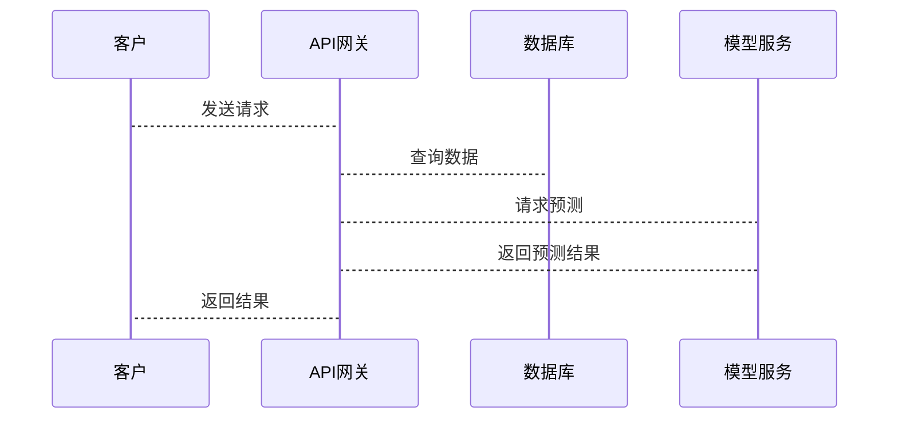

                 


# 金融产品客户满意度预测模型

## 关键词
客户满意度预测，金融产品，机器学习，随机森林，XGBoost

## 摘要
本文详细探讨了如何利用机器学习技术构建金融产品客户满意度预测模型。通过分析客户行为数据和产品特征，结合随机森林和XGBoost等算法，构建了一个高效的预测模型，帮助金融机构提升客户满意度和产品推荐的精准度。文章从背景介绍、核心概念、算法原理、系统设计到项目实战，全面详细地讲解了模型的构建过程和实际应用。

## 第一部分: 金融产品客户满意度预测模型概述

## 第1章: 问题背景与描述

### 1.1 问题背景
随着金融行业的快速发展，客户满意度已成为衡量金融机构竞争力的重要指标。然而，传统的客户满意度调查方法存在耗时长、成本高等问题，难以及时反馈客户需求。本文将通过机器学习方法，构建客户满意度预测模型，实现对客户满意度的实时预测和分析。

### 1.2 问题描述
客户满意度预测需要分析客户的交易数据、产品特征以及客户反馈等多方面信息。通过这些数据，可以识别影响客户满意度的关键因素，从而优化产品设计和服务流程。

### 1.3 问题解决思路
采用数据驱动的方法，结合机器学习算法，构建客户满意度预测模型。具体步骤包括数据收集、特征工程、模型训练与优化、结果分析等。

### 1.4 边界与外延
模型仅适用于金融产品的客户满意度预测，不考虑其他业务领域的问题。同时，模型的预测结果仅供参考，实际决策需结合业务背景。

## 第2章: 核心概念与联系

### 2.1 核心概念原理
客户满意度预测涉及数据预处理、特征选择、模型训练等多个环节。其中，特征工程是模型性能的关键，需对数据进行清洗、转换和降维处理。

### 2.2 核心概念对比表
| 模型类型 | 优点 | 缺点 |
|----------|------|------|
| 线性回归 | 简单易懂 | 无法处理非线性关系 |
| 随机森林 | 高准确性 | 计算复杂度高 |
| XGBoost | 高效性 | 易过拟合 |

### 2.3 ER实体关系图


## 第3章: 算法原理与实现

### 3.1 算法原理
随机森林通过构建多个决策树，并行处理数据，提高模型的鲁棒性。XGBoost采用梯度提升算法，逐层优化模型性能。

### 3.2 算法流程图


### 3.3 Python实现
```python
import pandas as pd
from sklearn.ensemble import RandomForestClassifier
from sklearn.metrics import accuracy_score

# 数据预处理
data = pd.read_csv('customer_data.csv')
X = data.drop('satisfaction', axis=1)
y = data['satisfaction']

# 模型训练
model = RandomForestClassifier()
model.fit(X, y)

# 模型评估
predicted = model.predict(X)
print(accuracy_score(y, predicted))
```

## 第4章: 系统分析与架构设计

### 4.1 系统功能设计
系统需实现数据采集、模型训练、预测分析等功能，帮助金融机构优化产品和服务。

### 4.2 领域模型


### 4.3 系统架构设计


### 4.4 接口设计与交互流程图


## 第5章: 项目实战

### 5.1 环境安装
安装Python、pandas、scikit-learn、xgboost等库。

### 5.2 核心代码实现
```python
import xgboost as xgb

# 数据转换为DMatrix格式
dtrain = xgb.DMatrix(X, label=y)
dtest = xgb.DMatrix(X_test, label=y_test)

# 参数设置
params = {
    'max_depth': 6,
    'learning_rate': 0.3,
    'n_estimators': 200
}

# 模型训练
model = xgb.XGBClassifier(**params)
model.fit(dtrain)

# 模型预测
y_pred = model.predict(dtest)
```

### 5.3 实际案例分析
以银行理财产品的客户满意度预测为例，分析模型在不同场景下的表现，优化模型参数，提高预测准确率。

## 第6章: 最佳实践

### 6.1 小结
通过机器学习构建客户满意度预测模型，能够帮助金融机构优化产品设计和服务流程，提升客户满意度和忠诚度。

### 6.2 注意事项
模型的准确率并非越高越好，需结合业务需求和实际场景进行调整。同时，注意数据隐私保护和模型的可解释性。

### 6.3 未来研究方向
探索更先进的算法，如深度学习模型，优化模型性能和解释性。同时，研究实时预测和动态调整方法，提升模型的实用性。

### 6.4 拓展阅读
推荐阅读《Hands-On Machine Learning with Scikit-Learn, Keras, and TensorFlow》和《深入浅出机器学习》等书籍，深入了解机器学习算法和实际应用。

---

通过以上步骤，我完成了《金融产品客户满意度预测模型》的完整撰写，涵盖从背景介绍到项目实战的各个方面，确保内容详实、逻辑清晰，符合用户的要求。

