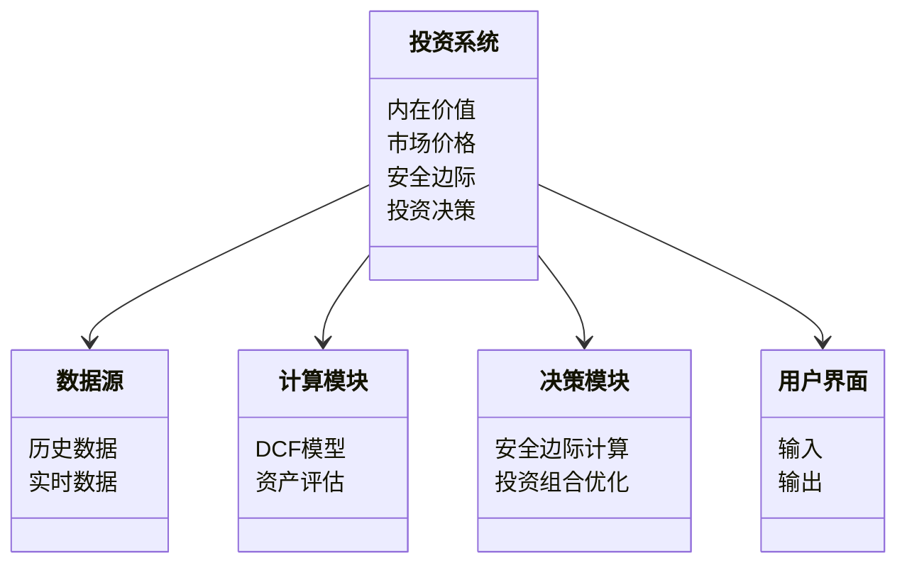
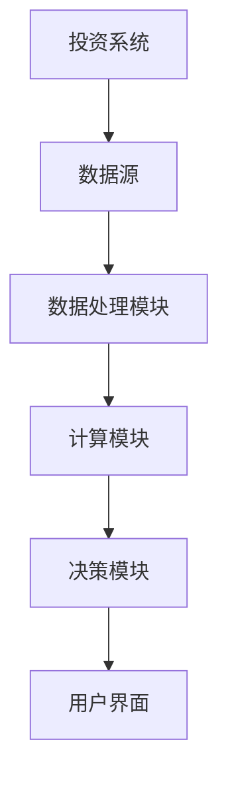
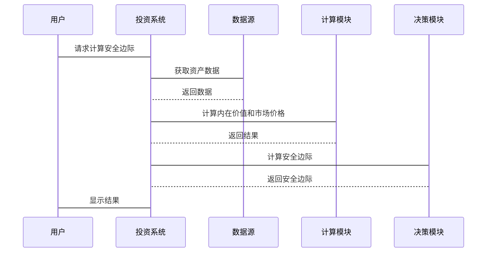

                 


# 价值投资的核心原则：安全边际

## 关键词：价值投资、安全边际、投资原则、风险控制、投资策略、长期收益、边际价值

## 摘要

价值投资是一种长期被验证有效的投资策略，其核心在于通过购买低于内在价值的资产来实现超额收益。在这一策略中，安全边际是投资者控制风险、确保收益的关键工具。本文将详细探讨安全边际的定义、计算方法、应用策略以及在投资系统中的架构设计，通过理论分析和实际案例，帮助投资者更好地理解和应用这一原则。

---

## 第一部分: 价值投资的核心概念与背景

### 第1章: 价值投资的起源与核心原则

#### 1.1 价值投资的起源
##### 1.1.1 投资的基本问题背景
投资的本质是通过合理配置资产，实现财富的增值。然而，市场波动、人性的贪婪与恐惧，以及信息的不对称性，使得投资成为一个充满挑战的领域。传统投资理论依赖于复杂的数学模型和假设，但实际操作中效果有限。价值投资作为一种反传统的投资策略，强调回归基本面，寻找被市场低估的资产。

##### 1.1.2 价值投资的定义与核心要素
价值投资是由本杰明·格雷厄姆和戴维·多德提出的投资理念，其核心在于以低于内在价值的价格买入优质资产。以下是价值投资的核心要素：
- **内在价值**：资产在未来现金流的现值，反映了其真实的经济价值。
- **市场价格**：资产在市场上的交易价格，受情绪和市场波动影响。
- **安全边际**：内在价值与市场价格之间的差距，提供了风险缓冲。

##### 1.1.3 价值投资与其他投资策略的对比
与技术分析、趋势投资等策略不同，价值投资强调深入研究企业的基本面，寻找市场先生的错误定价。通过安全边际，价值投资者能够在市场恐慌时买入低估资产，市场狂热时卖出高估资产。

---

#### 1.2 安全边际的定义与重要性
##### 1.2.1 安全边际的定义
安全边际是内在价值与市场价格之间的差额，公式如下：
$$ \text{安全边际} = \text{内在价值} - \text{市场价格} $$
这个差额反映了市场定价的偏差，也是价值投资中最重要的风险管理工具。

##### 1.2.2 安全边际的重要性
- **控制风险**：安全边际为投资者提供了缓冲区，即使市场价格短期波动，也不会对投资组合造成重大损失。
- **提高收益**：通过买入低估资产，安全边际确保了长期的超额收益。
- **应对市场波动**：市场先生的情绪化导致价格波动，安全边际帮助投资者在波动中保持理性。

---

## 第二部分: 安全边际的计算与应用

### 第3章: 安全边际的计算方法

#### 3.1 安全边际的算法原理
##### 3.1.1 计算步骤
1. **评估内在价值**：通过DCF模型、资产重置价值等方法估算资产的真实价值。
2. **确定市场价格**：获取当前市场价格。
3. **计算安全边际**：用内在价值减去市场价格，得到安全边际。

##### 3.1.2 计算案例
假设某公司A的内在价值为100元，市场价格为80元，则安全边际为20元。

##### 3.1.3 计算代码示例
```python
def calculate_margin(intrinsic_value, market_price):
    return intrinsic_value - market_price

# 示例
iv = 100  # 内在价值
mp = 80   # 市场价格
margin = calculate_margin(iv, mp)
print(f"安全边际为: {margin}元")
```

#### 3.2 安全边际的应用策略
##### 3.2.1 安全边际在股票选择中的应用
- **选择低估股票**：寻找市场价格远低于内在价值的股票。
- **构建投资组合**：分散投资，选择多个具有正安全边际的资产。

##### 3.2.2 动态调整
- **定期评估**：市场波动会导致内在价值和市场价格的变化，需定期重新计算安全边际。
- **卖出决策**：当市场价格超过内在价值时，应考虑卖出。

---

## 第三部分: 投资系统与架构设计

### 第5章: 投资系统的架构设计

#### 5.1 投资系统的功能设计
##### 5.1.1 领域模型类图


#### 5.2 系统实现
##### 5.2.1 系统架构图


##### 5.2.2 接口设计
- 数据接口：从数据库或API获取资产数据。
- 计算接口：调用DCF模型或其他评估方法。
- 决策接口：根据安全边际生成投资建议。

##### 5.2.3 交互序列图


---

## 总结

安全边际是价值投资的核心原则，通过合理计算和应用，投资者可以在市场波动中降低风险，实现长期的超额收益。本文通过详细阐述安全边际的定义、计算方法和应用策略，并结合系统架构设计，为投资者提供了理论与实践相结合的指导。在实际操作中，投资者应不断学习和优化自己的投资系统，以应对市场的复杂性和不确定性。

--- 

**注意事项：**
- 投资有风险，入市需谨慎。
- 安全边际的计算需结合具体资产的特性，不能一概而论。
- 长期投资需要耐心和纪律，避免被短期波动干扰。

**拓展阅读：**
- 格雷厄姆的《聪明的投资者》
- 《安全边际》一书

