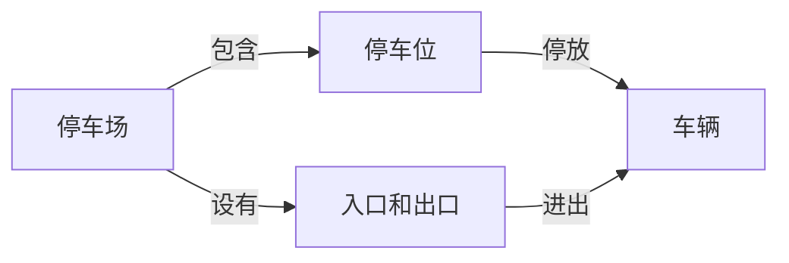
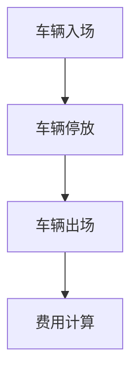

## 1.背景介绍

在现代社会中，随着汽车的普及，停车场管理系统的需求日益增长。一个有效的停车场管理系统不仅可以提高停车场的运营效率，还可以为车主提供更好的服务体验。本文将详细介绍停车场管理系统的设计和具体代码实现。

## 2.核心概念与联系

停车场管理系统主要包括以下几个核心概念：

- **停车场**：停车场是用来停放车辆的地方，可以是室内或室外的。

- **车辆**：车辆是停车场管理系统的主要对象，每辆车都有一定的属性，如车牌号、停车时间等。

- **停车位**：停车位是停车场中的一个空间，用来停放车辆。

- **入口和出口**：入口和出口是停车场的主要通道，用来进出停车场。

这些核心概念之间的关系可以用以下的Mermaid流程图表示：



## 3.核心算法原理具体操作步骤

停车场管理系统的核心算法主要包括以下几个步骤：

1. **车辆入场**：当车辆进入停车场时，系统需要记录车辆的入场时间和车牌号。

2. **车辆停放**：系统需要为每辆进入停车场的车辆分配一个停车位。

3. **车辆出场**：当车辆离开停车场时，系统需要计算车辆的停车费用，并记录车辆的出场时间。

4. **费用计算**：系统需要根据车辆的停车时间来计算停车费用。

这个流程可以用以下的Mermaid流程图表示：



## 4.数学模型和公式详细讲解举例说明

停车费用的计算是停车场管理系统的一个重要部分。一般来说，停车费用的计算公式如下：

$$
费用 = 单价 \times 停车时间
$$

其中，停车时间是指车辆在停车场内停放的时间，单位通常为小时；单价是指每小时的停车费用。

例如，如果一辆车在停车场内停放了3小时，而停车场的收费标准为每小时10元，那么这辆车的停车费用就是：

$$
费用 = 10 \times 3 = 30元
$$

## 5.项目实践：代码实例和详细解释说明

以下是一个简单的停车场管理系统的代码实现：

```python
class Car:
    def __init__(self, plate_number, enter_time):
        self.plate_number = plate_number
        self.enter_time = enter_time

class ParkingLot:
    def __init__(self, capacity):
        self.capacity = capacity
        self.cars = []

    def enter(self, car):
        if len(self.cars) < self.capacity:
            self.cars.append(car)
            return True
        else:
            return False

    def leave(self, car):
        self.cars.remove(car)
        return (datetime.now() - car.enter_time).hours

    def calculate_fee(self, hours):
        return hours * 10
```

这段代码定义了两个类：`Car`和`ParkingLot`。`Car`类用来表示车辆，`ParkingLot`类用来表示停车场。停车场有一个固定的容量，表示停车场的最大停车位数。当车辆进入停车场时，如果停车场还有空闲的停车位，那么车辆就可以进入停车场；否则，车辆就不能进入停车场。当车辆离开停车场时，系统会计算车辆的停车费用。

## 6.实际应用场景

停车场管理系统在现实生活中有很多应用场景，例如：

- **商业停车场**：商业停车场通常有很多停车位，需要一个有效的管理系统来管理这些停车位。

- **住宅小区停车场**：住宅小区的停车场通常只对小区内的居民开放，需要一个管理系统来管理车辆的进出。

- **公共停车场**：公共停车场是对公众开放的，需要一个管理系统来计算停车费用并管理车辆的进出。

## 7.工具和资源推荐

以下是一些用于开发停车场管理系统的工具和资源：

- **Python**：Python是一种广泛使用的编程语言，适合于开发各种应用，包括停车场管理系统。

- **SQLite**：SQLite是一个轻量级的数据库系统，适合于存储停车场管理系统的数据。

- **Flask**：Flask是一个用于开发web应用的Python框架，可以用来开发停车场管理系统的用户界面。

## 8.总结：未来发展趋势与挑战

随着技术的发展，未来的停车场管理系统将会更加智能化。例如，通过使用人工智能和机器学习技术，我们可以实现自动识别车牌号，自动计算停车费用，甚至自动驾驶车辆到指定的停车位。然而，这也带来了一些挑战，如如何保证系统的安全性和隐私性，如何处理大量的数据，如何提高系统的准确性和可靠性等。

## 9.附录：常见问题与解答

1. **问**：如果停车场满了，新来的车辆怎么办？

   **答**：如果停车场满了，新来的车辆将无法进入停车场。这时，可以考虑使用一些策略来处理，如设置临时停车区，或者引导车辆去附近的其他停车场。

2. **问**：如果车辆在停车场内停放的时间超过24小时怎么办？

   **答**：如果车辆在停车场内停放的时间超过24小时，可以按照每24小时收取一次费用，或者按照实际停放的时间收取费用。

3. **问**：如果车辆丢失了怎么办？

   **答**：如果车辆丢失了，首先应该报警，并向停车场管理人员报告情况。然后，可以通过查看停车场的监控录像来查找车辆。

作者：禅与计算机程序设计艺术 / Zen and the Art of Computer Programming