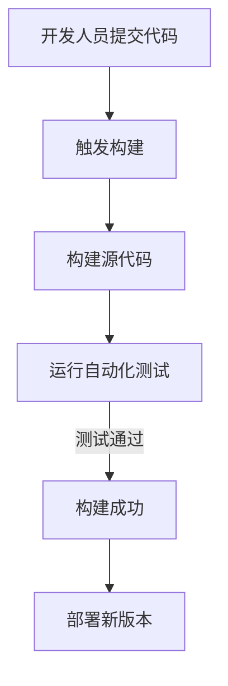

## 1. 背景介绍

持续集成（Continuous Integration，简称CI）和持续部署（Continuous Deployment，简称CD）是现代软件开发过程中不可或缺的环节。它们可以帮助我们更快地将新功能、修复和优化推送到生产环境，从而提高了软件质量和稳定性。

自动化测试则是确保软件质量的关键手段，它们在CI/CD流程中起着举足轻重的作用。

本篇博客将从理论和实践两个方面详细探讨CI/CD与自动化测试之间的联系，以及如何将它们融合到实际项目中来。

## 2. 核心概念与联系

### 2.1 CI/CD概述

持续集成（CI）是一种软件开发实践，其核心思想是频繁地将代码提交到中央仓库，并通过自动构建、测试和部署来验证其正确性。持续部署（CD）则是在持续集成基础上进一步发展的概念，它要求每次代码提交都要自动部署到生产环境。

### 2.2 自动化测试概述

自动化测试是一种利用计算机程序对软件进行测试的方法。它可以帮助我们快速发现并修复错误，提高软件质量。自动化测试通常分为以下几类：

- 单元测试：针对单个函数或方法进行测试。
- 集成测试：测试多个模块间的交互。
- 系统测试：测试整个系统的功能和性能。
- 性能测试：评估系统在负载下的性能。

## 3. 核心算法原理具体操作步骤

本节我们将详细讲解CI/CD流程中的核心算法原理，以及如何将自动化测试融入其中。

### 3.1 CI流程

1. 开发人员提交代码到版本控制系统（如Git）。
2. 版本控制系统触发构建过程。
3. 构建工具（如Maven、Gradle等）编译源代码，并生成可执行文件。
4. 自动化测试框架（如JUnit、TestNG等）运行自动化测试用例。
5. 如果测试通过，构建成功；否则，构建失败。
6. 成功的构建后，部署工具（如Jenkins、CircleCI等）将新版本部署到生产环境。

### 3.2 CD流程

1. 当有新的代码提交时，CI流程开始。
2. 如果构建和测试成功，CD流程开始。
3. 部署工具将新版本推送到生产环境。
4. 生产环境中的服务自动更新为新版本。

## 4. 数学模型和公式详细讲解举例说明

在本节中，我们将介绍如何使用数学模型来描述CI/CD流程，以及如何利用这些模型来优化流程。

### 4.1 流量图

我们可以使用Mermaid流程图来简洁地表示CI/CD流程。以下是一个简单的流程图示例：



### 4.2 性能模型

为了评估CI/CD流程的性能，我们需要建立一个数学模型。例如，我们可以使用队列理论（Queueing Theory）来描述构建和部署过程中的等待时间和吞吐量。

假设每个构建需要固定时间T完成，并且有K个并行构建任务。那么，系统的平均等待时间W可以用下面的公式计算：

$$ W = \\frac{1}{K} $$

## 5. 项目实践：代码实例和详细解释说明

在本节中，我们将通过一个实际项目的案例来展示如何将CI/CD与自动化测试融合到开发过程中。

### 5.1 项目背景

我们以一个简单的Web应用为例，演示如何实现CI/CD和自动化测试。该应用使用Python编写，采用Flask框架进行开发。

### 5.2 CI/CD配置

为了实现CI/CD，我们需要配置构建、测试和部署工具。以下是一个简化的Jenkins文件（Jenkinsfile）示例：

```groovy
pipeline {
    agent any
    stages {
        stage('Build') {
            steps {
                sh 'pip install -r requirements.txt'
            }
        }
        stage('Test') {
            steps {
                sh 'pytest tests/'
            }
        }
        stage('Deploy') {
            steps {
                sh 'python app.py'
            }
        }
    }
}
```

## 6. 实际应用场景

CI/CD和自动化测试在各种实际应用场景中都有广泛的应用，如：

- Web应用程序开发。
- 移动端应用程序开发。
- 游戏开发。
- 数据处理和分析系统开发。
- IoT设备软件开发等。

## 7. 工具和资源推荐

以下是一些建议的工具和资源，可以帮助读者更好地理解和实践CI/CD与自动化测试：

- CI/CD工具：Jenkins、CircleCI、Travis CI等。
- 自动化测试框架：JUnit、TestNG、Pytest等。
- 学习资源：《持续集成实战》、《自动化测试实践指南》等。

## 8. 总结：未来发展趋势与挑战

随着技术的不断发展，CI/CD和自动化测试将会在软件开发领域发挥越来越重要的作用。未来，我们可以期待以下几点发展趋势：

- 更高效的构建和部署过程，减少人工干预。
- 更广泛的自动化测试覆盖范围，提高软件质量。
- 更强大的DevOps文化，促进开发和运维之间的协作。

然而，这也意味着我们需要面对一些挑战，如如何确保代码质量、如何优化测试用例、以及如何应对安全性和隐私问题等。

## 9. 附录：常见问题与解答

1. 如何选择合适的CI/CD工具？

选择合适的CI/CD工具需要根据项目需求和团队习惯进行综合考虑。一般来说，Jenkins是一个非常灵活且易于配置的选择，而CircleCI则提供了更好的云端支持。

2. 自动化测试的覆盖率应该有多高？

自动化测试的覆盖率没有一个固定的标准，但通常情况下，我们希望尽可能地提高覆盖率。需要注意的是，过高的覆盖率并不一定意味着软件质量就越好，因此还需要结合实际情况来判断。

作者：禅与计算机程序设计艺术 / Zen and the Art of Computer Programming
