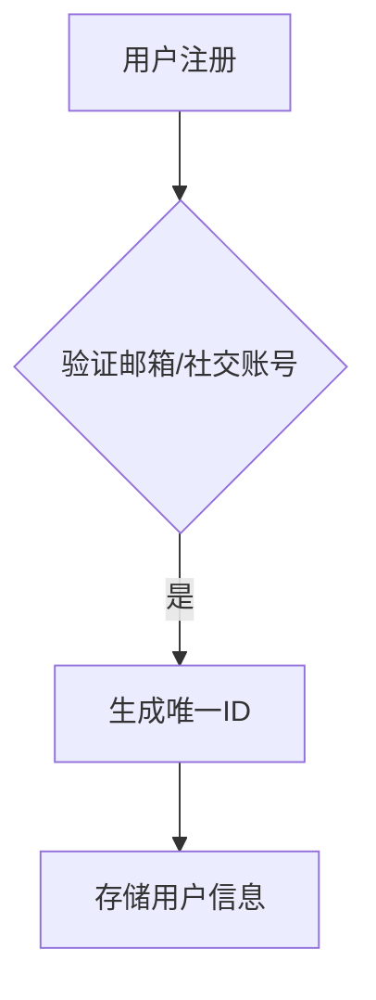
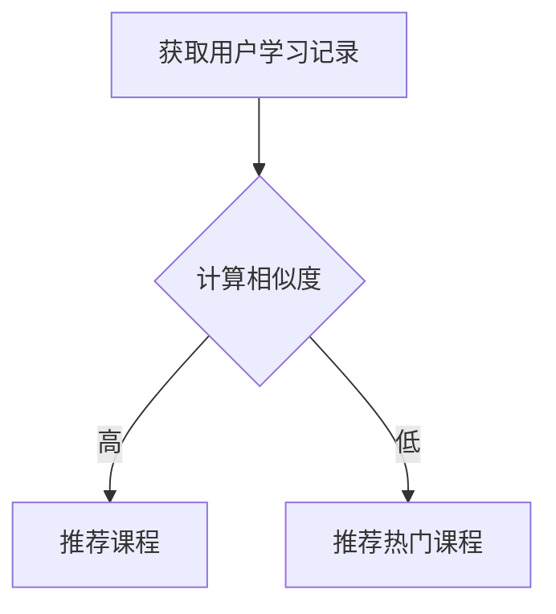

## 1. 背景介绍

随着互联网技术的不断发展，教学在线网站已经成为一种普及的教育方式。为了提高教学效果，我们需要设计一个高效、易用且具有互动性的教学在线网站。

本文将从以下几个方面进行探讨：

- 核心概念与联系
- 核心算法原理具体操作步骤
- 数学模型和公式详细讲解举例说明
- 项目实践：代码实例和详细解释说明
- 实际应用场景
- 工具和资源推荐
- 总结：未来发展趋势与挑战
- 附录：常见问题与解答

## 2. 核心概念与联系

教学在线网站的核心概念包括：

### 2.1 学习平台

学习平台是一个集成各种教学工具和资源的系统，旨在为学生提供个性化的学习体验。

### 2.2 互动式学习

互动式学习是指通过各种形式（如讨论区、问答环节等）让学生参与到学习过程中，提高学习效果。

### 2.3 数据分析

数据分析是指对学生学习行为进行统计和分析，以便了解学生的学习进度和需要改进的地方。

## 3. 核心算法原理具体操作步骤

为了实现上述功能，我们需要设计一些核心算法。以下是一些可能的操作步骤：

### 3.1 用户注册与登录

用户可以通过邮箱或社交账号注册并登录系统。系统将存储用户信息并生成唯一ID。



### 3.2 课程推荐

根据用户的学习记录和兴趣，推荐适合的课程。



## 4. 数学模型和公式详细讲解举例说明

在本节中，我们将讨论如何使用数学模型来优化教学在线网站的推荐算法。

### 4.1 矩阵分解

为了实现课程推荐，我们可以使用矩阵分解技术，如奇异值分解(SVD)。以下是一个简单的示例：

$$
\\textbf{A} = \\textbf{U}\\Sigma\\textbf{V}^T
$$

其中 $\\textbf{A}$ 是原始数据矩阵，$\\textbf{U}$ 和 $\\textbf{V}$ 是左侧和右侧的特征向量矩阵，$\\Sigma$ 是对角线上为非负数的对角矩阵。

### 4.2 评估指标

为了评估推荐系统的效果，我们需要选择合适的评估指标。常用的评估指标有：

- 精确度（Precision）
- 召回率（Recall）
- F1-score
- 均方误差（Mean Squared Error, MSE）

## 5. 项目实践：代码实例和详细解释说明

在本节中，我们将通过一个简化的Python代码示例来展示如何实现教学在线网站的核心功能。

```python
import numpy as np
from sklearn.decomposition import TruncatedSVD
from sklearn.metrics.pairwise import cosine_similarity

# 假设我们已经获取了用户学习记录和课程信息
user_learning_records =...
course_info =...

# 计算相似度矩阵
similarity_matrix = cosine_similarity(user_learning_records)

# 使用奇异值分解优化相似度矩阵
svd = TruncatedSVD(n_components=50)
optimized_similarity_matrix = svd.fit_transform(similarity_matrix)

# 推荐最相似的课程
def recommend_course(optimized_similarity_matrix, user_id):
    user_record = optimized_similarity_matrix[user_id]
    similar_courses = np.argsort(-user_record)[1:4]
    return course_info[similar_courses]

recommended_courses = recommend_course(optimized_similarity_matrix, 0)
print(recommended_courses)
```

## 6. 实际应用场景

教学在线网站可以在多个领域得到应用，例如：

- 教育培训：提供各种学科门类的在线课程。
- 职业技能培训：帮助企业员工提升技能。
- 自主学习：为自学者提供丰富的学习资源。

## 7. 工具和资源推荐

以下是一些建议的工具和资源，可以帮助您更好地设计和实现教学在线网站：

- 开源教程平台：如Teachable Machine、Jupyter Notebook等。
- 数据分析工具：如Python的Pandas库、R语言的dplyr包等。
- 学习管理系统：如Moodle、Canvas等。

## 8. 总结：未来发展趋势与挑战

随着人工智能、大数据和云计算等技术的不断发展，教学在线网站将会越来越智能化和个性化。然而，这也带来了诸如数据安全、隐私保护等新的挑战。我们需要持续关注这些问题，并寻求合适的解决方案，以确保教学在线网站始终保持高效、安全和可靠。

## 9. 附录：常见问题与解答

Q: 如何提高课程推荐的准确性？

A: 可以尝试使用不同的推荐算法，如协同过滤、内容过滤等，并结合用户反馈进行优化。

Q: 如何保证数据安全和隐私保护？

A: 可以采用加密技术、访问控制机制等手段，确保用户数据在传输和存储过程中的安全性。

作者：禅与计算机程序设计艺术 / Zen and the Art of Computer Programming
