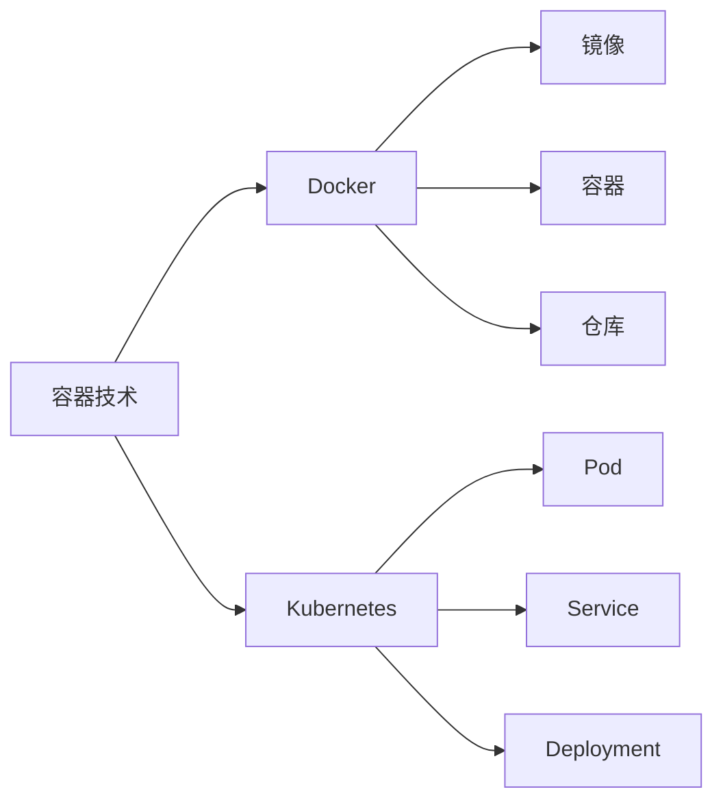

# AI项目管理中的容器技术：轻量级部署，提升效率

## 1. 背景介绍
### 1.1 AI项目开发面临的挑战
#### 1.1.1 环境配置复杂
#### 1.1.2 部署流程繁琐
#### 1.1.3 资源利用率低
### 1.2 容器技术的兴起
#### 1.2.1 容器技术的发展历程
#### 1.2.2 容器技术的优势
### 1.3 容器技术在AI项目管理中的应用前景

## 2. 核心概念与联系
### 2.1 容器技术
#### 2.1.1 容器的定义
#### 2.1.2 容器的特点
#### 2.1.3 容器与虚拟机的区别
### 2.2 Docker
#### 2.2.1 Docker的架构
#### 2.2.2 Docker的核心组件
#### 2.2.3 Dockerfile
### 2.3 Kubernetes
#### 2.3.1 Kubernetes的架构
#### 2.3.2 Kubernetes的核心概念
#### 2.3.3 Kubernetes与Docker的关系

## 3. 核心算法原理具体操作步骤
### 3.1 Docker镜像构建
#### 3.1.1 编写Dockerfile
#### 3.1.2 构建Docker镜像
#### 3.1.3 推送镜像到仓库
### 3.2 Kubernetes编排
#### 3.2.1 创建Deployment
#### 3.2.2 创建Service
#### 3.2.3 配置Ingress
### 3.3 容器化AI项目部署流程
#### 3.3.1 准备AI项目代码和依赖
#### 3.3.2 构建AI项目Docker镜像
#### 3.3.3 在Kubernetes上部署AI项目

## 4. 数学模型和公式详细讲解举例说明
### 4.1 资源利用率模型
#### 4.1.1 资源利用率的定义
#### 4.1.2 资源利用率计算公式
#### 4.1.3 容器化对资源利用率的影响
### 4.2 扩缩容模型
#### 4.2.1 扩缩容的定义
#### 4.2.2 扩缩容的数学模型
#### 4.2.3 Kubernetes的HPA（Horizontal Pod Autoscaler）

资源利用率计算公式：
$$
资源利用率 = \frac{已使用资源量}{总资源量} \times 100\%
$$

扩缩容模型：
假设系统当前有 $n$ 个Pod，每个Pod的CPU利用率为 $u_i$，目标CPU利用率为 $U_t$，则需要的Pod数量 $m$ 可以通过以下公式计算：

$$
m = \left \lceil \frac{\sum_{i=1}^{n} u_i}{U_t} \right \rceil
$$

其中，$\lceil x \rceil$ 表示对 $x$ 向上取整。

## 5. 项目实践：代码实例和详细解释说明
### 5.1 构建AI项目Docker镜像
#### 5.1.1 编写Dockerfile
#### 5.1.2 构建Docker镜像
#### 5.1.3 推送镜像到仓库
### 5.2 在Kubernetes上部署AI项目
#### 5.2.1 创建Deployment
#### 5.2.2 创建Service
#### 5.2.3 配置Ingress
### 5.3 代码实例解释
#### 5.3.1 Dockerfile详解
#### 5.3.2 Kubernetes YAML文件详解

## 6. 实际应用场景
### 6.1 机器学习模型服务化部署
#### 6.1.1 模型训练与导出
#### 6.1.2 模型服务化封装
#### 6.1.3 模型服务部署与扩缩容
### 6.2 深度学习任务分布式训练
#### 6.2.1 分布式训练框架选择
#### 6.2.2 构建分布式训练环境
#### 6.2.3 模型训练与部署
### 6.3 大数据处理平台容器化
#### 6.3.1 大数据处理框架选择
#### 6.3.2 构建大数据处理平台镜像
#### 6.3.3 大数据处理任务调度与执行

## 7. 工具和资源推荐
### 7.1 容器技术学习资源
#### 7.1.1 官方文档
#### 7.1.2 在线教程
#### 7.1.3 书籍推荐
### 7.2 AI项目开发工具
#### 7.2.1 机器学习框架
#### 7.2.2 深度学习框架
#### 7.2.3 数据处理工具
### 7.3 DevOps工具链
#### 7.3.1 CI/CD工具
#### 7.3.2 监控与日志工具
#### 7.3.3 服务网格

## 8. 总结：未来发展趋势与挑战
### 8.1 容器技术的发展趋势
#### 8.1.1 轻量化与标准化
#### 8.1.2 安全与隔离
#### 8.1.3 无服务器计算
### 8.2 AI项目管理的挑战
#### 8.2.1 模型管理与版本控制
#### 8.2.2 数据隐私与安全
#### 8.2.3 资源调度与优化
### 8.3 展望未来

## 9. 附录：常见问题与解答
### 9.1 容器技术相关问题
#### 9.1.1 如何选择容器运行时？
#### 9.1.2 如何优化容器镜像大小？
#### 9.1.3 如何处理容器间通信？
### 9.2 Kubernetes相关问题
#### 9.2.1 如何选择合适的Kubernetes发行版？
#### 9.2.2 如何配置Kubernetes集群？
#### 9.2.3 如何进行Kubernetes故障排查？
### 9.3 AI项目开发相关问题
#### 9.3.1 如何选择合适的机器学习框架？
#### 9.3.2 如何进行模型调优？
#### 9.3.3 如何处理数据不平衡问题？

---

作者：禅与计算机程序设计艺术 / Zen and the Art of Computer Programming