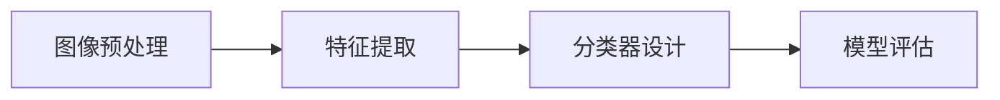

## 1.背景介绍

CIFAR-10是一个常用的彩色图像数据集，它有10个类别: '飞机', '汽车', '鸟', '猫', '鹿', '狗', '青蛙', '马', '船', '卡车'。在这个数据集中，每个类别有6000张图像，数据集中一共有50000张训练图像和10000张测试图像。CIFAR-10是由Hinton的两个大学生收集的，他们花费了很多时间来预处理图像，使其在机器学习中更易使用。在许多研究论文中，CIFAR-10被用作基准来测试算法的性能。

## 2.核心概念与联系

CIFAR-10图像分类涉及到的核心概念主要有：图像预处理、特征提取、分类器设计和模型评估。图像预处理是指将原始图像转换为适合进行特征提取的形式。特征提取是从预处理后的图像中提取有用的信息，这些信息对分类任务有帮助。分类器设计是指选择或设计合适的模型来进行分类任务。模型评估是指通过某些指标来评价模型的性能。

这些核心概念之间的联系主要表现在：图像预处理为特征提取提供了数据，特征提取为分类器设计提供了输入，分类器设计的结果需要通过模型评估来验证。



## 3.核心算法原理具体操作步骤

在CIFAR-10图像分类任务中，我们通常会采用深度学习的方法，如卷积神经网络（Convolutional Neural Networks，CNN）来进行。下面是使用CNN进行CIFAR-10图像分类的基本步骤：

1. **数据预处理**：将CIFAR-10数据集中的图像进行归一化处理，使得每个像素值都在0-1之间。同时，将类别标签进行one-hot编码。

2. **构建模型**：设计CNN模型，该模型通常包含多个卷积层、池化层和全连接层。

3. **模型训练**：将预处理后的数据输入到CNN模型中，通过反向传播算法和梯度下降法等优化算法来更新模型的参数。

4. **模型评估**：使用测试集来评估模型的性能，常用的评估指标有准确率、召回率、F1分数等。

## 4.数学模型和公式详细讲解举例说明

在CNN中，最基本的操作是卷积操作。在二维图像上的卷积操作可以表示为：

$$
(X * W)[i, j] = \sum_m \sum_n X[i-m, j-n] W[m, n]
$$

其中，$X$表示输入的图像，$W$表示卷积核，$[i, j]$是图像上的位置，$[m, n]$是卷积核上的位置。

在模型训练过程中，我们通常使用交叉熵损失函数来衡量模型的预测结果与真实结果之间的差异，其公式为：

$$
H(y, \hat{y}) = -\sum_i y[i] \log(\hat{y}[i])
$$

其中，$y$是真实的类别标签，$\hat{y}$是模型的预测结果。

## 5.项目实践：代码实例和详细解释说明

这部分将以Python和深度学习框架TensorFlow为例，给出一个简单的CNN模型在CIFAR-10数据集上的实现。

首先，我们需要导入所需的库，并加载CIFAR-10数据集：

```python
import tensorflow as tf
from tensorflow.keras.datasets import cifar10

(x_train, y_train), (x_test, y_test) = cifar10.load_data()
```

然后，我们需要对数据进行预处理：

```python
x_train, x_test = x_train / 255.0, x_test / 255.0
y_train, y_test = tf.keras.utils.to_categorical(y_train, 10), tf.keras.utils.to_categorical(y_test, 10)
```

接下来，我们可以构建CNN模型：

```python
model = tf.keras.models.Sequential([
    tf.keras.layers.Conv2D(32, (3, 3), activation='relu', input_shape=(32, 32, 3)),
    tf.keras.layers.MaxPooling2D((2, 2)),
    tf.keras.layers.Conv2D(64, (3, 3), activation='relu'),
    tf.keras.layers.MaxPooling2D((2, 2)),
    tf.keras.layers.Conv2D(64, (3, 3), activation='relu'),
    tf.keras.layers.Flatten(),
    tf.keras.layers.Dense(64, activation='relu'),
    tf.keras.layers.Dense(10, activation='softmax')
])

model.compile(optimizer='adam',
              loss='categorical_crossentropy',
              metrics=['accuracy'])
```

最后，我们可以用训练集来训练模型，并用测试集来评估模型的性能：

```python
model.fit(x_train, y_train, epochs=10)
test_loss, test_acc = model.evaluate(x_test, y_test)
print('Test accuracy:', test_acc)
```

## 6.实际应用场景

CIFAR-10图像分类的应用场景十分广泛，包括但不限于：

- **自动驾驶**：可以用于识别道路上的其他车辆、行人、交通标志等。
- **医疗图像分析**：可以用于识别图像中的病变区域，如肿瘤、病灶等。
- **安防监控**：可以用于识别监控视频中的异常行为，如闯红灯、盗窃等。

## 7.工具和资源推荐

如果你对CIFAR-10图像分类感兴趣，以下是一些有用的工具和资源：

- **TensorFlow**：一个强大的深度学习框架，提供了丰富的API，可以方便地构建和训练深度学习模型。
- **Keras**：一个高级的神经网络API，可以在TensorFlow等后端上运行，易于使用且高度模块化，使得构建和训练深度学习模型变得更简单。
- **CIFAR-10 Python版**：包含了CIFAR-10数据集的Python版本，可以方便地在Python程序中加载和使用。

## 8.总结：未来发展趋势与挑战

CIFAR-10图像分类是一个基础但非常重要的任务，它在很多实际应用中都有着广泛的用途。随着深度学习技术的发展，我们有理由相信在未来，CIFAR-10图像分类的准确率会进一步提高。然而，也存在一些挑战，如如何在保持高准确率的同时，减少模型的复杂度和计算资源的消耗，如何提高模型的鲁棒性，使其对输入的小幅度变化不敏感等。

## 9.附录：常见问题与解答

**Q：我应该如何选择合适的CNN架构？**

A：这取决于你的具体任务和数据。一般来说，更复杂的任务和更大的数据集可能需要更复杂的CNN架构。你可以从一些经典的CNN架构（如LeNet、AlexNet、VGG、ResNet等）开始，然后根据你的任务进行调整。

**Q：我可以用其他的深度学习模型来做CIFAR-10图像分类吗？**

A：当然可以。虽然CNN是最常用的图像分类模型，但你也可以尝试其他的模型，如全连接神经网络、循环神经网络、自编码器等。不同的模型可能会有不同的性能，你可以根据你的任务来选择合适的模型。

**Q：我应该如何评价我的模型的性能？**

A：你可以使用一些常用的评价指标，如准确率、召回率、F1分数等。同时，你也可以画出模型的学习曲线，以了解模型在训练过程中的性能变化。此外，你还可以使用混淆矩阵来了解模型在每个类别上的性能。

作者：禅与计算机程序设计艺术 / Zen and the Art of Computer Programming
