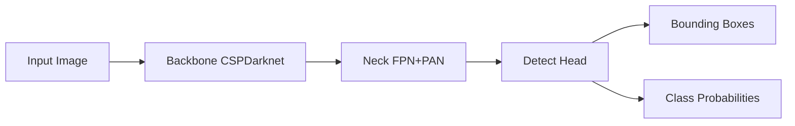

# YOLOv5原理与代码实例讲解

## 1. 背景介绍
### 1.1 目标检测的发展历程
#### 1.1.1 传统目标检测方法
#### 1.1.2 基于深度学习的目标检测方法
#### 1.1.3 One-stage和Two-stage目标检测方法对比

### 1.2 YOLO系列算法的演进
#### 1.2.1 YOLOv1
#### 1.2.2 YOLOv2
#### 1.2.3 YOLOv3
#### 1.2.4 YOLOv4
#### 1.2.5 YOLOv5的诞生

### 1.3 YOLOv5的优势与应用场景
#### 1.3.1 速度快、精度高
#### 1.3.2 模型轻量化
#### 1.3.3 适用于移动端和嵌入式设备
#### 1.3.4 广泛应用于安防监控、无人驾驶、工业检测等领域

## 2. 核心概念与联系
### 2.1 Backbone网络结构
#### 2.1.1 CSPNet
#### 2.1.2 Focus结构
#### 2.1.3 SPP模块

### 2.2 Neck特征融合
#### 2.2.1 FPN
#### 2.2.2 PAN
#### 2.2.3 Concat和Add融合

### 2.3 Detect预测头
#### 2.3.1 Anchor-based方法
#### 2.3.2 Anchor-free方法
#### 2.3.3 YOLO Head

### 2.4 损失函数
#### 2.4.1 分类损失
#### 2.4.2 定位损失
#### 2.4.3 置信度损失



## 3. 核心算法原理具体操作步骤
### 3.1 图像预处理
#### 3.1.1 图像Resize
#### 3.1.2 图像Padding
#### 3.1.3 图像Normalization

### 3.2 Mosaic数据增强
#### 3.2.1 Mosaic的原理
#### 3.2.2 Mosaic的实现步骤
#### 3.2.3 Mosaic的优势

### 3.3 Anchor生成
#### 3.3.1 K-means聚类生成Anchor
#### 3.3.2 Anchor的尺度和长宽比设置
#### 3.3.3 Anchor的匹配策略

### 3.4 特征图后处理
#### 3.4.1 Decode
#### 3.4.2 NMS
#### 3.4.3 后处理流程

## 4. 数学模型和公式详细讲解举例说明
### 4.1 Bounding Box回归
#### 4.1.1 中心坐标回归
$t_x = (x - c_x) / w$  
$t_y = (y - c_y) / h$
#### 4.1.2 宽高回归
$t_w = log(w / p_w)$
$t_h = log(h / p_h)$

### 4.2 置信度预测
$conf = Pr(Object) * IOU(b, object)$

### 4.3 分类概率预测
$p_i = exp(c_i) / \sum_j exp(c_j)$

### 4.4 损失函数
#### 4.4.1 分类损失 - 二元交叉熵
$L_{cls} = -\sum y_ilog(\hat{p}_i)$
#### 4.4.2 定位损失 - CIoU Loss
$L_{box} = 1 - IoU + \frac{\rho^2(b,b^{gt})}{c^2} + \alpha v$
#### 4.4.3 置信度损失 - 二元交叉熵
$L_{obj} = -\sum_{i=0}^{S^2} \sum_{j=0}^B \mathbb{1}_{ij}^{obj}[c_i log(\hat{c}_i) + (1-c_i)log(1-\hat{c}_i)]$

## 5. 项目实践：代码实例和详细解释说明
### 5.1 环境配置
#### 5.1.1 安装Pytorch
#### 5.1.2 安装YOLOv5依赖库

### 5.2 数据准备
#### 5.2.1 标注数据格式
#### 5.2.2 划分训练集和测试集
#### 5.2.3 生成数据配置文件

### 5.3 模型训练
#### 5.3.1 定义超参数
#### 5.3.2 加载预训练权重
#### 5.3.3 启动训练
```python
# 训练
python train.py --img 640 --batch 16 --epochs 100 --data coco.yaml --weights yolov5s.pt
```

### 5.4 模型验证
#### 5.4.1 加载训练好的权重
#### 5.4.2 在测试集上评估模型性能
```python 
# 验证
python val.py --weights runs/train/exp/weights/best.pt --data coco.yaml --img 640 --iou 0.65
```

### 5.5 模型推理
#### 5.5.1 单张图像检测
```python
# 检测图像
python detect.py --source data/images/ --weights runs/train/exp/weights/best.pt --img 640
```
#### 5.5.2 视频流检测
```python
# 检测视频
python detect.py --source data/video.mp4 --weights runs/train/exp/weights/best.pt --img 640
```
#### 5.5.3 导出ONNX模型
```python
# 导出ONNX
python export.py --weights runs/train/exp/weights/best.pt --img 640 --batch 1
```

## 6. 实际应用场景
### 6.1 智能安防
#### 6.1.1 人脸识别
#### 6.1.2 行为检测
#### 6.1.3 异常事件告警

### 6.2 智慧交通 
#### 6.2.1 车辆检测与计数
#### 6.2.2 交通标志检测
#### 6.2.3 违章行为识别

### 6.3 工业视觉检测
#### 6.3.1 瑕疵检测
#### 6.3.2 零件计数
#### 6.3.3 装配线目标定位

### 6.4 无人驾驶感知
#### 6.4.1 障碍物检测
#### 6.4.2 车道线检测
#### 6.4.3 交通标志识别

## 7. 工具和资源推荐
### 7.1 标注工具
- Labelme
- CVAT
- LabelImg

### 7.2 开源数据集
- COCO
- VOC
- OpenImages

### 7.3 YOLOv5项目资源
- Github: https://github.com/ultralytics/yolov5
- 官方文档: https://docs.ultralytics.com

## 8. 总结：未来发展趋势与挑战
### 8.1 轻量化模型设计
### 8.2 小样本学习
### 8.3 域自适应
### 8.4 3D目标检测

## 9. 附录：常见问题与解答
### 9.1 YOLOv5和YOLOv4的区别？
### 9.2 如何选择YOLOv5的模型版本？
### 9.3 数据增强有哪些常用方法？
### 9.4 Anchor-based和Anchor-free方法的优缺点？
### 9.5 如何处理模型过拟合问题？

作者：禅与计算机程序设计艺术 / Zen and the Art of Computer Programming