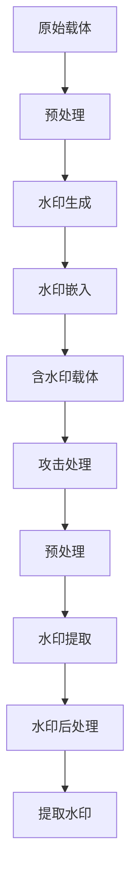

# 【AI大数据计算原理与代码实例讲解】Watermark

## 1. 背景介绍

随着人工智能和大数据技术的飞速发展,数字水印技术在版权保护、内容认证等领域扮演着越来越重要的角色。Watermark作为一种数字水印算法,通过在数字内容中嵌入隐藏信息,实现对内容的版权声明和完整性验证。本文将深入探讨Watermark算法的核心原理,并结合代码实例进行详细讲解,帮助读者全面理解这一重要技术。

### 1.1 数字水印技术概述
#### 1.1.1 数字水印的定义与特点
#### 1.1.2 数字水印的分类
#### 1.1.3 数字水印的应用场景

### 1.2 Watermark算法的发展历程  
#### 1.2.1 早期的Watermark算法
#### 1.2.2 Watermark算法的演进
#### 1.2.3 Watermark算法的研究现状

## 2. 核心概念与联系

要深入理解Watermark算法,首先需要掌握一些核心概念。这些概念之间存在着紧密的联系,共同构成了Watermark算法的理论基础。

### 2.1 信息隐藏
#### 2.1.1 信息隐藏的定义
#### 2.1.2 信息隐藏的分类
#### 2.1.3 信息隐藏与数字水印的关系

### 2.2 鲁棒性与不可感知性
#### 2.2.1 鲁棒性的定义与度量
#### 2.2.2 不可感知性的定义与度量 
#### 2.2.3 鲁棒性与不可感知性的权衡

### 2.3 嵌入域与提取域
#### 2.3.1 空间域水印
#### 2.3.2 变换域水印
#### 2.3.3 嵌入域与提取域的选择

## 3. 核心算法原理具体操作步骤

Watermark算法的核心在于水印信息的嵌入和提取。下面将详细介绍这两个关键步骤的具体操作。

### 3.1 水印嵌入
#### 3.1.1 原始载体的预处理
#### 3.1.2 水印信息的生成
#### 3.1.3 水印信息的嵌入

### 3.2 水印提取
#### 3.2.1 载体的预处理
#### 3.2.2 水印信息的提取
#### 3.2.3 水印信息的后处理

### 3.3 算法流程图



## 4. 数学模型和公式详细讲解举例说明

Watermark算法的数学基础主要涉及到信号处理、信息论等领域的知识。下面将对几个关键的数学模型和公式进行详细讲解。

### 4.1 离散小波变换
#### 4.1.1 一维离散小波变换
#### 4.1.2 二维离散小波变换
#### 4.1.3 小波基函数的选择

### 4.2 奇异值分解
#### 4.2.1 奇异值分解的定义
#### 4.2.2 奇异值分解的性质
#### 4.2.3 奇异值分解在水印中的应用

### 4.3 信息论基础
#### 4.3.1 熵的概念
#### 4.3.2 互信息量
#### 4.3.3 信道容量

举例说明:
考虑一个简单的基于离散小波变换的水印嵌入过程。设原始图像为 $I$,水印信息为 $W$,小波变换后的系数为 $C$,嵌入强度为 $\alpha$,则嵌入过程可表示为:

$$
C' = C + \alpha \cdot W
$$

其中 $C'$ 为嵌入水印后的小波系数。

## 5. 项目实践:代码实例和详细解释说明

下面将通过Python代码实例,演示Watermark算法的具体实现。

### 5.1 水印嵌入

```python
import numpy as np
import pywt

# 原始图像
I = np.random.rand(256, 256)

# 水印信息
W = np.random.choice([0, 1], size=(32, 32))

# 小波变换
coeffs = pywt.dwt2(I, 'haar')
cA, (cH, cV, cD) = coeffs

# 水印嵌入
alpha = 0.1
cA_marked = cA + alpha * W

# 小波逆变换
coeffs_marked = cA_marked, (cH, cV, cD)
I_marked = pywt.idwt2(coeffs_marked, 'haar')
```

代码解释:

1. 首先生成原始图像 `I` 和水印信息 `W`。
2. 对原始图像进行二维离散小波变换,得到小波系数 `cA`,`cH`,`cV`,`cD`。 
3. 将水印信息嵌入到低频系数 `cA` 中,嵌入强度为 `alpha`。
4. 对含水印的小波系数进行逆变换,得到含水印图像 `I_marked`。

### 5.2 水印提取

```python
# 提取水印
cA_extracted = pywt.dwt2(I_marked, 'haar')[0]
W_extracted = (cA_extracted - cA) / alpha
```

代码解释:

1. 对含水印图像 `I_marked` 进行小波变换,得到低频系数 `cA_extracted`。
2. 根据嵌入过程,从 `cA_extracted` 中提取出水印信息 `W_extracted`。

## 6. 实际应用场景

Watermark算法在实际中有广泛的应用,下面列举几个典型场景:

### 6.1 图像版权保护
#### 6.1.1 数字图像的版权问题
#### 6.1.2 基于Watermark的图像版权保护方案
#### 6.1.3 案例分析

### 6.2 视频内容认证
#### 6.2.1 视频内容认证的重要性
#### 6.2.2 基于Watermark的视频内容认证方案
#### 6.2.3 案例分析

### 6.3 文档防伪
#### 6.3.1 文档防伪的必要性
#### 6.3.2 基于Watermark的文档防伪方案
#### 6.3.3 案例分析

## 7. 工具和资源推荐

### 7.1 开源工具
#### 7.1.1 OpenCV
#### 7.1.2 Python图像处理库(PIL, scikit-image)
#### 7.1.3 MATLAB

### 7.2 数据集
#### 7.2.1 BOSSbase
#### 7.2.2 BOWS-2
#### 7.2.3 UCID

### 7.3 学习资源
#### 7.3.1 论文与书籍
#### 7.3.2 在线课程
#### 7.3.3 社区与论坛

## 8. 总结:未来发展趋势与挑战

### 8.1 Watermark算法的发展趋势
#### 8.1.1 多媒体水印
#### 8.1.2 联合水印
#### 8.1.3 智能水印

### 8.2 面临的挑战
#### 8.2.1 水印攻击
#### 8.2.2 法律与伦理问题
#### 8.2.3 跨媒体水印

### 8.3 展望

Watermark算法作为数字水印技术的重要分支,在版权保护、内容认证等领域发挥着不可替代的作用。未来,随着人工智能、区块链等新技术的发展,Watermark算法也将迎来更多的机遇和挑战。研究者需要在提高算法性能的同时,兼顾水印的安全性、法律伦理等因素,推动数字水印技术的健康发展。

## 9. 附录:常见问题与解答

### 9.1 Watermark算法与传统的加密技术有何区别?
### 9.2 Watermark算法能否防止截屏攻击?
### 9.3 如何权衡水印的鲁棒性和不可感知性?
### 9.4 Watermark算法是否适用于所有类型的数字内容?
### 9.5 Watermark算法在法律上是否有效?

作者: 禅与计算机程序设计艺术 / Zen and the Art of Computer Programming