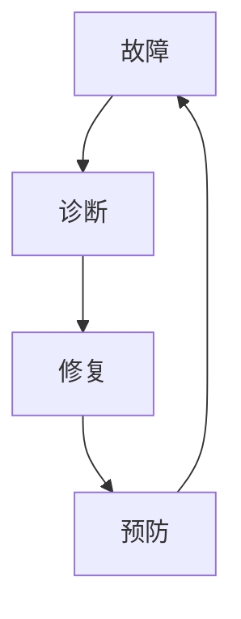
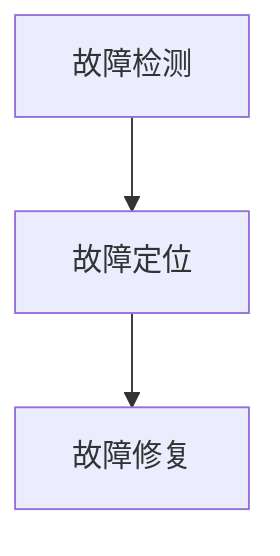

## 1.背景介绍

随着人工智能（AI）的发展，AI系统已经广泛应用于各个领域，包括但不限于自动驾驶、医疗诊断、金融风控等。然而，随着AI系统的复杂性和规模的增加，故障诊断成为了一个重要且紧迫的问题。本文将详细介绍AI系统故障诊断的原理，并通过案例分析，详细讲解如何在实战中应用这些原理。

## 2.核心概念与联系

AI系统故障诊断的核心概念包括故障、诊断、修复和预防。故障是指AI系统的某个部分无法正常工作，可能是因为硬件故障、软件错误或者数据问题。诊断是通过分析系统的行为和状态，找出故障的根源。修复是通过修改代码、更换硬件或者更正数据，使得AI系统恢复正常工作。预防是通过设计和实施各种策略，减少故障的发生。



## 3.核心算法原理具体操作步骤

AI系统故障诊断的核心算法原理包括故障检测、故障定位和故障修复。故障检测是通过分析系统的行为和状态，判断是否出现了故障。故障定位是通过进一步分析，找出故障的具体位置。故障修复是通过修改代码、更换硬件或者更正数据，解决故障。



## 4.数学模型和公式详细讲解举例说明

在AI系统故障诊断中，我们通常使用概率模型来描述和预测故障的发生。例如，我们可以使用泊松分布来描述故障的发生频率，使用指数分布来描述故障的持续时间。

假设故障的发生频率λ是一个已知的常数，那么在时间t内发生k次故障的概率P可以用泊松分布来计算：

$$
P(k;\lambda,t) = \frac{(\lambda t)^k e^{-\lambda t}}{k!}
$$

假设故障的持续时间T是一个随机变量，那么T的概率密度函数f可以用指数分布来计算：

$$
f(t;\lambda) = \lambda e^{-\lambda t} (t \geq 0)
$$

## 5.项目实践：代码实例和详细解释说明

下面我们以一个简单的AI系统故障诊断项目为例，详细讲解如何在实战中应用上述原理和算法。

首先，我们需要收集和分析AI系统的行为和状态数据，判断是否出现了故障。这可以通过监控系统的运行日志、性能指标和错误报告来实现。下面是一个简单的故障检测代码示例：

```python
def detect_fault(logs, metrics, reports):
    # 分析日志
    for log in logs:
        if 'error' in log:
            return True
    # 分析性能指标
    for metric in metrics:
        if metric > threshold:
            return True
    # 分析错误报告
    for report in reports:
        if 'fault' in report:
            return True
    return False
```

然后，我们需要进一步分析数据，找出故障的具体位置。这可以通过对比正常和异常状态的数据，找出差异和模式来实现。下面是一个简单的故障定位代码示例：

```python
def locate_fault(logs, metrics, reports):
    # 对比日志
    for log in logs:
        if 'error' in log:
            return log
    # 对比性能指标
    for metric in metrics:
        if metric > threshold:
            return metric
    # 对比错误报告
    for report in reports:
        if 'fault' in report:
            return report
    return None
```

最后，我们需要修改代码、更换硬件或者更正数据，解决故障。这需要根据故障的具体情况，选择合适的修复策略。下面是一个简单的故障修复代码示例：

```python
def fix_fault(fault):
    # 修改代码
    if 'code' in fault:
        fix_code(fault)
    # 更换硬件
    elif 'hardware' in fault:
        fix_hardware(fault)
    # 更正数据
    elif 'data' in fault:
        fix_data(fault)
```

## 6.实际应用场景

AI系统故障诊断可以应用于各种场景，包括但不限于自动驾驶、医疗诊断、金融风控等。例如，在自动驾驶中，我们可以通过故障诊断来检测和修复传感器、控制器和算法的问题。在医疗诊断中，我们可以通过故障诊断来检测和修复设备、软件和数据的问题。在金融风控中，我们可以通过故障诊断来检测和修复模型、策略和系统的问题。

## 7.工具和资源推荐

在AI系统故障诊断中，有许多工具和资源可以帮助我们更有效地进行故障检测、故障定位和故障修复。例如，日志分析工具（如Logstash、Graylog）、性能监控工具（如Prometheus、Grafana）、错误报告工具（如Sentry、Bugsnag）等。此外，还有许多优秀的开源项目和学术论文，可以为我们提供更深入的理论知识和实践经验。

## 8.总结：未来发展趋势与挑战

随着AI系统的复杂性和规模的增加，故障诊断将面临更大的挑战。例如，如何在海量的数据中快速准确地检测和定位故障、如何在复杂的系统中有效地修复和预防故障等。同时，故障诊断也将有更多的发展机会。例如，通过深度学习和强化学习，我们可以开发出更智能、更自动的故障诊断方法。通过大数据和云计算，我们可以处理更大、更复杂的系统和数据。通过区块链和物联网，我们可以应对更广、更深的应用场景。

## 9.附录：常见问题与解答

Q1：如何提高故障检测的准确性？

A1：我们可以通过收集更多、更全面的数据，使用更复杂、更精确的模型，以及调整更合适、更灵活的阈值，来提高故障检测的准确性。

Q2：如何提高故障定位的效率？

A2：我们可以通过优化数据的存储和查询，使用更快、更并行的算法，以及设计更简洁、更直观的界面，来提高故障定位的效率。

Q3：如何提高故障修复的稳定性？

A3：我们可以通过编写更规范、更健壮的代码，使用更可靠、更兼容的硬件，以及制定更严格、更完善的数据，来提高故障修复的稳定性。

作者：禅与计算机程序设计艺术 / Zen and the Art of Computer Programming