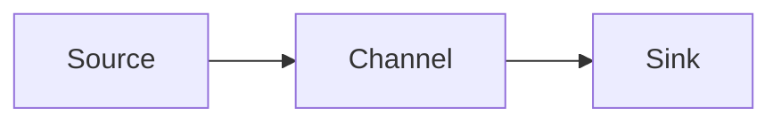

# Flume原理与代码实例讲解

## 1. 背景介绍

在当今大数据时代,海量数据的实时采集和传输是一个巨大的挑战。Apache Flume作为一个分布式、可靠、高可用的海量日志采集、聚合和传输的系统,在实时数据采集领域占据着重要地位。本文将深入探讨Flume的原理,并结合代码实例对其进行详细讲解,帮助读者全面理解和掌握这一利器。

### 1.1 Flume概述
#### 1.1.1 Flume的定义与特点  
#### 1.1.2 Flume在大数据生态系统中的地位
#### 1.1.3 Flume的发展历程

### 1.2 实时数据采集的挑战
#### 1.2.1 海量数据的高吞吐量
#### 1.2.2 分布式环境下的可靠性保证  
#### 1.2.3 异构数据源的兼容性

## 2. 核心概念与联系

要理解Flume的工作原理,首先需要掌握其核心概念及其之间的关系。本章节将对Flume的基本组件如Agent、Source、Channel、Sink等进行介绍,并通过Mermaid流程图直观展示它们之间的联系。

### 2.1 Agent
#### 2.1.1 Agent的定义
#### 2.1.2 Agent的组成部分

### 2.2 Source  
#### 2.2.1 Source的定义与分类
#### 2.2.2 常见的Source类型

### 2.3 Channel
#### 2.3.1 Channel的定义与作用
#### 2.3.2 常见的Channel类型

### 2.4 Sink
#### 2.4.1 Sink的定义与分类  
#### 2.4.2 常见的Sink类型

### 2.5 Flume核心组件之间的关系



## 3. 核心算法原理具体操作步骤

Flume的可靠性和高吞吐量离不开其背后的核心算法支撑。本章节将对Flume涉及的关键算法如可靠性算法、事务机制等进行深入剖析,并给出具体的操作步骤。

### 3.1 可靠性算法
#### 3.1.1 可靠性算法概述  
#### 3.1.2 可靠性算法的具体步骤

### 3.2 事务机制  
#### 3.2.1 Flume的事务机制介绍
#### 3.2.2 事务机制的具体实现步骤

## 4. 数学模型和公式详细讲解举例说明

为了更好地理解Flume的性能表现,我们需要借助数学建模的力量。本章节将介绍Flume涉及的关键数学模型如排队论模型等,并结合具体例子对相关公式进行详细讲解。

### 4.1 排队论模型
#### 4.1.1 排队论模型在Flume中的应用
#### 4.1.2 排队论模型的数学公式推导
#### 4.1.3 基于排队论模型的Flume性能分析示例

假设Flume的Source到Channel的数据到达率为$\lambda$,Channel的服务率为$\mu$,则根据排队论中的M/M/1模型,Channel中的平均等待时间$W_q$为:

$$W_q=\frac{\rho}{\mu(1-\rho)}$$

其中,$\rho=\frac{\lambda}{\mu}$表示服务强度。

## 5. 项目实践:代码实例和详细解释说明

理论结合实践才能深入理解Flume。本章节将提供Flume的完整代码实例,并对关键部分进行详细的解释说明,帮助读者快速上手。

### 5.1 Flume配置文件示例
#### 5.1.1 配置Source
#### 5.1.2 配置Channel  
#### 5.1.3 配置Sink

### 5.2 自定义Source代码实例
#### 5.2.1 自定义Source的必要性
#### 5.2.2 自定义Source的关键步骤
#### 5.2.3 自定义Source完整代码与解析

```java
public class MySource extends AbstractSource implements Configurable, PollableSource {
  // 代码实现
  @Override
  public Status process() throws EventDeliveryException {
    // 核心处理逻辑
  }
  ...
}
```

## 6. 实际应用场景

Flume在实际的大数据应用中有着广泛的使用场景。本章节将列举几个典型的应用案例,展示Flume的实际应用价值。

### 6.1 日志收集
#### 6.1.1 场景描述
#### 6.1.2 基于Flume的日志收集方案

### 6.2 数据库变更捕获
#### 6.2.1 场景描述
#### 6.2.2 基于Flume的数据库CDC实现

### 6.3 跨数据中心数据传输
#### 6.3.1 场景描述  
#### 6.3.2 基于Flume的跨DC数据传输方案

## 7. 工具和资源推荐  

### 7.1 Flume常用工具
#### 7.1.1 Flume-ng 
#### 7.1.2 Flume-ng-sql

### 7.2 学习资源推荐
#### 7.2.1 官方文档
#### 7.2.2 经典书籍  
#### 7.2.3 视频教程

## 8. 总结:未来发展趋势与挑战

展望Flume的未来,数据采集领域还有许多的机遇和挑战。本章节将对Flume的发展趋势进行分析,并指出其面临的潜在挑战。

### 8.1 Flume的发展趋势
#### 8.1.1 云原生环境下的Flume  
#### 8.1.2 Flume与流计算引擎的集成

### 8.2 Flume面临的挑战
#### 8.2.1 实时性能的进一步提升
#### 8.2.2 海量数据下的可扩展性

## 9. 附录:常见问题与解答

### 9.1 Flume与Kafka的比较
### 9.2 Flume的性能调优技巧
### 9.3 Flume常见错误及解决方法

作者:禅与计算机程序设计艺术 / Zen and the Art of Computer Programming