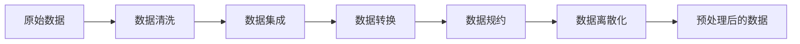

# AI数据预处理原理与代码实战案例讲解

## 1. 背景介绍
在人工智能的世界里，数据是核心。它不仅是机器学习模型的基石，也是决定模型性能的关键因素。然而，原始数据往往充满噪声和不一致性，这就需要我们进行数据预处理，以确保模型能够从中学习到有用的信息。数据预处理包括数据清洗、数据转换、数据归一化和特征提取等多个步骤，每一步都至关重要。

## 2. 核心概念与联系
数据预处理的目的是将原始数据转换成适合机器学习算法使用的格式。核心概念包括数据清洗、数据集成、数据转换、数据规约和数据离散化。这些步骤相互联系，共同构成了数据预处理的完整流程。



## 3. 核心算法原理具体操作步骤
数据预处理的核心算法原理涉及多个步骤，每个步骤都有其特定的操作方法和技术。

### 3.1 数据清洗
数据清洗主要解决数据中的噪声和不一致问题。操作步骤包括缺失值处理、噪声数据平滑、异常值检测和修正。

### 3.2 数据集成
数据集成是将来自多个源的数据合并到一个一致的数据存储中。操作步骤包括实体识别问题、冗余属性识别和数据值冲突解决。

### 3.3 数据转换
数据转换涉及将数据转换成适合分析的形式。操作步骤包括规范化、聚集、概念分层构造。

### 3.4 数据规约
数据规约旨在减少数据量，但同时产生与原始数据几乎相同的分析结果。操作步骤包括属性规约、数值规约、维度规约。

### 3.5 数据离散化
数据离散化是将连续属性的值分布转换成离散的形式。操作步骤包括分箱、直方图分析、聚类分析、决策树分析。

## 4. 数学模型和公式详细讲解举例说明
数据预处理中的数学模型和公式是理解其原理的关键。

### 4.1 缺失值处理
$$
\text{缺失值填充} = \text{统计方法}(数据集)
$$
例如，可以使用均值、中位数或众数来填充缺失值。

### 4.2 数据规范化
$$
x_{\text{new}} = \frac{x - x_{\text{min}}}{x_{\text{max}} - x_{\text{min}}}
$$
这是最小-最大规范化的公式，用于将属性值缩放到给定范围内。

### 4.3 维度规约
$$
\text{PCA} : Y = XW
$$
主成分分析(PCA)是一种常用的维度规约技术，其中$Y$是主成分，$X$是原始数据，$W$是权重矩阵。

## 5. 项目实践：代码实例和详细解释说明
在本节中，我们将通过一个实际的数据集来展示数据预处理的各个步骤。

### 5.1 数据清洗
```python
import pandas as pd
from sklearn.impute import SimpleImputer

# 加载数据集
data = pd.read_csv('data.csv')

# 缺失值处理
imputer = SimpleImputer(strategy='mean')
data_filled = imputer.fit_transform(data)
```

### 5.2 数据规范化
```python
from sklearn.preprocessing import MinMaxScaler

# 初始化规范化器
scaler = MinMaxScaler()

# 应用最小-最大规范化
data_normalized = scaler.fit_transform(data_filled)
```

### 5.3 维度规约
```python
from sklearn.decomposition import PCA

# 初始化PCA
pca = PCA(n_components=2)

# 应用PCA
data_reduced = pca.fit_transform(data_normalized)
```

## 6. 实际应用场景
数据预处理在各个领域都有广泛的应用，如金融风控、医疗诊断、市场分析等。

## 7. 工具和资源推荐
- Pandas: 数据处理和分析
- Scikit-learn: 机器学习算法
- Matplotlib: 数据可视化

## 8. 总结：未来发展趋势与挑战
数据预处理的未来发展趋势将更加自动化和智能化，但同时也面临着数据隐私和安全的挑战。

## 9. 附录：常见问题与解答
Q1: 数据预处理为什么重要？
A1: 数据预处理可以提高数据质量，从而提高模型的性能。

Q2: 数据规范化和标准化有什么区别？
A2: 规范化通常是将数据缩放到[0,1]区间，而标准化是将数据转换为均值为0，标准差为1的分布。

作者：禅与计算机程序设计艺术 / Zen and the Art of Computer Programming