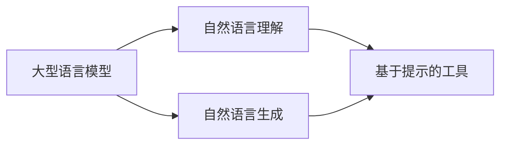

# 大语言模型应用指南：基于提示的工具

## 1. 背景介绍

随着人工智能技术的飞速发展，大型语言模型（Large Language Models，LLMs）已经成为了自然语言处理（NLP）领域的一大突破。这些模型如GPT-3、BERT和T5等，不仅在理解和生成自然语言方面取得了显著成就，而且在多种应用场景中展现出了巨大的潜力。基于提示的工具（Prompt-based Tools）是利用大型语言模型进行任务指导的一种方法，它通过精心设计的提示来激发模型生成特定的输出，从而在各种任务中实现高效的自动化。

## 2. 核心概念与联系

### 2.1 大型语言模型（LLMs）
大型语言模型是基于深度学习的模型，通常使用大量的文本数据进行训练，以学习语言的统计规律。这些模型能够捕捉到语言的复杂性和细微的语义差异。

### 2.2 基于提示的工具
基于提示的工具是指通过设计特定的语言提示，引导语言模型按照预期的方式响应。这种方法可以简化传统的机器学习流程，无需显式编程即可完成特定任务。

### 2.3 关系图谱


## 3. 核心算法原理具体操作步骤

### 3.1 模型训练
1. 数据收集：收集大规模多样化的文本数据。
2. 预处理：清洗数据，进行分词等预处理操作。
3. 模型选择：选择合适的神经网络架构，如Transformer。
4. 训练：使用大规模数据集对模型进行训练，直到收敛。

### 3.2 提示设计
1. 任务分析：明确任务目标和需求。
2. 提示构建：根据任务需求设计合适的语言提示。
3. 微调：在特定任务上对模型进行微调，以优化对提示的响应。

### 3.3 应用执行
1. 输入提示：将设计好的提示输入到模型中。
2. 模型响应：模型根据输入的提示生成响应。
3. 输出处理：对模型的输出进行后处理，以满足应用需求。

## 4. 数学模型和公式详细讲解举例说明

### 4.1 Transformer模型
Transformer模型是目前大型语言模型常用的架构，其核心是自注意力机制（Self-Attention）。

$$
\text{Attention}(Q, K, V) = \text{softmax}\left(\frac{QK^T}{\sqrt{d_k}}\right)V
$$

其中，$Q$、$K$、$V$分别代表查询（Query）、键（Key）和值（Value），$d_k$是键的维度。

### 4.2 微调过程
微调（Fine-tuning）是在预训练模型的基础上，针对特定任务进行的训练过程。

$$
L(\theta) = -\sum_{i=1}^{N}\log P(y_i|x_i;\theta)
$$

$L(\theta)$是损失函数，$P(y_i|x_i;\theta)$是模型在参数$\theta$下，给定输入$x_i$预测正确标签$y_i$的概率，$N$是训练样本的数量。

### 4.3 举例说明
假设我们要设计一个提示，让模型生成一篇关于机器学习的文章摘要。提示可以是：“请简述机器学习的基本概念和应用领域。”输入这个提示后，模型会生成一段摘要性质的文本。

## 5. 项目实践：代码实例和详细解释说明

### 5.1 环境准备
```python
import openai

# 设置API密钥
openai.api_key = '你的API密钥'
```

### 5.2 提示设计与模型调用
```python
prompt = "请简述机器学习的基本概念和应用领域。"
response = openai.Completion.create(
  engine="text-davinci-003",
  prompt=prompt,
  max_tokens=150
)
print(response.choices[0].text.strip())
```

### 5.3 解释说明
上述代码首先导入了OpenAI库，并设置了API密钥。然后定义了一个关于机器学习的提示，并通过OpenAI的Completion API调用了GPT-3模型，生成了一段文本作为响应。

## 6. 实际应用场景

大型语言模型和基于提示的工具在多个领域都有广泛应用，包括但不限于：

- 自动内容生成：如文章撰写、代码生成等。
- 问答系统：如客服机器人、教育辅导等。
- 语言翻译：如实时翻译、文档本地化等。
- 情感分析：如品牌监测、市场研究等。

## 7. 工具和资源推荐

- OpenAI API：提供GPT-3等模型的API接口。
- Hugging Face Transformers：开源的预训练模型库。
- TensorFlow和PyTorch：流行的深度学习框架。

## 8. 总结：未来发展趋势与挑战

大型语言模型和基于提示的工具将继续推动NLP领域的发展。未来的趋势可能包括模型的进一步优化、多模态学习的融合、以及对模型可解释性和偏见的探讨。同时，随着技术的发展，如何处理数据隐私和安全问题也将成为重要的挑战。

## 9. 附录：常见问题与解答

Q1: 如何选择合适的大型语言模型？
A1: 需要根据任务的具体需求和资源限制来选择，可以考虑模型的大小、训练数据的质量和多样性、以及社区支持等因素。

Q2: 基于提示的工具有哪些局限性？
A2: 提示设计需要一定的专业知识和经验，模型的输出也可能受到训练数据的偏见影响。

Q3: 如何评估基于提示工具的效果？
A3: 可以通过设置评估指标，如准确率、召回率和F1分数等，来评估模型在特定任务上的表现。

作者：禅与计算机程序设计艺术 / Zen and the Art of Computer Programming