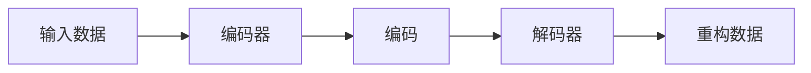

# 自编码器原理与代码实战案例讲解

## 1. 背景介绍
在深度学习的众多研究领域中，自编码器（Autoencoder）作为一种无监督学习算法，因其强大的特征提取和数据压缩能力而备受关注。自编码器通过学习输入数据的高效表示（即编码），并尝试从这些表示中重构输入数据，从而实现数据的降维和特征学习。它在图像去噪、数据降维、生成模型等领域有着广泛的应用。

## 2. 核心概念与联系
自编码器由编码器（Encoder）和解码器（Decoder）两部分组成。编码器负责将输入数据映射到一个隐藏层，这个隐藏层通常被称为“编码”；解码器则负责将编码重构回原始输入数据。自编码器的目标是最小化重构误差，即输入和输出之间的差异。



## 3. 核心算法原理具体操作步骤
自编码器的训练过程包括以下步骤：
1. 初始化编码器和解码器的权重和偏置。
2. 将输入数据传递给编码器，得到编码。
3. 将编码传递给解码器，得到重构数据。
4. 计算重构数据和原始输入数据之间的损失函数。
5. 通过反向传播算法更新权重和偏置，以最小化损失函数。
6. 重复步骤2-5，直到满足停止条件。

## 4. 数学模型和公式详细讲解举例说明
自编码器的数学模型可以表示为：
$$
h = f(Wx + b)
$$
$$
r = g(W'h + b')
$$
其中，$x$ 是输入数据，$h$ 是编码，$r$ 是重构数据，$W$ 和 $W'$ 分别是编码器和解码器的权重，$b$ 和 $b'$ 是偏置，$f$ 和 $g$ 是激活函数。

损失函数通常使用均方误差（MSE）：
$$
L(x, r) = \frac{1}{n} \sum_{i=1}^{n} (x_i - r_i)^2
$$
其中，$n$ 是数据点的数量，$x_i$ 和 $r_i$ 分别是原始数据和重构数据的第$i$个元素。

## 5. 项目实践：代码实例和详细解释说明
以下是一个简单的自编码器实现，使用Python和TensorFlow框架：

```python
import tensorflow as tf
from tensorflow.keras.layers import Input, Dense
from tensorflow.keras.models import Model

# 定义编码器和解码器的维度
encoding_dim = 32  # 编码的维度
input_img = Input(shape=(784,))  # 假设输入是28*28的图像，展平后的维度是784

# 编码器
encoded = Dense(encoding_dim, activation='relu')(input_img)

# 解码器
decoded = Dense(784, activation='sigmoid')(encoded)

# 自编码器模型
autoencoder = Model(input_img, decoded)

# 编码器模型
encoder = Model(input_img, encoded)

# 解码器模型
encoded_input = Input(shape=(encoding_dim,))
decoder_layer = autoencoder.layers[-1]
decoder = Model(encoded_input, decoder_layer(encoded_input))

# 编译自编码器
autoencoder.compile(optimizer='adam', loss='binary_crossentropy')

# 训练自编码器
autoencoder.fit(x_train, x_train, epochs=50, batch_size=256, shuffle=True, validation_data=(x_test, x_test))
```

在这个例子中，我们构建了一个简单的自编码器，它将784维的输入压缩到32维的编码，然后再重构回784维。我们使用ReLU激活函数进行编码，使用Sigmoid激活函数进行解码。模型使用Adam优化器和二元交叉熵损失函数进行训练。

## 6. 实际应用场景
自编码器在以下场景中有着广泛的应用：
- 数据降维和特征提取
- 图像去噪
- 生成模型，如变分自编码器（VAE）
- 异常检测

## 7. 工具和资源推荐
- TensorFlow和Keras：用于构建和训练自编码器的强大框架。
- PyTorch：另一个流行的深度学习框架，适合研究和原型开发。
- Scikit-learn：提供了许多数据预处理和降维的工具。

## 8. 总结：未来发展趋势与挑战
自编码器的研究正在朝着更复杂的模型和应用方向发展，例如结合卷积神经网络（CNN）的卷积自编码器，以及用于处理序列数据的循环自编码器（RNN）。未来的挑战包括提高自编码器的泛化能力，以及在更多的实际应用中实现其潜力。

## 9. 附录：常见问题与解答
Q1: 自编码器和PCA有什么区别？
A1: 自编码器是一种非线性降维方法，而PCA是线性的。自编码器可以学习更复杂的数据表示。

Q2: 自编码器如何用于去噪？
A2: 自编码器可以通过学习重构没有噪声的数据，从而在编码过程中忽略噪声。

Q3: 自编码器的训练数据需要标签吗？
A3: 不需要，自编码器是一种无监督学习算法，只需要输入数据本身。

作者：禅与计算机程序设计艺术 / Zen and the Art of Computer Programming