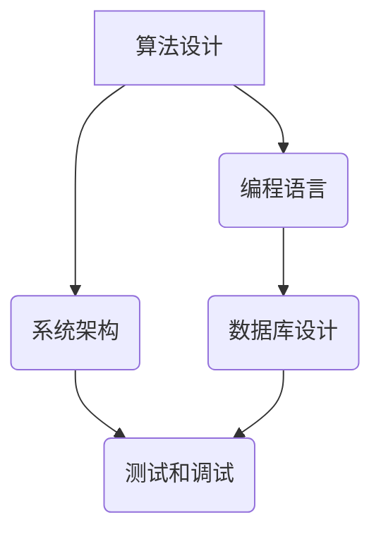

> 专业知识、项目管理、技术积累、算法设计、代码实践、数学模型、项目成功

## 1. 背景介绍

在当今科技日新月异的时代，软件开发项目正变得越来越复杂。从简单的单体应用到庞大的分布式系统，项目规模不断扩大，技术栈也日益丰富。面对这样的挑战，仅仅依靠个人经验和临场应变已经远远不够。 

项目成功与否，很大程度上取决于团队成员的专业知识积累。 丰富的专业知识不仅能帮助开发人员更高效地解决问题，还能提升团队的整体协作效率，最终推动项目顺利完成。

## 2. 核心概念与联系

专业知识的积累是一个持续的过程，它涵盖了多个方面，包括：

* **算法设计与分析**: 掌握常用的算法和数据结构，能够快速分析问题，设计高效的解决方案。
* **编程语言和框架**: 熟悉多种编程语言和框架，能够灵活选择合适的工具，提高开发效率。
* **系统架构设计**: 了解不同的系统架构模式，能够设计可靠、可扩展的系统。
* **数据库设计与管理**: 掌握数据库设计原则和操作方法，能够构建高效的数据存储和管理系统。
* **测试和调试**: 了解软件测试方法和调试技巧，能够保证软件质量。

这些核心概念相互关联，共同构成了软件开发的知识体系。

## 3. 核心算法原理 & 具体操作步骤

### 3.1  算法原理概述

算法是解决特定问题的步骤序列，是计算机程序的核心。选择合适的算法可以极大地提高程序的效率和性能。常见的算法包括排序算法、搜索算法、图算法等。

### 3.2  算法步骤详解

以排序算法为例，常见的排序算法包括冒泡排序、插入排序、快速排序等。

* **冒泡排序**: 比较相邻元素，如果顺序错误则交换位置，重复此过程直到整个数组有序。
* **插入排序**: 将一个元素插入到已经排序的子数组中，保持子数组有序。
* **快速排序**: 选择一个元素作为基准，将小于基准的元素放在左边，大于基准的元素放在右边，递归地对左右子数组进行排序。

### 3.3  算法优缺点

不同的算法具有不同的优缺点，需要根据实际情况选择合适的算法。

* **冒泡排序**: 简单易懂，但效率较低。
* **插入排序**: 效率中等，适合小规模数据排序。
* **快速排序**: 效率较高，但时间复杂度不稳定。

### 3.4  算法应用领域

算法广泛应用于各个领域，例如：

* **搜索引擎**: 使用排序算法对网页进行排名。
* **数据分析**: 使用聚类算法对数据进行分类。
* **图像处理**: 使用滤波算法对图像进行处理。

## 4. 数学模型和公式 & 详细讲解 & 举例说明

### 4.1  数学模型构建

数学模型可以用来描述和分析复杂系统，帮助我们理解其行为规律。例如，我们可以使用线性回归模型来预测房价，使用Logistic回归模型来预测用户点击行为。

### 4.2  公式推导过程

数学公式是数学模型的核心，通过公式可以量化描述系统的行为。例如，线性回归模型的公式如下：

$$y = mx + c$$

其中，$y$ 是预测值，$x$ 是输入变量，$m$ 是斜率，$c$ 是截距。

### 4.3  案例分析与讲解

我们可以使用线性回归模型来预测房价。假设我们收集了房屋面积和房价的数据，可以使用线性回归模型来建立一个预测房价的模型。

## 5. 项目实践：代码实例和详细解释说明

### 5.1  开发环境搭建

项目实践需要搭建合适的开发环境，包括操作系统、编程语言、开发工具等。

### 5.2  源代码详细实现

代码实现是将算法和数学模型转化为实际程序的过程。

### 5.3  代码解读与分析

需要对代码进行详细解读和分析，理解代码的逻辑和功能。

### 5.4  运行结果展示

运行代码后，需要展示运行结果，并进行分析和验证。

## 6. 实际应用场景

### 6.1  案例分析

可以结合实际案例，展示专业知识在实际应用中的场景。

### 6.2  应用价值

分析专业知识在实际应用中的价值和意义。

### 6.3  未来应用展望

展望专业知识在未来应用的趋势和方向。

## 7. 工具和资源推荐

### 7.1  学习资源推荐

推荐一些学习相关专业知识的资源，例如书籍、在线课程、博客等。

### 7.2  开发工具推荐

推荐一些常用的开发工具，例如IDE、版本控制工具、测试工具等。

### 7.3  相关论文推荐

推荐一些相关领域的论文，帮助读者深入了解专业知识。

## 8. 总结：未来发展趋势与挑战

### 8.1  研究成果总结

总结文章的主要研究成果和结论。

### 8.2  未来发展趋势

展望专业知识的未来发展趋势，例如人工智能、云计算等领域的发展。

### 8.3  面临的挑战

分析专业知识发展过程中面临的挑战，例如技术更新迭代、人才培养等。

### 8.4  研究展望

展望未来研究方向，例如如何更好地积累和应用专业知识。

## 9. 附录：常见问题与解答

解答一些读者可能遇到的常见问题。

## 作者：禅与计算机程序设计艺术 / Zen and the Art of Computer Programming

<end_of_turn>