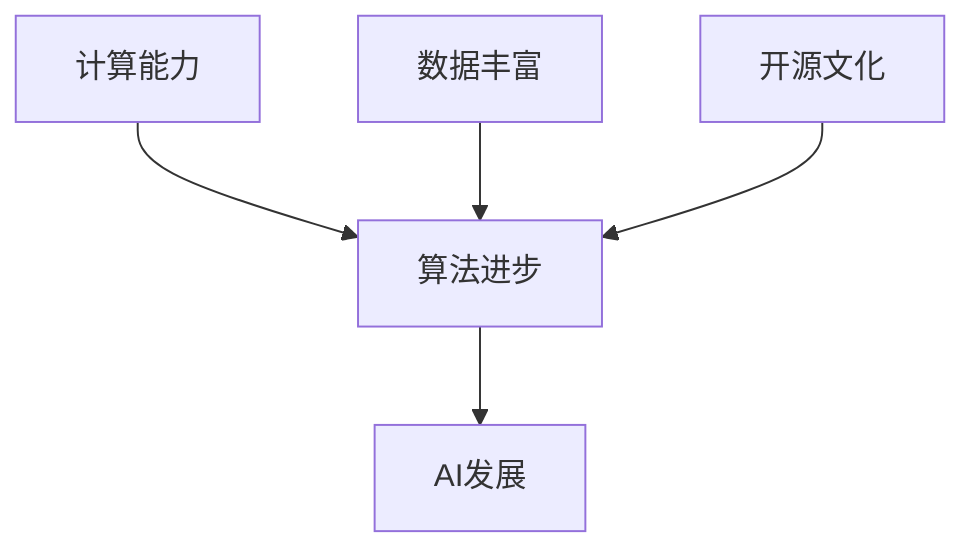

                 

**人工智能的未来发展挑挑战**

## 1. 背景介绍

人工智能（AI）自诞生以来，已从一项学术实验发展为商业和技术领域的关键驱动因素。然而，随着AI的不断发展，我们也面临着一系列挑战。本文将从技术、伦理和社会角度探讨这些挑战，并展望未来AI发展的可能方向。

## 2. 核心概念与联系

### 2.1 AI发展的驱动因素

AI的发展受到多种因素的驱动，包括计算能力的提高、数据的丰富、算法的进步和开源文化的兴起。这些因素共同推动了AI的发展，使其从简单的规则系统发展为当前的深度学习模型。



### 2.2 AI的分类

AI可以分为狭义AI和广义AI。狭义AI指的是当前我们正在开发的、能够执行特定任务的AI系统，如图像和语音识别。广义AI则指的是具有通用智能的AI系统，能够理解、学习和应用知识，目前还处于研究阶段。

## 3. 核心算法原理 & 具体操作步骤

### 3.1 算法原理概述

当前，深度学习是AI领域最成功的方法。深度学习模型由多个相互连接的层组成，每层都学习从输入到输出的表示。

### 3.2 算法步骤详解

深度学习模型的训练过程包括以下步骤：

1. **前向传播**：计算网络的输出。
2. **误差计算**：计算输出与真实值之间的误差。
3. **反向传播**：计算每层的梯度，更新权重。
4. **权重更新**：使用梯度下降法更新权重，以最小化误差。

### 3.3 算法优缺点

深度学习模型的优点包括自动特征提取和高精确度。然而，它们也存在缺点，如对大量数据的需求、训练过程的计算开销和模型的非解释性。

### 3.4 算法应用领域

深度学习模型广泛应用于图像和语音识别、自然语言处理、自动驾驶和医疗诊断等领域。

## 4. 数学模型和公式 & 详细讲解 & 举例说明

### 4.1 数学模型构建

深度学习模型可以表示为一个函数$f(x; \theta)$, 其中$x$是输入，$\theta$是模型的参数。模型的目标是学习一组参数$\theta^*$, 使得$f(x; \theta^*)$尽可能接近真实函数$y = g(x)$.

### 4.2 公式推导过程

模型的学习过程可以表示为一个优化问题：

$$\theta^* = \arg\min_{\theta} L(f(x; \theta), y)$$

其中$L$是损失函数，衡量模型输出与真实值之间的误差。

### 4.3 案例分析与讲解

例如，在线性回归中，$f(x; \theta) = \theta^T x$, 损失函数$L$可以是均方误差。学习过程变为：

$$\theta^* = \arg\min_{\theta} \frac{1}{n} \sum_{i=1}^{n} (\theta^T x_i - y_i)^2$$

## 5. 项目实践：代码实例和详细解释说明

### 5.1 开发环境搭建

要训练一个深度学习模型，需要安装Python、TensorFlow或PyTorch等深度学习框架。

### 5.2 源代码详细实现

以下是一个简单的线性回归模型的实现代码：

```python
import tensorflow as tf
import numpy as np

# 创建数据
x = np.random.rand(100, 1)
y = 2 * x + np.random.rand(100, 1)

# 定义模型
model = tf.keras.Sequential([tf.keras.layers.Dense(1, input_shape=(1,))])

# 编译模型
model.compile(optimizer='sgd', loss='mse')

# 训练模型
model.fit(x, y, epochs=100)
```

### 5.3 代码解读与分析

这段代码首先创建了一个简单的线性回归数据集。然后，它定义了一个单层神经网络模型，编译了模型，并使用梯度下降法训练了模型。

### 5.4 运行结果展示

训练好的模型应该能够准确预测新数据的输出。

## 6. 实际应用场景

### 6.1 当前应用

AI当前广泛应用于各个领域，从搜索引擎到自动驾驶汽车，从医疗诊断到语音助手。

### 6.2 未来应用展望

未来，AI可能会应用于更复杂的任务，如自动飞行器、人工智能助手和智能城市规划。

## 7. 工具和资源推荐

### 7.1 学习资源推荐

推荐阅读《深度学习》一书，以及斯坦福大学的在线课程“机器学习”。

### 7.2 开发工具推荐

推荐使用TensorFlow或PyTorch等深度学习框架，以及Jupyter Notebook等开发环境。

### 7.3 相关论文推荐

推荐阅读《ImageNet Classification with Deep Convolutional Neural Networks》和《Attention Is All You Need》等经典论文。

## 8. 总结：未来发展趋势与挑战

### 8.1 研究成果总结

AI在各个领域取得了显著成就，但仍面临着许多挑战。

### 8.2 未来发展趋势

未来，AI可能会朝着更解释性、更通用、更安全的方向发展。

### 8.3 面临的挑战

AI面临的挑战包括数据隐私、算法偏见、计算能力的限制和模型的解释性。

### 8.4 研究展望

未来的研究可能会集中在增强学习、自监督学习和多模式学习等领域。

## 9. 附录：常见问题与解答

**Q：AI会取代人类吗？**

**A：**AI可能会取代某些人类工作，但也会创造新的工作岗位。此外，AI的目标是辅助人类，而不是取代人类。

**作者：禅与计算机程序设计艺术 / Zen and the Art of Computer Programming**

