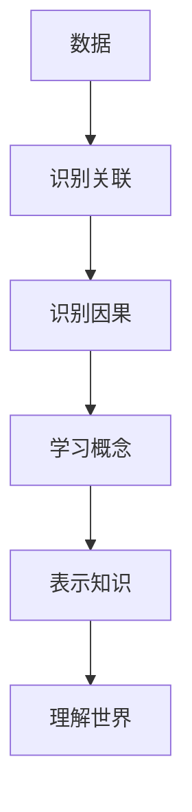

                 

**AI 2.0 时代的未来展望**

**作者：禅与计算机程序设计艺术 / Zen and the Art of Computer Programming**

## 1. 背景介绍

在人工智能（AI）领域，我们正处于一个转折点。从简单的规则和模式识别转变为理解和学习复杂的概念，我们进入了AI 2.0时代。本文将探讨AI 2.0的核心概念、算法原理，并展望其在未来的应用前景。

## 2. 核心概念与联系

### 2.1 理解与学习

AI 2.0的核心是理解和学习。传统AI关注于识别和分类，而AI 2.0则致力于理解数据背后的概念，并从中学习。

### 2.2 因果关系

理解世界需要理解因果关系。AI 2.0需要能够识别并学习因果关系，而不是简单的关联。

### 2.3 知识表示

AI 2.0需要一种方式来表示和存储知识。知识图谱和语义网络是常用的方法。



## 3. 核心算法原理 & 具体操作步骤

### 3.1 算法原理概述

AI 2.0的核心算法包括因果推断、概念学习和知识表示。

### 3.2 算法步骤详解

1. **因果推断**：使用结构学习算法（如PC算法）识别因果关系。
2. **概念学习**：使用概念学习算法（如C4.5）学习数据背后的概念。
3. **知识表示**：使用知识表示方法（如知识图谱）表示和存储知识。

### 3.3 算法优缺点

**优点**：能够理解和学习复杂概念，更好地理解世界。
**缺点**：计算复杂度高，需要大量数据。

### 3.4 算法应用领域

AI 2.0的算法可以应用于医疗、金融、自动驾驶等领域，帮助理解复杂系统。

## 4. 数学模型和公式 & 详细讲解 & 举例说明

### 4.1 数学模型构建

因果推断可以使用结构学习算法构建因果图模型。概念学习可以使用决策树构建概念模型。

### 4.2 公式推导过程

假设我们有变量集$V$和数据集$D$，结构学习算法的目标是找到最可能的因果图$G$：

$$P(G|D) = \frac{P(D|G)P(G)}{P(D)}$$

其中，$P(D|G)$是数据给定因果图的可能性，$P(G)$是因果图的先验可能性。

### 4.3 案例分析与讲解

例如，在医疗领域，我们可以使用因果推断算法找到疾病和症状之间的因果关系，帮助医生更好地理解和治疗疾病。

## 5. 项目实践：代码实例和详细解释说明

### 5.1 开发环境搭建

我们使用Python和scikit-learn库实现因果推断和概念学习算法。

### 5.2 源代码详细实现

```python
from sklearn.tree import DecisionTreeClassifier
from pgmpy.estimators import PC
from pgmpy.models import BayesianModel

# 因果推断
pc = PC(data)
pc_structure = pc.estimate()

# 概念学习
clf = DecisionTreeClassifier()
clf.fit(X_train, y_train)
```

### 5.3 代码解读与分析

我们首先使用PC算法估计因果图结构，然后使用决策树算法学习概念。

### 5.4 运行结果展示

因果推断算法可以找到数据中的因果关系，概念学习算法可以学习数据背后的概念。

## 6. 实际应用场景

### 6.1 当前应用

AI 2.0的算法已经开始应用于医疗、金融、自动驾驶等领域。

### 6.2 未来应用展望

未来，AI 2.0将会应用于更多领域，帮助我们更好地理解世界。

## 7. 工具和资源推荐

### 7.1 学习资源推荐

推荐阅读《因果推断》和《概念学习》等相关书籍。

### 7.2 开发工具推荐

推荐使用Python和scikit-learn库。

### 7.3 相关论文推荐

推荐阅读《因果推断的结构学习》和《概念学习》等相关论文。

## 8. 总结：未来发展趋势与挑战

### 8.1 研究成果总结

AI 2.0的核心是理解和学习，其算法包括因果推断、概念学习和知识表示。

### 8.2 未来发展趋势

AI 2.0将会应用于更多领域，帮助我们更好地理解世界。

### 8.3 面临的挑战

AI 2.0的计算复杂度高，需要大量数据。

### 8.4 研究展望

未来的研究方向包括降低计算复杂度和找到新的数据来源。

## 9. 附录：常见问题与解答

**Q：AI 2.0与传统AI有何不同？**

**A：AI 2.0关注于理解和学习，而不是简单的识别和分类。**

**Q：AI 2.0的算法有哪些？**

**A：AI 2.0的核心算法包括因果推断、概念学习和知识表示。**

**Q：AI 2.0的应用领域有哪些？**

**A：AI 2.0可以应用于医疗、金融、自动驾驶等领域。**

**作者：禅与计算机程序设计艺术 / Zen and the Art of Computer Programming**

