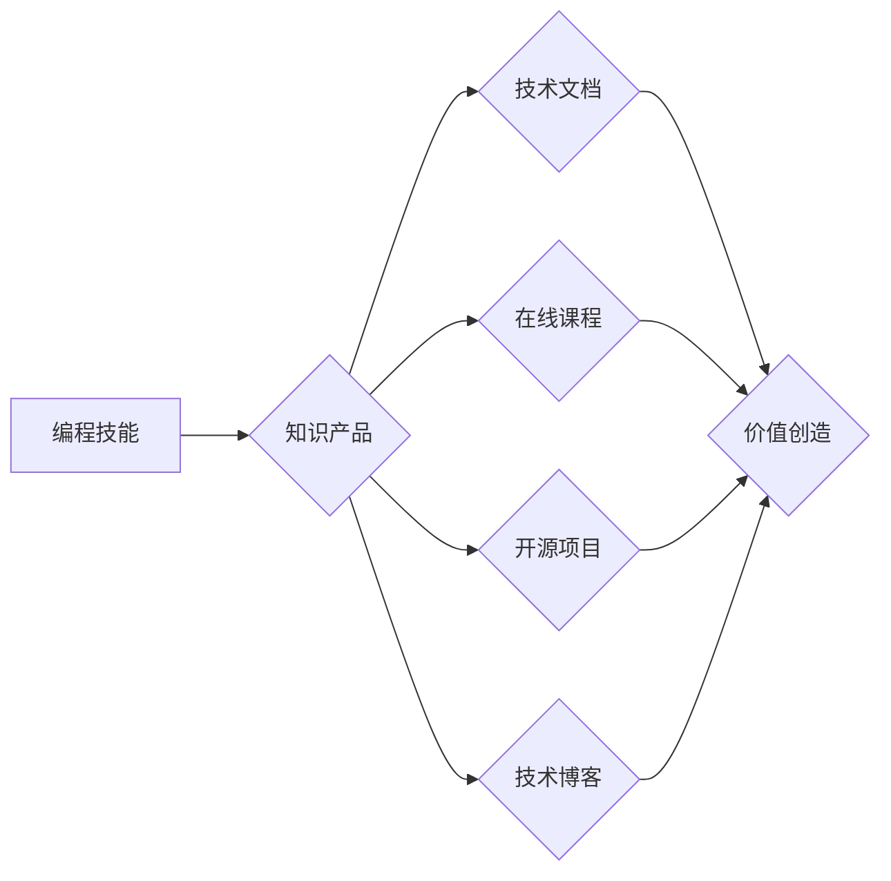

                 

## 如何将编程技能转化为知识产品

> 关键词：编程技能、知识产品、技术文档、在线课程、开源项目、技术博客、技术社区、知识付费、技术传播

### 1. 背景介绍

在当今数字时代，编程技能已成为一项至关重要的能力，它为个人和企业带来了无限的可能性。然而，仅仅掌握编程技能并不能保证成功。越来越多的程序员开始意识到，将自己的编程知识和经验转化为知识产品，能够带来更长远的影响力和收益。

知识产品是指以知识为核心内容，通过数字化形式传播和销售的产品。它可以是技术文档、在线课程、开源项目、技术博客、技术社区等多种形式。将编程技能转化为知识产品，不仅能够帮助程序员分享知识、建立个人品牌，更能为他人提供价值，推动技术进步。

### 2. 核心概念与联系

**2.1 编程技能与知识产品的联系**

编程技能是知识产品的基础，它为创建知识产品提供了必要的技术能力。而知识产品则将编程技能转化为可传播和利用的知识形态，使其能够触达更广泛的受众。

**2.2 知识产品类型与编程技能**

不同的知识产品类型对应不同的编程技能需求。例如：

* **技术文档:** 需要清晰的逻辑思维、良好的写作能力和对技术细节的深入理解。
* **在线课程:** 需要优秀的教学能力、善于用通俗易懂的语言讲解复杂的技术概念。
* **开源项目:** 需要扎实的编程基础、良好的代码规范和团队合作能力。
* **技术博客:** 需要对技术领域有深入的思考和见解，并能够用生动形象的语言进行表达。

**2.3 知识产品价值链**

知识产品的价值链包括：

* **内容创作:** 这是知识产品的第一步，需要程序员将自己的编程知识和经验转化为有价值的内容。
* **内容包装:** 将内容以易于理解和吸收的形式进行包装，例如制作视频、编写电子书等。
* **内容传播:** 通过各种渠道将知识产品推广到目标受众，例如发布博客文章、在社交媒体平台分享等。
* **内容 monetization:** 通过付费订阅、广告收入等方式实现知识产品的盈利。

**Mermaid 流程图**

### 3. 核心算法原理 & 具体操作步骤

**3.1 算法原理概述**

选择一个具体的编程算法，例如快速排序算法，并对其原理进行概述。

**3.2 算法步骤详解**

详细描述快速排序算法的步骤，包括选择基准元素、分区操作、递归调用等。

**3.3 算法优缺点**

分析快速排序算法的优缺点，例如时间复杂度、空间复杂度、稳定性等。

**3.4 算法应用领域**

介绍快速排序算法在实际应用中的场景，例如数据排序、查找等。

### 4. 数学模型和公式 & 详细讲解 & 举例说明

**4.1 数学模型构建**

构建快速排序算法的时间复杂度数学模型，例如：

$$T(n) = 2T(\frac{n}{2}) + O(n)$$

**4.2 公式推导过程**

详细推导快速排序算法的时间复杂度公式，并解释公式中的各个部分。

**4.3 案例分析与讲解**

通过一个具体的例子，分析快速排序算法的时间复杂度，并解释其结果。

### 5. 项目实践：代码实例和详细解释说明

**5.1 开发环境搭建**

介绍快速排序算法的代码实现环境，例如Python语言环境。

**5.2 源代码详细实现**

提供快速排序算法的源代码，并进行详细的注释解释。

**5.3 代码解读与分析**

对代码进行逐行解读，分析代码的逻辑流程和算法实现细节。

**5.4 运行结果展示**

展示快速排序算法的运行结果，例如排序后的数据序列。

### 6. 实际应用场景

**6.1 数据排序**

介绍快速排序算法在数据排序场景中的应用，例如数据库查询、搜索引擎排序等。

**6.2 查找操作**

介绍快速排序算法在查找操作场景中的应用，例如二分查找等。

**6.3 其他应用场景**

介绍快速排序算法在其他应用场景中的应用，例如机器学习、图像处理等。

**6.4 未来应用展望**

展望快速排序算法在未来应用中的发展趋势，例如与其他算法的结合、在云计算环境下的应用等。

### 7. 工具和资源推荐

**7.1 学习资源推荐**

推荐一些学习编程算法的在线课程、书籍、网站等资源。

**7.2 开发工具推荐**

推荐一些用于开发和测试编程算法的工具，例如IDE、调试器等。

**7.3 相关论文推荐**

推荐一些关于快速排序算法的学术论文。

### 8. 总结：未来发展趋势与挑战

**8.1 研究成果总结**

总结快速排序算法的研究成果，包括算法原理、时间复杂度分析、应用场景等。

**8.2 未来发展趋势**

展望快速排序算法的未来发展趋势，例如算法优化、应用扩展等。

**8.3 面临的挑战**

分析快速排序算法面临的挑战，例如算法效率、数据规模等。

**8.4 研究展望**

展望未来对快速排序算法的研究方向，例如算法的并行化、分布式化等。

### 9. 附录：常见问题与解答

解答一些关于快速排序算法的常见问题，例如算法的实现细节、时间复杂度的分析等。

作者：禅与计算机程序设计艺术 / Zen and the Art of Computer Programming<end_of_turn>

