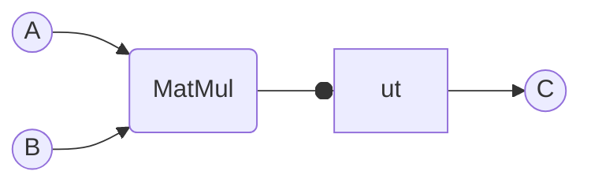
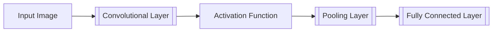
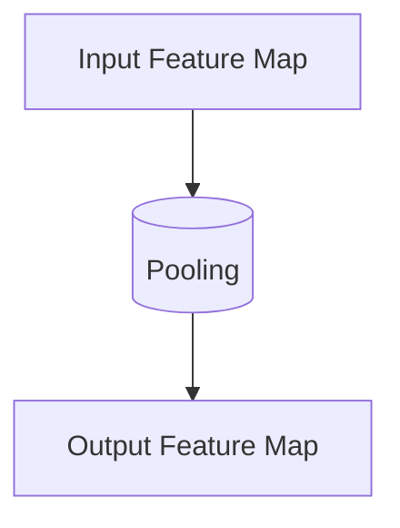

作者：禅与计算机程序设计艺术                    

# 1.简介
         

随着人工智能技术的发展，机器学习作为其中的一个分支领域越来越受到关注，特别是在图像、文本等领域，由于数据量庞大且复杂性高，传统的基于规则的机器学习方法无法有效地处理如此多的数据。因此，机器学习模型需要更加先进的算法、理论基础和系统设计。近几年来，Google公司推出了一款名为TensorFlow的开源机器学习框架，该框架能够支持很多深度学习模型的训练、验证、预测等流程，并具有强大的可扩展性。本文将向读者介绍TensorFlow及其在深度学习领域的应用。
# 2. 基本概念术语说明
## 2.1 TensorFlow
TensorFlow是一个开源的机器学习库，它使用图计算的方式进行深度学习，通过构建计算图可以定义和训练各种机器学习模型。其中图中的节点表示输入或参数，边代表张量运算符，有向无环图（DAG）是TensorFlow计算的主要抽象单元。TensorFlow提供的接口包括Python API、C++ API、命令行接口、JavaScript API等。

### 2.1.1 计算图（Computation Graph）
图计算的目的是为了更好地描述复杂的数值计算过程，将数学表达式表示成一系列节点和边所构成的有向无环图，每个节点对应数学表达式中的元素，而边则代表着数学运算符。例如，对于两个矩阵$A$和$B$, 求它们的点积$AB$，可以用以下的计算图来表示：



这里，$A$、$B$和$C$都是节点，$Op$就是表示矩阵乘法的节点，它有两个入口$A$和$B$，输出一个结果$C$。计算图的一个重要优势就是它不仅可以很方便地表示数学运算，而且可以用来实现机器学习模型的训练和预测。

### 2.1.2 矢量化（Vectorization）
TensorFlow中最基本的计算单位是一个张量（tensor），它可以看作是具有相同数据类型和形状的一组向量。为了提升计算效率，TensorFlow提供了一种自动矢量化的方法——直接对整个计算图进行矢量化，不需要手动编写循环和分支语句。

### 2.1.3 数据流图（Data Flow Graph）
数据流图（data flow graph）是指用于实现机器学习模型的图，它由几个阶段组成，每一个阶段负责完成特定的任务，比如读取数据、处理数据、执行模型计算、评估模型效果、保存模型等。这些阶段之间通过张量流动连接起来，在计算过程中会根据不同的操作生成新的张量。

## 2.2 深度学习
深度学习（deep learning）是机器学习研究领域里的一个重要方向，它利用计算机视觉、自然语言处理、语音识别等领域的结构性特征学习数据，使计算机具备了学习能力。深度学习通常由多个层次的神经网络组成，各层次之间通过前一层节点的输出与后一层节点的输入相连，形成一个复杂的神经网络结构。深度学习算法包括卷积神经网络（Convolutional Neural Networks，CNNs）、循环神经网络（Recurrent Neural Networks，RNNs）、深度置信网络（Deep Belief Networks，DBNs）等。

### 2.2.1 神经网络
神经网络（Neural Network，NN）是一种非线性函数approximator。它接收一个输入向量x，通过一定数量的隐藏层计算得到输出y，一般情况下，y可以看作是网络的预测结果。隐藏层可以理解为求解非线性方程的桩，它起到了模型的鲁棒性和泛化性能的作用。

在深度学习的任务中，NN可以做什么呢？

- 对复杂的非线性关系建模：对于输入向量x，假设有$D$个维度，那么通过隐含层的计算得到的输出y就可以看作是一组数字，如果需要区分$K$种可能的类别，那么输出向量y就有$K$个分量，而非线性激活函数（如Sigmoid、ReLU、Softmax等）的作用就是用来将输出范围压缩到$(0,1)$或$(-\infty,\infty)$之间。 

- 模拟人的大脑：深度学习模型的参数可以被认为是网络的权重，通过训练模型的参数可以模仿人类的神经元网络结构，这种模式在视觉、语音、语言、动作决策等领域都有着广泛的应用。

- 自动学习特征：由于人类的大脑具有高度抽象的思维方式，因此有很多的领域都可以用深度学习模型来自动学习有意义的特征。

### 2.2.2 损失函数
损失函数（loss function）用于衡量网络预测结果与实际标签之间的差异，它通过反馈网络在训练过程中发生的错误给予网络提示，从而优化模型的参数以减小误差。损失函数是一个单调递增函数，最小化损失函数的目标就是要找到合适的模型参数以便于解决问题。目前有多种损失函数，包括平方误差损失、交叉熵损失等。

### 2.2.3 优化器
优化器（optimizer）用于更新模型参数以降低损失函数的值。目前有多种优化器，包括随机梯度下降（SGD）、动量法（Momentum）、Adam等。

## 2.3 学习率（Learning Rate）
学习率（learning rate）是模型训练过程中的超参数，它决定了更新模型参数时的步长。一般来说，较大的学习率能够带来更好的模型训练效果，但过大的学习率容易造成震荡、发散等问题。

# 3.核心算法原理和具体操作步骤
本节将详细介绍常用的深度学习算法，包括卷积神经网络（CNN）、循环神经网络（RNN）、深度置信网络（DBN）。

## 3.1 卷积神经网络（Convolutional Neural Network，CNN）
卷积神经网络（Convolutional Neural Network，CNN）是一种适用于处理图片、视频、文本等高维数据的神经网络模型。它的特点是由卷积层、池化层、全连接层三部分组成。

### 3.1.1 卷积层
卷积层（convolution layer）是CNN的核心组件之一，它采用卷积操作来处理输入数据，得到局部特征。卷积层的工作原理如下图所示：



卷积层接收原始输入图像，经过多个过滤器（filter）的卷积操作，得到多个特征图（feature map）。每个特征图对应于输入图像中的不同位置，即每个特征图上的像素与输入图像上相应的局部区域联系紧密。卷积核（kernel）可以看作是一个小矩阵，它滑动到输入图像上，并与其相乘，产生一个输出。过滤器的数量决定了输出的通道数（channel）的数量，每个输出通道对应一个特征图。

### 3.1.2 池化层
池化层（pooling layer）用于减少特征图的大小和数量，从而提取高级特征。池化层的工作原理如下图所示：



池化层通过一些约束条件（如最大值池化、平均值池化等）将局部特征向量化为全局特征向量。池化层的大小（stride size）一般取2或其他整数。

### 3.1.3 全连接层
全连接层（fully connected layer）是CNN的另一种核心组件，它接受输入特征映射，经过矩阵运算得到输出特征映射。全连接层的输出可以看作是分类、回归、检测等任务的最终输出。

### 3.1.4 CNN总结
- 从图像、文本、语音等高维数据中提取局部特征。
- 使用过滤器（filter）对局部区域进行卷积操作，得到多个特征图。
- 通过池化层对特征图进行降采样，提取高级特征。
- 将提取到的特征进行矩阵运算得到最终输出。
- 最后，使用softmax等激活函数得到分类概率分布或分类结果。

## 3.2 循环神经网络（Recurrent Neural Network，RNN）
循环神经网络（Recurrent Neural Network，RNN）是一种递归神经网络，它能处理序列数据。它主要由重复的计算单元组成，通过循环连接，传递信息至后续时间步。RNN经常用于序列标注、文本生成、语音识别等任务。

### 3.2.1 输入门、遗忘门、输出门
RNN一般由三种门结构组成：输入门（input gate）、遗忘门（forget gate）、输出门（output gate）。这三个门结构分别控制信息到达以及留存于记忆单元中的流动。

### 3.2.2 序列性质
RNN通常处理的是序列型数据，它具有固定的输入输出关系，即对于每个时间步，前面的所有时间步的信息都会影响当前的时间步的输出。因此，RNN在处理序列数据时需要引入时间因素。

### 3.2.3 RNN总结
- 由多个计算单元组成，通过循环连接传递信息。
- 三个门结构控制信息的流动。
- 在处理序列数据时引入时间因素。

## 3.3 深度置信网络（Deep Belief Network，DBN）
深度置信网络（Deep Belief Network，DBN）是一种无监督学习方法，它能够学习复杂的高阶分布，同时也被认为是深度学习的基础。DBN可以看作是集生物、心理、经济、军事等不同领域的知识和信息为一体的统一框架。

### 3.3.1 观察者模式
DBN的核心思想是观察者模式（observer pattern），它采用不同的模式来观察同一件事情，比如一个经济事务。观察者模式能够帮助DBN捕获复杂的非线性分布，并学习模型参数。

### 3.3.2 深度层次结构
DBN由多个可学习的潜变量层（latent variable layer）和输出层（output layer）组成。每个潜变量层可以看作是一个具有不同表示能力的神经网络层，它可以捕获不同类型的特征。输出层可以看作是后验概率分布的估计。

### 3.3.3 DBN总结
- 用多个不同的可学习潜变量层来捕获不同类型的数据。
- 用观察者模式来学习不同分布下的模型参数。
- 用后验概率分布来估计模型的输出。

# 4. 具体代码实例和解释说明
## 4.1 MNIST手写数字识别
MNIST数据集是一个简单的计算机视觉数据集，它包含了60,000张训练图像和10,000张测试图像。这些图像都是手写数字，每张图像大小均为28x28像素。本节将演示如何使用TensorFlow训练一个卷积神经网络来识别手写数字。

### 安装依赖库
首先，安装TensorFlow 2.0以及相关的依赖库。

```bash
pip install tensorflow==2.0
```

然后，导入必要的模块。

```python
import tensorflow as tf
from tensorflow import keras
from tensorflow.keras import layers
```

### 准备数据集
下载MNIST数据集并加载数据。

```python
mnist = keras.datasets.mnist
(train_images, train_labels), (test_images, test_labels) = mnist.load_data()
```

对数据进行预处理，并将像素值缩放到0～1之间。

```python
train_images = train_images.reshape((60000, 28 * 28)) / 255.0
test_images = test_images.reshape((10000, 28 * 28)) / 255.0
```

### 创建模型
创建一个卷积神经网络模型，其中包括两层卷积层、两层池化层、一个Flatten层和四层全连接层。

```python
model = keras.Sequential([
layers.Dense(512, activation='relu', input_shape=(28 * 28,)),
layers.Dropout(0.2),
layers.Dense(256, activation='relu'),
layers.Dropout(0.2),
layers.Dense(10, activation='softmax')
])
```

编译模型，指定损失函数、优化器以及评价指标。

```python
model.compile(optimizer='adam',
   loss='sparse_categorical_crossentropy',
   metrics=['accuracy'])
```

### 训练模型
训练模型，指定训练轮数和批次大小，并显示训练日志。

```python
model.fit(train_images, train_labels, epochs=5, batch_size=32, validation_split=0.1)
```

### 测试模型
测试模型并显示测试准确率。

```python
test_loss, test_acc = model.evaluate(test_images, test_labels)
print('Test accuracy:', test_acc)
```

### 模型总结
以上，我们用TensorFlow搭建了一个简单的卷积神经网络，用MNIST数据集训练并测试模型，实现了手写数字识别。

# 5. 未来发展趋势与挑战
## 5.1 多任务学习
随着深度学习模型的普及，许多应用场景都面临着多任务学习的问题。例如，深度学习模型需要同时识别多个视觉任务（如手写数字识别、体系结构建模等）中的某些任务。多任务学习可以有效地提升模型的性能。

## 5.2 强化学习
在真实环境中，环境往往是完全不可知的，因此智能体只能通过感知和行动来与环境互动。但是，在这种情况下，如何通过学习和快速响应来解决环境中的问题也是非常有挑战性的。近年来，深度强化学习（Deep Reinforcement Learning，DRL）取得了巨大的成功，有望为解决这一难题奠定基石。