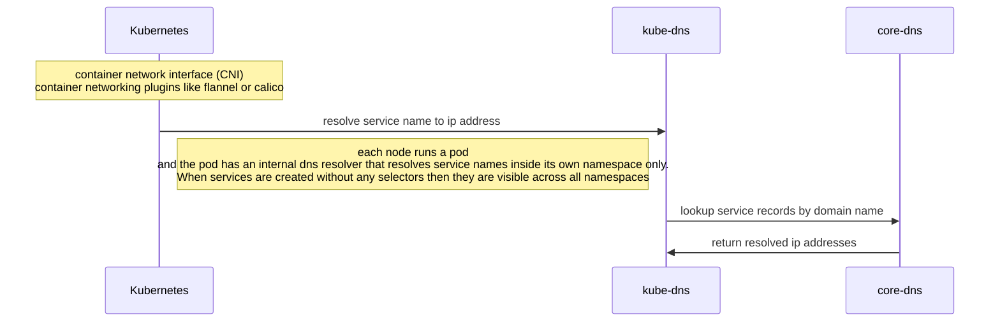
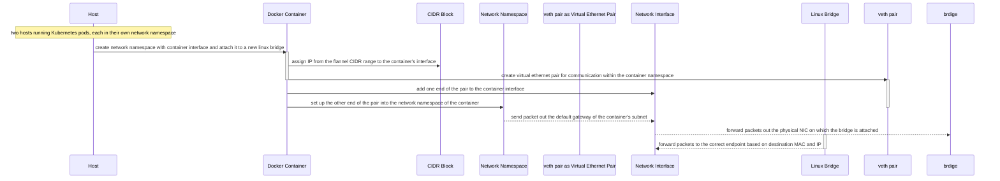

作者：禅与计算机程序设计艺术                    

# 1.简介
  

Kubernetes作为容器编排系统已经成为事实上的标准。在越来越多的企业中应用它的网络功能已经成为必备的技能。本文将介绍Kubernetes网络架构及其主要组件（如Pod，Service，Namespace等），并结合具体案例进行分析，介绍相关组件之间的交互关系。通过阅读本文可以更好地理解Kubernetes网络的运作机制，掌握Kubernetes网络的具体配置技巧，并且能够使用现有的工具和方法快速调试出Kubernetes集群中的网络问题。

# 2.基本概念术语说明
## Kubernetes Network
Kubernetes Network 是 Kubernetes 中用于实现容器间通信的网络系统。本文仅讨论 Kubernetes Network 组件的设计理念，不涉及 Kubernetes 的具体功能使用，如创建 Deployment、Pod 等。

### Pod
Pod 是 Kubernetes 中的最小调度单位，它是一个逻辑概念，即一个或多个容器共享资源的集合。Pod 内部可包含多个容器，这些容器之间可以通过本地文件、网络等方式共享数据。一般情况下，一个 Pod 只包含一个容器，但也可以包含多个不同的容器，甚至一个 Pod 可以包含多个相同的容器。每个 Pod 有自己的 IP 地址、端口空间，具有独立的生命周期和 DNS 记录。


### Service
Service 是 Kubernetes 用来解决分布式系统中的服务发现和负载均衡的一种机制。Kubernetes 中的 Service 提供了两种类型的服务：ClusterIP 和 NodePort。

#### ClusterIP
ClusterIP 服务的工作模式类似于传统的 IP 模式，只是提供了集群内有效的虚拟 IP，使得不同 Pod 之间可以直接通信。每一个 Service 会分配一个唯一的 cluster IP 地址，通过这个 IP 地址访问 Service 时，流量会自动路由到对应的后端 Pod 上。


#### NodePort
NodePort 服务的工作模式是通过暴露每个节点上运行的相同端口的方式实现的。这种方式不需要手动分配端口号，只需要指定一个节点端口即可。当外部请求到达时，集群 IP 层会把请求转发给对应 NodePort 暴露的端口，进而路由到后端的 Pod 上。


### Namespace
Namespace 是 Kubernetes 用来对不同的分组或租户进行逻辑隔离的一种抽象。Namespace 将用户、工作负载和其他对象的名字空间进行分割，从而避免了命名冲突的问题。一个 Kubernetes 集群通常会由多个 Namespace 组成，每个 Namespace 都有一个独立的环境。


## Kubernetes CNI Plugin
Kubernetes CNI Plugin 是 Kubernetes 提供的容器网络接口（Container Network Interface）插件。CNI 插件为 Pod 分配 IP 地址和设置路由规则提供了必要的扩展点。Kubernetes 目前支持的 CNI 插件包括 Flannel、Calico、Weave Net 和华为云的 VPC CNI 等。

CNI Plugin 在创建 Pod 时会调用 CNI 库函数，将请求发送给指定的 CNI 插件。CNI Plugin 根据指定的配置文件，调用底层网络插件（如 Calico）创建网络接口、分配 IP 地址和设置路由规则。然后 kubelet 会根据分配的 IP 地址配置 Pod 的网络栈，完成 Pod 和主机之间的网络连接。


## Kubernetes Ingress Controller
Ingress 是 Kubernetes 提供的用于定义 HTTP 和 HTTPS 入口规则的 API 对象。Ingress 通过设置 Ingress Controller 来控制外网访问 Kubernetes 服务的行为。

Ingress Controller 是运行在 Kubernetes 集群中的独立进程，负责维护 Ingress 对象，并按照 Ingress 的规则提供负载均衡、SSL 终止、HTTP 重定向等作用。常用的 Kubernetes Ingress Controller 包括 Nginx、Traefik、HAProxy、Contour、Kong等。


## Kubernetes DNS
DNS （Domain Name System）是一套用于域名解析的协议。在 Kubernetes 中，DNS 是用于 Service 发现的重要组件。

Kubernetes DNS 服务器会监视集群中的 Service 和 Endpoint 对象，并利用 SkyDNS 或者 CoreDNS 生成相应的 DNS 记录。


# 3.核心算法原理和具体操作步骤以及数学公式讲解
## 一、路由器内部数据结构

```mermaid
graph LR
    subgraph Router
        Device[Router Device] --Ethernet cable--> Switch[Switching Station]<--Ethernet cable-- SubnetA[Subnet A]<|im_sep|>
        Device ---Ethernet cable--> Switch<--Ethernet cable-- SubnetB[Subnet B]<|im_sep|>
        switch Cluster[Kubernetes Cluster]
            subgraph K8sNetwork
                NodeA[Node in Subnet A]<--Ethernet cable--> PodA[Pod]<|im_sep|>
                NodeB[Node in Subnet B]<--Ethernet cable--> PodB[Pod]<|im_sep|>
                PodA ---VPC CNI Plugin--> VPCEndpointA[VPC Endpoint for Subnet A]<|im_sep|>
                PodB ---VPC CNI Plugin--> VPCEndpointB[VPC Endpoint for Subnet B]<|im_sep|>
                VPCEndpointA --Route Table 1--> RouteTableA[Route Table for Subnet A]<|im_sep|>
                VPCEndpointB --Route Table 2--> RouteTableB[Route Table for Subnet B]<|im_sep|>
                RouteTableA[Route Table for Subnet A] --Static routes and NAT rules--> InternetGateway[Internet Gateway]<|im_sep|>
                RouteTableB[Route Table for Subnet B] --Static routes and NAT rules--> InternetGateway<|im_sep|>
                VPCEndpointA --VPC peering connection with PeerB--> PeeredVPCEndpointB[Peering Connection to Subnet B]<|im_sep|>
                PeeredVPCEndpointB --Route Table 3--> RouteTableB<|im_sep|>
                RouteTableB --Default route to internet through VPCEndpointA--> DefaultSubnetABranch[Branch connected to both subnets]<|im_sep|>
            end
        end
    end
```

1. 二层交换机或路由器（Device）管理着一个 VLAN 或 VxLAN 的子网，并与另外两个 VLAN 或 VxLAN 的子网建立点对点的连接。
2. 每个子网中都有 Kubernetes 集群中的不同节点（Node）。
3. 两个节点之间用以太网直连，使用 VPC CNI Plugin 为它们分配了一个私有网络（VPC Endpoint）地址。
4. 每个私有网络有一个对应的路由表（Route Table）。路由表中包含静态路由和 NAT 规则，用来为两个子网的数据包做必要的处理。
5. 两个私有网络之间的通信可能需要通过 VPC peering，即利用 VPC Endpoint 之间自动建立的 IPSec VPN 隧道。如果两个子网之间没有建立 VPC peering ，则数据包需要通过默认路由通过第一个私有网络连接到另一个私有网络的代理（Peered VPC Endpoint），然后再通过第二个私有网络连接到目标节点。
6. 默认路由通过 VPCEndpointA（或者代理）到达 Internet Gateway（或者 Direct Connect Gateway），数据包经过 NAT 转换后最终路由到外网。

## 二、Kubernetes 中各个模块之间的关系



1. kubernetes 中包括 kube-dns 和 core-dns，其中kube-dns 以 daemonset 的形式部署在每个 node 上，core-dns 以 deployment 的形式部署在 master node 上，用来处理各种 DNS 请求，比如：Service 解析、pod 解析等。
2. 当某个 Pod 创建成功后，kubelet 会启动一个 `pause` 容器（用于暂停当前 Pod 的所有其他容器），该容器具有独占网络命名空间；之后 kubelet 会创建一个共享网络命名空间的 Pod，用于存放当前 Pod 的所有容器，每个 Pod 都会获得一个独立的 IP 地址，并且拥有独占的 DNS 解析域（namespace）。
3. 不同 namespace 中的 Pod 之间只能通过 Service 的 IP 地址通信，因为只有被允许访问的 Service 才会被分配到一个固定的 IP 地址。
4. Kubelet 使用 CNI 插件来为 Pod 分配 IP 地址，以及为这些 IP 配置路由规则。例如：Flannel 支持 vxlan 网络，Calico 支持 BGP 动态路由协议。

## 三、Flannel 数据包封装与解封装流程



Flannel 用于为容器分配 IP 地址的机制依赖于 Linux 网桥设备。为了实现容器间 IP 地址的透明通信，Flannel 使用虚拟以太网（veth）设备实现跨主机的网络通信。

1. 用户态程序（如 Docker）启动一个新的容器，指定要加入哪个网络，docker 为其分配一个新名空间（netns）。
2. 在这个新的 netns 中，Flannel 为容器创建一个新的虚拟以太网设备 pair，一端连接在宿主机上的网络命名空间的 veth 设备上，另一端连接到容器的命名空间的 eth0 设备上。这样一来，容器就可以通过 eth0 设备与其它容器或主机通信。
3. Flannel 从分配给它的范围中随机选择一个可用 IP 地址，并通过一个专用接口（iface）（实际是 veth 设备的一端）注入到容器的命名空间中。
4. Flannel 设置路由条目，通过该专用接口，容器就可以与其它容器或主机通信。Flannel 使用 UDP 端口 8285 进行数据包传输，该端口默认在公开范围以防火墙阻挡。
5. 容器向 Flannel 报告其网络信息，包括自身所属的子网以及分配到的 IP 地址，Flannel 通过 etcd 存储这些信息，供其它组件（如 kubelet）查询使用。
6. 任何来自任意容器或主机的数据包都会经过主机的 Linux 网桥设备（bridge）到达网卡驱动程序（NIC Driver）上，然后通过虚拟以太网设备（veth）到达 Flannel 。
7. Flannel 将接收到的消息打包为一个原始数据包，并根据目的 IP 地址选择发送目的网络的目的端，然后再将其发送回源容器。

# 4.具体代码实例和解释说明
本章节将采用 Python 语言演示如何通过 Python 操作 Kubernetes API 来编程控制 Kubernetes 集群。

## 安装 Python 客户端

```bash
pip install kubernetes
```

## 连接到 Kubernetes 集群

```python
from kubernetes import client, config

# Load configuration
config.load_incluster_config()

# Create API object
v1 = client.CoreV1Api()
```

首先，加载 Kubernetes 集群的 kubeconfig 文件。这里假设 Kubernetes 集群处于 Pod 内部，所以需要使用 `incluster_config()` 方法加载集群的 kubeconfig 文件。

接着，创建 `CoreV1Api` 对象，这是用来操作 Kubernetes 集群中 Pod 的主要类。

## 获取 Pod 列表

```python
pods = v1.list_namespaced_pod('default').items
for pod in pods:
    print(f"Name: {pod.metadata.name}, Status: {pod.status.phase}")
```

首先获取 `default` 命名空间下的所有 Pod。由于该命名空间下没有 Pod，因此输出为空。

```python
api_response = v1.create_namespaced_service(
    body=client.V1Service(
        metadata=client.V1ObjectMeta(
            name='my-service',
            labels={'app': 'web'},
        ),
        spec=client.V1ServiceSpec(
            selector={
                'app': 'web'
            },
            ports=[{'port': 80}]
        )
    ),
    namespace='default')

print("Create Service: " + api_response.to_str())
```

创建一个名为 `my-service` 的 Service。该 Service 使用 `selector` 属性匹配 `app=web` 的 Pod，`ports` 属性指定端口为 80。

```python
api_response = v1.delete_namespaced_service(
    name='my-service',
    namespace='default',
    body=client.V1DeleteOptions(
        propagation_policy='Foreground',
        grace_period_seconds=5))

print("Delete Service: " + str(api_response))
```

删除刚刚创建的 Service。采用 `propagation_policy='Foreground'` 参数让 Kubernetes 等待所有的 Pod 都停止运行，然后才能继续进行 Service 的删除操作。

# 5.未来发展趋势与挑战
随着云计算的发展，Kubernetes 也在跟上发展。Kubernetes 本质上是一个开源的平台，你可以基于其构建自己专属的集群管理系统。但是 Kubernetes 仍然有很多值得探索的地方。以下是我认为 Kubernetes 需要进一步完善的一些方面：

1. **安全性**：Kubernetes 虽然提供了丰富的安全机制，但是仍然存在很多漏洞。尤其是在对权限管理方面，缺乏细粒度的权限控制和审计功能。我们希望 Kubernetes 提供更加细化的权限控制功能，以满足不同用户对于不同资源的访问权限需求。
2. **扩展性**：目前 Kubernetes 官方提供的集群规模相对较小，无法满足日益增长的业务要求。因此，我们期望 Kubernetes 提供更高级的集群管理能力，包括横向扩展、弹性伸缩等。
3. **性能优化**：Kubernetes 的核心组件如 apiserver、controller manager、scheduler、etcd 等都需要关注性能。我们期望 Kubernetes 能够对核心组件进行更细致的性能优化，提升集群的整体性能。
4. **运维自动化**：虽然 Kubernetes 提供了强大的管理能力，但是仍然存在大量的运维任务需要手工执行。因此，我们期望 Kubernetes 提供一系列的运维自动化工具，帮助运维人员降低复杂性和错误率，提升效率。

# 6.附录常见问题与解答

**1. Kubernetes 为什么不直接支持 overlay 网络？**

Overlay 网络并不是 Kubernetes 独有的技术，容器网络可以在很多场景下都可以使用。Kubernetes 更像是一个容器编排系统，所以在设计的时候就考虑到了容器网络的多样性。比如我们可以使用 Weave Net，它可以在 Kubernetes 中以简单的命令行参数开启集群间的网络通信，同时保持容器网络的纯净性。Kubernetes 不应该限制容器网络的多样性，所以并没有直接支持 overlay 网络。