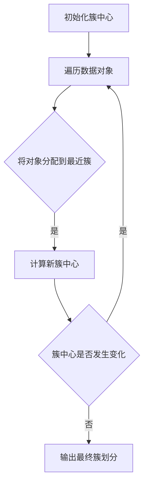

# K-Means聚类：简单高效的聚类算法

## 1.背景介绍

### 1.1 什么是聚类

聚类(Clustering)是一种无监督学习技术,其目标是将数据集中的对象划分为若干个通常是不相交的子集(簇),使得同一个簇中的对象相似度较高,而不同簇之间的对象相似度则较低。聚类分析广泛应用于数据挖掘、统计学习、图像分析、生物信息学等诸多领域。

### 1.2 聚类算法的分类

聚类算法可以分为多种类型,包括:

- 分区聚类(Partitioning Clustering)
- 层次聚类(Hierarchical Clustering) 
- 密度聚类(Density-based Clustering)
- 基于网格的聚类(Grid-based Clustering)
- 基于模型的聚类(Model-based Clustering)

其中,K-Means算法属于分区聚类算法。

### 1.3 K-Means聚类算法简介

K-Means是一种简单且广为人知的聚类算法,它将n个观测数据对象划分为k个簇(k<=n)。该算法的工作原理是尽量将数据对象划分到离簇中心最近的簇中,使得所有簇内的数据对象与其簇中心的总距离之和最小。

## 2.核心概念与联系

### 2.1 簇和簇中心

K-Means算法的核心概念是簇(Cluster)和簇中心(Cluster Centroid)。

- 簇是数据对象的集合,同一簇内的数据对象相似度较高。
- 簇中心是簇内所有数据对象的中心点,可以是簇内数据对象的平均值。

### 2.2 目标函数

K-Means算法的目标是最小化所有簇内数据对象与其簇中心之间的总平方距离,即最小化目标函数:

$$J = \sum_{i=1}^{k}\sum_{x \in C_i} \left \| x - \mu_i \right \|^2$$

其中:
- $k$是簇的数量
- $C_i$是第$i$个簇
- $\mu_i$是第$i$个簇的中心
- $\left \| x - \mu_i \right \|^2$是数据对象$x$与其簇中心$\mu_i$之间的欧几里得距离的平方

### 2.3 K-Means与其他聚类算法的关系

K-Means算法属于分区聚类算法家族,与层次聚类、密度聚类等算法有所区别。它通过迭代优化来最小化目标函数,从而得到最优的簇划分。相比其他聚类算法,K-Means算法计算复杂度较低、实现简单、可解释性强,是最经典和最广泛使用的聚类算法之一。

## 3.核心算法原理具体操作步骤  

### 3.1 算法步骤

K-Means算法的核心步骤如下:

1. 初始化: 随机选择k个数据对象作为初始簇中心
2. 分配: 遍历所有数据对象,将其分配到离它最近的簇中心的簇
3. 更新: 对于每一个簇,计算簇内所有数据对象的均值作为新的簇中心
4. 重复步骤2和3,直到簇中心不再发生变化或达到最大迭代次数

### 3.2 算法流程图



### 3.3 算法复杂度分析

假设数据集包含n个数据对象,簇的数量为k:

- 时间复杂度: $O(nkt)$, 其中t是迭代次数
- 空间复杂度: $O(k + n)$

通常情况下,K-Means算法的收敛速度较快,t相对较小。

## 4.数学模型和公式详细讲解举例说明

### 4.1 距离度量

K-Means算法需要计算数据对象与簇中心之间的距离,常用的距离度量包括:

- 欧几里得距离(Euclidean Distance):
  
  $$d(x,y) = \sqrt{\sum_{i=1}^{n}(x_i - y_i)^2}$$

- 曼哈顿距离(Manhattan Distance):

  $$d(x,y) = \sum_{i=1}^{n}|x_i - y_i|$$
  
- 其他距离度量,如切比雪夫距离、明可夫斯基距离等。

对于不同的数据类型,需要选择合适的距离度量。

### 4.2 簇内平方和最小化

如2.2节所述,K-Means算法的目标是最小化所有簇内数据对象与簇中心之间的总平方距离:

$$J = \sum_{i=1}^{k}\sum_{x \in C_i} \left \| x - \mu_i \right \|^2$$

对于给定的簇划分$C = \{C_1, C_2, \ldots, C_k\}$,可以证明当$\mu_i$取簇$C_i$内所有数据对象的均值时,目标函数$J$达到最小值。

### 4.3 举例说明

假设有一个二维数据集$X = \{(1,1), (1,2), (2,1), (6,6), (7,6), (6,7)\}$,我们希望将其划分为2个簇。

1. 初始化: 随机选取$(1,1)$和$(6,6)$作为两个初始簇中心
2. 分配: 根据欧几里得距离,数据对象$(1,2)$和$(2,1)$被分配到第一个簇,$(7,6)$和$(6,7)$被分配到第二个簇
3. 更新: 第一个簇的新中心是$\mu_1 = (1.33, 1.33)$,第二个簇的新中心是$\mu_2 = (6.5, 6.5)$
4. 重复步骤2和3,直到簇中心不再变化

最终得到两个簇:$C_1 = \{(1,1), (1,2), (2,1)\}$和$C_2 = \{(6,6), (7,6), (6,7)\}$。

## 4.项目实践: 代码实例和详细解释说明

下面给出使用Python实现K-Means算法的代码示例,并对关键步骤进行详细解释。

```python
import numpy as np

def euclidean_distance(x, y):
    """计算两个向量之间的欧几里得距离"""
    return np.sqrt(np.sum((x - y)**2))

def k_means(X, k, max_iter=100):
    """
    X: 数据集,每一行是一个数据对象
    k: 簇的数量
    max_iter: 最大迭代次数
    """
    # 初始化簇中心
    centroids = X[np.random.choice(X.shape[0], k, replace=False)]
    
    for _ in range(max_iter):
        # 分配数据对象到最近的簇
        clusters = [[] for _ in range(k)]
        for x in X:
            distances = [euclidean_distance(x, centroid) for centroid in centroids]
            cluster_idx = np.argmin(distances)
            clusters[cluster_idx].append(x)
        
        # 更新簇中心
        new_centroids = []
        for cluster in clusters:
            if cluster:
                new_centroids.append(np.mean(cluster, axis=0))
            else:
                # 如果簇为空,保持原有中心不变
                new_centroids.append(centroids[clusters.index(cluster)])
        
        # 检查簇中心是否发生变化
        if np.array_equal(centroids, new_centroids):
            break
        centroids = new_centroids
    
    return centroids, clusters

# 使用示例
X = np.array([[1, 1], [1, 2], [2, 1], [6, 6], [7, 6], [6, 7]])
centroids, clusters = k_means(X, k=2)
print("Cluster centroids:", centroids)
print("Clusters:")
for i, cluster in enumerate(clusters):
    print(f"Cluster {i}:", cluster)
```

代码解释:

1. `euclidean_distance`函数计算两个向量之间的欧几里得距离。
2. `k_means`函数实现了K-Means算法的核心逻辑:
   - 初始化簇中心为数据集中随机选取的k个数据对象。
   - 在每次迭代中:
     - 遍历所有数据对象,将其分配到离它最近的簇中心的簇。
     - 对于每一个簇,计算簇内所有数据对象的均值作为新的簇中心。
   - 重复上述步骤,直到簇中心不再发生变化或达到最大迭代次数。
3. 使用示例展示了如何调用`k_means`函数,并输出最终的簇中心和各个簇的数据对象。

## 5.实际应用场景

K-Means聚类算法在许多实际应用场景中发挥着重要作用,包括但不限于:

### 5.1 客户细分和目标营销

在营销领域,可以使用K-Means算法根据客户的购买行为、人口统计特征等数据对客户进行细分,从而制定有针对性的营销策略和个性化推荐。

### 5.2 图像分割

在计算机视觉领域,K-Means算法可用于图像分割,将图像像素根据颜色或纹理特征划分为不同的簇,实现对象检测和识别。

### 5.3 文本聚类

在自然语言处理领域,可以将文本表示为向量,然后使用K-Means算法对文本进行聚类,用于主题发现、文档分类等任务。

### 5.4 异常检测

K-Means算法也可用于异常检测,将数据对象划分为正常簇和异常簇,从而发现异常值或异常模式。

### 5.5 基因表达数据分析

在生物信息学领域,K-Means算法可用于分析基因表达数据,将基因表达模式相似的基因聚类在一起,有助于发现潜在的生物学功能。

## 6.工具和资源推荐

### 6.1 Python库

Python提供了多个流行的机器学习库,支持K-Means聚类算法的实现:

- **Scikit-learn**: 集成了`KMeans`类,提供了多种距离度量和初始化方法。
- **Apache Spark MLlib**: 支持分布式K-Means聚类,适用于大规模数据集。
- **TensorFlow**和**PyTorch**: 深度学习框架,也可用于实现K-Means算法。

### 6.2 在线工具

一些在线工具和平台也提供了K-Means聚类的功能,方便快速尝试和可视化:

- **Google Colab**: 基于Jupyter Notebook的云端环境,可直接运行Python代码。
- **Kaggle Kernels**: 数据科学社区,提供了多种算法的示例代码。
- **Azure Machine Learning Studio**: Microsoft的云端机器学习平台,支持可视化构建K-Means模型。

### 6.3 教程和文档

以下是一些优秀的K-Means聚类教程和文档资源:

- **Scikit-learn用户指南**: 包含了K-Means算法的详细说明和使用示例。
- **机器学习课程**: 像Andrew Ng的机器学习课程,对K-Means算法有深入讲解。
- **Pattern Recognition and Machine Learning**: Christopher Bishop的经典教材,对聚类算法有系统介绍。

## 7.总结: 未来发展趋势与挑战

### 7.1 优化和改进

尽管K-Means算法简单高效,但它也存在一些局限性和挑战:

- 对初始簇中心的选择敏感,可能陷入局部最优解。
- 对异常值和噪声数据敏感,簇形状受限于球形。
- 需要预先指定簇的数量k,对结果有较大影响。

因此,研究人员提出了多种优化和改进的方法,如K-Means++初始化、核K-Means、模糊C-Means等,以提高算法的鲁棒性和适用性。

### 7.2 大规模数据集和分布式实现

随着数据量的不断增长,如何在大规模数据集上高效地执行K-Means聚类成为一个挑战。分布式计算框架如Apache Spark MLlib提供了分布式K-Means算法的实现,可以在多台机器上并行执行聚类任务,提高计算效率。

### 7.3 深度聚类

近年来,深度学习技术在聚类任务中也得到了广泛应用。深度聚类模型可以自动从数据中学习有区分性的特征表示,并基于这些特