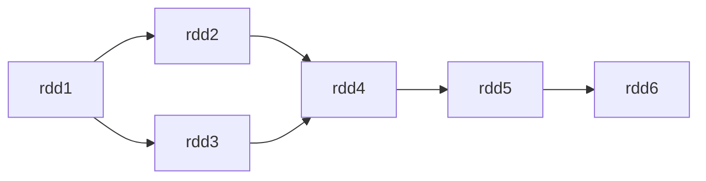
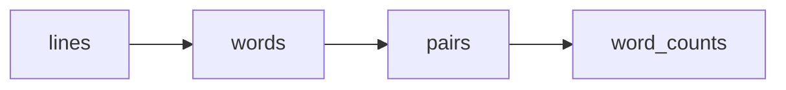

# Spark DAG原理与代码实例讲解

作者：禅与计算机程序设计艺术

## 1. 背景介绍

### 1.1 大数据处理的挑战
在当今大数据时代,海量数据的高效处理已成为各行各业面临的重大挑战。传统的数据处理方式难以应对数据量的爆炸式增长,迫切需要新的计算框架来满足大规模数据处理的需求。

### 1.2 Spark的崛起
Apache Spark作为一个快速、通用的大数据处理引擎,凭借其出色的性能和易用性,在大数据领域迅速崛起,成为了业界的首选解决方案。Spark的核心是基于弹性分布式数据集(RDD)的计算模型,支持多种数据源和多种计算类型。

### 1.3 Spark DAG的重要性
在Spark的核心设计中,有向无环图(DAG)扮演着至关重要的角色。Spark通过DAG来表示和优化用户提交的计算任务,决定了任务的执行方式和效率。深入理解Spark DAG的原理和实现,对于开发高效的Spark应用程序至关重要。

## 2. 核心概念与联系

### 2.1 RDD的概念与特性
- RDD是Spark的基本计算单元,代表一个不可变、可分区、里面元素可并行计算的集合
- RDD具有数据血缘关系(Lineage),通过转换操作衍生新的RDD,形成DAG
- RDD支持两种操作:转换(Transformation)和行动(Action)

### 2.2 DAG的概念与作用
- DAG是由RDD及其之间的依赖关系组成的有向无环图
- DAG描述了RDD之间的血缘关系和计算逻辑,是Spark任务调度和优化的基础
- 每个Spark作业(Job)都对应一个DAG,DAG中包含多个阶段(Stage)和任务(Task)

### 2.3 Spark运行时的核心组件
- SparkContext:Spark功能的主要入口,负责与集群管理器通信以分配资源
- DAGScheduler:实现将DAG划分为不同的阶段(Stage),并以TaskSet的形式提交给TaskScheduler
- TaskScheduler:将TaskSet中的任务分发到Executor上执行,监控任务状态

## 3. 核心算法原理与具体操作步骤

### 3.1 DAG的构建过程
1. 用户通过SparkContext提交应用程序,定义RDD及其转换关系
2. Spark根据RDD之间的依赖关系,构建DAG
3. DAG通过回溯数据血缘(Lineage),确定了各个RDD的计算顺序

### 3.2 DAG的划分与优化
1. DAGScheduler负责将DAG划分为不同的阶段(Stage) 
2. 划分的依据是RDD之间的宽依赖(Shuffle Dependency)
3. 对DAG进行优化,如管道化(Pipeline)、常量折叠等

### 3.3 任务的生成与提交
1. 每个阶段(Stage)形成一个TaskSet,包含多个任务(Task)
2. 每个任务对应一个分区,负责计算该分区的数据
3. TaskSet被提交给TaskScheduler,分发到Executor上执行

## 4. 数学模型和公式详细讲解举例说明

### 4.1 DAG的数学表示
我们可以将DAG表示为一个有向图$G=(V,E)$,其中:
- $V$表示顶点的集合,每个顶点对应一个RDD
- $E$表示有向边的集合,表示RDD之间的依赖关系

例如,对于以下Spark代码:
```python
rdd1 = sc.textFile("file1.txt")
rdd2 = rdd1.filter(lambda x: x.startswith('a'))
rdd3 = rdd1.map(lambda x: x.split())
rdd4 = rdd2.union(rdd3)
rdd5 = rdd4.map(lambda x: (x, 1))
rdd6 = rdd5.reduceByKey(lambda x, y: x + y)
```

其对应的DAG可以表示为:



### 4.2 阶段的划分与最优化
假设DAG中有$n$个顶点,则划分阶段的问题可以转化为在DAG中找出所有的强连通分量。

令$S={S_1,S_2,...,S_k}$表示划分得到的阶段集合,则划分需要满足以下条件:

1. $\forall i \neq j, S_i \cap S_j = \emptyset$
2. $\bigcup_{i=1}^{k} S_i = V$
3. 在同一个$S_i$内部,任意两个顶点(RDD)之间都是连通的
4. 在不同的$S_i$和$S_j$之间,至少存在一个顶点对$(u,v)$,使得$u \in S_i, v \in S_j$,且$(u,v) \notin E$

直观地说,就是要找出DAG中所有不存在Shuffle依赖的子图,每个子图形成一个阶段。阶段的划分直接影响了Spark作业的执行效率。一般来说,阶段数越少,任务的并行度越高,Shuffle的次数也会减少,从而提升整体性能。

## 5. 项目实践:代码实例和详细解释说明

下面我们通过一个实际的Spark代码示例,来演示DAG的构建和执行过程。

```python
from pyspark import SparkContext

sc = SparkContext("local", "DAG Example")

# 从HDFS读取文本文件,创建初始RDD
lines = sc.textFile("hdfs://path/to/file.txt")

# 对每一行文本进行分割,提取单词
words = lines.flatMap(lambda line: line.split())

# 将每个单词转换为(word, 1)的形式
pairs = words.map(lambda word: (word, 1))

# 对相同的单词进行分组并求和
word_counts = pairs.reduceByKey(lambda x, y: x + y)

# 将结果保存到HDFS
word_counts.saveAsTextFile("hdfs://path/to/output")
```

上述代码执行的主要步骤如下:

1. 通过`textFile`方法从HDFS读取文本文件,创建名为`lines`的RDD。
2. 对`lines`执行`flatMap`操作,将每一行文本按空格分割成单词,生成新的RDD `words`。这里使用了匿名函数`lambda line: line.split()`。
3. 对`words`执行`map`操作,将每个单词转换为`(word, 1)`的形式,生成新的RDD `pairs`。
4. 对`pairs`执行`reduceByKey`操作,按照单词分组,对每个组内的计数值求和,生成新的RDD `word_counts`。这里使用了匿名函数`lambda x, y: x + y`。
5. 最后,将结果RDD `word_counts`通过`saveAsTextFile`方法保存到HDFS。

在执行过程中,Spark会根据RDD之间的转换关系,构建出如下的DAG:



可以看到,该DAG包含了4个RDD,通过3个转换操作(`flatMap`, `map`, `reduceByKey`)连接而成。其中,`reduceByKey`会触发Shuffle,导致DAG被划分为2个阶段(Stage)。

当调用`saveAsTextFile`行动操作时,Spark开始实际执行该DAG。期间会经历以下步骤:

1. DAGScheduler对DAG进行划分,将其分为2个阶段(Stage)。
2. 对于每个阶段,DAGScheduler生成一个TaskSet,提交给TaskScheduler。
3. TaskScheduler将TaskSet中的任务分发到各个Executor上执行。
4. 在Executor上,每个任务根据其所属的阶段和分区号,计算相应的数据。
5. Shuffle阶段的任务将计算结果写入磁盘,下一阶段的任务通过网络读取这些数据。
6. 所有任务完成后,最终结果写入HDFS,作业结束。

通过这个例子,我们可以清晰地看到Spark是如何利用DAG来表示和执行计算任务的。DAG提供了一种高层次的抽象,使得用户可以方便地表达复杂的计算逻辑,而无需关心底层的分布式执行细节。Spark则通过解析DAG,自动完成任务的调度、分发和容错等工作,极大地简化了分布式计算的编程模型。

## 6. 实际应用场景

Spark DAG在实际的大数据处理中有广泛的应用,下面列举几个典型的场景:

### 6.1 日志分析
互联网公司通常会收集大量的用户访问日志,通过对日志进行分析,可以挖掘出有价值的信息,如用户行为模式、热门页面等。使用Spark DAG,我们可以方便地表达日志分析的计算逻辑,如过滤、转换、聚合等,快速实现海量日志数据的并行处理。

### 6.2 用户推荐
在电商、社交等领域,用户推荐是一项重要的应用。通过分析用户的历史行为数据,我们可以建立用户画像,计算用户之间的相似度,进而给用户推荐感兴趣的商品或者好友。Spark DAG可以很好地支持这种复杂的数据处理流程,将推荐算法转化为一系列的RDD转换操作。

### 6.3 机器学习
机器学习是大数据领域的一个热点应用,需要处理海量的训练数据。Spark提供了MLlib机器学习库,基于DAG实现了常见的机器学习算法,如决策树、随机森林、逻辑回归等。通过Spark DAG,用户可以方便地进行特征提取、模型训练和预测等任务。

### 6.4 图计算
图是一种重要的数据结构,在社交网络、金融风控等领域有广泛应用。Spark提供了GraphX图计算框架,使用DAG来表示图数据上的计算操作,如点聚合、边转换等。通过Spark DAG,用户可以高效地进行图的并行计算,挖掘图数据中的关联信息。

## 7. 工具和资源推荐

### 7.1 Spark官方文档
Spark官网提供了详尽的用户文档和API参考,是学习和使用Spark的权威资料。
官网地址:http://spark.apache.org/docs/latest/

### 7.2 Spark源码
通过阅读Spark源码,可以深入理解Spark的实现原理,包括DAG的构建、调度等核心模块。
源码地址:https://github.com/apache/spark

### 7.3 Spark论文
Spark的设计理念和优化技术有多篇优秀的论文发表,如RDD论文、Spark SQL论文等,对理解Spark DAG有重要参考价值。

### 7.4 Spark社区
Spark拥有活跃的开源社区,用户可以通过邮件列表、JIRA等渠道参与讨论、提问和贡献代码。
社区地址:http://spark.apache.org/community.html

## 8. 总结:未来发展趋势与挑战

### 8.1 异构计算的支持
随着GPU、FPGA等异构硬件的发展,如何在Spark中高效利用这些计算资源,是一个值得研究的问题。未来Spark DAG需要考虑异构硬件的特性,设计合适的调度和执行机制。

### 8.2 流批一体化
Spark同时支持批处理和流处理,但目前它们在API和执行引擎上还有一定的差异。未来Spark DAG有望实现流批一体化,提供统一的API和运行时优化,简化用户的开发工作。

### 8.3 机器学习管道优化
机器学习任务通常包含多个数据预处理、特征工程、训练、预测等阶段。如何在Spark DAG的基础上,实现端到端的机器学习管道优化,减少数据移动和中间结果存储,是一个有价值的研究方向。

### 8.4 自适应调优
大数据作业的调优是一项复杂的工程,需要对任务的特性、数据分布、资源情况等有深入的了解。未来Spark DAG可以引入自适应调优技术,根据作业的运行状况动态调整执行计划和资源分配,实现更智能、更高效的作业优化。

## 9. 附录:常见问题与解答

### 9.1 什么是窄依赖和宽依赖?
窄依赖(Narrow Dependency)是指