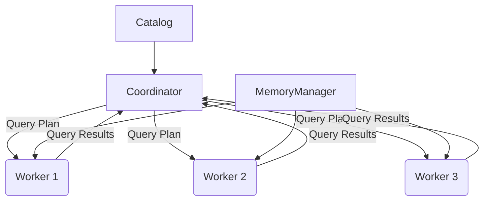
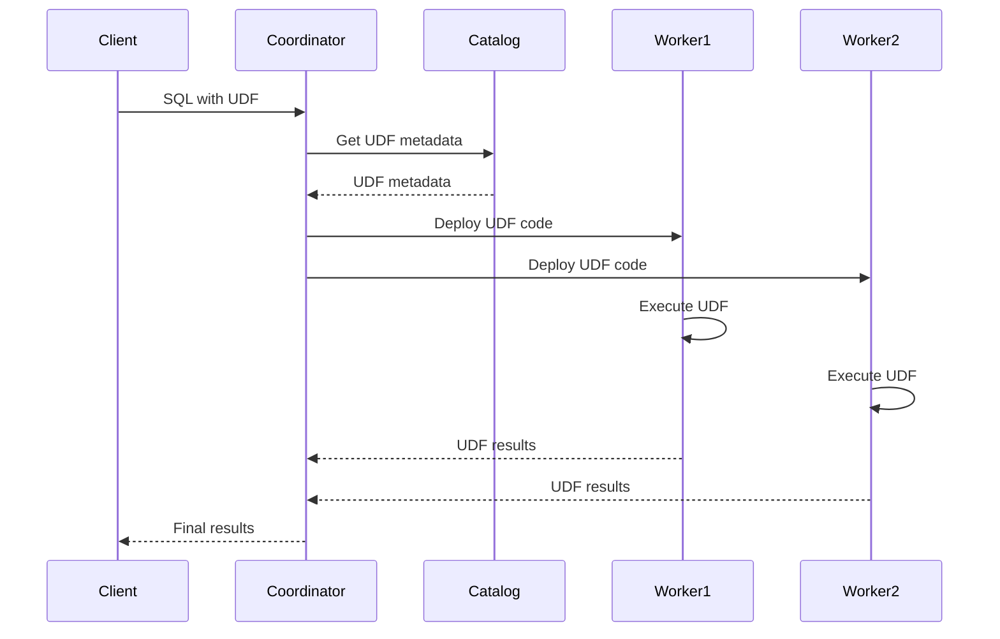

# Presto UDF原理与代码实例讲解

## 1.背景介绍

### 1.1 什么是Presto

Presto是一种开源的大规模数据分析引擎，由Facebook开发和维护。它旨在查询各种不同的数据源，包括HDFS、Amazon S3、Cassandra、MySQL和PostgreSQL等。Presto的设计目标是在保证高性能的同时，提供标准的SQL接口，使用户可以轻松地与已有的数据分析工具集成。

### 1.2 Presto的优势

相比于其他大数据查询引擎，Presto具有以下优势：

- **高性能**：Presto在内存计算方面表现出色，查询速度极快。
- **统一查询接口**：Presto提供标准的ANSI SQL查询语言，使用户无需学习新的查询语言。
- **多数据源支持**：Presto可以连接多种数据源，包括关系型数据库、NoSQL数据库和数据湖等。
- **容错性**：Presto具有良好的容错能力，能够在节点故障时自动重新路由查询。
- **可扩展性**：Presto可以轻松地水平扩展以处理更大的数据集。

### 1.3 UDF在Presto中的作用

UDF(User-Defined Function)是用户自定义函数的缩写。在Presto中,UDF扮演着非常重要的角色,它允许用户根据自己的需求定义自定义的函数,从而扩展Presto的功能。通过UDF,用户可以实现一些Presto原生不支持的特殊计算逻辑,使Presto的应用场景更加广泛。

## 2.核心概念与联系

### 2.1 Presto的架构

Presto采用主从架构,包括以下几个主要组件:

- **Coordinator(协调器)**:负责解析SQL查询,生成查询计划,并将任务分发给Worker。
- **Worker(工作节点)**:负责执行实际的查询任务,并将结果返回给Coordinator。
- **Catalog(目录服务)**:管理数据源的元数据,如表、视图等。
- **MemoryManager(内存管理器)**:负责管理和分配Worker节点的内存资源。



### 2.2 UDF在Presto中的执行流程

当用户在SQL查询中调用UDF时,Presto会按照以下流程执行:

1. Coordinator解析SQL,识别出UDF调用。
2. Coordinator从Catalog获取UDF的元数据信息。
3. Coordinator将UDF代码分发到相关的Worker节点。
4. Worker节点加载并执行UDF代码。
5. Worker节点将UDF计算结果返回给Coordinator。
6. Coordinator汇总所有Worker的结果,并返回给客户端。



## 3.核心算法原理具体操作步骤

### 3.1 UDF的类型

在Presto中,UDF主要分为以下几种类型:

- **标量函数(Scalar Function)**:接受0个或多个参数,返回单个值。
- **聚合函数(Aggregation Function)**:将多个输入值聚合为单个结果。
- **窗口函数(Window Function)**:对于每个输入行,根据相关的其他行计算结果。
- **Lambda函数(Lambda Function)**:支持在SQL中内联定义简单函数。

### 3.2 实现UDF的步骤

以实现一个标量函数为例,步骤如下:

1. **定义函数接口**:继承`org.apache.presto.spi.function.ScalarFunction`接口,并实现`createDescriptor()`方法。
2. **实现函数逻辑**:实现`eval()`方法,编写函数的核心逻辑。
3. **注册函数**:在`etc/catalogs`目录下创建一个属性文件,定义函数的名称、类型等元数据。
4. **打包部署**:将实现的UDF代码打包为JAR文件,并部署到Presto集群。

下面是一个简单的字符串连接UDF的示例:

```java
// 1. 定义函数接口
public class ConcatScalarFunction extends ScalarFunction
{
    // 2. 实现函数逻辑
    @SqlType(StandardTypes.VARCHAR)
    public Slice eval(@SqlType(StandardTypes.VARCHAR) Slice str1, @SqlType(StandardTypes.VARCHAR) Slice str2)
    {
        return concat(str1, str2);
    }

    private Slice concat(Slice str1, Slice str2)
    {
        // 实现字符串连接逻辑
    }

    // 3. 注册函数元数据
    @Override
    public ScalarFunctionImplementation specialize(...)
    {
        // 定义函数名称、参数类型等元数据
    }
}
```

## 4.数学模型和公式详细讲解举例说明

在实现某些复杂的UDF时,我们可能需要使用数学模型和公式。以下是一个使用线性回归模型实现预测函数的示例:

给定一个数据集$\{(x_1, y_1), (x_2, y_2), ..., (x_n, y_n)\}$,我们希望找到一个线性函数$y = \theta_0 + \theta_1 x$,使得对于所有的数据点$(x_i, y_i)$,预测值$\hat{y_i} = \theta_0 + \theta_1 x_i$与真实值$y_i$的差异最小。

我们定义代价函数(Cost Function)为:

$$J(\theta_0, \theta_1) = \frac{1}{2m}\sum_{i=1}^{m}(\hat{y_i} - y_i)^2 = \frac{1}{2m}\sum_{i=1}^{m}(\theta_0 + \theta_1x_i - y_i)^2$$

其中$m$是数据集的大小。我们的目标是找到$\theta_0$和$\theta_1$的值,使代价函数$J(\theta_0, \theta_1)$最小。

通过梯度下降算法,我们可以迭代地更新$\theta_0$和$\theta_1$的值:

$$\theta_0 := \theta_0 - \alpha\frac{1}{m}\sum_{i=1}^{m}(\theta_0 + \theta_1x_i - y_i)$$
$$\theta_1 := \theta_1 - \alpha\frac{1}{m}\sum_{i=1}^{m}((\theta_0 + \theta_1x_i - y_i)x_i)$$

其中$\alpha$是学习率,控制每次迭代的步长。

以下是Java代码实现:

```java
public class LinearRegressionScalarFunction extends ScalarFunction
{
    private final double theta0; // 初始化为0
    private final double theta1; // 初始化为0
    private final double alpha = 0.01; // 学习率

    @SqlType(StandardTypes.DOUBLE)
    public double eval(@SqlType(StandardTypes.DOUBLE) double x)
    {
        return theta0 + theta1 * x; // 线性回归预测
    }

    // 使用梯度下降算法训练模型
    public void train(List<Double> xValues, List<Double> yValues)
    {
        int m = xValues.size();
        double[] theta0Grad = new double[m];
        double[] theta1Grad = new double[m];

        // 计算梯度
        for (int i = 0; i < m; i++) {
            double x = xValues.get(i);
            double y = yValues.get(i);
            double prediction = theta0 + theta1 * x;
            theta0Grad[i] = prediction - y;
            theta1Grad[i] = (prediction - y) * x;
        }

        // 更新theta0和theta1
        double sum0 = 0;
        double sum1 = 0;
        for (int i = 0; i < m; i++) {
            sum0 += theta0Grad[i];
            sum1 += theta1Grad[i];
        }
        theta0 -= alpha * sum0 / m;
        theta1 -= alpha * sum1 / m;
    }
}
```

在这个示例中,我们使用梯度下降算法训练线性回归模型,并提供一个`eval()`函数,根据输入的`x`值预测`y`值。用户可以在SQL查询中调用这个UDF,实现线性回归预测功能。

## 4.项目实践:代码实例和详细解释说明

在本节中,我们将通过一个实际的项目示例,演示如何在Presto中实现和使用UDF。

### 4.1 项目概述

假设我们需要实现一个UDF,用于计算两个字符串之间的编辑距离(Levenshtein Distance)。编辑距离是指将一个字符串转换为另一个字符串所需的最少编辑操作次数,其中编辑操作包括插入、删除和替换字符。

例如,将字符串"kitten"转换为"sitting"的编辑距离为3,因为需要进行以下3次操作:

1. 将第一个字符'k'替换为's'
2. 将第三个字符't'替换为't'
3. 在末尾插入't'

### 4.2 实现Levenshtein Distance UDF

我们将实现一个名为`levenshtein_distance`的标量函数,用于计算两个字符串之间的编辑距离。

首先,我们定义函数接口:

```java
import io.airlift.slice.Slice;
import io.airlift.slice.Slices;
import com.google.common.primitives.Ints;
import org.apache.presto.spi.function.Description;
import org.apache.presto.spi.function.ScalarFunction;
import org.apache.presto.spi.function.SqlType;
import org.apache.presto.spi.type.StandardTypes;

@ScalarFunction("levenshtein_distance")
@Description("Returns Levenshtein distance between two strings")
public class LevenshteinDistance
{
    // 实现函数逻辑
}
```

接下来,我们实现`eval()`方法,计算编辑距离:

```java
@SqlType(StandardTypes.INTEGER)
public long eval(@SqlType(StandardTypes.VARCHAR) Slice str1, @SqlType(StandardTypes.VARCHAR) Slice str2)
{
    return computeLevenshteinDistance(str1, str2);
}

private static long computeLevenshteinDistance(Slice str1, Slice str2)
{
    int[][] distance = new int[str1.length() + 1][str2.length() + 1];

    for (int i = 0; i <= str1.length(); i++) {
        distance[i][0] = i;
    }
    for (int j = 0; j <= str2.length(); j++) {
        distance[0][j] = j;
    }

    for (int i = 1; i <= str1.length(); i++) {
        for (int j = 1; j <= str2.length(); j++) {
            distance[i][j] = minimum(
                    distance[i - 1][j] + 1,
                    distance[i][j - 1] + 1,
                    distance[i - 1][j - 1] + ((str1.getByte(i - 1) == str2.getByte(j - 1)) ? 0 : 1));
        }
    }

    return distance[str1.length()][str2.length()];
}

private static int minimum(int a, int b, int c)
{
    return Ints.min(a, b, c);
}
```

这段代码实现了经典的动态规划算法,计算两个字符串之间的编辑距离。

最后,我们需要在`etc/catalogs`目录下创建一个属性文件,注册UDF的元数据:

```
connector.name=example-udfs
presto-udfs.examples.levenshtein-distance.type=SCALAR
presto-udfs.examples.levenshtein-distance.description=Returns Levenshtein distance between two strings
presto-udfs.examples.levenshtein-distance.scalar-function=com.example.LevenshteinDistance
```

### 4.3 使用Levenshtein Distance UDF

部署UDF后,我们就可以在SQL查询中调用`levenshtein_distance`函数了:

```sql
SELECT levenshtein_distance('kitten', 'sitting');
-- Output: 3
```

我们还可以将UDF与其他SQL语句结合使用,例如:

```sql
WITH strings AS (
    VALUES
        ('hello', 'world'),
        ('presto', 'prestosql'),
        ('cat', 'dog')
)
SELECT s1, s2, levenshtein_distance(s1, s2) AS distance
FROM strings
CROSS JOIN strings AS t(s1, s2)
ORDER BY distance;
```

这个查询将计算所有字符串对之间的编辑距离,并按距离排序。

## 5.实际应用场景

UDF在Presto中有许多实际应用场景,例如:

1. **字符串处理**:实现各种字符串操作,如模式匹配