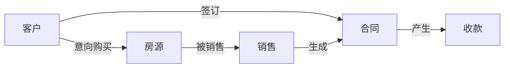

# 售楼管理系统详细设计与具体代码实现

作者：禅与计算机程序设计艺术

## 1. 背景介绍

### 1.1 售楼管理系统的必要性

在现代房地产行业中,高效的售楼管理是提高企业竞争力的关键因素之一。传统的人工管理模式已经无法满足日益增长的业务需求,因此开发一套功能完善、易于操作的售楼管理系统势在必行。

### 1.2 售楼管理系统的目标

售楼管理系统旨在实现房地产销售过程的信息化、标准化和自动化,提高工作效率,减少人为错误,为管理层提供及时、准确的决策依据。同时,该系统还应具备良好的可扩展性和维护性,以适应未来业务的发展需求。

### 1.3 售楼管理系统的主要功能

售楼管理系统的主要功能包括:

- 客户管理:记录和管理客户的基本信息、购房意向等
- 房源管理:录入和维护房源信息,如户型、面积、价格等
- 销售管理:跟踪和记录销售过程,生成销售合同等
- 财务管理:处理房款收支、佣金结算等财务事务
- 统计报表:生成各类统计报表,如销售业绩、客户分析等

## 2. 核心概念与联系

### 2.1 实体关系图

售楼管理系统涉及的主要实体有:客户、房源、销售、合同、收款等。它们之间的关系可用下图表示:



### 2.2 数据字典

- 客户(Customer):客户ID、姓名、电话、意向户型...
- 房源(House):房源ID、楼盘名称、户型、面积、价格...
- 销售(Sale):销售ID、客户ID、房源ID、销售员ID、销售日期...  
- 合同(Contract):合同ID、客户ID、房源ID、合同金额、签订日期...
- 收款(Payment):收款ID、合同ID、收款金额、收款日期...

## 3. 核心算法原理与具体操作步骤

### 3.1 客户购房意向分析算法

#### 3.1.1 算法原理

根据客户的年龄、职业、收入等属性,利用决策树算法预测其购房意向。

#### 3.1.2 具体步骤

1. 收集客户属性数据及其购房意向
2. 选择决策树算法(如ID3、C4.5等) 
3. 将数据集划分为训练集和测试集
4. 利用训练集数据训练决策树模型
5. 使用测试集数据评估模型的准确性
6. 对新客户的属性数据进行预测

### 3.2 销售业绩统计算法

#### 3.2.1 算法原理

根据销售员的销售记录,统计其销售业绩并生成排名。

#### 3.2.2 具体步骤

1. 从数据库中读取所有销售记录
2. 按销售员ID对记录进行分组
3. 对每个销售员,计算其销售总金额和销售套数
4. 按销售总金额和销售套数对销售员进行排序
5. 生成销售业绩排名报表

## 4. 数学模型和公式详细讲解举例说明

### 4.1 客户购房意向预测模型

假设我们使用决策树算法中的ID3算法进行客户购房意向预测,其数学原理如下:

设训练数据集为$D$,类别属性(即购房意向)的取值集合为$C$。属性$A$对训练数据集$D$的信息增益为:

$$
Gain(D,A) = Ent(D) - \sum_{v=1}^{V}\frac{|D^v|}{|D|}Ent(D^v)
$$

其中,$Ent(D)$为数据集$D$的信息熵:

$$
Ent(D) = -\sum_{k=1}^{|C|}p_klog_2p_k
$$

$p_k$为数据集$D$中第$k$类样本所占的比例。$V$为属性$A$的取值个数,$D^v$为$A$取第$v$个值的样本子集。

ID3算法的核心是在每个节点选择信息增益最大的属性作为划分属性,递归地构建决策树。

### 4.2 销售业绩统计模型

销售业绩可用销售总金额和销售套数两个指标来衡量。设第$i$个销售员的销售记录集合为$S_i$,则其销售总金额$M_i$和销售套数$N_i$分别为:

$$
M_i = \sum_{j=1}^{|S_i|}Amount(S_{ij})
$$

$$
N_i = |S_i|
$$

其中,$Amount(S_{ij})$为销售记录$S_{ij}$的成交金额。

根据$M_i$和$N_i$的大小对销售员进行排序,可得到销售业绩排名。

## 5. 项目实践:代码实例和详细解释说明

下面以Java语言为例,给出售楼管理系统的部分核心代码。

### 5.1 客户实体类

```java
public class Customer {
    private int id;
    private String name;
    private String phone;
    private String intentionType;
    
    // 构造函数、getter和setter方法略
}
```

### 5.2 房源实体类

```java
public class House {
    private int id;
    private String name;
    private String type;
    private double area;
    private double price;
    
    // 构造函数、getter和setter方法略
}
```

### 5.3 销售记录实体类

```java
public class SaleRecord {
    private int id;
    private int customerId;
    private int houseId;
    private int salesmanId;
    private Date saleDate;
    
    // 构造函数、getter和setter方法略
}
```

### 5.4 销售业绩统计

```java
public class SalesStatistics {
    public static Map<Integer, Double> calcSalesAmount(List<SaleRecord> records) {
        Map<Integer, Double> amountMap = new HashMap<>();
        for (SaleRecord record : records) {
            int salesmanId = record.getSalesmanId();
            double amount = record.getHouse().getPrice();
            amountMap.put(salesmanId, amountMap.getOrDefault(salesmanId, 0.0) + amount);
        }
        return amountMap;
    }
    
    public static Map<Integer, Integer> calcSalesCount(List<SaleRecord> records) {
        Map<Integer, Integer> countMap = new HashMap<>();
        for (SaleRecord record : records) {
            int salesmanId = record.getSalesmanId();
            countMap.put(salesmanId, countMap.getOrDefault(salesmanId, 0) + 1);
        }
        return countMap;
    }
}
```

`calcSalesAmount`方法和`calcSalesCount`方法分别用于计算每个销售员的销售总金额和销售套数,其原理与前面的数学模型一致。

## 6. 实际应用场景

售楼管理系统可应用于各类房地产开发企业,典型场景包括:

- 售楼处:销售人员使用该系统录入客户信息,跟进销售进度,生成销售合同等
- 营销中心:管理层使用该系统查看销售数据,分析客户需求,指导营销策略的制定
- 财务部门:财务人员使用该系统进行房款收支、佣金结算等工作

通过售楼管理系统的应用,可显著提高房地产企业的管理效率和决策水平。

## 7. 工具和资源推荐

- 开发工具:Eclipse、IntelliJ IDEA等Java IDE
- 数据库:MySQL、Oracle等关系型数据库
- 应用服务器:Tomcat、JBoss等Java Web服务器
- 报表工具:JasperReports、BIRT等报表引擎
- 机器学习库:Weka、LIBSVM等开源机器学习库

## 8. 总结:未来发展趋势与挑战

### 8.1 未来发展趋势

- 移动化:支持移动终端访问,实现随时随地的销售管理
- 智能化:引入人工智能技术,实现客户画像、销售预测等智能功能
- 可视化:加强数据可视化展示,为管理决策提供直观依据
- 集成化:与CRM、ERP等系统集成,实现数据共享和业务协同

### 8.2 面临的挑战

- 数据安全:如何保护客户隐私数据和销售数据的安全
- 系统性能:如何保证系统在高并发访问下的性能和稳定性
- 业务变更:如何适应频繁的业务需求变更,提供灵活的定制功能
- 用户体验:如何提供友好的用户界面和操作流程,降低用户的学习成本

## 9. 附录:常见问题与解答

### 9.1 如何导入客户和房源数据?

可通过Excel等文件格式导入,也可手工录入。导入时需进行数据格式校验,以保证数据质量。

### 9.2 如何设置销售员的权限?

系统支持基于角色的权限控制,可为不同岗位的销售员分配不同的操作权限,如录入权限、审核权限等。

### 9.3 如何查看销售业绩走势图?

在统计报表模块中,选择销售业绩报表,设置统计时间段,即可查看相应的趋势图。图表支持柱状图、折线图等多种展现形式。

### 9.4 如何备份和恢复系统数据?

系统支持定期自动备份数据到本地或远程服务器。需要恢复数据时,可选择相应的备份文件进行恢复操作。恢复前建议先停止业务系统。

### 9.5 系统对硬件配置有何要求?

- 服务器:CPU 2GHz以上,内存4GB以上,硬盘100GB以上
- 客户端:CPU 1GHz以上,内存2GB以上,硬盘10GB以上
- 网络:100Mbps以上带宽,局域网部署

以上是售楼管理系统的详细设计与实现,涵盖了系统的主要功能、核心算法、关键代码等内容。该系统的开发和应用,可有效提升房地产企业的信息化管理水平,值得在行业内推广和借鉴。