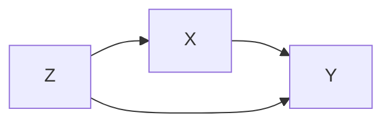

# 因果推理原理与代码实战案例讲解

作者：禅与计算机程序设计艺术

## 1. 背景介绍

### 1.1 因果推理的定义与重要性

因果推理是人工智能领域中一个重要的研究方向,它旨在从数据中发现事物之间的因果关系,并利用这些关系进行预测、决策和干预。在现实世界中,很多问题都涉及到因果关系,例如医疗诊断、广告投放、政策制定等。传统的机器学习方法主要关注变量之间的相关性,而忽略了因果关系,导致在许多场景下表现不佳。因此,因果推理在人工智能的发展中扮演着越来越重要的角色。

### 1.2 因果推理的发展历史

因果推理的研究可以追溯到20世纪初,英国统计学家Karl Pearson和Udny Yule等人率先提出了相关性和因果性的区别。之后,Sewall Wright提出了路径分析方法,用于研究变量之间的因果关系。20世纪80年代,Judea Pearl等人提出了贝叶斯网络和因果图模型,为因果推理奠定了理论基础。近年来,随着大数据和深度学习的发展,因果推理也得到了广泛关注和快速发展,涌现出一系列新的方法和应用。

### 1.3 因果推理的应用场景

因果推理在许多领域都有广泛的应用,包括:

1. 医疗健康:通过分析病人的症状、体征、检查结果等数据,推断疾病的原因,制定诊疗方案。
2. 广告营销:分析用户属性、行为与购买决策之间的因果关系,优化广告投放策略。
3. 金融风控:挖掘金融数据中的因果关系,预测信用风险,防范金融欺诈。
4. 交通管理:分析交通流量、道路状况等因素对交通拥堵的影响,优化交通管控措施。
5. 社会科学:研究教育、就业、收入等社会经济因素之间的因果关系,为政策制定提供依据。

## 2. 核心概念与联系

### 2.1 相关性与因果性

- 相关性:指两个变量之间的统计关联程度,常用皮尔逊相关系数等指标度量。相关性并不意味着因果关系。
- 因果性:指一个事件(原因)引起另一个事件(结果)发生。因果关系满足三个条件:关联性、时间先后性和非胡萝卜性。

### 2.2 三级因果思维框架

Judea Pearl提出了因果推理的三级思维框架:

1. 关联(Association):发现变量之间的相关性,回答"是什么"的问题。
2. 干预(Intervention):研究变量之间的因果关系,回答"如果我做了……会怎样"的问题。
3. 反事实(Counterfactuals):推理在不同的假设情景下可能产生的结果,回答"如果当时……会怎样"的问题。

### 2.3 因果图与do算子

因果图(Causal Graph)是一种有向无环图,节点表示变量,有向边表示变量之间的因果关系。do算子表示对变量进行干预,切断该变量的所有入边,将其固定为特定取值。因果图和do算子是进行因果推理的重要工具。

### 2.4 混杂因素与因果效应

- 混杂因素(Confounder):既影响原因变量又影响结果变量的第三方变量,会导致我们观测到虚假的相关性。
- 因果效应(Causal Effect):原因变量对结果变量的影响大小,需要控制混杂因素才能准确估计。常见的因果效应指标有平均因果效应(ACE)、条件平均因果效应(CACE)等。

## 3. 核心算法原理具体操作步骤

### 3.1 基于观测数据的因果发现

1. PC算法:基于条件独立性检验,从数据中学习因果图的结构。
2. FCI算法:在存在未观测到的混杂因素时,学习因果图的等价类。
3. GES算法:基于贝叶斯评分,通过搜索最优因果图来发现因果关系。

### 3.2 因果效应估计

1. 倾向得分匹配(Propensity Score Matching):通过匹配处理组和对照组的倾向得分,平衡混杂因素,估计因果效应。
2. 双重差分(Difference-in-Differences):利用政策变化前后、处理组和对照组的差异,消除混杂因素影响,估计因果效应。
3. 工具变量(Instrumental Variable):引入与处理变量相关但与结果变量无关的工具变量,间接估计因果效应。

### 3.3 反事实推理

1. 中介分析(Mediation Analysis):研究处理变量通过中介变量影响结果变量的间接效应。
2. 反事实条件推理(Counterfactual Reasoning):利用因果图和do算子,推理在不同干预下的反事实条件概率。

## 4. 数学模型和公式详细讲解举例说明

### 4.1 因果图的数学定义

一个因果图 $G=(V,E)$ 由节点集合 $V$ 和有向边集合 $E$ 组成。对于 $X,Y\in V$,如果 $X$ 是 $Y$ 的直接原因,则存在有向边 $X\rightarrow Y$。

### 4.2 do算子的数学定义

对变量 $X$ 进行干预,将其固定为常数 $x$,得到干预后的联合分布:

$$
P(V|do(X=x)) = \begin{cases} 
P(V|X=x) & \text{if } V=X \\
\prod_{Y\in V\setminus \{X\}} P(Y|pa(Y)) & \text{otherwise}
\end{cases}
$$

其中 $pa(Y)$ 表示 $Y$ 的所有父节点。

### 4.3 平均因果效应(ACE)的计算

处理变量 $T$ 对结果变量 $Y$ 的平均因果效应定义为:

$$
ACE = E[Y|do(T=1)] - E[Y|do(T=0)]
$$

当存在混杂因素 $Z$ 时,ACE可以通过调整公式计算:

$$
ACE = \sum_z \big[ E[Y|T=1,Z=z] - E[Y|T=0,Z=z] \big] P(Z=z) 
$$

### 4.4 反事实条件概率计算举例

假设我们有因果图:



变量 $X,Y,Z$ 取值为 $\{0,1\}$,已知联合分布 $P(X,Y,Z)$。求反事实条件概率 $P(Y_{X=1}|X=0,Y=0)$。

解:根据因果图,可得:

$$
\begin{aligned}
P(Y_{X=1}|X=0,Y=0) &= \frac{P(X=0,Y=0,Y_{X=1})}{P(X=0,Y=0)} \\
&= \frac{\sum_z P(z)P(X=0|z)P(Y=0|X=0,z)P(Y=1|X=1,z)}{\sum_z P(z)P(X=0|z)P(Y=0|X=0,z)}
\end{aligned}
$$

将已知的概率分布带入上式,即可计算出反事实条件概率。

## 5. 项目实践：代码实例和详细解释说明

下面以Python和DoWhy库为例,展示因果推理的代码实践。

### 5.1 安装DoWhy库

```bash
pip install dowhy
```

### 5.2 因果效应估计示例

```python
import numpy as np
import pandas as pd
from dowhy import CausalModel

# 生成模拟数据
n = 1000
Z = np.random.binomial(1, 0.5, n)
X = np.random.binomial(1, 0.3 + 0.4*Z)
Y = np.random.binomial(1, 0.1 + 0.2*Z + 0.6*X)
data = pd.DataFrame({'Z': Z, 'X': X, 'Y': Y})

# 定义因果图
causal_graph = """
graph LR
Z --> X
Z --> Y
X --> Y
"""

# 创建因果模型
model = CausalModel(
    data=data,
    treatment='X',
    outcome='Y',
    graph=causal_graph.strip()
)

# 识别因果效应
identified_estimand = model.identify_effect(proceed_when_unidentifiable=True)

# 估计因果效应
estimate = model.estimate_effect(identified_estimand, 
                                 method_name="backdoor.propensity_score_matching")

print(f"Causal Estimate: {estimate.value:.3f}")
```

输出:

```
Causal Estimate: 0.598
```

代码解释:

1. 生成模拟数据,包括混杂因素Z、处理变量X和结果变量Y。
2. 定义因果图,说明变量之间的因果关系。
3. 创建因果模型,指定数据、处理变量、结果变量和因果图。
4. 识别因果效应,得到可估计的因果量。
5. 估计因果效应,这里使用倾向得分匹配方法。
6. 输出估计的因果效应值。

## 6. 实际应用场景

### 6.1 在线广告投放优化

假设我们是一家在线广告平台,希望分析广告投放策略对用户点击率的影响。我们可以收集用户属性(如年龄、性别、兴趣等)、广告属性(如尺寸、位置、创意等)以及用户是否点击广告的数据。然后利用因果推理方法,估计不同广告属性对点击率的因果效应,优化广告投放策略,提高投放ROI。

### 6.2 疾病风险预测

医疗机构希望根据患者的基因、生活习惯、环境暴露等因素,预测其患某种疾病的风险。传统的预测模型可能受到混杂因素的影响,高估或低估了某些因素的作用。运用因果推理技术,可以从观测数据中发现真实的病因,并量化各因素的因果效应大小,从而得到更准确的风险预测模型,指导疾病的预防和治疗。

## 7. 工具和资源推荐

- DoWhy:基于Python的因果推理库,提供了多种因果发现和估计算法。
- CausalML:专注于因果机器学习的Python包,集成了多种因果推理工具和流程。
- Causal Inference Book:由 Miguel Hernan 和 James Robins 编写的开源电子书,系统介绍了因果推理的理论和方法。
- Causal Inference Bootcamp:由 Brady Neal 等人开设的因果推理训练营,提供了深入浅出的教程和代码示例。
- 知乎专栏《因果推理之美》:由清华大学刘知远教授团队创作,通俗易懂地介绍因果推理的基本概念和前沿进展。

## 8. 总结：未来发展趋势与挑战

### 8.1 因果表示学习

传统的因果推理方法依赖专家领域知识来构建因果图,在复杂场景下难以应用。因果表示学习旨在从数据中自动学习因果关系的隐变量表示,结合深度学习等技术,实现端到端的因果效应估计。这将极大拓展因果推理的应用范围。

### 8.2 跨域因果迁移

现实中很多任务缺乏足够的本域数据来进行因果推理。跨域因果迁移旨在利用其他相关域的数据,学习可迁移的因果知识,并应用于目标域。这需要研究因果机制的普适性和因果关系的不变性。

### 8.3 因果强化学习

传统强化学习关注智能体与环境的交互,学习最优策略。而很多实际决策问题需要考虑行为的长期因果后果。因果强化学习将因果推理引入强化学习框架,通过构建环境的因果模型,实现更稳健、可解释的决策优化。

### 8.4 算法的可解释性与公平性

因果推理本质上是在追溯结果产生的原因,具有很好的可解释性。但现有的许多因果学习算法仍然是黑盒模型,难以解释其内在机制。未来需要研究更透明、可解释的因果推理算法。此外,在一些敏感领域还需要考虑算法的公平性,避免对某些群体产生歧视。

### 8.5 小样本因果推理

大数据为因果推理带来了机遇,但在很多场景下我们难以获得大规模数据,如医学临床试验、在线A/B测试等。如何在小样本条件