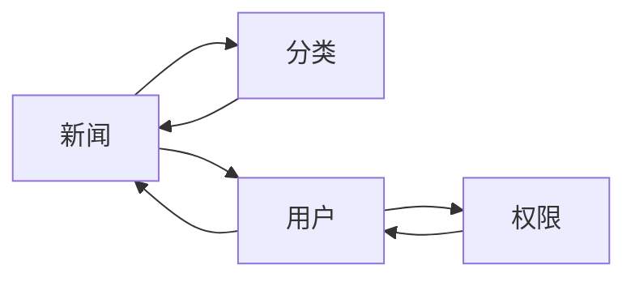

## 1.背景介绍

在数字化的时代，新闻的传播已经不再依赖于传统的媒体，而是通过互联网进行传播。新闻管理系统是一种可以对新闻进行管理的系统，它可以帮助我们对新闻进行分类、发布、修改和删除等操作。本文将详细介绍如何设计和实现一个基于WEB的新闻管理系统。

## 2.核心概念与联系

新闻管理系统主要包括以下几个核心概念：

- **新闻**：新闻是新闻管理系统的核心，它包括新闻的标题、内容、发布时间、作者等信息。

- **分类**：为了更好的管理新闻，我们需要对新闻进行分类。每个新闻都属于一个分类，每个分类都包含多个新闻。

- **用户**：用户是新闻管理系统的使用者，他们可以发布、修改和删除新闻。

- **权限**：不同的用户有不同的权限。例如，管理员可以管理所有的新闻和用户，而普通用户只能管理自己发布的新闻。

这些核心概念之间的联系如下图所示：



## 3.核心算法原理具体操作步骤

新闻管理系统的核心算法主要包括新闻的发布、修改、删除和查询等操作。下面我们将详细介绍这些操作的具体步骤。

### 3.1 新闻发布

新闻发布的步骤如下：

1. 用户登录系统。
2. 用户选择新闻分类。
3. 用户输入新闻标题和内容。
4. 系统保存新闻信息。
5. 系统返回发布成功的消息。

### 3.2 新闻修改

新闻修改的步骤如下：

1. 用户登录系统。
2. 用户查询需要修改的新闻。
3. 用户修改新闻的标题和内容。
4. 系统保存新闻信息。
5. 系统返回修改成功的消息。

### 3.3 新闻删除

新闻删除的步骤如下：

1. 用户登录系统。
2. 用户查询需要删除的新闻。
3. 用户选择删除操作。
4. 系统删除新闻信息。
5. 系统返回删除成功的消息。

### 3.4 新闻查询

新闻查询的步骤如下：

1. 用户登录系统。
2. 用户输入查询条件，如新闻标题、分类等。
3. 系统返回符合条件的新闻列表。

## 4.数学模型和公式详细讲解举例说明

在新闻管理系统中，我们需要对新闻的数量进行统计。这可以通过以下的数学模型来实现。

设 $N$ 为新闻的总数量，$n_i$ 为第 $i$ 个分类的新闻数量，$C$ 为分类的总数量，我们可以得到以下的公式：

$$
N = \sum_{i=1}^{C} n_i
$$

这个公式告诉我们，新闻的总数量等于每个分类的新闻数量之和。

例如，如果我们有3个分类，每个分类的新闻数量分别为10、20和30，那么新闻的总数量为：

$$
N = 10 + 20 + 30 = 60
$$

## 4.项目实践：代码实例和详细解释说明

下面我们将通过一个简单的例子来说明如何实现一个基于WEB的新闻管理系统。我们将使用Python的Flask框架来实现这个系统。

```python
from flask import Flask, request
from flask_sqlalchemy import SQLAlchemy

app = Flask(__name__)
app.config['SQLALCHEMY_DATABASE_URI'] = 'sqlite:////tmp/test.db'
db = SQLAlchemy(app)

class News(db.Model):
    id = db.Column(db.Integer, primary_key=True)
    title = db.Column(db.String(80), nullable=False)
    content = db.Column(db.Text, nullable=False)
    category_id = db.Column(db.Integer, db.ForeignKey('category.id'),
        nullable=False)
    category = db.relationship('Category',
        backref=db.backref('news', lazy=True))

class Category(db.Model):
    id = db.Column(db.Integer, primary_key=True)
    name = db.Column(db.String(50), nullable=False)

@app.route('/news', methods=['POST'])
def create_news():
    title = request.json['title']
    content = request.json['content']
    category_id = request.json['category_id']
    news = News(title=title, content=content, category_id=category_id)
    db.session.add(news)
    db.session.commit()
    return {'id': news.id}

if __name__ == '__main__':
    db.create_all()
    app.run(debug=True)
```

这个代码首先定义了一个Flask应用和一个SQLite数据库。然后，定义了两个模型：News和Category。News模型表示新闻，它包括新闻的标题、内容和分类。Category模型表示分类，它包括分类的名称。最后，定义了一个路由`/news`，它接受POST请求来创建新的新闻。

## 5.实际应用场景

基于WEB的新闻管理系统可以应用于各种场景，例如新闻网站、公司内部的新闻发布系统、社区论坛等。它可以帮助用户方便的发布和管理新闻，提高新闻的传播效率。

## 6.工具和资源推荐

如果你想要实现一个基于WEB的新闻管理系统，我推荐你使用以下的工具和资源：

- **Python**：Python是一种简单易学的编程语言，它有丰富的库和框架，非常适合WEB开发。

- **Flask**：Flask是一个轻量级的Python WEB框架，它简单易用，可以快速的开发WEB应用。

- **SQLite**：SQLite是一个轻量级的数据库，它不需要安装和配置，非常适合小型应用。

- **SQLAlchemy**：SQLAlchemy是一个Python的ORM框架，它可以让你用Pythonic的方式来操作数据库。

## 7.总结：未来发展趋势与挑战

随着互联网的发展，新闻的传播方式正在发生着深刻的变化。基于WEB的新闻管理系统作为新闻传播的重要工具，将会有更大的发展空间。

然而，基于WEB的新闻管理系统也面临着一些挑战。例如，如何保证新闻的真实性和准确性，如何防止恶意发布和传播虚假新闻，如何提高新闻的传播效率等。这些都是我们在设计和实现新闻管理系统时需要考虑的问题。

## 8.附录：常见问题与解答

1. **如何防止用户发布虚假新闻？**

   可以通过用户审核、新闻审核等方式来防止用户发布虚假新闻。同时，也可以通过用户举报和反馈机制，让用户参与到新闻的管理中来。

2. **如何提高新闻的传播效率？**

   可以通过优化新闻的存储和查询方式，提高新闻的加载速度。同时，也可以通过新闻推荐等方式，让用户更快的找到他们感兴趣的新闻。

3. **如何保证新闻管理系统的安全？**

   可以通过用户权限管理、数据加密等方式来保证新闻管理系统的安全。同时，也需要定期进行安全检查和更新，防止新的安全威胁。

4. **如何扩展新闻管理系统的功能？**

   可以通过插件或者模块的方式来扩展新闻管理系统的功能。例如，可以添加新闻评论、新闻分享、新闻推荐等功能。

希望这篇文章可以帮助你理解和实现一个基于WEB的新闻管理系统。如果你有任何问题或者建议，欢迎留言讨论。