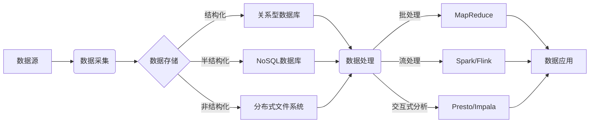

# 大数据架构原理与代码实例讲解

作者：禅与计算机程序设计艺术

## 1. 背景介绍

### 1.1 大数据时代的到来
- 1.1.1 数据爆炸式增长
- 1.1.2 传统数据处理方式的局限性
- 1.1.3 大数据技术的兴起

### 1.2 大数据的特征
- 1.2.1 Volume（数据量）
- 1.2.2 Velocity（数据速度）  
- 1.2.3 Variety（数据种类）
- 1.2.4 Value（数据价值）

### 1.3 大数据带来的机遇与挑战
- 1.3.1 大数据应用场景
- 1.3.2 大数据面临的技术挑战
- 1.3.3 大数据人才缺口

## 2. 核心概念与联系

### 2.1 分布式存储
- 2.1.1 分布式文件系统HDFS
- 2.1.2 NoSQL数据库HBase
- 2.1.3 分布式数据库Cassandra

### 2.2 分布式计算
- 2.2.1 MapReduce编程模型 
- 2.2.2 Spark计算框架
- 2.2.3 Flink流式计算引擎

### 2.3 资源管理与调度
- 2.3.1 YARN资源管理器
- 2.3.2 Mesos资源调度平台
- 2.3.3 Kubernetes容器编排系统

### 2.4 数据采集与传输
- 2.4.1 日志收集Flume
- 2.4.2 消息队列Kafka
- 2.4.3 数据同步Sqoop

### 2.5 大数据架构图解



## 3. 核心算法原理具体操作步骤

### 3.1 MapReduce工作原理
- 3.1.1 Map阶段
- 3.1.2 Shuffle阶段
- 3.1.3 Reduce阶段

### 3.2 MapReduce编程步骤
- 3.2.1 编写Mapper类
- 3.2.2 编写Reducer类
- 3.2.3 编写Driver类
- 3.2.4 打包运行

### 3.3 Spark工作原理  
- 3.3.1 RDD弹性分布式数据集
- 3.3.2 DAG有向无环图
- 3.3.3 Executor执行器

### 3.4 Spark编程步骤
- 3.4.1 创建SparkContext
- 3.4.2 创建RDD
- 3.4.3 转换操作
- 3.4.4 行动操作

## 4. 数学模型和公式详细讲解举例说明

### 4.1 TF-IDF文本挖掘
- 4.1.1 TF词频
$$
TF(t,d) = \frac{f_{t,d}}{\sum_{t'\in d} f_{t',d}}
$$
- 4.1.2 IDF逆文档频率 
$$
IDF(t,D) = \log \frac{|D|}{|\{d \in D: t \in d\}|}
$$
- 4.1.3 TF-IDF权重
$$
TFIDF(t,d,D) = TF(t,d) \times IDF(t,D)
$$

### 4.2 协同过滤推荐
- 4.2.1 用户-物品评分矩阵
- 4.2.2 相似度计算
  - 欧几里得距离
  $$
  d(x,y) = \sqrt{\sum_{i=1}^n (x_i-y_i)^2} 
  $$
  - 皮尔逊相关系数
  $$
  \rho_{X,Y} = \frac{cov(X,Y)}{\sigma_X \sigma_Y} = \frac{E[(X-\mu_X)(Y-\mu_Y)]}{\sigma_X \sigma_Y}
  $$
  - 余弦相似度
  $$
  \cos(\theta) = \frac{A \cdot B}{||A|| \times ||B||} = \frac{\sum_{i=1}^n A_i \times B_i}{\sqrt{\sum_{i=1}^n A_i^2} \times \sqrt{\sum_{i=1}^n B_i^2}}
  $$
- 4.2.3 预测评分
  - UserCF
  $$
  P_{u,i} = \overline{r_u} + \frac{\sum_{v \in S^k(u,i)}sim(u,v) \times (r_{v,i} - \overline{r_v})}{\sum_{v \in S^k(u,i)}|sim(u,v)|}
  $$
  - ItemCF 
  $$
  P_{u,i} = \frac{\sum_{j \in S^k(u,i)}sim(i,j) \times r_{u,j}}{\sum_{j \in S^k(u,i)}|sim(i,j)|}
  $$

### 4.3 PageRank网页排名
- 4.3.1 PageRank值计算
$$
PR(p_i) = \frac{1-d}{N} + d \sum_{p_j \in M(p_i)} \frac{PR (p_j)}{L(p_j)}
$$
- 4.3.2 迭代计算
- 4.3.3 随机游走解释

## 5. 项目实践：代码实例和详细解释说明

### 5.1 Hadoop WordCount词频统计
```java
public class WordCount {
    public static class TokenizerMapper extends Mapper<Object, Text, Text, IntWritable> {
        private final static IntWritable one = new IntWritable(1);
        private Text word = new Text();
        
        public void map(Object key, Text value, Context context) throws IOException, InterruptedException {
            StringTokenizer itr = new StringTokenizer(value.toString());
            while (itr.hasMoreTokens()) {
                word.set(itr.nextToken());
                context.write(word, one);
            }
        }
    }
    
    public static class IntSumReducer extends Reducer<Text,IntWritable,Text,IntWritable> {
        private IntWritable result = new IntWritable();
        
        public void reduce(Text key, Iterable<IntWritable> values, Context context) throws IOException, InterruptedException {
            int sum = 0;
            for (IntWritable val : values) {
                sum += val.get();
            }
            result.set(sum);
            context.write(key, result);
        }
    }
    
    public static void main(String[] args) throws Exception {
        Configuration conf = new Configuration();
        Job job = Job.getInstance(conf, "word count");
        
        job.setJarByClass(WordCount.class);
        job.setMapperClass(TokenizerMapper.class);
        job.setCombinerClass(IntSumReducer.class);
        job.setReducerClass(IntSumReducer.class);
        
        job.setOutputKeyClass(Text.class);
        job.setOutputValueClass(IntWritable.class);
        
        FileInputFormat.addInputPath(job, new Path(args[0]));
        FileOutputFormat.setOutputPath(job, new Path(args[1]));
        
        System.exit(job.waitForCompletion(true) ? 0 : 1);
    }
}
```
WordCount是MapReduce编程的入门示例，主要分为以下步骤：

1. 自定义一个Mapper类，继承Mapper父类，重写map方法。在map方法中，接收<key,value>键值对，其中key是每一行的起始位置（一般用不到），value是这一行的内容。对value进行分词，输出<word, 1>。

2. 自定义一个Reducer类，继承Reducer父类，重写reduce方法。在reduce方法中，接收<key,value-list>，其中key是map输出的key（即单词），value-list是key对应的所有value组成的列表。遍历value-list，进行求和，输出<word, sum>。

3. 在main方法中进行任务的配置和提交。

### 5.2 Spark WordCount词频统计
```scala
val conf = new SparkConf().setAppName("WordCount")
val sc = new SparkContext(conf)

val textFile = sc.textFile("hdfs://...")
val counts = textFile.flatMap(line => line.split(" "))
                 .map(word => (word, 1))
                 .reduceByKey(_ + _)
counts.saveAsTextFile("hdfs://...")
```
使用Spark实现WordCount更加简洁：

1. 创建SparkConf对象，设置应用名称，创建SparkContext。

2. 读取HDFS上的文件，得到RDD[String]。

3. 对每一行文本进行分词，得到RDD[String]。 

4. 将每个单词映射为(word, 1)，得到RDD[(String, Int)]。

5. 按照key进行聚合，对value进行求和，得到RDD[(String, Int)]，即为每个单词的频数。

6. 将结果保存到HDFS。

### 5.3 Flink实时WordCount
```scala
val env = StreamExecutionEnvironment.getExecutionEnvironment
val text = env.socketTextStream("localhost", 9999)

val counts = text.flatMap { _.toLowerCase.split("\\W+") filter { _.nonEmpty } }
  .map { (_, 1) }
  .keyBy(0)
  .timeWindow(Time.seconds(5))
  .sum(1)

counts.print()
env.execute("Window Stream WordCount")
```
Flink是一个流式计算引擎，支持实时计算：

1. 创建流处理执行环境。

2. 连接Socket获取实时数据流。

3. 对数据流进行分词、过滤、映射。

4. 按照单词进行分组，设置5秒的滚动窗口。

5. 对窗口内的数据进行聚合求和。

6. 打印结果。

7. 启动Flink程序。

## 6. 实际应用场景

### 6.1 电商推荐系统
- 6.1.1 用户行为数据采集
- 6.1.2 离线训练协同过滤模型
- 6.1.3 实时推荐服务

### 6.2 金融风控系统
- 6.2.1 交易数据实时采集
- 6.2.2 特征工程
- 6.2.3 机器学习模型训练
- 6.2.4 实时预测服务

### 6.3 车联网系统
- 6.3.1 车辆数据实时采集
- 6.3.2 实时道路状况分析
- 6.3.3 个性化导航服务

### 6.4 工业互联网
- 6.4.1 设备数据采集
- 6.4.2 设备健康度评估
- 6.4.3 预测性维护

## 7. 工具和资源推荐

### 7.1 大数据平台
- 7.1.1 Hadoop
- 7.1.2 Spark
- 7.1.3 Flink
- 7.1.4 Storm
- 7.1.5 Hive
- 7.1.6 HBase

### 7.2 数据可视化
- 7.2.1 Echarts
- 7.2.2 Superset
- 7.2.3 Redash
- 7.2.4 Metabase

### 7.3 学习资源
- 7.3.1 官方文档
- 7.3.2 GitHub开源项目
- 7.3.3 慕课网大数据课程
- 7.3.4 《Spark快速大数据分析》
- 7.3.5 《数据算法：Hadoop/Spark大数据处理技巧》

## 8. 总结：未来发展趋势与挑战

### 8.1 大数据发展趋势
- 8.1.1 云计算与大数据融合 
- 8.1.2 AI与大数据结合
- 8.1.3 边缘计算与大数据协同
- 8.1.4 大数据即服务

### 8.2 大数据面临的挑战
- 8.2.1 数据安全与隐私保护
- 8.2.2 数据质量与数据治理
- 8.2.3 复杂异构环境数据集成
- 8.2.4 大数据人才培养

### 8.3 大数据的未来展望
- 8.3.1 数据驱动的智慧社会
- 8.3.2 个性化智能服务普及
- 8.3.3 全域数据融合应用
- 8.3.4 数据价值深度挖掘

## 9. 附录：常见问题与解答

### 9.1 如何选择合适的大数据框架？
- 9.1.1 根据数据量级选择
- 9.1.2 根据实时性需求选择
- 9.1.3 根据生态完善程度选择
- 9.1.4 根据团队技术储备选择

### 9.2 如何保证大数据处理的高可用？
- 9.2.1 数据多副本容错
- 9.2.2 任务重试机制
- 9.2.3 集群HA部署
- 9.2.4 监控与告警

### 9.3 