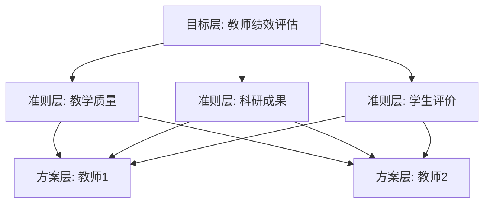

# 教师信息管理系统详细设计与具体代码实现

作者：禅与计算机程序设计艺术

## 1.背景介绍

在现代化的教育管理中,教师信息管理系统扮演着至关重要的角色。一个高效、易用、功能完善的教师信息管理系统可以极大地提高学校的管理效率,减轻教务人员的工作负担,为学校的决策提供数据支持。本文将详细介绍教师信息管理系统的设计与实现,探讨其中涉及的核心概念、算法原理、数学模型以及实际应用场景,并给出具体的代码实例。

### 1.1 教师信息管理系统的意义
#### 1.1.1 提高管理效率
#### 1.1.2 减轻工作负担  
#### 1.1.3 数据支持决策

### 1.2 教师信息管理系统的功能需求
#### 1.2.1 教师信息录入与维护
#### 1.2.2 教师考勤管理
#### 1.2.3 教师绩效考核
#### 1.2.4 教师培训管理
#### 1.2.5 数据统计与分析

### 1.3 教师信息管理系统的技术选型
#### 1.3.1 开发语言的选择
#### 1.3.2 数据库的选择
#### 1.3.3 框架与类库的选择

## 2.核心概念与联系

在教师信息管理系统中,涉及到一些核心概念,它们之间有着错综复杂的联系。本节将对这些核心概念进行介绍,并分析它们之间的关系。

### 2.1 教师对象
#### 2.1.1 教师属性
#### 2.1.2 教师方法
#### 2.1.3 教师状态

### 2.2 课程对象  
#### 2.2.1 课程属性
#### 2.2.2 课程方法
#### 2.2.3 课程状态

### 2.3 考勤对象
#### 2.3.1 考勤属性  
#### 2.3.2 考勤方法
#### 2.3.3 考勤状态

### 2.4 绩效对象
#### 2.4.1 绩效属性
#### 2.4.2 绩效方法  
#### 2.4.3 绩效状态

### 2.5 培训对象
#### 2.5.1 培训属性
#### 2.5.2 培训方法
#### 2.5.3 培训状态

### 2.6 对象之间的关系
#### 2.6.1 教师与课程的关系
#### 2.6.2 教师与考勤的关系
#### 2.6.3 教师与绩效的关系
#### 2.6.4 教师与培训的关系

## 3.核心算法原理具体操作步骤

教师信息管理系统中涉及到一些核心算法,本节将详细介绍这些算法的原理以及具体的操作步骤。

### 3.1 教师信息的增删改查算法
#### 3.1.1 添加教师信息
#### 3.1.2 删除教师信息
#### 3.1.3 修改教师信息
#### 3.1.4 查询教师信息

### 3.2 考勤数据处理算法
#### 3.2.1 考勤数据录入
#### 3.2.2 考勤数据统计
#### 3.2.3 考勤异常识别

### 3.3 绩效评估算法
#### 3.3.1 绩效指标设置
#### 3.3.2 绩效数据采集
#### 3.3.3 绩效评分计算

### 3.4 数据分析算法
#### 3.4.1 描述性统计分析
#### 3.4.2 相关性分析
#### 3.4.3 聚类分析

## 4.数学模型和公式详细讲解举例说明

为了更好地实现教师信息管理系统的各项功能,需要运用一些数学模型和公式。本节将详细讲解这些数学模型和公式,并给出具体的举例说明。

### 4.1 考勤异常识别模型
#### 4.1.1 正态分布模型
设考勤时间服从正态分布 $X \sim N(\mu, \sigma^2)$,则异常考勤的判定公式为:

$$
P(X < \mu - 3\sigma) + P(X > \mu + 3\sigma) < 0.003
$$

其中,$\mu$ 为平均值,$\sigma$为标准差。

例如,某教师连续一周的上班打卡时间如下:

| 星期一 | 星期二 | 星期三 | 星期四 | 星期五 |
| ------ | ------ | ------ | ------ | ------ |
| 8:03   | 8:01   | 10:34  | 8:02   | 7:58   |

其中星期三的打卡时间明显异常。

#### 4.1.2 贝叶斯异常检测模型
贝叶斯异常检测模型的公式为:

$$
P(x_i|\theta) = \frac{e^{-\theta x_i}}{\sum_{j=1}^n e^{-\theta x_j}}
$$

其中,$x_i$为第$i$个数据点,$\theta$为模型参数。

例如,对于上述考勤数据,可以通过贝叶斯异常检测模型计算出星期三的打卡时间异常的概率。

### 4.2 绩效评估模型
#### 4.2.1 加权平均模型
设第$i$个绩效指标的得分为$s_i$,权重为$w_i$,则综合绩效得分$S$的计算公式为:

$$
S = \frac{\sum_{i=1}^n w_i s_i}{\sum_{i=1}^n w_i}
$$

例如,某教师的绩效考核包括教学质量、科研成果、学生评价三个指标,各指标得分和权重如下:

| 指标     | 得分 | 权重 |
| -------- | ---- | ---- |
| 教学质量 | 85   | 0.5  |
| 科研成果 | 90   | 0.3  |
| 学生评价 | 95   | 0.2  |

则该教师的综合绩效得分为:

$$
S = \frac{85 \times 0.5 + 90 \times 0.3 + 95 \times 0.2}{0.5 + 0.3 + 0.2} \approx 88.5
$$

#### 4.2.2 层次分析法
层次分析法(AHP)是一种常用的绩效评估模型,其基本步骤如下:

1. 建立层次结构模型
2. 构造判断矩阵
3. 计算权向量并进行一致性检验
4. 计算组合权重并进行一致性检验
5. 得出最终的绩效评分

例如,对于上述绩效指标,可以建立如下的层次结构模型:



然后,通过专家打分的方式构造判断矩阵,并计算权向量、进行一致性检验,最终得出各方案的绩效得分。

## 5.项目实践：代码实例和详细解释说明

本节将给出教师信息管理系统的部分核心代码实例,并进行详细的解释说明。

### 5.1 教师信息管理模块
#### 5.1.1 教师类的定义
```python
class Teacher:
    def __init__(self, id, name, gender, birthday, title, department):
        self.id = id
        self.name = name
        self.gender = gender
        self.birthday = birthday
        self.title = title
        self.department = department
        
    def __str__(self):
        return f"Teacher(id={self.id}, name={self.name}, gender={self.gender}, birthday={self.birthday}, title={self.title}, department={self.department})"
```

这段代码定义了一个`Teacher`类,包含了教师的基本属性如工号、姓名、性别、出生日期、职称、所属部门等。其中,`__init__`方法为构造函数,用于创建`Teacher`对象;`__str__`方法用于返回`Teacher`对象的字符串表示形式。

#### 5.1.2 教师信息的增删改查
```python
class TeacherManager:
    def __init__(self):
        self.teachers = []
        
    def add_teacher(self, teacher):
        self.teachers.append(teacher)
        
    def remove_teacher(self, id):
        for teacher in self.teachers:
            if teacher.id == id:
                self.teachers.remove(teacher)
                break
                
    def update_teacher(self, id, **kwargs):
        for teacher in self.teachers:
            if teacher.id == id:
                for key, value in kwargs.items():
                    setattr(teacher, key, value)
                break
                
    def get_teacher(self, id):
        for teacher in self.teachers:
            if teacher.id == id:
                return teacher
        return None
        
    def get_all_teachers(self):
        return self.teachers
```

这段代码定义了一个`TeacherManager`类,用于管理教师信息。其中,`add_teacher`方法用于添加教师信息,`remove_teacher`方法用于删除教师信息,`update_teacher`方法用于修改教师信息,`get_teacher`方法用于查询单个教师信息,`get_all_teachers`方法用于查询所有教师信息。

### 5.2 考勤管理模块
#### 5.2.1 考勤类的定义
```python
class Attendance:
    def __init__(self, teacher_id, date, time):
        self.teacher_id = teacher_id
        self.date = date
        self.time = time
        
    def __str__(self):
        return f"Attendance(teacher_id={self.teacher_id}, date={self.date}, time={self.time})"
```

这段代码定义了一个`Attendance`类,包含了考勤记录的基本属性如教师工号、考勤日期、考勤时间等。

#### 5.2.2 考勤数据处理
```python
import numpy as np
from scipy.stats import norm

class AttendanceManager:
    def __init__(self):
        self.attendances = []
        
    def add_attendance(self, attendance):
        self.attendances.append(attendance)
        
    def get_attendances(self, teacher_id, start_date, end_date):
        return [a for a in self.attendances if a.teacher_id == teacher_id and start_date <= a.date <= end_date]
        
    def detect_abnormal(self, teacher_id, start_date, end_date, threshold=0.003):
        attendances = self.get_attendances(teacher_id, start_date, end_date)
        times = [a.time.hour * 60 + a.time.minute for a in attendances]
        mean, std = np.mean(times), np.std(times)
        prob = norm.cdf(mean - 3 * std) + (1 - norm.cdf(mean + 3 * std))
        return prob < threshold
```

这段代码定义了一个`AttendanceManager`类,用于管理考勤数据。其中,`add_attendance`方法用于添加考勤记录,`get_attendances`方法用于查询特定教师在特定时间范围内的考勤记录,`detect_abnormal`方法用于检测考勤异常。在`detect_abnormal`方法中,我们首先计算考勤时间的均值和标准差,然后利用正态分布的累积分布函数计算异常考勤的概率,并与给定的阈值进行比较。

### 5.3 绩效管理模块
#### 5.3.1 绩效类的定义
```python
class Performance:
    def __init__(self, teacher_id, indicator, score, weight):
        self.teacher_id = teacher_id
        self.indicator = indicator
        self.score = score
        self.weight = weight
        
    def __str__(self):
        return f"Performance(teacher_id={self.teacher_id}, indicator={self.indicator}, score={self.score}, weight={self.weight})"
```

这段代码定义了一个`Performance`类,包含了绩效考核的基本属性如教师工号、考核指标、得分、权重等。

#### 5.3.2 绩效评估
```python
class PerformanceManager:
    def __init__(self):
        self.performances = []
        
    def add_performance(self, performance):
        self.performances.append(performance)
        
    def get_performances(self, teacher_id):
        return [p for p in self.performances if p.teacher_id == teacher_id]
        
    def evaluate(self, teacher_id):
        performances = self.get_performances(teacher_id)
        total_score = sum(p.score * p.weight for p in performances)
        total_weight = sum(p.weight for p in performances)
        return total_score / total_weight
```

这段代码定义了一个`PerformanceManager`类,用于管理绩效数据。其中,`add_performance`方法用于添加绩效记录,`get_performances`方法用于查询特定教师的绩效记录,`evaluate`方法用于计算教师的综合绩效得分。在`evaluate`方法中,我们利用加权平均模型计算教师的综合绩效得