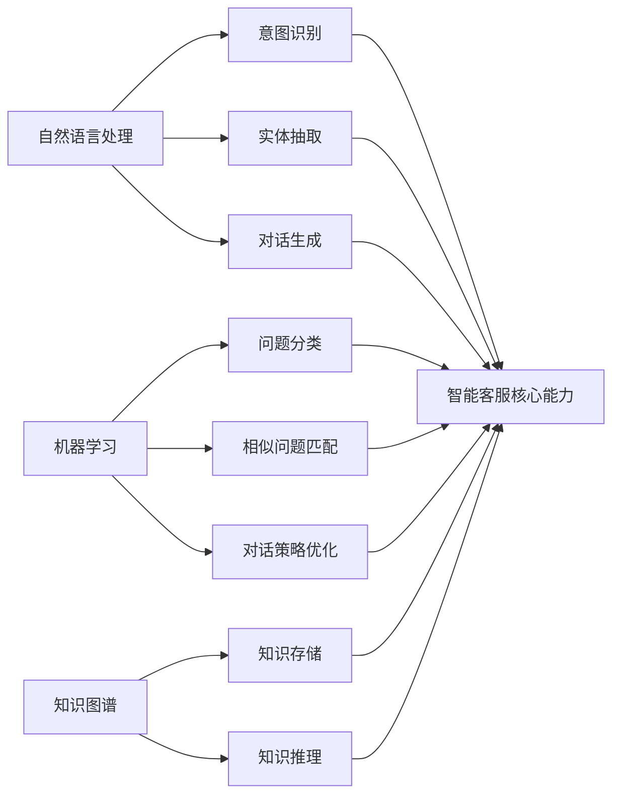

# 智能客服:提升用户服务体验

作者：禅与计算机程序设计艺术

## 1.背景介绍

### 1.1 客服的重要性
在当今数字化时代,企业面临着日益激烈的市场竞争。提供优质的客户服务已成为企业保持竞争力和留住客户的关键因素之一。客服在维系客户关系、提升品牌形象方面扮演着不可或缺的角色。

### 1.2 传统客服面临的挑战
传统的人工客服模式存在诸多局限性:

1. 人力成本高昂
2. 服务时间受限
3. 服务质量参差不齐
4. 难以应对海量客户咨询

这些挑战促使企业寻求更加智能化、高效的客服解决方案。

### 1.3 智能客服的兴起
随着人工智能技术的飞速发展,智能客服应运而生。它利用自然语言处理(NLP)、机器学习等AI技术,为企业提供全天候、高质量的客户服务。智能客服不仅能够显著降低人力成本,还能提升客户满意度和忠诚度。

## 2.核心概念与联系

### 2.1 智能客服的定义
智能客服是指利用人工智能技术,实现自动化、个性化的客户服务的系统。它能够理解客户的问题,并给出准确、有针对性的回答,从而提供与人工客服相媲美的服务体验。

### 2.2 智能客服的核心技术

#### 2.2.1 自然语言处理(NLP)
NLP 使计算机能够理解、处理和生成人类语言。在智能客服中,NLP 主要用于:

- 意图识别:理解客户问题背后的真正意图
- 实体抽取:从客户问题中提取关键信息
- 对话生成:根据理解生成自然、贴切的回答

#### 2.2.2 机器学习
机器学习赋予了智能客服从海量服务数据中自动学习和优化的能力。常见的机器学习任务包括:

- 问题分类:将客户问题归类到预定义的类别中
- 相似问题匹配:在知识库中找到与客户问题最相似的问题及答案
- 对话策略优化:根据客户反馈动态调整对话策略

#### 2.2.3 知识图谱
知识图谱以结构化的方式存储企业的产品、服务相关知识,使智能客服能够利用这些知识对客户问题进行推理和查询,给出更加准确和全面的答复。

### 2.3 技术之间的联系
NLP、机器学习、知识图谱等技术相辅相成,共同构建起智能客服系统的核心能力:



## 3.核心算法原理具体操作步骤

### 3.1 意图识别
意图识别旨在理解客户问题背后的真正意图,它是智能客服的基础。主要步骤包括:

1. 收集和标注意图训练数据
2. 对文本进行预处理(分词、去停用词等)
3. 特征提取(如 TF-IDF、Word2Vec)
4. 选择并训练意图分类模型(如 CNN、LSTM、BERT)
5. 使用训练好的模型对新问题进行意图预测

### 3.2 相似问题匹配 
相似问题匹配在知识库中找到与客户问题最相似的问题,主要步骤:

1. 对知识库问题和客户问题进行向量化表示
2. 计算客户问题与知识库中每个问题的相似度(如余弦相似度)
3. 选择相似度最高的问题,返回对应答案

常用的相似度计算方法包括:

- TF-IDF 相似度
- Word2Vec 相似度
- BERT 相似度

### 3.3 对话策略优化
对话策略优化根据客户反馈动态调整对话策略,提升客户体验。主要采用强化学习方法:

1. 定义对话状态(State)、动作(Action)和奖励(Reward)
2. 初始化对话策略模型(如 DQN、DDPG)
3. 智能客服与客户进行对话,记录对话数据
4. 根据客户反馈计算奖励值
5. 利用奖励值更新对话策略模型
6. 重复步骤3-5,不断优化对话策略

## 4.数学模型和公式详细讲解举例说明

### 4.1 TF-IDF
TF-IDF 是一种常用于文本挖掘的加权技术,它用于评估一个词语对于一个文件集或一个语料库中的其中一份文件的重要程度。

- TF(Term Frequency):词频,指词语 $t$ 在文档 $d$ 中出现的频率。

$$
TF(t,d) = \frac{f_{t,d}}{\sum_{t'\in d} f_{t',d}}
$$

其中,$f_{t,d}$ 是词语 $t$ 在文档 $d$ 中出现的次数,$\sum_{t'\in d} f_{t',d}$ 是文档 $d$ 中所有词语的出现次数之和。

- IDF(Inverse Document Frequency):逆文档频率,衡量词语 $t$ 的普遍重要性。

$$
IDF(t,D) = \log \frac{|D|}{|\{d\in D:t\in d\}|}
$$

其中,$|D|$ 是语料库中的文档总数,$|\{d\in D:t\in d\}|$ 是包含词语 $t$ 的文档数。

TF-IDF 是 TF 和 IDF 的乘积:

$$
TFIDF(t,d,D) = TF(t,d) \times IDF(t,D)
$$

举例:假设我们有两个文档:

- 文档1:"智能客服是人工智能的一个应用"
- 文档2:"智能客服利用自然语言处理技术"

计算词语"智能"的 TF-IDF:

- 文档1:$TF("智能",文档1) = 1/10, IDF("智能") = \log(2/2) = 0$
- 文档2:$TF("智能",文档2) = 1/8, IDF("智能") = \log(2/2) = 0$

$TFIDF("智能",文档1) = 1/10 \times 0 = 0$
$TFIDF("智能",文档2) = 1/8 \times 0 = 0$

可见,"智能"在两个文档中的 TF-IDF 值都为0,说明它对于区分这两个文档的重要性不大。

### 4.2 余弦相似度
余弦相似度用于衡量两个向量的相似程度,在智能客服中常用于计算问题之间的相似度。

对于两个 n 维向量 $\mathbf{A}$ 和 $\mathbf{B}$,其余弦相似度定义为:

$$
\cos(\theta) = \frac{\mathbf{A} \cdot \mathbf{B}}{\|\mathbf{A}\| \|\mathbf{B}\|} = \frac{\sum_{i=1}^n A_i B_i}{\sqrt{\sum_{i=1}^n A_i^2} \sqrt{\sum_{i=1}^n B_i^2}}
$$

其中,$A_i$ 和 $B_i$ 分别是向量 $\mathbf{A}$ 和 $\mathbf{B}$ 的第 $i$ 个分量。

举例:假设我们有两个问题:

- 问题1:"如何注册账户?"(表示为向量 $\mathbf{A} = (1, 0, 1, 1)$)
- 问题2:"注册账号的流程是什么?"(表示为向量 $\mathbf{B} = (1, 1, 0, 1)$)

计算它们的余弦相似度:

$$
\cos(\theta) = \frac{1\times 1 + 0\times 1 + 1\times 0 + 1\times 1}{\sqrt{1^2 + 0^2 + 1^2 + 1^2} \sqrt{1^2 + 1^2 + 0^2 + 1^2}} = \frac{2}{\sqrt{3} \sqrt{3}} \approx 0.67
$$

可见,这两个问题的余弦相似度为0.67,说明它们的语义较为相似,可以被视为同一类问题。

## 5.项目实践:代码实例和详细解释说明

下面我们以 Python 为例,演示如何实现一个简单的基于 TF-IDF 和余弦相似度的问题匹配系统。

```python
from sklearn.feature_extraction.text import TfidfVectorizer
from sklearn.metrics.pairwise import cosine_similarity

# 知识库问题列表
kb_questions = [
    "如何注册账户?",
    "忘记密码怎么办?",
    "如何修改个人信息?",
    "如何查看订单状态?"
]

# 客户问题
customer_question = "注册账号的流程是什么?"

# 创建 TF-IDF 向量化器
vectorizer = TfidfVectorizer()

# 对知识库问题进行向量化
kb_vectors = vectorizer.fit_transform(kb_questions)

# 对客户问题进行向量化
customer_vector = vectorizer.transform([customer_question])

# 计算客户问题与知识库问题的余弦相似度
similarities = cosine_similarity(customer_vector, kb_vectors)

# 找到相似度最高的问题索引
most_similar_index = similarities.argmax()

# 返回最相似问题
most_similar_question = kb_questions[most_similar_index]
print(f"最相似的问题: {most_similar_question}")
```

输出结果:
```
最相似的问题: 如何注册账户?
```

代码解释:

1. 导入所需的库:TfidfVectorizer 用于进行 TF-IDF 向量化,cosine_similarity 用于计算余弦相似度。
2. 定义知识库问题列表 kb_questions 和客户问题 customer_question。
3. 创建 TF-IDF 向量化器 vectorizer。
4. 使用 vectorizer.fit_transform 对知识库问题进行向量化,得到 kb_vectors。
5. 使用 vectorizer.transform 对客户问题进行向量化,得到 customer_vector。
6. 调用 cosine_similarity 计算客户问题与知识库问题的余弦相似度,得到 similarities。
7. 使用 similarities.argmax() 找到相似度最高的问题索引。
8. 根据索引从 kb_questions 中获取最相似问题,并打印输出。

这个简单的问题匹配系统展示了如何利用 TF-IDF 和余弦相似度实现智能客服中的相似问题匹配功能。在实际应用中,我们还可以引入更加复杂的语义匹配模型,如 DSSM、ESIM 等,以进一步提升匹配精度。

## 6.实际应用场景

智能客服在各行各业中得到广泛应用,典型场景包括:

### 6.1 电商客服
- 处理订单查询、物流跟踪等常见问题
- 提供商品推荐、促销活动信息
- 协助处理退换货、投诉等售后问题

### 6.2 金融客服
- 解答账户、交易、理财等业务咨询
- 提供贷款、信用卡申请指导
- 协助处理盗刷、争议交易等安全问题

### 6.3 政务客服
- 提供政策解读、办事指南
- 引导办理各类证件、许可
- 受理并转派投诉、建议等诉求

### 6.4 医疗客服
- 提供疾病知识、就医指南
- 协助预约挂号、查询检查结果
- 指导购药、医保报销等后续流程

无论在哪个领域,智能客服都能显著提升服务效率,降低人工成本,为企业和用户带来实实在在的价值。

## 7.工具和资源推荐

### 7.1 自然语言处理工具
- NLTK:Python 自然语言处理工具包
- spaCy:工业级自然语言处理库
- HanLP:中文自然语言处理包
- Stanford CoreNLP:Java 自然语言处理工具包

### 7.2 机器学习平台
- TensorFlow:端到端开源机器学习平台
- PyTorch:基于 Python 的深度学习框架
- Scikit-learn:Python 机器学习库