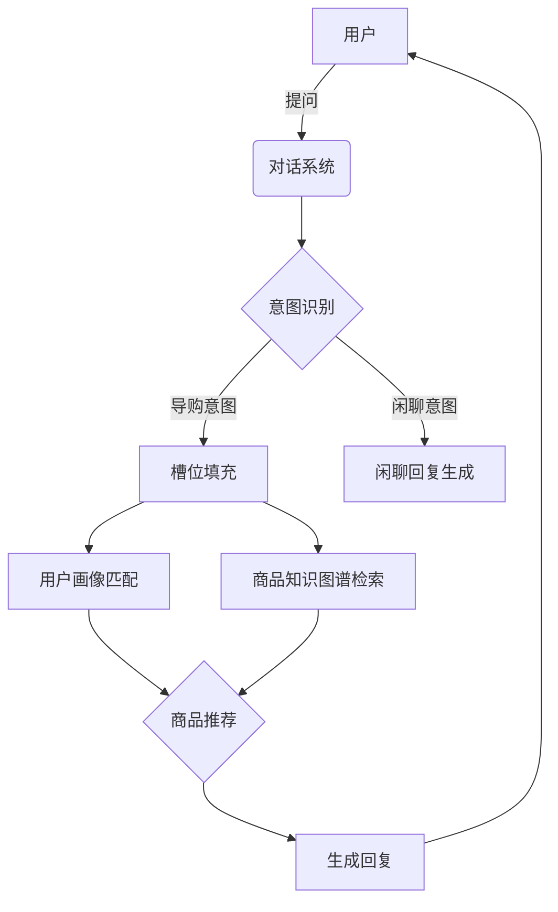

# 智能导购Agent的在线实验与算法评估

作者：禅与计算机程序设计艺术

## 1.背景介绍

### 1.1 电商平台的发展现状
#### 1.1.1 电商平台的快速增长
#### 1.1.2 用户需求的多样化
#### 1.1.3 传统推荐系统的局限性

### 1.2 智能导购Agent的出现
#### 1.2.1 智能导购Agent的定义
#### 1.2.2 智能导购Agent的优势
#### 1.2.3 智能导购Agent的发展历程

### 1.3 本文的研究目的与意义
#### 1.3.1 探索智能导购Agent的实验方法
#### 1.3.2 评估智能导购Agent的算法性能
#### 1.3.3 为智能导购Agent的应用提供参考

## 2.核心概念与联系

### 2.1 智能导购Agent的核心概念
#### 2.1.1 用户画像
#### 2.1.2 商品知识图谱
#### 2.1.3 对话系统

### 2.2 相关技术概念
#### 2.2.1 自然语言处理(NLP)
#### 2.2.2 知识表示与推理
#### 2.2.3 强化学习

### 2.3 核心概念之间的联系
#### 2.3.1 用户画像与商品知识图谱的融合
#### 2.3.2 对话系统与NLP技术的结合
#### 2.3.3 强化学习在智能导购中的应用

## 3.核心算法原理具体操作步骤

### 3.1 用户画像构建
#### 3.1.1 用户行为数据收集
#### 3.1.2 用户特征提取
#### 3.1.3 用户聚类与分类

### 3.2 商品知识图谱构建 
#### 3.2.1 商品属性提取
#### 3.2.2 商品关系挖掘
#### 3.2.3 知识图谱存储与查询

### 3.3 对话系统设计
#### 3.3.1 意图识别
#### 3.3.2 槽位填充
#### 3.3.3 对话策略学习

### 3.4 算法流程图


## 4.数学模型和公式详细讲解举例说明

### 4.1 用户画像的向量表示
用户$u$可以表示为一个$n$维向量:
$$
u = (w_1, w_2, ..., w_n)
$$
其中$w_i$表示用户在第$i$个特征上的权重。

### 4.2 商品相似度计算
可以使用余弦相似度来计算两个商品$p_1$和$p_2$之间的相似度:
$$
\text{sim}(p_1, p_2) = \frac{p_1 \cdot p_2}{||p_1|| \times ||p_2||}
$$

### 4.3 强化学习中的Q-learning
Q-learning是一种常用的强化学习算法,用于学习对话策略。Q值的更新公式为:
$$
Q(s,a) \leftarrow Q(s,a) + \alpha [r + \gamma \max_{a'} Q(s',a') - Q(s,a)]
$$
其中$s$为当前状态,$a$为当前动作,$r$为奖励值,$\alpha$为学习率,$\gamma$为折扣因子。

## 5.项目实践：代码实例和详细解释说明

### 5.1 用户画像构建示例代码
```python
from sklearn.cluster import KMeans

# 用户特征数据
user_features = [
    [0.2, 0.1, 0.3], 
    [0.5, 0.4, 0.6],
    [0.8, 0.9, 0.7]
]

# 使用K-means进行用户聚类
kmeans = KMeans(n_clusters=2).fit(user_features)
labels = kmeans.labels_

print(labels) # 输出:[0 1 1]
```
上述代码使用K-means算法对用户进行聚类,将相似的用户划分到同一个类别中。

### 5.2 商品知识图谱构建示例代码
```python
import networkx as nx

# 创建知识图谱
G = nx.Graph()

# 添加商品节点
G.add_node("商品A", type="商品", price=100)
G.add_node("商品B", type="商品", price=200)

# 添加属性节点和关系边
G.add_node("品牌X", type="品牌")
G.add_edge("商品A", "品牌X", relation="所属品牌")
G.add_edge("商品B", "品牌X", relation="所属品牌")

# 查询商品A的所属品牌
brands = [n for n in G.neighbors("商品A") if G.nodes[n]["type"] == "品牌"]
print(brands) # 输出: ['品牌X']
```
上述代码使用NetworkX库构建了一个简单的商品知识图谱,并演示了如何查询商品的属性信息。

### 5.3 对话系统中的意图识别示例代码
```python
from rasa_nlu.training_data import load_data
from rasa_nlu.config import RasaNLUModelConfig
from rasa_nlu.model import Trainer

# 加载训练数据
training_data = load_data("training_data.json")

# 配置NLU管道
config = RasaNLUModelConfig({"pipeline": "supervised_embeddings"})

# 训练NLU模型
trainer = Trainer(config)
interpreter = trainer.train(training_data)

# 测试意图识别
message = "我想买一部苹果手机"
result = interpreter.parse(message)
print(result["intent"]["name"]) # 输出: 购买意图
```
上述代码使用Rasa NLU框架训练了一个意图识别模型,并演示了如何使用训练好的模型进行意图识别。

## 6.实际应用场景

### 6.1 电商平台中的智能客服
智能导购Agent可以应用于电商平台的客服系统中,通过与用户进行自然语言交互,理解用户需求,提供个性化的商品推荐和导购服务。

### 6.2 社交电商中的智能助手
在社交电商场景下,智能导购Agent可以作为用户的智能助手,根据用户的社交行为和偏好,主动推荐合适的商品,提升用户体验。

### 6.3 跨境电商中的多语言导购
智能导购Agent可以支持多种语言,为跨境电商提供个性化的导购服务,帮助用户跨越语言障碍,找到心仪的商品。

## 7.工具和资源推荐

### 7.1 自然语言处理工具
- NLTK: 自然语言处理工具包
- spaCy: 工业级自然语言处理库
- Gensim: 主题模型和词向量工具

### 7.2 知识图谱构建工具
- Neo4j: 图数据库
- Apache Jena: 语义网框架
- OpenKE: 知识图谱嵌入工具

### 7.3 对话系统开发框架
- Rasa: 开源对话系统开发框架
- DialogFlow: Google提供的对话系统开发平台
- Microsoft Bot Framework: 微软提供的聊天机器人开发框架

## 8.总结：未来发展趋势与挑战

### 8.1 个性化与用户体验的提升
未来智能导购Agent将更加注重个性化和用户体验,通过更精准的用户理解和推荐算法,提供更加贴心和人性化的导购服务。

### 8.2 多模态交互的支持
智能导购Agent将支持多种交互方式,如语音、图像、视频等,提供更加自然和便捷的导购体验。

### 8.3 知识的自动化学习与更新
智能导购Agent将具备持续学习和自我更新的能力,通过自动化的知识获取和学习,不断扩充和优化自身的知识库。

### 8.4 算法的可解释性与可信赖性
如何提高智能导购Agent算法的可解释性和可信赖性,增强用户对系统的信任,是未来需要重点关注的问题。

## 9.附录：常见问题与解答

### 9.1 智能导购Agent与传统推荐系统有何区别？
智能导购Agent基于自然语言交互,能够主动理解用户需求,提供更加个性化和交互式的导购体验,而传统推荐系统主要基于用户的历史行为数据进行被动推荐。

### 9.2 如何评估智能导购Agent的效果？
可以通过用户满意度、转化率、交互轮次等指标来评估智能导购Agent的效果。同时,也可以通过A/B测试等方式,比较智能导购Agent与传统推荐系统的效果差异。

### 9.3 智能导购Agent如何保障用户隐私安全？
智能导购Agent需要遵循严格的数据隐私保护规范,采用数据脱敏、加密等技术手段,确保用户个人信息的安全。同时,也要为用户提供隐私设置和控制的选项,尊重用户的隐私权。