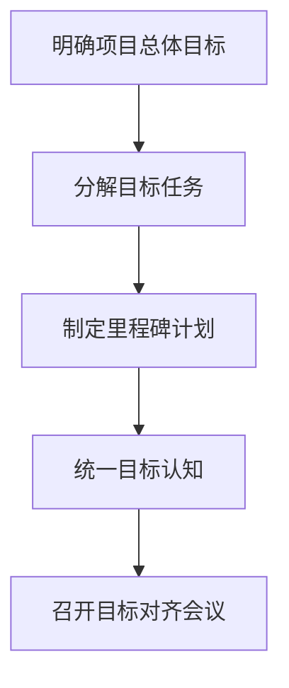
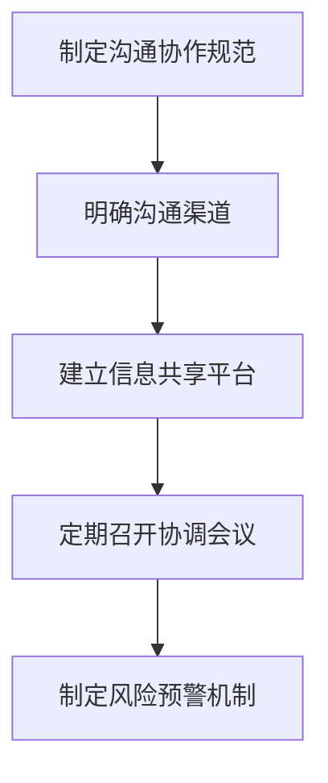
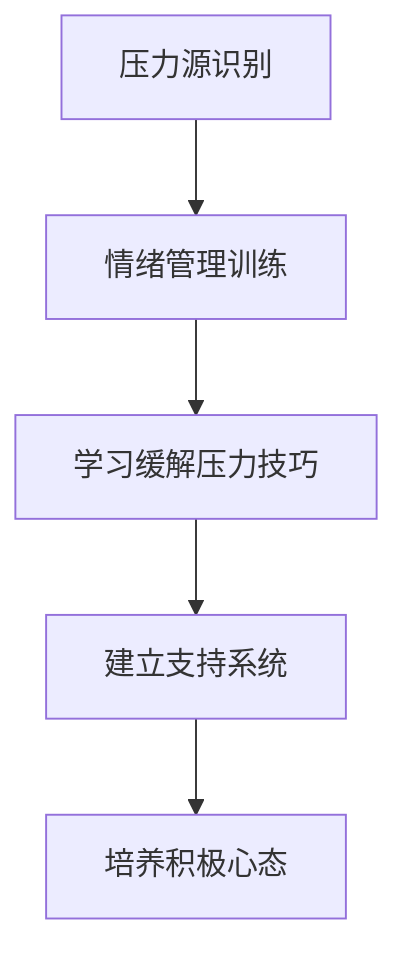
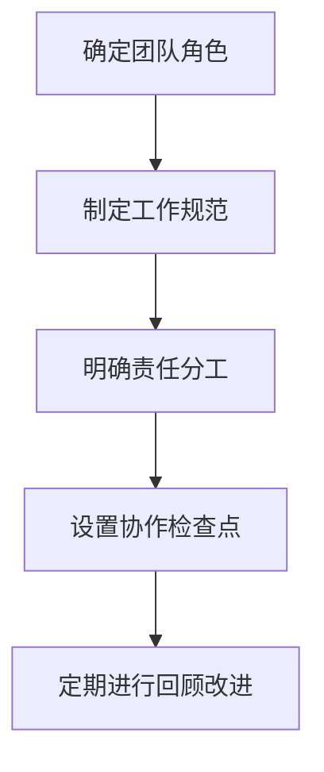

# 跨团队沟通协作能力和抗压能力培养

## 1.背景介绍

### 1.1 为什么需要培养跨团队沟通协作和抗压能力

在当今快节奏的商业环境中,项目越来越复杂,需要多个团队紧密协作才能完成。跨团队协作已经成为常态,但由于团队文化差异、沟通障碍等原因,往往会遇到诸多挑战。同时,项目进度变化、需求变更等不确定因素也给团队成员带来巨大压力。因此,培养跨团队沟通协作和抗压能力对确保项目顺利进行至关重要。

### 1.2 跨团队协作和抗压能力的重要性

- 提高工作效率:高效的跨团队协作能减少重复工作,加快项目进度。
- 提升产品质量:多团队的专业知识融合有助于发现潜在问题,提升产品质量。
- 增强抗风险能力:良好的抗压能力有助于团队冷静应对突发情况,降低风险。
- 促进创新思维:跨团队交流有助于激发新思路,推动创新。

## 2.核心概念与联系

### 2.1 跨团队沟通协作

跨团队沟通协作指不同团队之间为实现共同目标而进行的信息交流、资源共享和工作协调。它包括以下关键要素:

- 统一目标认知
- 明确分工和职责
- 规范的沟通渠道
- 高效的信息共享机制
- 定期的工作协调与评估

### 2.2 抗压能力

抗压能力是指个人在面临压力时,保持心理平衡,合理应对,并将压力转化为动力的能力。它主要包括:

- 情绪管理能力
- 压力识别和评估能力
- 积极应对压力的策略
- 自我调节和恢复能力

### 2.3 两者的关联

跨团队协作和抗压能力密切相关,相互影响:

- 高效的团队协作能减少沟通障碍和工作冲突,降低工作压力
- 良好的抗压能力有助于团队成员冷静应对协作中的分歧和挑战
- 培养两种能力有助于提高团队凝聚力和工作效率

## 3.核心算法原理具体操作步骤

### 3.1 构建统一的目标认知



1. 明确项目总体目标,并分解为可衡量的任务和里程碑
2. 制定详细的里程碑计划,包括时间节点、交付物等
3. 召开跨团队目标对齐会议,确保所有成员对目标及计划有统一认知

### 3.2 建立规范的沟通协作机制



1. 制定统一的沟通协作规范,如会议纪要模板、信息发布流程等
2. 明确各种沟通渠道及使用场景,如即时通讯、邮件、会议等
3. 建立集中的信息共享平台,如项目管理工具、知识库等
4. 定期召开协调会议,评估进展,解决问题,并及时调整计划
5. 制定风险预警机制,提前发现并处理潜在风险

### 3.3 培养个人抗压能力



1. 识别工作和生活中的压力源,如工作量过大、人际关系等
2. 接受情绪管理训练,学习调节负面情绪的方法
3. 学习缓解压力的技巧,如正念冥想、运动、兴趣爱好等
4. 建立良好的社交支持系统,如家人、朋友、心理咨询等
5. 培养积极乐观的心态,转变压力为动力

### 3.4 优化团队协作流程



1. 明确每个团队及成员的角色定位
2. 制定统一的工作规范和流程,如代码评审、发版流程等
3. 根据工作规范,明确每个角色的职责分工
4. 设置协作检查点,如代码冻结、测试通过等,确保工作同步
5. 定期对协作流程进行回顾,持续优化改进

## 4.数学模型和公式详细讲解举例说明

在团队协作和抗压管理中,我们可以借助一些数学模型和公式来量化分析、优化决策。

### 4.1 工作量估算模型

在项目计划阶段,我们需要对工作量进行合理估算,作为制定计划和分配资源的依据。常用的估算模型有:

1. **专家估算法**

$$
E = \frac{1}{n}\sum_{i=1}^{n}E_i
$$

其中,$E$为最终估算值,$E_i$为第$i$个专家的估算值,$n$为专家人数。

2. **三点估算法**

$$
E = \frac{O + 4M + P}{6}
$$

其中,$O$为乐观估算值,$M$为最可能估算值,$P$为悲观估算值。

3. **PERT模型**

$$
E = \frac{O + 4M + P}{6}, \quad D = \frac{P - O}{6}
$$

其中,$E$为工作量期望值,$D$为工作量标准差,$O$、$M$、$P$同上。

这些模型能够综合考虑不确定因素,给出更加合理的估算结果。

### 4.2 压力评估模型

压力评估对于制定应对策略至关重要。常用的压力评估模型有:

1. **Lazarus压力评估模型**

$$
S = \frac{D}{R}
$$

其中,$S$为压力水平,$D$为压力源的严重程度,$R$为应对资源水平。

2. **斯特劳斯-肯恩压力评估模型**

$$
S = \frac{\sum_{i=1}^{n}w_iD_i}{\sum_{j=1}^{m}w_jR_j}
$$

其中,$S$为压力水平,$D_i$为第$i$个压力源的严重程度,$w_i$为其权重,$R_j$为第$j$种应对资源的水平,$w_j$为其权重。

这些模型能够量化压力水平,为后续的应对策略提供依据。

### 4.3 团队协作效率模型

为评估和优化团队协作效率,我们可以借助一些数学模型:

1. **Tuckman团队发展模型**

$$
P = f(T)
$$

其中,$P$为团队绩效,$T$为团队发展阶段,包括形成、摸索、规范、运作和解体五个阶段。该模型指出,不同阶段团队绩效存在差异。

2. **Steiner公式**

$$
\begin{aligned}
APE &= PPE - PL \\
PL &= \frac{fa^2}{n} + \frac{(1-a)^2}{n(n-1)}
\end{aligned}
$$

其中,$APE$为实际团队绩效,$PPE$为潜在团队绩效,$PL$为过程损失,$f$为任务的等值性,$a$为任务的可分性,$n$为团队人数。该公式揭示了影响团队效率的关键因素。

利用这些模型,我们可以评估当前团队协作效率,并据此优化团队结构、任务分配等,提高团队绩效。

## 5.项目实践:代码实例和详细解释说明

为了帮助读者更好地理解和实践跨团队协作和抗压管理,这里提供了一个基于Python的示例项目。该项目模拟了一个软件开发项目的跨团队协作流程,并集成了一些压力管理功能。

### 5.1 项目结构

```
project/
├── teams/
│   ├── dev_team.py
│   ├── qa_team.py
│   └── ops_team.py
├── collaboration/
│   ├── communication.py
│   ├── coordination.py
│   └── metrics.py
├── stress_management/
│   ├── assessment.py
│   ├── coping.py
│   └── support.py
├── main.py
└── README.md
```

- `teams/`目录包含模拟不同团队的代码
- `collaboration/`目录包含协作相关的功能模块
- `stress_management/`目录包含压力管理相关的功能模块
- `main.py`是程序入口
- `README.md`是项目说明文件

### 5.2 协作流程

以下是模拟的软件开发协作流程:

```python
# main.py
from teams import dev_team, qa_team, ops_team
from collaboration import communication, coordination, metrics

# 1. 开发团队开发新功能
feature = dev_team.develop_feature()

# 2. 通过即时通讯工具共享开发进展
communication.share_progress(feature)

# 3. 质量保证团队进行测试
test_report = qa_team.test_feature(feature)

# 4. 召开协调会议讨论测试报告
issues = coordination.discuss_report(test_report)

# 5. 开发团队根据反馈修复问题
fixed_feature = dev_team.fix_issues(feature, issues)

# 6. 质量保证团队再次测试
test_report = qa_team.test_feature(fixed_feature)

# 7. 计算协作指标并输出报告
metrics.calculate_collaboration_metrics(test_report)

# 8. 运维团队部署上线
ops_team.deploy(fixed_feature)
```

在这个流程中,开发、测试和运维团队通过规范的沟通渠道(如即时通讯工具)、协调会议等方式紧密协作,共同完成新功能的开发、测试和上线。同时,我们还集成了协作指标的计算和输出,用于持续改进协作流程。

### 5.3 压力管理

为了帮助团队成员更好地管理工作压力,我们在`stress_management`模块中集成了以下功能:

```python
# stress_management/assessment.py
def assess_stress_level(stressors):
    """使用Lazarus压力评估模型评估压力水平"""
    ...

# stress_management/coping.py  
def recommend_coping_strategies(stress_level):
    """根据压力水平推荐应对策略,如正念冥想、运动等"""
    ...

# stress_management/support.py
def provide_support_resources():
    """提供社交支持资源,如心理咨询热线、员工助手计划等"""
    ...
```

在协作流程的关键节点,我们可以调用这些功能,帮助团队成员评估压力水平、获取应对建议和支持资源。例如:

```python
# 在协调会议前评估压力水平
from stress_management import assessment, coping

stressors = communication.collect_stressors()
stress_level = assessment.assess_stress_level(stressors)
strategies = coping.recommend_coping_strategies(stress_level)

print("压力水平:", stress_level)
print("推荐应对策略:", strategies)
```

通过将压力管理功能集成到协作流程中,我们可以更好地关注团队成员的身心健康,提高团队的抗压能力和协作效率。

## 6.实际应用场景

跨团队协作和抗压管理在现实中有广泛的应用场景,包括但不限于:

1. **软件开发**: 软件开发项目通常需要设计、开发、测试、运维等多个团队紧密协作,良好的协作机制和抗压能力对确保项目质量和进度至关重要。

2. **产品研发**: 新产品的研发往往需要市场、设计、工程、供应链等多个部门通力合作,高效的跨团队协作有助于加快研发速度,提高产品质量。

3. **咨询服务**: 咨询公司的项目团队通常需要与客户、合作伙伴等多方密切配合,培养出色的沟通协作和抗压能力是关键。

4. **营销活动**: 大型营销活动需要市场、创意、执行、数据等团队通力合作,良好的协作氛围和压力管理有助于活动的顺利开展。

5. **学术研究**: 跨学科的