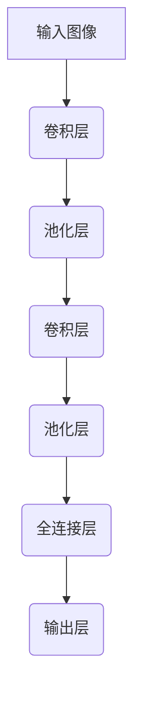

# AI人工智能深度学习算法：在图像识别的应用

## 1.背景介绍

### 1.1 图像识别的重要性

在当今数字时代,图像数据无处不在。从社交媒体上的个人照片,到医疗影像诊断,再到自动驾驶汽车的环境感知,图像识别技术都扮演着关键角色。准确高效的图像识别能力不仅能为人类生活带来诸多便利,更是推动人工智能技术发展的重要驱动力。

### 1.2 传统图像识别方法的局限性  

早期的图像识别方法主要基于手工设计的特征提取和分类器,如SIFT、HOG等经典算法。这些方法需要大量的领域知识和人工参与,且往往只能处理特定类型的图像,泛化能力有限。随着数据量的激增和问题复杂度的提高,传统方法在准确率和效率方面已经难以满足实际需求。

### 1.3 深度学习的兴起

深度学习作为一种有效的机器学习方法,凭借其强大的模型表达能力和端到端的训练方式,在计算机视觉领域取得了革命性的突破。卷积神经网络(CNN)等深度学习模型能够自动从大量数据中学习特征表示,极大提高了图像识别的准确率和泛化能力。

## 2.核心概念与联系

### 2.1 卷积神经网络(CNN)

卷积神经网络是深度学习在计算机视觉领域的核心模型,它的设计灵感来源于生物视觉系统的神经网络结构。CNN由多个卷积层、池化层和全连接层组成,能够自动学习图像的层次特征表示。



### 2.2 卷积运算

卷积运算是CNN的基础操作,它通过在输入特征图上滑动卷积核,提取局部特征并形成新的特征图。卷积层能够有效捕获图像的局部模式,如边缘、纹理等低级特征。

### 2.3 池化层

池化层通常在卷积层之后,对特征图进行下采样操作,减小数据量并提取局部不变性特征。常用的池化操作有最大池化和平均池化。池化层有助于提高模型的泛化能力和鲁棒性。

### 2.4 全连接层

全连接层位于CNN的最后几层,将前面卷积层和池化层提取的高级特征进行整合,并输出分类结果或其他任务的预测值。全连接层类似于传统的人工神经网络。

## 3.核心算法原理具体操作步骤  

### 3.1 前向传播

前向传播是CNN进行图像识别的核心步骤,包括以下具体操作:

1. 输入图像经过预处理(如归一化)后送入CNN的第一层;
2. 在第一个卷积层,卷积核在输入特征图上滑动,通过卷积运算提取局部特征,形成新的特征图;
3. 新的特征图经过激活函数(如ReLU)的非线性变换,增强特征表达能力;
4. 特征图进入池化层,通过最大池化或平均池化操作,降低分辨率并提取局部不变性特征;
5. 重复上述卷积、激活和池化操作,在高层次提取更加抽象和语义的特征表示;
6. 最后一层通常为全连接层,将前面层的特征整合并输出分类结果或其他预测值。

### 3.2 反向传播

在监督学习中,CNN的参数(卷积核权重和偏置项)通过反向传播算法和优化方法(如随机梯度下降)进行学习:

1. 计算输出层的损失函数,如交叉熵损失函数;
2. 利用链式法则,计算损失函数相对于每层参数的梯度;
3. 根据梯度的方向,更新每层的卷积核权重和偏置项;
4. 重复上述过程,不断优化CNN的参数,使得模型在训练数据上的损失函数值最小化。

在实际应用中,还需要注意诸如正则化、数据增强、学习率调度等技巧,以提高模型的泛化能力和收敛速度。

## 4.数学模型和公式详细讲解举例说明

### 4.1 卷积运算

卷积运算是CNN中最基础和最关键的操作,它的数学表达式如下:

$$
(I * K)(i,j) = \sum_{m}\sum_{n}I(i+m,j+n)K(m,n)
$$

其中,$I$表示输入特征图,$K$表示卷积核,$(i,j)$是输出特征图的坐标。卷积运算实际上是在输入特征图上滑动卷积核,对每个位置进行点乘和累加操作,得到输出特征图的一个元素值。

例如,假设输入特征图$I$的大小为$5\times 5$,卷积核$K$的大小为$3\times 3$,填充(padding)为1,步长(stride)为1,则输出特征图$O$的大小为$5\times 5$。具体计算过程如下:

```
I = [1 0 2 1 0
     0 1 0 2 1
     2 0 3 0 1
     1 2 0 0 2
     0 1 1 1 0]

K = [1 0 1
     2 1 0
     0 1 1]
     
O(0,0) = 1*1 + 0*2 + 2*0 + 0*0 + 1*1 + 0*2 + 0*0 + 2*0 + 1*1 = 4
O(0,1) = ...
```

通过上述卷积运算,CNN能够自动学习输入图像的局部特征,如边缘、纹理等,并在高层次上组合形成更加抽象和语义化的特征表示。

### 4.2 池化操作

池化操作的主要目的是降低特征图的分辨率,减少参数数量,提高模型的计算效率。最大池化和平均池化是两种常用的池化方式,数学表达式分别为:

最大池化:
$$
y_{i,j} = \max\limits_{(m,n)\in R_{i,j}}x_{m,n}
$$

平均池化:
$$
y_{i,j} = \frac{1}{|R_{i,j}|}\sum\limits_{(m,n)\in R_{i,j}}x_{m,n}
$$

其中,$x$表示输入特征图,$y$表示输出特征图,$R_{i,j}$表示以$(i,j)$为中心的池化区域。

例如,对于一个$4\times 4$的输入特征图,采用$2\times 2$的最大池化,步长为2,则输出特征图的大小为$2\times 2$,计算过程如下:

```
x = [1 3 2 4
     5 6 1 2
     7 8 3 1
     4 2 6 5]
     
y(0,0) = max(1, 3, 5, 6) = 6
y(0,1) = max(2, 4, 1, 2) = 4
y(1,0) = max(7, 8, 4, 2) = 8
y(1,1) = max(3, 1, 6, 5) = 6
```

通过池化操作,CNN能够获得对平移、缩放等变换的鲁棒性,提高模型的泛化能力。

### 4.3 全连接层

全连接层的作用是将前面卷积层和池化层提取的高级特征进行整合,并输出分类结果或其他预测值。全连接层的数学表达式如下:

$$
y = f(Wx+b)
$$

其中,$x$表示输入特征向量,$W$表示权重矩阵,$b$表示偏置向量,$f$表示激活函数(如Sigmoid、ReLU等)。

例如,假设输入特征向量$x$的维度为$1000$,全连接层的输出维度为$10$(对应10个分类类别),则权重矩阵$W$的大小为$10\times 1000$,偏置向量$b$的大小为$10\times 1$。通过矩阵乘法和激活函数变换,全连接层将高维特征映射到低维输出空间,得到分类结果或回归值。

## 5.项目实践:代码实例和详细解释说明

为了更好地理解CNN在图像识别任务中的应用,我们以MNIST手写数字识别为例,使用PyTorch框架实现一个简单的CNN模型。完整代码如下:

```python
import torch
import torch.nn as nn
import torchvision
import torchvision.transforms as transforms

# 定义CNN模型
class CNN(nn.Module):
    def __init__(self):
        super(CNN, self).__init__()
        self.conv1 = nn.Conv2d(1, 10, kernel_size=5)
        self.conv2 = nn.Conv2d(10, 20, kernel_size=5)
        self.pool = nn.MaxPool2d(2, 2)
        self.fc1 = nn.Linear(320, 50)
        self.fc2 = nn.Linear(50, 10)

    def forward(self, x):
        x = self.pool(nn.functional.relu(self.conv1(x)))
        x = self.pool(nn.functional.relu(self.conv2(x)))
        x = x.view(-1, 320)
        x = nn.functional.relu(self.fc1(x))
        x = self.fc2(x)
        return x

# 加载MNIST数据集
train_dataset = torchvision.datasets.MNIST(root='./data', train=True, transform=transforms.ToTensor(), download=True)
test_dataset = torchvision.datasets.MNIST(root='./data', train=False, transform=transforms.ToTensor())

# 定义数据加载器
train_loader = torch.utils.data.DataLoader(dataset=train_dataset, batch_size=100, shuffle=True)
test_loader = torch.utils.data.DataLoader(dataset=test_dataset, batch_size=100, shuffle=False)

# 实例化模型
model = CNN()

# 定义损失函数和优化器
criterion = nn.CrossEntropyLoss()
optimizer = torch.optim.SGD(model.parameters(), lr=0.01)

# 训练模型
num_epochs = 5
for epoch in range(num_epochs):
    for i, (images, labels) in enumerate(train_loader):
        outputs = model(images)
        loss = criterion(outputs, labels)
        
        optimizer.zero_grad()
        loss.backward()
        optimizer.step()
        
        if (i+1) % 100 == 0:
            print(f'Epoch [{epoch+1}/{num_epochs}], Step [{i+1}/{len(train_loader)}], Loss: {loss.item():.4f}')

# 测试模型
correct = 0
total = 0
with torch.no_grad():
    for images, labels in test_loader:
        outputs = model(images)
        _, predicted = torch.max(outputs.data, 1)
        total += labels.size(0)
        correct += (predicted == labels).sum().item()

print(f'Accuracy on test set: {100 * correct / total}%')
```

上述代码实现了一个简单的CNN模型,包含两个卷积层、两个池化层和两个全连接层。我们逐步解释代码的各个部分:

1. 定义CNN模型类,继承自PyTorch的`nn.Module`。在`__init__`方法中,定义了两个卷积层(`nn.Conv2d`)、一个最大池化层(`nn.MaxPool2d`)和两个全连接层(`nn.Linear`)。

2. `forward`方法定义了模型的前向传播过程,包括卷积、激活(ReLU)、池化和全连接操作。

3. 加载MNIST数据集,并使用`torchvision.transforms.ToTensor()`将图像数据转换为PyTorch的Tensor格式。

4. 定义数据加载器(`DataLoader`),用于迭代读取批次数据。

5. 实例化CNN模型,定义交叉熵损失函数(`nn.CrossEntropyLoss`)和随机梯度下降优化器(`torch.optim.SGD`)。

6. 训练模型,遍历训练数据集,计算损失函数,执行反向传播和参数更新。

7. 在测试集上评估模型的准确率。

通过上述代码示例,我们可以清晰地看到CNN模型的构建过程,以及如何使用PyTorch框架进行训练和测试。在实际应用中,我们还可以尝试更深更复杂的CNN架构、不同的优化算法、数据增强技术等,以进一步提高模型的性能。

## 6.实际应用场景

CNN在图像识别领域有着广泛的应用,包括但不限于以下几个方面:

### 6.1 图像分类

图像分类是CNN最典型的应用场景,如识别图像中的物体、场景、人物等。在计算机视觉竞赛ImageNet上,CNN模型已经超越了人类的识别水平。图像分类在自动驾驶、