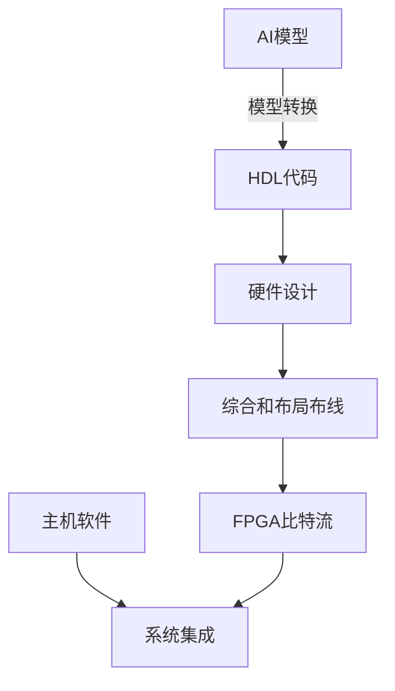

# AI模型部署到FPGA原理与代码实战案例讲解

## 1. 背景介绍

### 1.1 AI模型的重要性

在当今时代,人工智能(AI)已经渗透到我们生活的方方面面。从语音助手到自动驾驶汽车,从推荐系统到医疗诊断,AI技术正在彻底改变着我们的生活方式。作为AI应用的核心,AI模型扮演着至关重要的角色。

### 1.2 AI模型部署的挑战

尽管AI模型展现出了巨大的潜力,但将其高效部署到实际应用场景中仍然面临着诸多挑战。传统的CPU和GPU并不是专门为AI工作负载而设计的,因此在处理复杂的AI模型时,它们的性能和能效往往不尽如人意。

### 1.3 FPGA的优势

在这种背景下,现场可编程门阵列(FPGA)凭借其可重构的硬件架构、高度并行性和低功耗特性,成为了部署AI模型的理想选择。FPGA可以针对特定的AI算法进行硬件加速,从而实现比CPU和GPU更高的性能和更好的能效。

## 2. 核心概念与联系

### 2.1 FPGA架构概述

FPGA是一种可编程逻辑器件,由可编程逻辑块(CLB)、可编程互连资源和I/O块组成。CLB是FPGA的基本逻辑单元,可以实现各种组合逻辑和简单的序列逻辑功能。通过编程,CLB之间可以通过可编程互连资源进行任意互连,从而实现复杂的逻辑功能。

### 2.2 FPGA硬件加速原理

FPGA硬件加速的核心思想是将AI算法映射到FPGA的硬件逻辑资源上,利用FPGA的并行处理能力和可重构性,实现高效的计算加速。具体来说,需要将AI模型转换为硬件描述语言(HDL)代码,然后综合、布局布线和编程到FPGA器件中。

### 2.3 FPGA与AI模型的联系

不同的AI模型具有不同的计算特征,因此需要针对性地设计FPGA加速器架构。例如,卷积神经网络(CNN)模型需要大量的矩阵乘法运算,因此FPGA加速器需要包含高效的矩阵乘法单元。而递归神经网络(RNN)模型则需要处理序列数据,因此FPGA加速器需要支持有效的数据流水线。

## 3. 核心算法原理具体操作步骤

### 3.1 AI模型到FPGA的流程概览

将AI模型部署到FPGA通常包括以下几个主要步骤:

1. **模型转换**: 将训练好的AI模型(如TensorFlow或PyTorch模型)转换为FPGA可以理解的格式,通常是硬件描述语言(HDL)代码。
2. **硬件设计**: 根据AI模型的计算特征,设计FPGA加速器的硬件架构,包括计算单元、存储单元和数据流水线等。
3. **综合和布局布线**: 将HDL代码综合为门级网表,并进行布局布线,生成可编程到FPGA器件的比特流文件。
4. **软件开发**: 开发运行在CPU/GPU上的主机代码,用于控制FPGA加速器和进行数据传输。
5. **系统集成**: 将FPGA加速卡与主机系统集成,并进行系统级测试和优化。



### 3.2 模型转换

模型转换是将训练好的AI模型转换为FPGA可以理解的格式的过程。常见的方法包括:

1. **手动转换**: 直接将AI模型的数学公式转换为HDL代码,这种方式灵活性高,但工作量大。
2. **自动转换工具**: 使用专门的模型转换工具,如Xilinx AI Engine或Intel OpenVINO,可以自动将常见的AI框架模型(如TensorFlow、PyTorch等)转换为HDL代码。

无论采用哪种方式,转换后的HDL代码需要经过综合和布局布线,才能生成可编程到FPGA器件的比特流文件。

### 3.3 硬件设计

硬件设计是根据AI模型的计算特征,设计FPGA加速器的硬件架构。常见的硬件设计技术包括:

1. **计算单元设计**: 根据AI模型的计算操作(如矩阵乘法、卷积等),设计高效的计算单元。
2. **存储单元设计**: 设计适当的存储单元(如BRAM、URAM等),用于存储模型参数和中间计算结果。
3. **数据流水线设计**: 设计高效的数据流水线,实现计算单元和存储单元之间的高带宽数据传输。
4. **任务级并行设计**: 根据FPGA资源情况,实现多个AI模型任务的并行执行。

硬件设计需要权衡资源利用率、性能和功耗等因素,以实现最优的FPGA加速效果。

## 4. 数学模型和公式详细讲解举例说明

### 4.1 卷积神经网络(CNN)

卷积神经网络是深度学习中最广泛使用的一种模型,在图像识别、目标检测等任务中表现出色。CNN的核心操作是卷积运算,可以用下式表示:

$$
y_{i,j} = \sum_{m,n} x_{m,n} \cdot w_{i-m,j-n}
$$

其中,$$x$$是输入特征图,$$w$$是卷积核权重,$$y$$是输出特征图。

在FPGA上实现CNN加速器时,通常会设计高效的卷积计算单元,利用FPGA的并行性来加速卷积运算。同时,还需要设计合适的存储单元和数据流水线,以支持大规模的卷积运算。

### 4.2 递归神经网络(RNN)

递归神经网络擅长处理序列数据,在自然语言处理、时间序列预测等任务中有广泛应用。RNN的核心公式如下:

$$
h_t = f(h_{t-1}, x_t)
$$

其中,$$h_t$$是时刻$$t$$的隐藏状态,$$x_t$$是时刻$$t$$的输入,$$f$$是非线性激活函数。

在FPGA上实现RNN加速器时,需要设计支持有效数据流水线的硬件架构,以处理序列数据。同时,还需要考虑隐藏状态的存储和复用,以提高计算效率。

### 4.3 其他AI模型

除了CNN和RNN,还有许多其他类型的AI模型,如生成对抗网络(GAN)、变分自编码器(VAE)等。这些模型的数学原理和计算特征各不相同,因此在FPGA上实现加速器时,需要针对性地设计硬件架构。

无论是何种AI模型,数学公式都是理解和优化算法的关键。通过深入分析模型的数学原理,我们可以更好地设计FPGA加速器,实现高效的硬件加速。

## 5. 项目实践:代码实例和详细解释说明

在本节,我们将通过一个实际的FPGA加速器设计项目,展示如何将AI模型部署到FPGA上。我们将使用Xilinx Vitis AI工具链,并以LeNet-5 CNN模型为例进行说明。

### 5.1 LeNet-5 CNN模型

LeNet-5是一种经典的卷积神经网络模型,广泛用于手写数字识别任务。它包含以下几个主要层:

1. 卷积层1 (Conv1): 6个5x5卷积核
2. 池化层1 (Pool1): 2x2最大池化
3. 卷积层2 (Conv2): 16个5x5卷积核
4. 池化层2 (Pool2): 2x2最大池化
5. 全连接层1 (FC1): 120个神经元
6. 全连接层2 (FC2): 84个神经元
7. 输出层 (Output): 10个神经元(对应0-9数字)

### 5.2 模型转换

我们使用Vitis AI提供的AI模型转换工具`vai_c_xfer`将LeNet-5模型从TensorFlow格式转换为Xilinx Deep Neural Network (XDNN)格式。

```bash
vai_c_xfer -m /path/to/lenet5.pb -o /path/to/lenet5.xmodel -k lenet5 -D /path/to/data/
```

转换后的`lenet5.xmodel`文件包含了LeNet-5模型的权重和结构信息,可以被FPGA加速器直接使用。

### 5.3 硬件设计

接下来,我们使用Vitis AI提供的IP核和设计工具,设计LeNet-5的FPGA加速器硬件架构。

```verilog
module lenet5_acc (
    input clk,
    input rst,
    // Input data interface
    input [31:0] in_data,
    input in_data_valid,
    output in_data_ready,
    // Output data interface
    output [31:0] out_data,
    output out_data_valid,
    input out_data_ready
);

// Instantiate XDNN IP core
xdnn_top #(
    .C_MODE(0),
    .C_MODEL_FILE("lenet5.xmodel")
) xdnn_inst (
    .clk(clk),
    .rst(rst),
    .in_data(in_data),
    .in_data_valid(in_data_valid),
    .in_data_ready(in_data_ready),
    .out_data(out_data),
    .out_data_valid(out_data_valid),
    .out_data_ready(out_data_ready)
);

endmodule
```

在这个示例中,我们实例化了Vitis AI提供的`xdnn_top`IP核,并将LeNet-5模型文件`lenet5.xmodel`作为参数传递给它。`xdnn_top`IP核包含了LeNet-5模型的硬件实现,包括卷积计算单元、池化单元、全连接单元等。

### 5.4 软件开发

为了控制FPGA加速器并进行数据传输,我们需要开发运行在主机CPU上的软件。我们可以使用Vitis AI提供的API和示例代码。

```cpp
#include <vitis/ai/library/tensor.hpp>
#include <vitis/ai/env_runner.hpp>

int main() {
    // Initialize Vitis AI runtime
    vitis::ai::env_runner runner;

    // Load LeNet-5 model
    auto lenet5 = vitis::ai::Library::instance().get_kernel("lenet5");

    // Prepare input data
    std::vector<vitis::ai::library::InputTensor> input_tensors;
    input_tensors.emplace_back(lenet5->get_input_tensor(0));
    // Fill input data...

    // Run inference on FPGA
    auto result = lenet5->run(input_tensors);

    // Process output data
    auto output_tensor = result.at(0);
    // Process output data...

    return 0;
}
```

在这个示例中,我们使用Vitis AI提供的C++ API加载LeNet-5模型,准备输入数据,在FPGA上运行推理,并处理输出结果。

### 5.5 系统集成

最后,我们需要将FPGA加速卡与主机系统集成,并进行系统级测试和优化。这可能涉及到PCIe驱动程序、数据传输优化、任务调度等多个方面。

在实际应用中,我们还需要考虑系统的可扩展性、可维护性和安全性等因素,以确保FPGA加速器能够顺利地集成到更大的系统中。

## 6. 实际应用场景

FPGA加速AI模型的应用场景非常广泛,包括但不限于:

### 6.1 边缘计算

在物联网、自动驾驶、机器人等领域,边缘计算设备需要实时处理大量的传感器数据。将AI模型部署到FPGA上,可以实现高性能、低功耗的边缘智能,满足实时性和能效要求。

### 6.2 数据中心加速

在数据中心中,FPGA可以用于加速各种AI工作负载,如推理服务、训练加速等。与GPU相比,FPGA具有更好的能效和可重构性,可以根据不同的AI模型进行硬件优化。

### 6.3 视频分析

在视频监控、无人机、增强现实等领域,需要对大量的视频数据进行实时分析。FPGA加速器可以高效地运行图像识别、目标检测等AI模型,提供实时的视频分析能力。

### 6.4 自然语言处理

自然语言处理任务通常需要处理大量的文本数据,