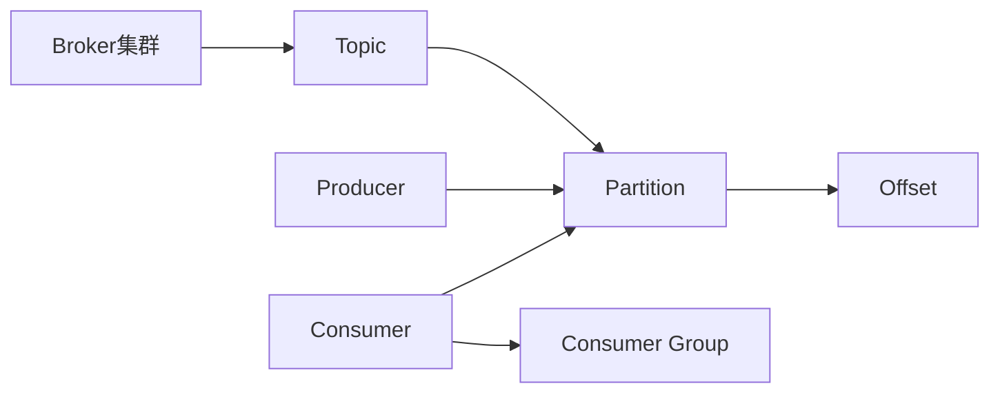

# AI系统Kafka原理与代码实战案例讲解

## 1.背景介绍

### 1.1 什么是Kafka?

Apache Kafka是一个分布式流处理平台,它是一个可扩展、高吞吐量、高可靠的分布式发布-订阅消息系统。Kafka最初是由LinkedIn公司开发,后来捐赠给Apache软件基金会,目前已成为Apache顶级项目之一。

Kafka被广泛应用于实时数据管道、日志处理、流处理、事件源驱动架构等场景,能够实时处理大规模数据流,并保证数据的可靠传输。它的设计目标是作为一个统一的数据管道,可以实现数据从多个来源进行高效地收集、存储和处理。

### 1.2 Kafka的应用场景

Kafka可以应用于以下几种主要场景:

- **消息系统**: Kafka可以作为分布式消息队列,实现异步通信,降低系统耦合度。
- **活动跟踪**: 通过Kafka可以实时记录各种活动数据,如用户浏览记录、在线购买记录等。
- **数据管道**: Kafka可以实时从多个数据源采集数据,并可靠地存储和传输数据到其他系统。
- **日志收集**: Kafka常被用作分布式日志收集系统,用于收集和处理服务器日志数据。
- **流处理**: Kafka可以与流处理工具(如Apache Storm、Apache Spark等)集成,构建实时流处理系统。
- **事件源(Event Sourcing)**: Kafka可以作为事件源系统,存储所有状态变更事件,以支持数据完整性和审计。

### 1.3 Kafka的优势

Kafka作为分布式消息系统,具有以下主要优势:

- **高吞吐量**: 能够每秒处理数百万条消息。
- **可扩展性**: 集群可以根据需求动态扩展,支持热扩容。
- **持久化**: 消息被持久化到磁盘,有效避免数据丢失。
- **容错性**: 允许节点失败,保证数据可靠性。
- **高并发**: 支持数千个客户端同时读写数据。
- **实时处理**: 能够以常量时间复杂度提供消息持久化能力,实现实时处理。

## 2.核心概念与联系

### 2.1 Kafka核心概念

理解Kafka的几个核心概念对于掌握其原理非常重要,主要包括:

- **Broker**: Kafka集群中的每个服务实例被称为Broker。
- **Topic**: Kafka中的消息分类,每个Topic代表一个消息流。
- **Partition**: Topic物理上的分组,一个Topic可以分为多个Partition。
- **Offset**: 消息在Partition中的唯一位置标识,用于控制消息的读取位置。
- **Producer**: 消息的生产者,负责发布消息到Kafka Broker。
- **Consumer**: 消息的消费者,从Broker读取消息进行处理。
- **Consumer Group**: 每个Consumer属于一个特定的Consumer Group。

### 2.2 Kafka核心概念关系

Kafka的核心概念之间存在以下关系:



- Broker集群管理多个Topic。
- 每个Topic分为多个Partition,Partition中的消息按Offset排序。
- Producer向Partition写入消息。
- Consumer从Partition读取消息。
- 多个Consumer组成一个Consumer Group,Consumer Group内的Consumer并行消费Topic的Partition。

## 3.核心算法原理具体操作步骤

### 3.1 生产者(Producer)发送消息原理

Producer发送消息到Kafka集群的原理如下:

1. Producer从Broker领导者(Leader)处获取Partition的元数据信息,包括Partition副本所在的Broker信息。
2. Producer根据Partition策略选择将消息发送到哪个Partition。常用的策略有:
   - 轮询(Round-Robin)策略:平均分配到所有Partition。
   - Key哈希(Key Hashing)策略:根据Key的哈希值映射到特定Partition。
3. Producer将消息发送给Partition的Leader副本所在的Broker。
4. Leader Broker将消息写入本地磁盘,并确认写入成功。
5. Leader Broker将消息复制到Follower副本所在的Broker。
6. Leader Broker确认所有Follower副本都已成功复制消息后,向Producer发送Ack确认。

### 3.2 消费者(Consumer)消费消息原理

Consumer消费Kafka中的消息原理如下:

1. Consumer向Broker发送请求,获取Topic的元数据信息,包括Topic的Partition信息。
2. Consumer根据Consumer Group的策略订阅Topic的部分或全部Partition。
3. Consumer通过轮询(poll)操作从订阅的Partition中拉取消息。
4. Consumer根据消费位移(offset)读取Partition中的消息。
5. Consumer处理消息,并通过提交新的offset位置来更新消费进度。

### 3.3 消息复制与容错原理

Kafka采用分区复制和领导者选举机制来实现容错,原理如下:

1. 每个Partition都有多个副本,其中一个副本是Leader,其他副本是Follower。
2. Producer只能将消息发送给Partition的Leader副本所在的Broker。
3. Leader副本将消息写入本地磁盘后,再将消息复制到所有Follower副本所在的Broker。
4. 如果Leader副本失效,则会从Follower副本中选举出一个新的Leader副本。
5. 新的Leader副本接管原Leader的工作,继续提供读写服务。

通过分区复制和领导者选举机制,Kafka实现了高可用性和容错性。即使部分Broker宕机,整个集群仍然可以正常工作,不会导致数据丢失。

## 4.数学模型和公式详细讲解举例说明

### 4.1 分区分配策略

Kafka在分配Partition给Consumer时,采用了一种基于"范围分区(Range Partitioning)"的策略。这种策略可以保证同一个Consumer Group内的Consumer均匀地分配到所有的Partition。

假设有一个Topic包含N个Partition,该Topic被订阅的Consumer Group包含C个Consumer。Kafka将使用以下公式计算每个Consumer应该分配到的Partition范围:

$$
\begin{aligned}
N_{partitions\_per\_consumer} &= \left\lfloor\frac{N}{C}\right\rfloor \\
N_{lead\_partitions} &= N \bmod C \\
\text{Consumer}_i\text{'s Partition Range} &= \begin{cases}
[i \times N_{partitions\_per\_consumer}, (i+1) \times N_{partitions\_per\_consumer}), & \text{if } i < N_{lead\_partitions}\\
[i \times N_{partitions\_per\_consumer} + N_{lead\_partitions}, (i+1) \times N_{partitions\_per\_consumer} + N_{lead\_partitions}), & \text{if } i \geq N_{lead\_partitions}
\end{cases}
\end{aligned}
$$

其中:

- $N_{partitions\_per\_consumer}$表示每个Consumer应分配到的Partition数量。
- $N_{lead\_partitions}$表示有几个Consumer将多分配一个Partition。
- $\text{Consumer}_i\text{'s Partition Range}$表示第i个Consumer分配到的Partition范围。

例如,如果一个Topic有10个Partition,并且有3个Consumer订阅该Topic,则Partition分配情况如下:

- Consumer 1: [0, 1, 2, 3]
- Consumer 2: [4, 5, 6]
- Consumer 3: [7, 8, 9]

### 4.2 消息传递延迟模型

Kafka在消息传递过程中,会引入一定的延迟。这种延迟可以用以下公式进行建模:

$$
T_{total} = T_{send} + T_{replicate} + T_{consume}
$$

其中:

- $T_{total}$表示消息从Producer发送到Consumer处理的总延迟时间。
- $T_{send}$表示Producer将消息发送到Broker的延迟时间。
- $T_{replicate}$表示Leader副本将消息复制到所有Follower副本的延迟时间。
- $T_{consume}$表示Consumer从Broker拉取并处理消息的延迟时间。

每个延迟时间都受到多个因素的影响,例如网络延迟、磁盘I/O速度、CPU负载等。通过对这些因素进行优化,可以有效降低消息传递延迟。

## 5.项目实践:代码实例和详细解释说明

### 5.1 Producer示例

以下是使用Java编写的Kafka Producer示例代码:

```java
Properties props = new Properties();
props.put("bootstrap.servers", "broker1:9092,broker2:9092");
props.put("key.serializer", "org.apache.kafka.common.serialization.StringSerializer");
props.put("value.serializer", "org.apache.kafka.common.serialization.StringSerializer");

Producer<String, String> producer = new KafkaProducer<>(props);

for (int i = 0; i < 100; i++) {
    String message = "Message " + i;
    ProducerRecord<String, String> record = new ProducerRecord<>("my-topic", message);
    producer.send(record);
}

producer.flush();
producer.close();
```

代码解释:

1. 首先配置Kafka Broker地址和序列化器。
2. 创建一个`KafkaProducer`实例。
3. 使用循环发送100条消息到名为"my-topic"的Topic。
4. 调用`flush()`方法确保所有消息已被发送。
5. 最后关闭Producer实例。

### 5.2 Consumer示例

以下是使用Java编写的Kafka Consumer示例代码:

```java
Properties props = new Properties();
props.put("bootstrap.servers", "broker1:9092,broker2:9092");
props.put("group.id", "my-group");
props.put("key.deserializer", "org.apache.kafka.common.serialization.StringDeserializer");
props.put("value.deserializer", "org.apache.kafka.common.serialization.StringDeserializer");

KafkaConsumer<String, String> consumer = new KafkaConsumer<>(props);
consumer.subscribe(Collections.singletonList("my-topic"));

while (true) {
    ConsumerRecords<String, String> records = consumer.poll(Duration.ofMillis(100));
    for (ConsumerRecord<String, String> record : records) {
        System.out.printf("offset = %d, key = %s, value = %s%n", record.offset(), record.key(), record.value());
    }
}
```

代码解释:

1. 首先配置Kafka Broker地址、Consumer Group和反序列化器。
2. 创建一个`KafkaConsumer`实例,并订阅名为"my-topic"的Topic。
3. 使用无限循环不断从订阅的Topic中拉取消息。
4. 对于每条拉取到的消息,打印其offset、key和value。

## 6.实际应用场景

Kafka在实际应用中有广泛的使用场景,例如:

### 6.1 实时数据管道

Kafka可以作为实时数据管道,从各种数据源(如日志文件、传感器数据、Web应用程序等)采集数据,并将数据传输到其他系统(如Hadoop、Spark、Elasticsearch等)进行存储和分析。例如,可以使用Kafka将Web服务器的访问日志实时传输到Hadoop集群进行离线分析。

### 6.2 流处理系统

Kafka可以与流处理框架(如Apache Storm、Apache Spark Streaming等)集成,构建实时流处理系统。例如,可以使用Kafka作为数据源,将实时数据流传输到Spark Streaming进行实时处理和分析,如实时计算网站的页面浏览量、实时检测欺诈交易等。

### 6.3 事件驱动架构

在事件驱动架构中,Kafka可以作为事件源(Event Source),存储所有状态变更事件。其他系统可以订阅这些事件,并根据事件执行相应的操作。例如,在电子商务系统中,可以将用户下单、支付、发货等事件存储在Kafka中,其他系统可以订阅这些事件进行处理,如更新库存、发送通知等。

### 6.4 物联网(IoT)数据收集

在物联网领域,Kafka可以用于收集来自各种传感器和设备的大量数据。由于Kafka具有高吞吐量和可扩展性,它可以有效地处理大规模的物联网数据流。例如,可以使用Kafka收集智能家居设备的状态数据,并将这些数据传输到其他系统进行分析和控制。

## 7.工具和资源推荐

### 7.1 Kafka工具

- **Kafka Manager**: 一个基于Web的Kafka集群管理工具,可以方便地查看和管理Kafka集群。
- **Kafka Tool**: 一个命令行工具,提供了许多实用的Kafka操作命令。
- **Kafka-Python**: Kafka官方提供的Python客户端库。
- **Kafka-Node**: Kafka官方提供的Node.js客户端库。

### 7.2 Kafka资源

- **Apache Kafka官网**: https