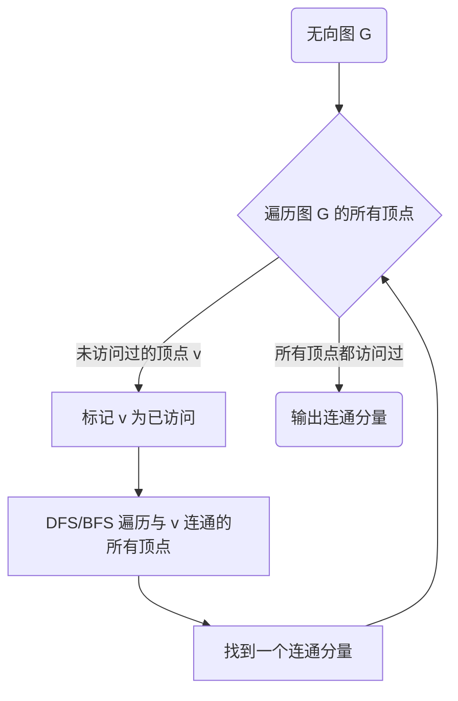

# Connected Components连通分量算法原理与代码实例讲解

## 1. 背景介绍
### 1.1 图论基础
#### 1.1.1 图的定义
#### 1.1.2 图的表示方法
#### 1.1.3 图的基本性质
### 1.2 连通分量的概念
#### 1.2.1 连通图的定义  
#### 1.2.2 连通分量的定义
#### 1.2.3 连通分量的重要性

## 2. 核心概念与联系
### 2.1 连通分量与图的遍历
#### 2.1.1 深度优先搜索(DFS)
#### 2.1.2 广度优先搜索(BFS)  
#### 2.1.3 连通分量与DFS/BFS的关系
### 2.2 连通分量算法的核心思想
#### 2.2.1 基于DFS的连通分量算法
#### 2.2.2 基于并查集的连通分量算法
#### 2.2.3 两种算法的比较

## 3. 核心算法原理具体操作步骤
### 3.1 基于DFS的连通分量算法
#### 3.1.1 算法流程
#### 3.1.2 时间复杂度分析
#### 3.1.3 空间复杂度分析
### 3.2 基于并查集的连通分量算法 
#### 3.2.1 并查集数据结构
#### 3.2.2 并查集的基本操作
#### 3.2.3 基于并查集的连通分量算法流程
#### 3.2.4 时间复杂度分析
#### 3.2.5 空间复杂度分析

## 4. 数学模型和公式详细讲解举例说明
### 4.1 图的数学表示
#### 4.1.1 邻接矩阵
#### 4.1.2 邻接表
### 4.2 并查集的数学模型 
#### 4.2.1 集合的表示
#### 4.2.2 集合的合并
#### 4.2.3 查找元素所属集合

## 5. 项目实践：代码实例和详细解释说明
### 5.1 基于DFS的连通分量算法代码实现
#### 5.1.1 C++版本
#### 5.1.2 Python版本
#### 5.1.3 Java版本
### 5.2 基于并查集的连通分量算法代码实现
#### 5.2.1 C++版本  
#### 5.2.2 Python版本
#### 5.2.3 Java版本
### 5.3 代码运行示例与解释
#### 5.3.1 输入数据格式
#### 5.3.2 输出结果格式
#### 5.3.3 代码运行过程解析

## 6. 实际应用场景
### 6.1 社交网络分析
#### 6.1.1 社区发现
#### 6.1.2 影响力分析
### 6.2 图像分割
#### 6.2.1 基于图的图像分割方法
#### 6.2.2 连通分量在图像分割中的应用
### 6.3 网络可达性分析
#### 6.3.1 网络连通性检测
#### 6.3.2 网络节点重要性评估

## 7. 工具和资源推荐
### 7.1 图论算法库
#### 7.1.1 Boost Graph Library
#### 7.1.2 LEMON
#### 7.1.3 NetworkX
### 7.2 在线评测平台
#### 7.2.1 LeetCode
#### 7.2.2 HackerRank
#### 7.2.3 Codeforces
### 7.3 推荐书籍
#### 7.3.1 《算法导论》
#### 7.3.2 《图论及其算法》
#### 7.3.3 《数据结构与算法分析》

## 8. 总结：未来发展趋势与挑战
### 8.1 连通分量算法的改进
#### 8.1.1 并行化
#### 8.1.2 外存算法
#### 8.1.3 流式算法
### 8.2 连通分量在新兴领域的应用
#### 8.2.1 大数据分析
#### 8.2.2 生物信息学
#### 8.2.3 量子计算
### 8.3 面临的挑战
#### 8.3.1 算法的可扩展性
#### 8.3.2 实时性要求
#### 8.3.3 数据的高维特性

## 9. 附录：常见问题与解答
### 9.1 如何处理有向图中的连通分量？
### 9.2 连通分量算法能否用于带权图？
### 9.3 连通分量与最小生成树的关系是什么？
### 9.4 如何优化并查集的时间复杂度？
### 9.5 连通分量算法在竞赛中常见的题型有哪些？

图论是计算机科学和数学领域的重要分支，在解决现实世界问题中有着广泛的应用。作为图论的基础算法之一，连通分量(Connected Components)在图的许多操作和分析中扮演着关键角色。本文将深入探讨连通分量的概念、算法原理、代码实现以及实际应用，帮助读者全面理解并掌握这一重要算法。

首先，我们将从图论的基本概念出发，介绍图的定义、表示方法以及基本性质。在此基础上，引出连通图和连通分量的概念，阐明其在图论中的重要地位。接下来，我们将连通分量问题与图的遍历算法——深度优先搜索(DFS)和广度优先搜索(BFS)联系起来，分析它们之间的内在联系，并由此引出连通分量算法的核心思想。

本文将重点介绍两种经典的连通分量算法：基于DFS的算法和基于并查集的算法。我们将详细讲解每种算法的原理、具体操作步骤、时间复杂度和空间复杂度，并通过形象的示意图和流程图帮助读者直观地理解算法的执行过程。

为了加深读者对算法原理的理解，我们还将从数学角度对图和并查集进行建模，给出它们的数学表示方法，并对相关公式进行详细推导和讲解。通过数学语言的描述，读者将能更加深刻地领会算法的精髓所在。

理论固然重要，但实践出真知。为此，我们精心准备了连通分量算法的代码实例，包括C++、Python和Java三种主流编程语言的实现。每段代码都配有详尽的注释和解释，读者可以轻松地理解代码的每一行、每一个细节。我们还提供了完整的输入输出示例和运行过程解析，帮助读者快速上手，将理论知识转化为实际编程能力。

连通分量算法在诸多领域都有着广泛应用。本文将选取几个具有代表性的场景，如社交网络分析、图像分割和网络可达性分析等，展示连通分量算法在解决实际问题中的威力。通过这些实例，读者将深刻认识到算法的实用价值，激发学习的兴趣和动力。

学习算法离不开优秀的工具和资源。我们精选了几款功能强大、使用便捷的图论算法库，如Boost Graph Library、LEMON和NetworkX等，帮助读者在编程实践中事半功倍。此外，我们还推荐了几个知名的在线评测平台和经典图论书籍，为读者的进一步学习提供了方向和参考。

展望未来，连通分量算法仍有很大的改进空间，如并行化、外存算法、流式算法等，以适应日益增长的数据规模和计算需求。同时，连通分量算法在大数据分析、生物信息学、量子计算等新兴领域也有着广阔的应用前景。这些都为算法的发展带来了新的机遇和挑战。

在附录部分，我们精选了几个读者最关心的问题，如有向图中的连通分量处理、算法能否应用于带权图、与最小生成树的关系、并查集的优化技巧以及在竞赛中的常见题型等，对每个问题都给出了详尽的解答，帮助读者解决疑惑，巩固知识。

总之，本文力求从概念原理、算法细节、代码实现、实际应用等多个角度，全方位、深层次地剖析连通分量算法这一重要话题。通过对本文的学习，相信读者一定能对连通分量算法建立起完整、深入的认知，并能够灵活运用，解决实际问题。让我们一起踏上这段图论的探索之旅吧！



下面我们来看一下基于DFS的连通分量算法的C++代码实现：

```cpp
class Solution {
public:
    void dfs(vector<vector<int>>& graph, vector<bool>& visited, int v) {
        visited[v] = true;
        for (int neighbor : graph[v]) {
            if (!visited[neighbor]) {
                dfs(graph, visited, neighbor);
            }
        }
    }

    int countComponents(int n, vector<vector<int>>& edges) {
        vector<vector<int>> graph(n);
        for (auto& edge : edges) {
            graph[edge[0]].push_back(edge[1]);
            graph[edge[1]].push_back(edge[0]);
        }

        vector<bool> visited(n, false);
        int count = 0;
        for (int v = 0; v < n; v++) {
            if (!visited[v]) {
                dfs(graph, visited, v);
                count++;
            }
        }

        return count;
    }
};
```

算法的主要步骤如下：
1. 根据边集构建邻接表表示的图。
2. 初始化 visited 数组，标记所有顶点为未访问。
3. 遍历图中的每个顶点 v：
   - 如果 v 未被访问过，则从 v 开始进行 DFS 遍历，将与 v 连通的所有顶点标记为已访问。
   - DFS 遍历结束后，找到了一个连通分量，连通分量的数量加 1。
4. 返回连通分量的总数。

该算法的时间复杂度为 $O(V+E)$，其中 $V$ 和 $E$ 分别为图的顶点数和边数。空间复杂度为 $O(V)$，用于存储邻接表和 visited 数组。

接下来我们再看一下基于并查集的连通分量算法的Python代码实现：

```python
class UnionFind:
    def __init__(self, n):
        self.parent = list(range(n))
        self.rank = [0] * n
        self.count = n

    def find(self, x):
        if self.parent[x] != x:
            self.parent[x] = self.find(self.parent[x])
        return self.parent[x]

    def union(self, x, y):
        root_x, root_y = self.find(x), self.find(y)
        if root_x == root_y:
            return
        if self.rank[root_x] < self.rank[root_y]:
            self.parent[root_x] = root_y
        elif self.rank[root_x] > self.rank[root_y]:
            self.parent[root_y] = root_x
        else:
            self.parent[root_y] = root_x
            self.rank[root_x] += 1
        self.count -= 1

class Solution:
    def countComponents(self, n: int, edges: List[List[int]]) -> int:
        uf = UnionFind(n)
        for u, v in edges:
            uf.union(u, v)
        return uf.count
```

并查集算法的核心思想是：
1. 初始时，每个顶点都是一个独立的集合，即每个顶点的父节点都指向自己。
2. 遍历每条边 (u, v)：
   - 找到顶点 u 和 v 所在集合的根节点 root_u 和 root_v。
   - 如果 root_u 和 root_v 不同，说明 u 和 v 不在同一个连通分量中，将它们合并，连通分量的数量减 1。
3. 返回最终的连通分量数量。

并查集算法的时间复杂度为 $O(E \cdot \alpha(V))$，其中 $\alpha$ 是反阿克曼函数，在实际应用中可以看作是常数。空间复杂度为 $O(V)$，用于存储并查集的数据结构。

连通分量算法在许多实际场景中都有着重要应用。例如，在社交网络分析中，我们可以将用户视为图中的顶点，用户之间的关系（如好友关系）视为图中的边，通过连通分量算法可以发现社交