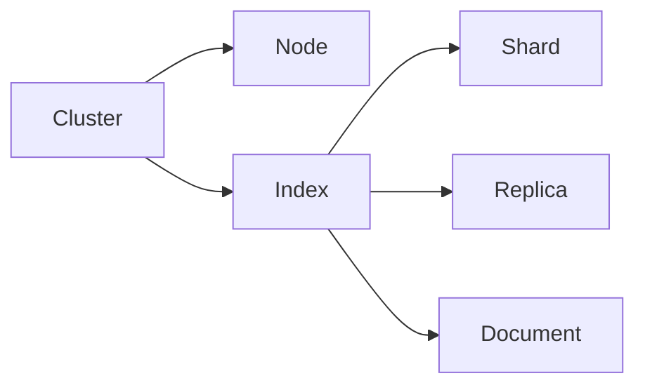

# ElasticSearch Query DSL原理与代码实例讲解

## 1.背景介绍
### 1.1 全文搜索引擎的发展历程
#### 1.1.1 早期的全文搜索
#### 1.1.2 Lucene的出现
#### 1.1.3 Solr的崛起
### 1.2 ElasticSearch的诞生
#### 1.2.1 基于Lucene的封装与扩展  
#### 1.2.2 分布式特性
#### 1.2.3 RESTful API

## 2.核心概念与联系
### 2.1 Node与Cluster
#### 2.1.1 Node的概念
#### 2.1.2 Cluster的概念
#### 2.1.3 Node与Cluster的关系
### 2.2 Index与Document
#### 2.2.1 Index的概念
#### 2.2.2 Document的概念 
#### 2.2.3 Index与Document的关系
### 2.3 Shard与Replica
#### 2.3.1 Shard的概念
#### 2.3.2 Replica的概念
#### 2.3.3 Shard与Replica的关系
### 2.4 核心概念之间的联系


## 3.核心算法原理具体操作步骤
### 3.1 倒排索引
#### 3.1.1 什么是倒排索引
#### 3.1.2 倒排索引的构建过程
#### 3.1.3 倒排索引的优缺点
### 3.2 文档分析
#### 3.2.1 文档分析的概念
#### 3.2.2 分词器的作用
#### 3.2.3 内置分词器与自定义分词器
### 3.3 相关度评分 
#### 3.3.1 TF-IDF算法
#### 3.3.2 BM25算法
#### 3.3.3 自定义相关度评分算法

## 4.数学模型和公式详细讲解举例说明
### 4.1 布尔模型
#### 4.1.1 布尔模型的定义
布尔模型是信息检索中的经典模型，使用AND、OR、NOT等逻辑算子将检索词连接起来，形成布尔表达式。
假设有布尔查询：(Java OR Python) AND (Elasticsearch OR Solr)
它将匹配同时包含Java或Python，且包含Elasticsearch或Solr的文档。

#### 4.1.2 布尔模型的表达式
布尔表达式BooleanQuery可以表示为:
$$
BooleanQuery ::= Clause_1\wedge Clause_2 \wedge ... \wedge Clause_n \\
Clause ::= [+|-]Term \\
$$
其中+表示必须包含(AND)，-表示必须不包含(NOT)，无符号表示可选包含(OR)。

### 4.2 向量空间模型
#### 4.2.1 向量空间模型的定义
向量空间模型将文档和查询都表示成一个加权的特征向量，然后计算查询向量与文档向量的相似度。
设有m个检索词构成的查询Q和文档D：
$$
\begin{aligned}
Q &= (q_1, q_2, ..., q_m)\\  
D &= (d_1, d_2, ..., d_m)
\end{aligned}
$$
其中$q_i$和$d_i$分别表示查询和文档在第i个检索词上的权重。

#### 4.2.2 向量空间模型的相似度计算
查询Q与文档D的相似度可以用余弦相似度来衡量：
$$
sim(Q,D) = \frac{\sum_{i=1}^m q_i \cdot d_i}{\sqrt{\sum_{i=1}^m q_i^2} \cdot \sqrt{\sum_{i=1}^m d_i^2}}
$$

### 4.3 概率模型
#### 4.3.1 概率模型的定义
概率模型试图估计一个文档D与查询Q相关的概率P(R=1|D,Q)，通常用贝叶斯定理转化为：
$$P(R=1|D,Q)=\frac{P(D,Q|R=1)\cdot P(R=1)}{P(D,Q)}$$
其中R=1表示相关，R=0表示不相关。

#### 4.3.2 概率模型的应用
BM25就是一个基于概率模型的排序函数，考虑了检索词频率(TF)、文档长度等因素对相关性的影响。
BM25的计算公式如下：
$$
score(D,Q) = \sum_{i=1}^m IDF(q_i) \cdot \frac{f(q_i,D) \cdot (k_1+1)}{f(q_i,D) + k_1 \cdot (1-b+b \cdot \frac{|D|}{avgdl})}
$$
其中：
- $IDF(q_i)$是检索词$q_i$的逆文档频率
- $f(q_i,D)$是检索词$q_i$在文档D中的频率
- $|D|$是文档D的长度
- $avgdl$是文档集合的平均长度
- $k_1$和$b$是可调参数，控制TF和文档长度的影响程度

## 5.项目实践：代码实例和详细解释说明
### 5.1 创建索引
```json
PUT /my_index
{
  "settings": {
    "number_of_shards": 3,
    "number_of_replicas": 2
  },
  "mappings": {
    "properties": {
      "title": {
        "type": "text"
      },
      "content": {
        "type": "text"
      },
      "publish_date": {
        "type": "date"
      }
    }
  }
}
```
这段代码创建了一个名为my_index的索引，设置了3个主分片和2个副本分片。同时定义了title、content、publish_date三个字段的类型。

### 5.2 插入文档
```json
POST /my_index/_doc
{
  "title":"ElasticSearch 入门教程",
  "content": "这是一篇ElasticSearch的入门介绍文章",
  "publish_date":"2023-05-20"
}
```
这段代码在my_index索引中插入了一条文档，包含title、content、publish_date三个字段。

### 5.3 查询文档
```json
GET /my_index/_search
{
  "query": {
    "match": {
      "content": "ElasticSearch 入门"
    }
  }
}
```
这段代码在my_index索引中查询content字段包含"ElasticSearch"和"入门"的文档。
match查询会对查询语句先进行分词，然后用OR逻辑连接各个词的查询结果。

### 5.4 布尔查询
```json
GET /my_index/_search
{
  "query": {
    "bool": {
      "must": [
        {
          "match": {
            "title": "ElasticSearch"
          }
        }
      ],
      "should": [
        {
          "match": {
            "content": "入门"
          }
        },
        {
          "match": {
            "content": "教程"  
          }
        }
      ]
    }
  }
}
```
这段代码使用bool查询实现了组合条件查询。must部分要求title必须包含"ElasticSearch"，should部分希望content包含"入门"或"教程"，增加相关度评分。

### 5.5 函数评分查询
```json
GET /my_index/_search
{
  "query": {
    "function_score": {
      "query": {
        "match": {
          "title": "ElasticSearch"
        }
      },
      "functions": [
        {
          "exp": {
            "publish_date": {
              "origin": "now",
              "scale": "100d",
              "offset": "30d",
              "decay": 0.3
            }
          }
        }
      ],
      "boost_mode": "multiply"
    }
  }
}
```
这段代码使用function_score查询修改相关度评分。query部分是原始查询，functions部分定义了一个指数衰减函数，publish_date越接近当前时间的文档评分越高。boost_mode指定评分修改模式为相乘。

## 6.实际应用场景
### 6.1 电商搜索
- 根据商品名称、类目、品牌、属性等多维度条件进行组合查询
- 支持拼音、同义词、词性分析等查询优化
- 根据用户行为、商品热度、上架时间等对结果评分排序
### 6.2 日志分析
- 采集各种服务器、应用的日志数据，建立统一的日志分析平台
- 实时接收日志事件，解析字段存入ElasticSearch
- 根据关键字、时间范围、日志等级等条件快速检索日志
- 对日志中的异常错误进行聚合统计，实现告警监控
### 6.3 金融风控
- 收集各类交易记录、用户信息、行为日志等数据
- 实时判断交易的风险程度，对高危交易进行拦截
- 多维度统计分析资金流向，评估洗钱风险
- 构建用户画像，预测违约、逾期、欺诈等风险事件

## 7.工具和资源推荐
### 7.1 官方文档
- Elasticsearch官方文档：https://www.elastic.co/guide/en/elasticsearch/reference/current/index.html
- Query DSL：https://www.elastic.co/guide/en/elasticsearch/reference/current/query-dsl.html
### 7.2 中文社区
- Elastic中文社区：https://elasticsearch.cn/
- ElasticSearch技术博客：http://www.lxway.com/
### 7.3 可视化管理工具
- Kibana：Elastic Stack自带的强大可视化分析平台
- elasticsearch-head：开源的ElasticSearch集群管理工具
- Cerebro：开源的ElasticSearch Web管理工具

## 8.总结：未来发展趋势与挑战
### 8.1 更智能的搜索和问答
- 引入知识图谱、语义分析等技术，实现智能问答
- 利用机器学习优化排序、query rewrite等，提升搜索质量
### 8.2 更好的性能和扩展性
- 优化存储和检索性能，提升查询和写入吞吐量
- 探索新的索引结构，更好地平衡实时性与可扩展性
### 8.3 更广泛的生态系统支持
- 与Spark、Flink等大数据处理引擎深度集成，支持更复杂的分析场景
- 提供更多开箱即用的机器学习模型，简化算法应用

## 9.附录：常见问题与解答
### 9.1 ElasticSearch与关系型数据库的区别是什么？
ElasticSearch是分布式的文档型NoSQL数据库，主要用于海量数据的实时全文检索和分析查询。而关系型数据库如MySQL适合存储结构化数据，支持ACID事务、join等操作。它们在数据模型、应用场景上有很大区别。

### 9.2 ElasticSearch的分布式架构是如何实现的？
ElasticSearch通过Shard分片机制实现了分布式架构。一个Index的数据被分成多个Shard存储到不同的Node上，可以并行处理查询请求。同时每个Shard可以设置多个Replica副本，提供了高可用和读扩展。

### 9.3 ElasticSearch的查询性能优化有哪些手段？
- 尽量使用Filter Context，利用缓存过滤不相关文档
- 预聚合数据，减少实时聚合的开销
- 合理设置Mapping，优化倒排索引
- 开启Doc Values，加速排序、聚合操作
- 使用别名机制，平滑索引重建
- 定期使用Force Merge API,减少Segment文件数量
- 必要时手动Warmup,加载数据到文件系统缓存中

作者：禅与计算机程序设计艺术 / Zen and the Art of Computer Programming