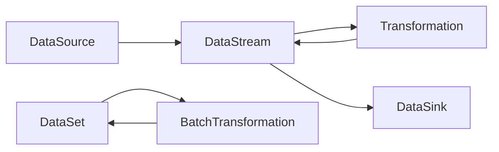

# Flink原理与代码实例讲解

## 1. 背景介绍

### 1.1 大数据处理的挑战

在当今大数据时代,我们面临着海量数据的处理和分析挑战。传统的批处理框架如Hadoop MapReduce已经无法满足实时性要求高、数据量大的场景。因此,业界迫切需要一种新的大数据处理框架来应对这些挑战。

### 1.2 Flink的诞生

Apache Flink是由德国柏林工业大学的研究小组开发的新一代大数据处理框架。它采用了数据流(DataStream)和数据集(DataSet)相结合的编程模型,支持高吞吐、低延迟、高性能的流式和批量数据处理。Flink的诞生引领了大数据处理技术的革新。

### 1.3 Flink的发展历程

- 2009年,Flink的前身Stratosphere项目启动
- 2014年,Stratosphere捐献给Apache基金会,正式更名为Flink
- 2015年,Flink 0.9版本发布,支持高吞吐、低延迟的流处理
- 2019年,Flink 1.9版本发布,Flink社区持续活跃,成为主流大数据处理框架之一

## 2. 核心概念与联系

### 2.1 Flink的核心概念

#### 2.1.1 数据流(DataStream)

数据流是Flink的核心抽象,它代表一个无界的、持续生成的数据序列。Flink以数据流作为输入,对其进行各种转换操作,如map、filter等,最终得到输出结果。

#### 2.1.2 数据集(DataSet)

数据集是Flink批处理的数据抽象,代表一个有界的、静态的数据集合。Flink对数据集执行类似于MapReduce的操作,如groupBy、join等,处理后输出结果数据集。

#### 2.1.3 时间概念

Flink支持三种时间概念:
- 事件时间(Event Time):数据本身携带的时间戳
- 摄入时间(Ingestion Time):数据进入Flink的时间
- 处理时间(Processing Time):执行操作算子的机器时间

### 2.2 核心概念之间的联系

下面是Flink核心概念之间联系的Mermaid流程图:



Flink作业从数据源(DataSource)读取数据,生成数据流(DataStream)或数据集(DataSet),然后经过一系列的转换操作(Transformation),最终将结果写入数据汇(DataSink)。

## 3. 核心算法原理具体操作步骤

### 3.1 窗口算法

Flink提供了灵活的窗口机制来对无界数据流进行处理。窗口可以按照时间(Time Window)或数量(Count Window)来划分。具体步骤如下:

1. 定义窗口大小和滑动间隔
2. 将数据流按照窗口规则分配到不同的窗口
3. 对每个窗口内的数据进行计算
4. 输出窗口计算结果

### 3.2 状态管理

Flink提供了一致性的状态管理机制,支持exactly-once语义。算子可以将状态保存在内存或RocksDB中。Checkpoint机制定期将状态持久化到存储系统,在发生故障时能够从Checkpoint恢复状态。

### 3.3 反压机制

Flink通过反压机制来控制数据流的速率。当下游算子处理速度跟不上上游数据生成速度时,会反馈反压信号给上游,使其降低数据生成速率,从而保证系统稳定性。

## 4. 数学模型和公式详细讲解举例说明

### 4.1 窗口计算公式

以滑动时间窗口为例,假设窗口大小为 $w$,滑动间隔为 $s$,对于时间戳为 $t$ 的数据,其所属窗口的起始时间 $start$ 和结束时间 $end$ 计算公式为:

$$
start = \lfloor \frac{t-w}{s} \rfloor \times s \\
end = start + w
$$

例如,设置窗口大小 $w=10min$,滑动间隔 $s=5min$,对于时间戳 $t=12:07$ 的数据,代入公式得:

$$
start = \lfloor \frac{12:07-10:00}{5:00} \rfloor \times 5:00 = 10:00 \\
end = 10:00 + 10:00 = 20:00
$$

因此,该数据应该被分配到 [10:00, 20:00) 这个窗口进行计算。

### 4.2 反压控制公式

Flink使用基于信用的反压控制算法。上游算子根据下游算子的消费能力,动态调整数据生成速率。设上游算子的数据生成速率为 $v_p$,下游算子的数据消费速率为 $v_c$,信用值为 $\alpha$,则有:

$$
v_p = \min(v_p, \alpha \times v_c)
$$

其中, $\alpha$ 取值在 $[0,1]$ 范围内。当下游消费跟不上时, $\alpha$ 会减小,使得上游降低生成速率;反之, $\alpha$ 会增大,提高上游生成速率,最终达到动态平衡。

## 5. 项目实践：代码实例和详细解释说明

下面通过一个实际的Flink项目代码实例,来说明Flink的编程模型和API用法。该项目从Kafka读取数据,进行窗口计算,然后将结果写入MySQL。

### 5.1 添加依赖

在pom.xml中添加所需依赖:

```xml
<dependency>
    <groupId>org.apache.flink</groupId>
    <artifactId>flink-java</artifactId>
    <version>1.14.0</version>
</dependency>
<dependency>
    <groupId>org.apache.flink</groupId>
    <artifactId>flink-streaming-java_2.12</artifactId>
    <version>1.14.0</version>
</dependency>
<dependency>
    <groupId>org.apache.flink</groupId>
    <artifactId>flink-clients_2.12</artifactId>
    <version>1.14.0</version>
</dependency>
<dependency>
    <groupId>org.apache.flink</groupId>
    <artifactId>flink-connector-kafka_2.12</artifactId>
    <version>1.14.0</version>
</dependency>
<dependency>
    <groupId>org.apache.flink</groupId>
    <artifactId>flink-connector-jdbc_2.12</artifactId>
    <version>1.14.0</version>
</dependency>
```

### 5.2 代码实现

```java
public class KafkaWindowExample {

    public static void main(String[] args) throws Exception {
        StreamExecutionEnvironment env = StreamExecutionEnvironment.getExecutionEnvironment();
        
        // 从Kafka读取数据
        DataStreamSource<String> kafkaSource = env.addSource(
            new FlinkKafkaConsumer<>("test-topic", new SimpleStringSchema(), getKafkaProperties()));
        
        // 解析数据
        SingleOutputStreamOperator<Tuple2<String, Integer>> streamOperator = kafkaSource.map(new MapFunction<String, Tuple2<String, Integer>>() {
            @Override
            public Tuple2<String, Integer> map(String value) throws Exception {
                String[] fields = value.split(",");
                return Tuple2.of(fields[0], Integer.parseInt(fields[1]));
            }
        });
        
        // 设置水印
        SingleOutputStreamOperator<Tuple2<String, Integer>> streamWithWatermark = 
            streamOperator.assignTimestampsAndWatermarks(
                WatermarkStrategy.<Tuple2<String, Integer>>forBoundedOutOfOrderness(Duration.ofSeconds(5))
                .withTimestampAssigner((event, timestamp) -> event.f1));
        
        // 窗口计算
        SingleOutputStreamOperator<Tuple2<String, Integer>> windowAggStream = streamWithWatermark
            .keyBy(value -> value.f0)
            .window(TumblingEventTimeWindows.of(Time.seconds(10)))
            .reduce(new ReduceFunction<Tuple2<String, Integer>>() {
                @Override
                public Tuple2<String, Integer> reduce(Tuple2<String, Integer> value1, Tuple2<String, Integer> value2) throws Exception {
                    return new Tuple2<>(value1.f0, value1.f1 + value2.f1);
                }
            });
        
        // 写入MySQL
        windowAggStream.addSink(JdbcSink.sink(
            "INSERT INTO result (name, sum) VALUES (?, ?)",
            (ps, value) -> {
                ps.setString(1, value.f0);
                ps.setInt(2, value.f1);
            },
            new JdbcConnectionOptions.JdbcConnectionOptionsBuilder()
                .withUrl("jdbc:mysql://localhost:3306/test")
                .withDriverName("com.mysql.jdbc.Driver")
                .withUsername("root")
                .withPassword("123456")
                .build()
        ));
        
        env.execute("Kafka Window Example");
    }

    private static Properties getKafkaProperties() {
        Properties properties = new Properties();
        properties.put("bootstrap.servers", "localhost:9092");
        properties.put("group.id", "test");
        return properties;
    }
}
```

### 5.3 代码说明

1. 通过`env.addSource`添加Kafka数据源,从指定的topic读取数据。
2. 使用`map`算子对读入的数据进行解析,提取时间戳和数值。
3. 通过`assignTimestampsAndWatermarks`设置水印,允许最大延迟5秒。
4. 先使用`keyBy`对数据流按照key进行分区,然后用`window`定义10秒的滚动事件时间窗口,再用`reduce`对窗口数据进行聚合计算。
5. 最后使用`addSink`将窗口计算结果写入MySQL表。

该实例展示了Flink如何与Kafka和MySQL集成,如何进行窗口计算以及如何设置水印处理数据乱序的场景。

## 6. 实际应用场景

Flink凭借其优异的流批一体和低延迟处理能力,在多个行业领域得到了广泛应用,例如:

- 电商实时大屏:统计当天销售额、订单数等核心指标
- 物联网数据分析:分析传感器实时数据,异常报警、预测性维护
- 金融风控:实时识别异常交易,防范金融欺诈
- 日志分析:分析应用程序日志,实时报警、异常定位

以电商实时大屏为例,Flink可以从Kafka实时消费订单数据,通过窗口计算、去重、聚合等操作,实时统计各种销售指标,并将结果写入Redis或MySQL,供Web前端实时展示。

## 7. 工具和资源推荐

- Flink官网:https://flink.apache.org/
- Flink中文文档:https://flink.apache.org/zh/
- Flink Github:https://github.com/apache/flink
- Ververica Platform:基于Flink构建的商业化流处理平台
- 《Stream Processing with Apache Flink》:Flink权威指南
- Flink Forward大会:Flink社区的年度盛会,分享最佳实践和未来规划

## 8. 总结：未来发展趋势与挑战

Flink在流处理领域已经占据了重要地位,未来仍有广阔的发展空间和潜力:

- Flink SQL的成熟和普及,使得Flink能够服务更多的数据分析场景
- Flink AI生态的发展,支持机器学习和深度学习算法的流式训练和推理
- Flink云原生部署的成熟,提高资源利用率,降低使用门槛
- 基于Flink构建统一的流批处理平台,简化数据处理架构

同时,Flink也面临一些挑战:

- 流处理的exactly-once语义在某些场景下难以实现
- 流处理的状态存储可能成为性能瓶颈
- 大状态的Checkpoint和恢复耗时较长
- 高可用和容错机制有待进一步完善

相信Flink社区能够攻克这些难题,推动Flink在流处理领域的创新发展。

## 9. 附录：常见问题与解答

### 9.1 Flink与Spark Streaming的区别?

Flink是纯流式计算,基于事件驱动,实时产生结果;而Spark Streaming是微批处理,基于时间驱动,有一定的处理延迟。此外,Flink支持更丰富的时间语义和窗口操作。

### 9.2 Flink保证exactly-once的原理?

Flink通过checkpoint机制和两阶段提交协议实现端到端的exactly-once。将每个算子的状态定期持久化到存储系统,发生故障时能够从checkpoint恢复,保证数据处理的一致性。

### 9.3 Flink的反压机制有什么作用?

反压机制能够动态平衡数据流的生成速率和消费速率,避免下游算子因数据积压而崩溃,保证系统的稳定