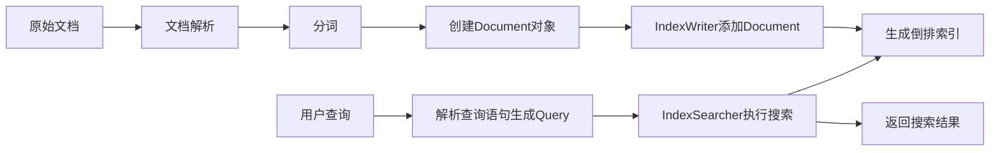

# Lucene搜索引擎原理与代码实例讲解

## 1.背景介绍

### 1.1 搜索引擎的重要性

在当今信息爆炸的时代,高效准确的信息检索至关重要。搜索引擎技术为我们从海量数据中快速找到所需信息提供了有力支持。无论是在互联网搜索、企业内部数据检索,还是各种应用系统中的关键词查询等场景,搜索引擎都发挥着不可或缺的作用。

### 1.2 Lucene简介

Apache Lucene是一个成熟的开源搜索引擎库,提供了全文检索和搜索的核心API。它是用Java编写的,性能优异,功能丰富,可扩展性强。许多知名的开源搜索引擎如Elasticsearch、Solr都是基于Lucene构建的。Lucene为开发人员提供了灵活的搜索引擎开发框架,使其能够专注于上层应用,而无需从头开始编写搜索引擎。

### 1.3 本文目标

本文将深入探讨Lucene的核心原理,包括索引结构、搜索算法等,并结合代码实例进行讲解。通过学习本文,读者将对Lucene的工作机制有更深入的理解,并能够基于Lucene开发出强大的搜索引擎应用。

## 2.核心概念与联系

### 2.1 Document 

在Lucene中,Document表示一个原子索引单元,类似数据库中的一行记录。一个Document包含多个Field,每个Field有一个名称和一个值,用于描述Document的不同属性。

### 2.2 Field

Field是Document的一个属性,由名称(name)和值(value)组成。不同的Field可以有不同的存储、索引、分词策略。常见的Field类型有:

- StringField - 存储字符串,不分词,用于精确匹配
- TextField - 存储文本,分词,用于全文搜索  
- IntPoint/LongPoint/FloatPoint/DoublePoint - 存储数值型字段,可用于范围查询
- SortedDocValuesField - 存储用于排序的字段值

### 2.3 Analyzer 

Analyzer是Lucene中用于分词的组件。它将Field的值转换为一系列Token(词元),以便创建倒排索引。Lucene内置了多种Analyzer,如StandardAnalyzer、WhitespaceAnalyzer等,也支持自定义Analyzer。

### 2.4 IndexWriter

IndexWriter用于创建和维护索引。通过IndexWriter可以添加、删除和更新Document。IndexWriter会将Document写入一个或多个Segment中。

### 2.5 IndexSearcher

IndexSearcher用于执行搜索。它打开一个IndexReader来访问索引,然后根据查询语句进行搜索,返回符合条件的Document结果集。

### 2.6 Query

Query是一个抽象的查询语句,用于描述用户的搜索需求。Lucene中的查询类型非常丰富,包括TermQuery、BooleanQuery、PhraseQuery、FuzzyQuery、WildcardQuery等。

### 2.7 索引和搜索流程

下面是Lucene索引和搜索的基本流程示意图:



## 3.核心算法原理具体操作步骤

### 3.1 索引阶段

#### 3.1.1 文档解析

将原始文档按照一定格式进行解析,提取出需要索引的Field。例如对于HTML文档,可以提取出标题、正文、作者等信息。

#### 3.1.2 分词 

对需要进行全文搜索的Field(如正文)进行分词处理。通过Analyzer将Field的值转换为一系列Token。分词过程通常包括字符过滤(如去除HTML标签)、Tokenizer初步分词、Token过滤(如转小写、去除停用词等)几个步骤。

#### 3.1.3 创建Document对象

为每个原始文档创建一个Document对象,并将提取出的各个Field添加到Document中。

#### 3.1.4 添加Document到索引

通过IndexWriter的addDocument方法将Document写入索引。IndexWriter会分析Document中各个Field的类型和属性,采用合适的方式对其进行索引,并将索引信息写入一个或多个Segment文件。

### 3.2 搜索阶段 

#### 3.2.1 解析查询语句

将用户输入的查询语句解析为Lucene中的Query对象。Query描述了用户的搜索意图,如关键词、逻辑关系、字段限定等。

#### 3.2.2 执行搜索

通过IndexSearcher的search方法执行实际的搜索过程。IndexSearcher会遍历索引中的各个Segment,找出所有匹配Query条件的Document,并根据相关性算分(Scoring)生成最终的结果排序。

#### 3.2.3 返回结果

将搜索结果以一定格式返回给用户,通常包括每个匹配Document的得分、排序位置等信息,以及高亮显示匹配关键词等。

## 4.数学模型和公式详细讲解举例说明

### 4.1 向量空间模型(Vector Space Model)

Lucene使用向量空间模型来计算Query和Document之间的相关性。在该模型中,Query和Document都被表示为多维向量,每个维度对应一个索引Term,维度的值表示该Term在Query或Document中的权重。

假设有一个包含n个Term的词汇表,一个Document可以表示为一个n维向量:

$\vec{d} = (w_{1,d}, w_{2,d}, ..., w_{n,d})$

其中$w_{i,d}$表示第i个Term在Document d中的权重。

同样,一个Query也可以表示为一个n维向量:

$\vec{q} = (w_{1,q}, w_{2,q}, ..., w_{n,q})$

其中$w_{i,q}$表示第i个Term在Query q中的权重。

### 4.2 TF-IDF权重计算

Lucene使用TF-IDF(Term Frequency-Inverse Document Frequency)来计算Term的权重。TF表示Term在Document中出现的频率,IDF表示Term在整个索引中的稀疏程度。

对于Term t在Document d中的权重计算公式为:

$w_{t,d} = tf_{t,d} * idf_t$

其中,$tf_{t,d}$表示Term t在Document d中的频率,$idf_t$表示Term t的逆文档频率,计算公式为:

$idf_t = log(\frac{N}{df_t})$

其中,N表示索引中的总Document数,$df_t$表示包含Term t的Document数。

### 4.3 余弦相似度

在向量空间模型中,Query和Document的相关性可以通过两个向量的余弦相似度来衡量:

$sim(q,d) = cos(\vec{q},\vec{d}) = \frac{\vec{q} \cdot \vec{d}}{|\vec{q}| |\vec{d}|}$

$= \frac{\sum_{i=1}^{n} w_{i,q} * w_{i,d}}{\sqrt{\sum_{i=1}^{n} w_{i,q}^2} \sqrt{\sum_{i=1}^{n} w_{i,d}^2}}$

余弦相似度的取值范围为[0,1],值越大表示Query和Document的相关性越高。

### 4.4 示例说明

假设有一个Query:"quick brown fox",和一个Document:"the quick brown fox jumps over the lazy dog"。

Query向量$\vec{q} = (0, 1, 1, 1, 0, 0, 0, 0, 0)$

Document向量$\vec{d} = (1, 1, 1, 1, 1, 1, 1, 1, 1)$

假设每个Term的IDF值为1,则Query和Document的余弦相似度为:

$sim(q,d) = \frac{0*1 + 1*1 + 1*1 + 1*1 + 0*1 + 0*1 + 0*1 + 0*1 + 0*1}{\sqrt{0^2 + 1^2 + 1^2 + 1^2 + 0^2 + 0^2 + 0^2 + 0^2 + 0^2} * \sqrt{1^2 + 1^2 + 1^2 + 1^2 + 1^2 + 1^2 + 1^2 + 1^2 + 1^2}}$

$= \frac{3}{\sqrt{3} * \sqrt{9}} \approx 0.577$

## 5.项目实践：代码实例和详细解释说明

下面通过一个简单的Java代码示例来展示Lucene的基本用法。该示例包括创建索引和执行搜索两个部分。

### 5.1 创建索引

```java
//创建Directory对象,指定索引存储位置
Directory directory = FSDirectory.open(Paths.get("index_dir"));
//创建IndexWriter对象
IndexWriterConfig config = new IndexWriterConfig(new StandardAnalyzer());
IndexWriter indexWriter = new IndexWriter(directory, config);

//创建Document对象
Document doc = new Document();
//添加Field
doc.add(new TextField("title", "Quick brown fox", Field.Store.YES));
doc.add(new TextField("content", "The quick brown fox jumps over the lazy dog", Field.Store.YES));

//将Document添加到索引中  
indexWriter.addDocument(doc);

//提交并关闭IndexWriter
indexWriter.close();
```

说明:
- 首先创建一个Directory对象,指定索引存储的位置。这里使用FSDirectory表示索引存储在文件系统中。
- 然后创建IndexWriter对象,指定使用StandardAnalyzer进行分词。
- 接着创建Document对象,并添加需要索引的Field。这里添加了两个TextField类型的Field,分别表示标题和正文。
- 调用IndexWriter的addDocument方法将Document添加到索引中。
- 最后提交并关闭IndexWriter。

### 5.2 执行搜索

```java
//创建Directory对象,指定索引位置
Directory directory = FSDirectory.open(Paths.get("index_dir"));
//创建IndexReader对象
IndexReader indexReader = DirectoryReader.open(directory);
//创建IndexSearcher对象
IndexSearcher indexSearcher = new IndexSearcher(indexReader);

//创建Query对象
Query query = new TermQuery(new Term("content", "fox"));
//执行搜索,指定返回前10个结果
TopDocs topDocs = indexSearcher.search(query, 10);

//遍历搜索结果
for (ScoreDoc scoreDoc : topDocs.scoreDocs) {
    //根据文档id获取完整的Document对象
    Document doc = indexSearcher.doc(scoreDoc.doc);
    //获取Document的Field值
    String title = doc.get("title");
    String content = doc.get("content");
    System.out.println("title: " + title);
    System.out.println("content: " + content);
}

//关闭IndexReader
indexReader.close();
```

说明:
- 首先创建Directory对象,指定要搜索的索引位置。
- 然后创建IndexReader对象,用于读取索引。
- 接着创建IndexSearcher对象,用于执行实际的搜索。
- 创建Query对象,这里使用TermQuery查询content字段中包含"fox"的Document。
- 调用IndexSearcher的search方法执行搜索,指定最多返回10个结果。返回结果为TopDocs对象。
- 遍历TopDocs中的每个ScoreDoc,通过IndexSearcher的doc方法获取完整的Document对象。
- 从Document中获取需要的Field值,如title和content。
- 最后关闭IndexReader。

以上就是一个简单的Lucene索引和搜索的代码示例。实际应用中,还需要考虑索引的更新、删除,以及更复杂的查询语法、相关性打分优化等。

## 6.实际应用场景

Lucene作为一个成熟的搜索引擎库,在很多实际场景中都有广泛应用,下面列举几个典型的应用场景:

### 6.1 网站搜索

很多网站都需要提供站内搜索功能,让用户能够快速找到所需的内容。使用Lucene可以为网站构建高效的全文检索功能。将网页内容索引为Lucene的Document,在用户搜索时执行相应的查询即可返回匹配的网页链接。

### 6.2 企业内部数据检索

企业内部积累了大量的非结构化数据,如文档、邮件、报告等。使用Lucene可以对这些数据进行索引和搜索,帮助员工快速找到所需的信息资源,提高工作效率。

### 6.3 日志搜索分析

系统运行过程中会产生大量的日志数据,传统的grep命令在处理大规模日志时效率较低。将日志数据索引到Lucene中,可以大幅提高日志搜索和分析的效率,快速定位问题。

### 6.4 电商商品搜索 

电商网站通常有海量的商品数据,用户希望能够快速搜