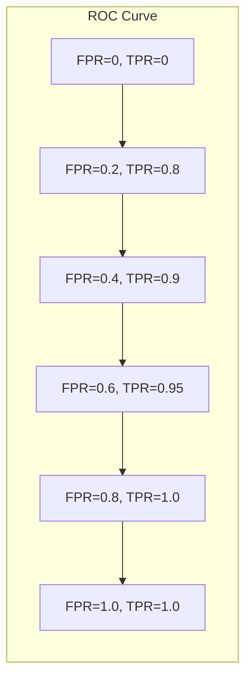

# ROC Curve 原理与代码实战案例讲解

## 1.背景介绍

在机器学习和数据挖掘领域中,评估模型的性能是一个非常重要的环节。ROC(Receiver Operating Characteristic)曲线是一种常用的评估二分类模型性能的可视化工具。它通过绘制真阳性率(True Positive Rate,TPR)和假阳性率(False Positive Rate,FPR)在不同阈值下的变化情况,直观地展示了模型的分类能力。

ROC曲线广泛应用于多个领域,如机器学习、信号检测理论、临床医学等。它能够清晰地描述分类模型在不同场景下的表现,为模型选择和优化提供重要依据。

## 2.核心概念与联系

### 2.1 真阳性率(TPR)和假阳性率(FPR)

理解ROC曲线的关键是掌握TPR和FPR这两个概念。在二分类问题中,我们将样本分为阳性(Positive)和阴性(Negative)两类。

- 真阳性(True Positive,TP)指实际为阳性且被正确预测为阳性的样本数。
- 假阳性(False Positive,FP)指实际为阴性但被错误预测为阳性的样本数。
- 真阴性(True Negative,TN)指实际为阴性且被正确预测为阴性的样本数。
- 假阴性(False Negative,FN)指实际为阳性但被错误预测为阴性的样本数。

TPR和FPR的计算公式如下:

$$
TPR = \frac{TP}{TP + FN}
$$

$$
FPR = \frac{FP}{FP + TN}
$$

TPR表示模型正确识别阳性样本的能力,FPR表示模型将阴性样本错误识别为阳性的程度。一个好的分类模型应该具有较高的TPR和较低的FPR。

### 2.2 ROC曲线

ROC曲线是在不同阈值下,TPR作为纵坐标,FPR作为横坐标绘制的曲线。阈值的变化会影响TP、FP、TN和FN的数量,进而影响TPR和FPR的值。

理想的分类模型对应的ROC曲线应该尽可能靠近左上角,这意味着TPR接近1且FPR接近0。而对角线上的点对应随机猜测的结果,模型的ROC曲线应该尽可能远离对角线。

### 2.3 AUC(Area Under Curve)

ROC曲线下的面积被称为AUC(Area Under Curve),是评估分类模型性能的另一个重要指标。AUC的取值范围是0到1,值越大表示模型的分类能力越强。

AUC等于1表示模型是完美分类器,等于0表示模型是反分类器。一般来说,AUC大于0.9被认为是优秀的分类模型,0.7到0.9之间是可以接受的,小于0.7则需要重新考虑模型。

## 3.核心算法原理具体操作步骤  

绘制ROC曲线的基本步骤如下:

1. **获取模型的预测概率值**

   对于每个样本,分类模型会输出一个预测概率值,表示该样本属于阳性类的概率。我们需要获取所有样本的预测概率值。

2. **设置阈值并计算TPR和FPR**

   遍历一系列阈值(通常在0到1之间),对于每个阈值:
   - 将预测概率值大于等于该阈值的样本预测为阳性,否则预测为阴性。
   - 根据预测结果和实际标签,计算TP、FP、TN和FN的数量。
   - 使用公式计算TPR和FPR。

3. **绘制ROC曲线**

   将TPR作为纵坐标,FPR作为横坐标,绘制一系列(FPR,TPR)点,并将这些点连接起来形成ROC曲线。

4. **计算AUC**

   使用数值积分或其他方法计算ROC曲线下的面积,即AUC值。

下面是一个Python代码示例,使用scikit-learn库绘制ROC曲线并计算AUC:

```python
from sklearn.datasets import make_classification
from sklearn.linear_model import LogisticRegression
from sklearn.metrics import roc_curve, auc
import matplotlib.pyplot as plt

# 生成模拟数据
X, y = make_classification(n_samples=10000, n_features=5, random_state=42)

# 训练逻辑回归模型
model = LogisticRegression()
model.fit(X, y)

# 获取预测概率值
y_score = model.predict_proba(X)[:, 1]

# 计算ROC曲线和AUC
fpr, tpr, thresholds = roc_curve(y, y_score)
roc_auc = auc(fpr, tpr)

# 绘制ROC曲线
plt.figure()
plt.plot(fpr, tpr, label='ROC curve (area = %0.2f)' % roc_auc)
plt.plot([0, 1], [0, 1], 'k--')
plt.xlim([0.0, 1.0])
plt.ylim([0.0, 1.05])
plt.xlabel('False Positive Rate')
plt.ylabel('True Positive Rate')
plt.title('Receiver Operating Characteristic (ROC) Curve')
plt.legend(loc="lower right")
plt.show()
```

在上述代码中,我们首先生成了一些模拟数据,然后训练了一个逻辑回归模型。接下来,我们使用`roc_curve`函数计算出不同阈值下的FPR和TPR,并使用`auc`函数计算AUC值。最后,我们绘制了ROC曲线并标注了AUC值。

## 4.数学模型和公式详细讲解举例说明

ROC曲线的数学基础可以追溯到信号检测理论。在信号检测任务中,我们需要根据观测值判断信号是否存在。这个过程可以建模为一个二元假设检验问题:

$$
\begin{cases}
H_0: & \text{无信号存在,观测值来自噪声分布} \\
H_1: & \text{有信号存在,观测值来自信号加噪声分布}
\end{cases}
$$

我们设定一个阈值$\tau$,当观测值大于等于$\tau$时,我们判断存在信号(阳性),否则判断不存在信号(阴性)。

在这种情况下,TPR和FPR可以表示为:

$$
TPR = P(X \geq \tau | H_1) = \int_{\tau}^{\infty} p(x|H_1) dx
$$

$$
FPR = P(X \geq \tau | H_0) = \int_{\tau}^{\infty} p(x|H_0) dx
$$

其中,$p(x|H_1)$和$p(x|H_0)$分别表示在$H_1$和$H_0$假设下观测值$x$的概率密度函数。

通过改变阈值$\tau$,我们可以得到不同的(FPR,TPR)对,从而绘制出ROC曲线。ROC曲线下的面积AUC可以表示为:

$$
AUC = \int_0^1 TPR(t) dt
$$

其中,$TPR(t)$表示FPR等于$t$时对应的TPR值。

在实际应用中,我们通常不知道$p(x|H_1)$和$p(x|H_0)$的具体形式,但可以使用机器学习模型来估计每个样本属于阳性类的概率值,然后根据这些概率值计算TPR和FPR,进而绘制ROC曲线和计算AUC。

以下是一个具体的例子,说明如何根据模型的预测概率值计算TPR和FPR。假设我们有10个样本,其中5个为阳性,5个为阴性。模型对这10个样本的预测概率值如下:

```
阳性样本: [0.9, 0.8, 0.7, 0.6, 0.55]
阴性样本: [0.5, 0.4, 0.35, 0.3, 0.2]
```

我们设置阈值为0.6,那么:

- 对于阳性样本,预测概率大于等于0.6的有4个,因此TP=4,FN=1。
- 对于阴性样本,预测概率大于等于0.6的有1个,因此FP=1,TN=4。

根据公式,我们可以计算出:

$$
TPR = \frac{TP}{TP + FN} = \frac{4}{4 + 1} = 0.8
$$

$$
FPR = \frac{FP}{FP + TN} = \frac{1}{1 + 4} = 0.2
$$

因此,在阈值为0.6时,对应的(FPR,TPR)点为(0.2,0.8)。通过改变阈值并重复上述计算过程,我们就可以得到多个(FPR,TPR)点,从而绘制出ROC曲线。

## 5.项目实践:代码实例和详细解释说明

在这一部分,我们将通过一个实际的代码示例,展示如何使用Python中的scikit-learn库来绘制ROC曲线并计算AUC值。我们将使用著名的乳腺癌数据集作为示例。

### 5.1 导入必要的库

```python
import numpy as np
from sklearn.datasets import load_breast_cancer
from sklearn.model_selection import train_test_split
from sklearn.linear_model import LogisticRegression
from sklearn.metrics import roc_curve, auc
import matplotlib.pyplot as plt
```

我们导入了NumPy用于数值计算,scikit-learn用于加载数据集、训练模型和评估模型性能,以及Matplotlib用于绘制ROC曲线。

### 5.2 加载数据集并划分训练集和测试集

```python
# 加载乳腺癌数据集
data = load_breast_cancer()
X, y = data.data, data.target

# 划分训练集和测试集
X_train, X_test, y_train, y_test = train_test_split(X, y, test_size=0.2, random_state=42)
```

我们使用`load_breast_cancer`函数从scikit-learn中加载乳腺癌数据集,并使用`train_test_split`函数将数据集划分为训练集和测试集,测试集占20%。

### 5.3 训练逻辑回归模型

```python
# 训练逻辑回归模型
model = LogisticRegression()
model.fit(X_train, y_train)
```

我们使用逻辑回归模型作为示例,并在训练集上进行训练。

### 5.4 获取测试集上的预测概率值

```python
# 获取测试集上的预测概率值
y_score = model.predict_proba(X_test)[:, 1]
```

我们使用模型的`predict_proba`方法获取测试集上每个样本属于阳性类(即患有乳腺癌)的预测概率值。

### 5.5 计算ROC曲线和AUC值

```python
# 计算ROC曲线和AUC
fpr, tpr, thresholds = roc_curve(y_test, y_score)
roc_auc = auc(fpr, tpr)
```

我们使用`roc_curve`函数计算不同阈值下的FPR和TPR,并使用`auc`函数计算AUC值。

### 5.6 绘制ROC曲线

```python
# 绘制ROC曲线
plt.figure()
plt.plot(fpr, tpr, label='ROC curve (area = %0.2f)' % roc_auc)
plt.plot([0, 1], [0, 1], 'k--')
plt.xlim([0.0, 1.0])
plt.ylim([0.0, 1.05])
plt.xlabel('False Positive Rate')
plt.ylabel('True Positive Rate')
plt.title('Receiver Operating Characteristic (ROC) Curve')
plt.legend(loc="lower right")
plt.show()
```

最后,我们使用Matplotlib绘制ROC曲线,并在图例中显示AUC值。绘制的ROC曲线如下所示:



在这个示例中,我们使用逻辑回归模型对乳腺癌数据集进行了分类,并计算了ROC曲线和AUC值。可以看到,该模型在这个数据集上表现良好,ROC曲线接近于理想的左上角,AUC值也较高。

通过这个实例,我们可以清楚地了解如何使用Python中的scikit-learn库来计算和绘制ROC曲线,并评估分类模型的性能。

## 6.实际应用场景

ROC曲线和AUC在多个领域都有广泛的应用,包