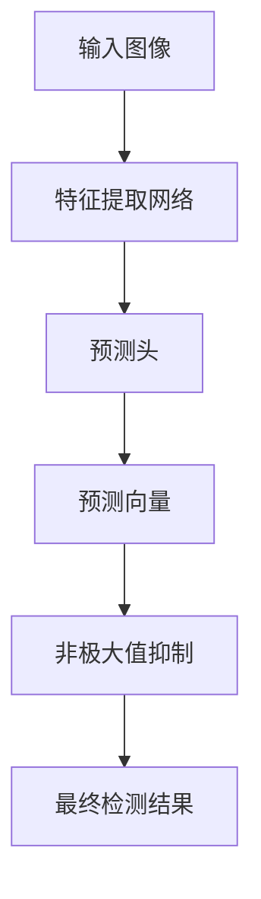

# YOLOv5原理与代码实例讲解

## 1.背景介绍

在计算机视觉领域,目标检测是一项极具挑战的任务。它需要同时定位目标对象在图像中的位置,并对目标对象进行分类。传统的目标检测算法通常采用滑动窗口的方式在图像上进行密集搜索,计算量极大,难以满足实时性的要求。

2015年,Joseph Redmon等人提出了YOLO(You Only Look Once)算法,将目标检测任务转化为端到端的回归问题,取得了革命性的突破。YOLO算法直接从整张图像中预测边界框和类别概率,无需传统方法中的候选区域生成过程,大大提高了目标检测的速度。

YOLOv5是由Glenn Jocher在2020年基于YOLOv3和YOLOv4进行改进和优化后推出的目标检测算法。它在保持高精度的同时,进一步提升了推理速度,并支持多种训练模式和推理导出。凭借出色的性能表现,YOLOv5已被广泛应用于各种视觉任务中。

## 2.核心概念与联系 

### 2.1 单阶段检测器

YOLOv5属于单阶段目标检测器,与双阶段检测器(如Faster R-CNN)不同,它不需要先生成候选区域框,而是直接对整个图像进行预测。这种端到端的方式避免了传统滑动窗口和候选区域生成的巨大计算开销。

### 2.2 锚框与预测向量

YOLOv5将输入图像划分为SxS个网格,每个网格单元需要预测B个边界框,以及每个边界框所属的类别概率。这B个边界框被称为锚框(anchor box),是预先设置的不同形状和比例的先验框。

每个锚框由一个预测向量(x,y,w,h,conf,c1,c2,...)来表示,其中:
- (x,y)是边界框中心坐标相对于网格单元的偏移量
- (w,h)是边界框的宽高
- conf是边界框置信度得分
- (c1,c2,...)是各个类别的概率得分

### 2.3 损失函数

YOLOv5的损失函数由三部分组成:边界框坐标损失、置信度损失和分类损失。通过最小化这三部分的加权和,来优化网络权重参数。

## 3.核心算法原理具体操作步骤

YOLOv5算法的具体原理和操作步骤如下:



1. **输入图像**:首先将输入图像缩放到适当的尺寸,以满足网络输入要求。

2. **特征提取网络**:输入图像经过一系列卷积层和残差模块,提取出多尺度特征图。这一步使用的是CSPDarknet53作为主干网络。

3. **预测头**:特征图被输入到三个不同尺度的预测头中,每个预测头都会为每个网格单元生成B个锚框,并预测出对应的预测向量(x,y,w,h,conf,c1,c2,...)。

4. **预测向量解码**:将预测向量解码为实际的边界框坐标、置信度和类别概率。

5. **非极大值抑制**:对解码后的边界框进行非极大值抑制(NMS),去除重叠度较高的冗余框。

6. **最终检测结果**:输出保留下来的目标检测框及其类别和置信度。

## 4.数学模型和公式详细讲解举例说明

### 4.1 边界框回归

YOLOv5中,锚框的中心坐标、宽高相对于网格单元的偏移量,由以下公式计算得到:

$$
b_x = \sigma(t_x) + c_x \\
b_y = \sigma(t_y) + c_y \\
b_w = p_w e^{t_w} \\
b_h = p_h e^{t_h}
$$

其中:
- $(t_x, t_y)$是网络预测的x,y偏移量
- $(c_x, c_y)$是网格单元的左上角坐标
- $(p_w, p_h)$是先验锚框的宽高
- $(t_w, t_h)$是网络预测的宽高调整量

这种参数化方式使得网络只需要预测较小的调整量,从而简化了回归任务。

### 4.2 损失函数

YOLOv5的损失函数由三部分组成:

$$
\mathcal{L} = \mathcal{L}_{box} + \mathcal{L}_{obj} + \mathcal{L}_{cls}
$$

其中:

**边界框坐标损失**:

$$
\mathcal{L}_{box} = \lambda_{coord} \sum_{i=0}^{S^2}\sum_{j=0}^{B} \mathbb{1}_{ij}^{obj}[(1 - \hat{w}_i)^2 + (1 - \hat{h}_i)^2]
$$

**置信度损失**:

$$
\mathcal{L}_{obj} = \lambda_{noobj} \sum_{i=0}^{S^2}\sum_{j=0}^{B} \mathbb{1}_{ij}^{noobj}(\hat{C}_i)^2 + \lambda_{obj} \sum_{i=0}^{S^2}\sum_{j=0}^{B} \mathbb{1}_{ij}^{obj}(1 - \hat{C}_i)^2  
$$

**分类损失**:

$$
\mathcal{L}_{cls} = \sum_{i=0}^{S^2}\sum_{j=0}^{B} \mathbb{1}_{ij}^{obj} \sum_{c \in \text{classes}} (p_i(c) - \hat{p}_i(c))^2
$$

这里$\lambda$是权重系数,用于平衡不同损失项的贡献。$\mathbb{1}_{ij}^{obj}$和$\mathbb{1}_{ij}^{noobj}$是指示函数,用于选择负责预测的锚框。

通过最小化这三部分损失的加权和,网络可以同时学习预测准确的边界框坐标、置信度以及类别概率。

### 4.3 实例分割

除了目标检测,YOLOv5还支持实例分割任务。在预测向量中增加额外的掩码(mask)分支,即可输出每个目标实例的像素级掩码。这种方式避免了复杂的proposal生成和RoIPooling操作,大大提高了实例分割的效率。

## 5.项目实践:代码实例和详细解释说明

以下是使用PyTorch实现的YOLOv5目标检测代码示例,并对关键部分进行详细解释。

### 5.1 模型定义

```python
import torch
import torch.nn as nn

# 定义卷积块
def conv_block(in_channels, out_channels, kernel_size, stride, padding, activate=True):
    layers = [nn.Conv2d(in_channels, out_channels, kernel_size, stride, padding, bias=False)]
    layers.append(nn.BatchNorm2d(out_channels))
    if activate:
        layers.append(nn.LeakyReLU(0.1, inplace=True))
    return nn.Sequential(*layers)

# YOLOv5主干网络
class CSPDarknet(nn.Module):
    ...

# YOLOv5检测头
class YOLOHead(nn.Module):
    ...

# YOLOv5模型
class YOLOv5(nn.Module):
    def __init__(self, num_classes=80):
        super().__init__()
        self.backbone = CSPDarknet()
        self.head_1 = YOLOHead(...)
        self.head_2 = YOLOHead(...)
        self.head_3 = YOLOHead(...)
    
    def forward(self, x):
        outputs = []
        x = self.backbone(x)
        output_1 = self.head_1(x[2])
        output_2 = self.head_2(x[1])
        output_3 = self.head_3(x[0])
        outputs.append(output_1)
        outputs.append(output_2)
        outputs.append(output_3)
        return outputs
```

在这个示例中,我们定义了YOLOv5的主干网络CSPDarknet和检测头YOLOHead。YOLOv5模型将输入图像传递给主干网络,提取出多尺度特征图。然后,这些特征图被输入到三个不同尺度的检测头中,每个检测头会为对应尺度的网格单元预测锚框。

### 5.2 损失函数计算

```python
import torch.nn.functional as F

def bbox_iou(box1, box2, x1y1x2y2=True):
    # 计算IoU
    ...

def yolov5_loss(preds, targets, anchors):
    # 初始化损失
    loss_box = torch.tensor(0.0, device=preds[0].device)
    loss_obj = torch.tensor(0.0, device=preds[0].device)
    loss_cls = torch.tensor(0.0, device=preds[0].device)
    
    # 遍历每个预测头
    for pred, target, anch in zip(preds, targets, anchors):
        # 获取正样本索引
        obj_mask = target[..., 0] > 0
        nobj_mask = ~obj_mask
        
        # 计算边界框坐标损失
        loss_box += F.mse_loss(pred[obj_mask, :4], target[obj_mask, 1:5], reduction='sum')
        
        # 计算置信度损失
        loss_obj += F.binary_cross_entropy(pred[obj_mask, 4], target[obj_mask, 0], reduction='sum')
        loss_obj += F.binary_cross_entropy(pred[nobj_mask, 4], target[nobj_mask, 0], reduction='sum')
        
        # 计算分类损失
        loss_cls += F.cross_entropy(pred[obj_mask, 5:], target[obj_mask, 5].long(), reduction='sum')
        
    # 计算总损失
    total_loss = loss_box + loss_obj + loss_cls
    return total_loss
```

在这个示例中,我们实现了YOLOv5的损失函数计算。首先,我们根据目标边界框信息,确定每个网格单元中的正样本(存在目标)和负样本(不存在目标)。然后,分别计算边界框坐标损失、置信度损失和分类损失。最后,将三部分损失相加得到总损失。

### 5.3 非极大值抑制

```python
def non_max_suppression(preds, conf_thres=0.25, iou_thres=0.45):
    # 初始化输出列表
    output = [None for _ in range(len(preds))]
    
    # 遍历每个预测头
    for i, pred in enumerate(preds):
        # 过滤低置信度边界框
        boxes = pred[pred[:, 4] > conf_thres]
        
        # 非极大值抑制
        scores = boxes[:, 4]
        keep = torch.tensor([], dtype=torch.long)
        while scores.numel() > 0:
            # 获取当前置信度最高的边界框
            max_score, max_idx = scores.max(0)
            keep = torch.cat((keep, max_idx.view(1)))
            
            # 计算IoU
            box = boxes[max_idx]
            iou = bbox_iou(box.unsqueeze(0), boxes)
            
            # 移除重叠边界框
            mask = iou < iou_thres
            boxes = boxes[mask]
            scores = scores[mask]
        
        output[i] = boxes[keep]
    
    return output
```

在这个示例中,我们实现了非极大值抑制(NMS)算法。首先,我们过滤掉置信度较低的边界框。然后,对剩余的边界框进行NMS操作,移除重叠度较高的冗余框。NMS算法按照置信度从高到低遍历每个边界框,计算其与其他框的IoU,并移除IoU超过阈值的框。最终,我们得到每个预测头的最终检测结果。

## 6.实际应用场景

YOLOv5作为一种高效准确的目标检测算法,已被广泛应用于各种计算机视觉任务中,包括但不限于:

1. **安防监控**:在监控摄像头中部署YOLOv5,可以实时检测和跟踪运动目标,用于安全防范。

2. **无人驾驶**:在自动驾驶汽车上使用YOLOv5,可以检测路面上的行人、车辆、障碍物等,为决策系统提供重要信息。

3. **机器人视觉**:在机器人系统中集成YOLOv5,可以实现目标识别和抓取等功能。

4. **农业智能化**:利用YOLOv5对农作物、病虫害进行检测,为精准农业提供数据支持。

5. **工业自动化**:在工业生产线上部署YOLOv5,可以实现产品缺陷检测、物料识别等功能。

6. **医疗影