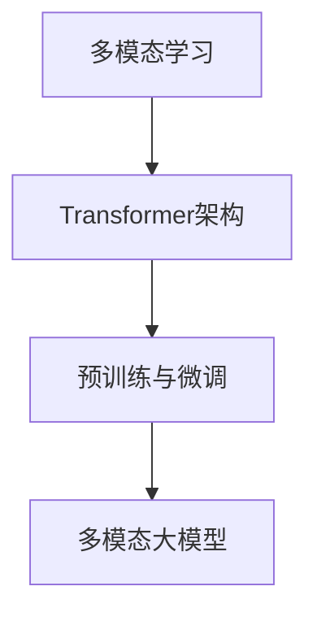

# 多模态大模型：技术原理与实战 OpenAI成功的因素

## 1. 背景介绍
### 1.1 人工智能的发展历程
#### 1.1.1 经典人工智能时代
#### 1.1.2 机器学习时代 
#### 1.1.3 深度学习时代
### 1.2 大模型的兴起
#### 1.2.1 大模型的定义
#### 1.2.2 大模型的发展历程
#### 1.2.3 大模型的应用前景
### 1.3 OpenAI的崛起
#### 1.3.1 OpenAI的创立背景
#### 1.3.2 OpenAI的发展历程
#### 1.3.3 OpenAI的代表性成果

## 2. 核心概念与联系
### 2.1 多模态学习
#### 2.1.1 多模态学习的定义
#### 2.1.2 多模态学习的优势
#### 2.1.3 多模态学习的挑战
### 2.2 Transformer架构
#### 2.2.1 Transformer的提出背景
#### 2.2.2 Transformer的核心思想
#### 2.2.3 Transformer的技术细节
### 2.3 预训练与微调
#### 2.3.1 预训练的概念
#### 2.3.2 微调的概念
#### 2.3.3 预训练与微调的关系
### 2.4 核心概念之间的联系


## 3. 核心算法原理具体操作步骤
### 3.1 多模态Transformer
#### 3.1.1 多模态Transformer的结构
#### 3.1.2 多模态Transformer的训练过程
#### 3.1.3 多模态Transformer的推理过程
### 3.2 对比学习
#### 3.2.1 对比学习的基本原理
#### 3.2.2 对比学习在多模态中的应用
#### 3.2.3 对比学习的优化技巧
### 3.3 知识蒸馏
#### 3.3.1 知识蒸馏的概念
#### 3.3.2 知识蒸馏在多模态中的应用
#### 3.3.3 知识蒸馏的优化方法

## 4. 数学模型和公式详细讲解举例说明
### 4.1 Transformer的数学原理
#### 4.1.1 自注意力机制
$Attention(Q,K,V) = softmax(\frac{QK^T}{\sqrt{d_k}})V$
其中，$Q$、$K$、$V$分别表示查询、键、值向量，$d_k$为向量维度。
#### 4.1.2 多头注意力
$$MultiHead(Q,K,V) = Concat(head_1,...,head_h)W^O$$
$$head_i = Attention(QW_i^Q, KW_i^K, VW_i^V)$$
其中，$W_i^Q \in \mathbb{R}^{d_{model} \times d_k}$，$W_i^K \in \mathbb{R}^{d_{model} \times d_k}$，$W_i^V \in \mathbb{R}^{d_{model} \times d_v}$，$W^O \in \mathbb{R}^{hd_v \times d_{model}}$。
#### 4.1.3 前馈神经网络
$$FFN(x) = max(0, xW_1 + b_1)W_2 + b_2$$
其中，$W_1 \in \mathbb{R}^{d_{model} \times d_{ff}}$，$W_2 \in \mathbb{R}^{d_{ff} \times d_{model}}$，$b_1 \in \mathbb{R}^{d_{ff}}$，$b_2 \in \mathbb{R}^{d_{model}}$。
### 4.2 对比学习的数学原理 
#### 4.2.1 InfoNCE损失函数
$$\mathcal{L}_{NCE}(x, x^+, \{x^-\}) = -\log \frac{\exp(f(x)^T f(x^+))}{\exp(f(x)^T f(x^+)) + \sum_{x^-}\exp(f(x)^T f(x^-))}$$
其中，$x$为锚点样本，$x^+$为正样本，$\{x^-\}$为负样本集合，$f(\cdot)$为编码器网络。
#### 4.2.2 对比学习目标函数
$$\mathcal{J}_{CL} = \mathbb{E}_{x \sim \mathcal{D}} [\mathcal{L}_{NCE}(x, x^+, \{x^-\})]$$
其中，$\mathcal{D}$为数据分布。
### 4.3 知识蒸馏的数学原理
#### 4.3.1 软目标蒸馏
$$\mathcal{L}_{KD}(y_s, y_t) = \mathcal{H}(y_s, \sigma(y_t/T))$$
其中，$y_s$为学生模型输出，$y_t$为教师模型输出，$\sigma(\cdot)$为softmax函数，$T$为温度参数，$\mathcal{H}(\cdot)$为交叉熵损失函数。
#### 4.3.2 注意力蒸馏
$$\mathcal{L}_{AD}(A_s, A_t) = \frac{1}{L}\sum_{l=1}^L \lVert A_s^l - A_t^l \rVert_2^2$$
其中，$A_s^l$为学生模型第$l$层注意力矩阵，$A_t^l$为教师模型第$l$层注意力矩阵，$L$为模型层数。

## 5. 项目实践：代码实例和详细解释说明
### 5.1 多模态Transformer实现
```python
import torch
import torch.nn as nn

class MultimodalTransformer(nn.Module):
    def __init__(self, d_model, nhead, num_layers):
        super().__init__()
        self.visual_encoder = VisualTransformer(d_model, nhead, num_layers)
        self.text_encoder = TextTransformer(d_model, nhead, num_layers)
        self.fusion_layer = nn.Linear(2*d_model, d_model)
        self.output_layer = nn.Linear(d_model, num_classes)
        
    def forward(self, visual_inputs, text_inputs):
        visual_features = self.visual_encoder(visual_inputs)
        text_features = self.text_encoder(text_inputs)
        fused_features = torch.cat([visual_features, text_features], dim=-1)
        fused_features = self.fusion_layer(fused_features)
        outputs = self.output_layer(fused_features)
        return outputs
```
上述代码实现了一个简单的多模态Transformer模型，包含视觉编码器、文本编码器、特征融合层和输出层。视觉编码器和文本编码器分别对图像和文本进行特征提取，然后将提取的特征拼接后经过融合层和输出层得到最终的预测结果。

### 5.2 对比学习实现
```python
import torch
import torch.nn as nn

class ContrastiveLearning(nn.Module):
    def __init__(self, encoder, projection_dim, temperature):
        super().__init__()
        self.encoder = encoder
        self.projector = nn.Sequential(
            nn.Linear(encoder.output_dim, projection_dim),
            nn.ReLU(),
            nn.Linear(projection_dim, projection_dim)
        )
        self.temperature = temperature
        
    def forward(self, x1, x2):
        z1 = self.projector(self.encoder(x1))
        z2 = self.projector(self.encoder(x2))
        z1 = z1 / torch.norm(z1, p=2, dim=-1, keepdim=True)
        z2 = z2 / torch.norm(z2, p=2, dim=-1, keepdim=True)
        logits = torch.matmul(z1, z2.T) / self.temperature
        labels = torch.arange(z1.size(0))
        loss = nn.CrossEntropyLoss()(logits, labels)
        return loss
```
上述代码实现了一个简单的对比学习模型，包含编码器和投影头。给定一对正样本$(x1, x2)$，编码器分别对其进行特征提取得到表示向量，然后经过投影头映射到相同的低维空间，最后通过InfoNCE损失函数优化编码器和投影头的参数，使得正样本的表示在低维空间中更加接近。

### 5.3 知识蒸馏实现
```python
import torch
import torch.nn as nn

class KnowledgeDistillation(nn.Module):
    def __init__(self, teacher_model, student_model, temperature):
        super().__init__()
        self.teacher = teacher_model
        self.student = student_model
        self.temperature = temperature
        
    def forward(self, inputs):
        with torch.no_grad():
            teacher_outputs = self.teacher(inputs)
        student_outputs = self.student(inputs)
        soft_loss = nn.KLDivLoss()(
            nn.functional.log_softmax(student_outputs/self.temperature, dim=1),
            nn.functional.softmax(teacher_outputs/self.temperature, dim=1)
        ) * (self.temperature**2)
        hard_loss = nn.CrossEntropyLoss()(student_outputs, labels)
        loss = soft_loss + hard_loss
        return loss
```
上述代码实现了一个简单的知识蒸馏模型，包含教师模型和学生模型。在训练过程中，固定教师模型的参数，学生模型通过最小化软目标损失和硬目标损失来学习教师模型的知识。其中，软目标损失使用KL散度来度量学生模型和教师模型输出分布的差异，硬目标损失使用交叉熵损失来度量学生模型的预测与真实标签的差异。

## 6. 实际应用场景
### 6.1 多模态情感分析
多模态大模型可以用于情感分析任务，通过融合文本、语音、视频等不同模态的信息，更准确地判断用户的情感倾向。例如，给定一段包含文本、语音、视频的用户评论，多模态大模型可以综合分析不同模态传递的情感信息，得出用户的整体情感倾向，如积极、中性、消极等。

### 6.2 多模态问答系统
多模态大模型可以用于构建智能问答系统，回答用户的各种问题。用户可以以文本、语音、图像等不同形式提出问题，多模态大模型通过理解不同模态的问题表述，结合自身的知识库，给出准确、完整的答案。多模态问答系统可以应用于智能客服、智能教育等场景，提升用户体验。

### 6.3 多模态内容生成
多模态大模型可以用于创作丰富多彩的内容，如根据文本描述生成对应的图像，根据图像生成对应的文本描述，根据音乐生成对应的歌词等。通过多模态大模型强大的跨模态生成能力，人们可以高效地创作出图文并茂的内容，应用于设计、娱乐、教育等领域。

## 7. 工具和资源推荐
### 7.1 开源工具包
- Hugging Face Transformers：包含大量预训练的Transformer模型和下游任务的开源工具包。
- OpenAI CLIP：用于学习图像-文本表示的开源工具包。
- Fairseq：Facebook开源的序列建模工具包，支持多种任务如机器翻译、语言模型等。

### 7.2 开放数据集
- MS COCO：大规模图像描述数据集，包含超过12万张图像和对应的文本描述。
- Flickr30K：包含31,783张图像和每张图像5个英文句子描述的数据集。
- VQA：基于图像的问答数据集，包含超过20万张图像和对应的问答对。

### 7.3 学习资源
- CS224n：斯坦福大学的自然语言处理课程，主要介绍了深度学习在NLP中的应用。
- CS231n：斯坦福大学的计算机视觉课程，主要介绍了深度学习在CV中的应用。
- 动手学深度学习：深度学习入门教程，提供了大量Jupyter Notebook示例。

## 8. 总结：未来发展趋势与挑战
### 8.1 未来发展趋势
- 更大规模的多模态预训练模型：未来将会出现更大规模的多模态预训练模型，融合更多模态的信息，具备更强大的跨模态理解和生成能力。
- 更高效的训练和推理方法：如何高效地训练和推理大规模多模态模型是一大挑战，需要探索新的优化方法、加速技术、压缩技术等。
- 更广泛的应用场景：多模态大模型将在更多领域得到应用，如医疗、金融、教育等，为这些领域带来革命性的变化。

### 8.2 面临的挑战
- 数据质量和规模：构建高质量的大规模多模态数据集需要消耗大量人力物力，对数据的采集、清洗、标注等提出了更高要求。  
- 计算资源和成本：训练大规模多模态模型需要消耗大量计算资源