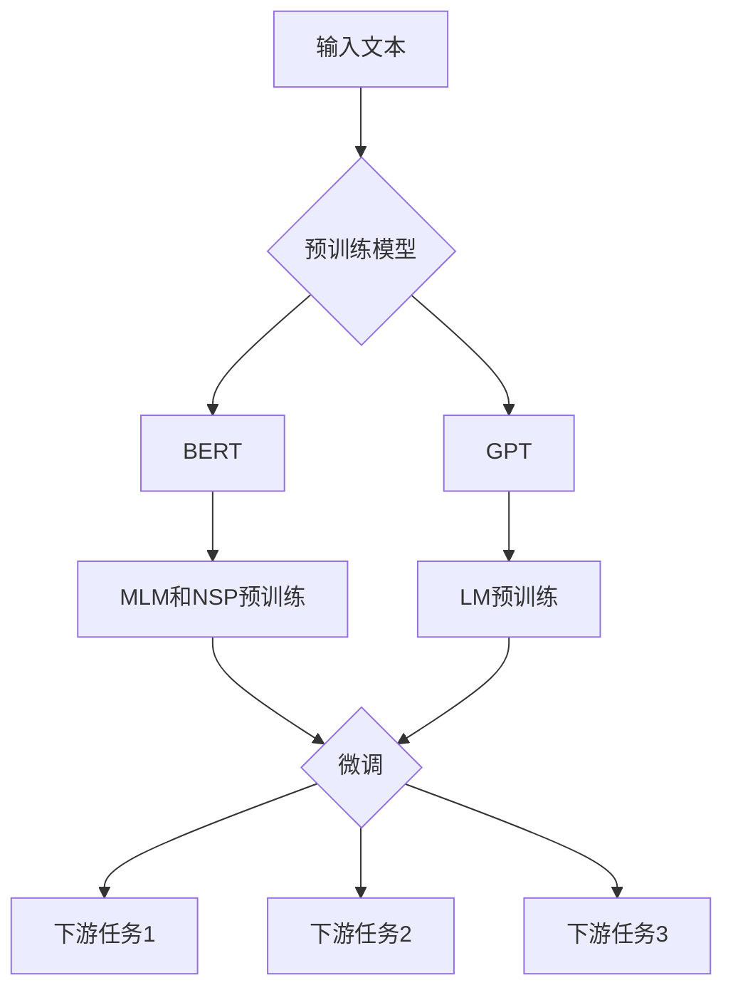

# 大规模预训练语言模型：BERT与GPT争锋

## 1. 背景介绍
### 1.1 自然语言处理的发展历程
#### 1.1.1 早期的规则与统计方法
#### 1.1.2 神经网络的兴起
#### 1.1.3 注意力机制与Transformer架构
### 1.2 预训练语言模型的诞生
#### 1.2.1 Word2Vec与GloVe
#### 1.2.2 ELMo与ULMFiT
#### 1.2.3 GPT与BERT的横空出世

## 2. 核心概念与联系
### 2.1 预训练与微调
#### 2.1.1 无监督预训练
#### 2.1.2 有监督微调
#### 2.1.3 预训练与微调的优势
### 2.2 自注意力机制
#### 2.2.1 自注意力的计算过程
#### 2.2.2 多头自注意力
#### 2.2.3 自注意力的优势
### 2.3 Transformer架构
#### 2.3.1 编码器与解码器
#### 2.3.2 残差连接与层归一化
#### 2.3.3 位置编码
### 2.4 BERT与GPT的异同
#### 2.4.1 预训练任务的差异
#### 2.4.2 输入表示的差异
#### 2.4.3 双向与单向的差异

## 3. 核心算法原理具体操作步骤
### 3.1 BERT的预训练
#### 3.1.1 Masked Language Model (MLM)
#### 3.1.2 Next Sentence Prediction (NSP)
#### 3.1.3 输入表示
### 3.2 GPT的预训练
#### 3.2.1 Language Modeling (LM)
#### 3.2.2 输入表示
### 3.3 微调过程
#### 3.3.1 下游任务的输入表示
#### 3.3.2 微调的训练过程
#### 3.3.3 微调的优化策略

## 4. 数学模型和公式详细讲解举例说明
### 4.1 自注意力机制的数学表示
#### 4.1.1 查询、键、值的计算
#### 4.1.2 注意力权重的计算
#### 4.1.3 注意力输出的计算
### 4.2 Transformer的数学表示
#### 4.2.1 编码器的数学表示
#### 4.2.2 解码器的数学表示
#### 4.2.3 残差连接与层归一化的数学表示
### 4.3 BERT的数学表示
#### 4.3.1 MLM的数学表示
#### 4.3.2 NSP的数学表示
#### 4.3.3 BERT的损失函数
### 4.4 GPT的数学表示  
#### 4.4.1 LM的数学表示
#### 4.4.2 GPT的损失函数

## 5. 项目实践：代码实例和详细解释说明
### 5.1 BERT的预训练代码实例
#### 5.1.1 数据准备
#### 5.1.2 模型构建
#### 5.1.3 训练过程
### 5.2 GPT的预训练代码实例  
#### 5.2.1 数据准备
#### 5.2.2 模型构建
#### 5.2.3 训练过程
### 5.3 下游任务微调代码实例
#### 5.3.1 数据准备
#### 5.3.2 模型构建
#### 5.3.3 训练与评估

## 6. 实际应用场景
### 6.1 文本分类
#### 6.1.1 情感分析
#### 6.1.2 新闻分类
#### 6.1.3 意图识别
### 6.2 命名实体识别
#### 6.2.1 人名识别
#### 6.2.2 地名识别
#### 6.2.3 组织机构名识别  
### 6.3 问答系统
#### 6.3.1 阅读理解
#### 6.3.2 开放域问答
#### 6.3.3 常识问答
### 6.4 机器翻译
#### 6.4.1 神经机器翻译
#### 6.4.2 无监督机器翻译
#### 6.4.3 低资源机器翻译

## 7. 工具和资源推荐
### 7.1 预训练模型
#### 7.1.1 BERT系列模型
#### 7.1.2 GPT系列模型
#### 7.1.3 其他预训练模型
### 7.2 开源框架与工具
#### 7.2.1 TensorFlow
#### 7.2.2 PyTorch
#### 7.2.3 Hugging Face Transformers
### 7.3 数据集资源
#### 7.3.1 通用语料库
#### 7.3.2 下游任务数据集
#### 7.3.3 多语言数据集

## 8. 总结：未来发展趋势与挑战
### 8.1 模型的发展趋势 
#### 8.1.1 更大规模的预训练模型
#### 8.1.2 更高效的预训练方法
#### 8.1.3 更精细的知识表示
### 8.2 应用的发展趋势
#### 8.2.1 跨模态学习
#### 8.2.2 可解释性与鲁棒性
#### 8.2.3 个性化与隐私保护
### 8.3 面临的挑战
#### 8.3.1 计算资源的限制
#### 8.3.2 数据质量与标注成本
#### 8.3.3 模型的泛化能力

## 9. 附录：常见问题与解答
### 9.1 预训练语言模型的本质是什么？
### 9.2 BERT与GPT的主要区别在哪里？
### 9.3 如何选择合适的预训练模型？
### 9.4 微调过程中需要注意哪些问题？
### 9.5 预训练语言模型的局限性有哪些？

随着深度学习技术的快速发展，自然语言处理（NLP）领域也迎来了革命性的变革。其中，大规模预训练语言模型的出现，更是掀起了NLP领域的一场巨大风暴。BERT（Bidirectional Encoder Representations from Transformers）和GPT（Generative Pre-trained Transformer）作为两大预训练语言模型的代表，在学术界和工业界都引起了广泛的关注和应用。

BERT由Google于2018年提出，其核心思想是通过无监督的预训练任务，学习文本的双向表示。与之前的语言模型不同，BERT采用了Masked Language Model（MLM）和Next Sentence Prediction（NSP）两个预训练任务，分别捕捉单词级别和句子级别的语义信息。在预训练阶段，BERT随机地Mask掉一部分单词，并尝试预测这些被Mask掉的单词。同时，BERT还尝试预测两个句子是否相邻。这种双向的预训练方式，使得BERT能够更好地理解文本的上下文信息，从而获得更加准确和鲁棒的语义表示。

与BERT不同，GPT采用了单向的语言模型预训练任务。GPT的目标是根据前面的单词预测下一个单词，通过这种自回归的方式，GPT能够生成连贯且流畅的文本。GPT在预训练阶段使用了大规模的无标注语料库，通过不断地预测下一个单词，学习到了丰富的语言知识和常识。GPT的生成能力非常强大，在许多自然语言生成任务上都取得了优异的表现。

BERT和GPT的预训练都基于Transformer架构。Transformer通过自注意力机制，能够捕捉单词之间的长距离依赖关系，从而更好地理解文本的语义。在自注意力机制中，每个单词都与其他所有单词进行交互，计算它们之间的注意力权重。这种全局的交互方式，使得Transformer能够更好地处理长文本和复杂语义。

在预训练完成后，BERT和GPT都可以通过微调的方式，应用于各种下游的NLP任务，如文本分类、命名实体识别、问答系统、机器翻译等。微调过程通常只需要少量的标注数据，并在预训练模型的基础上进行简单的调整，就能够在特定任务上取得很好的效果。这种"预训练+微调"的范式，大大降低了NLP任务的数据需求和训练成本，使得许多以前难以处理的任务变得可行。

为了更直观地理解BERT和GPT的工作原理，我们可以通过数学模型和公式来进行详细的讲解。在自注意力机制中，每个单词的表示都是通过与其他单词的交互计算得到的。具体来说，对于单词 $i$，我们首先计算它与其他所有单词的注意力权重：

$$
\alpha_{ij} = \frac{\exp(e_{ij})}{\sum_{k=1}^n \exp(e_{ik})}
$$

其中，$e_{ij}$ 表示单词 $i$ 对单词 $j$ 的注意力分数，通常通过单词的查询向量 $q_i$ 和键向量 $k_j$ 的点积计算得到：

$$
e_{ij} = q_i \cdot k_j
$$

得到注意力权重后，我们可以计算单词 $i$ 的注意力输出：

$$
z_i = \sum_{j=1}^n \alpha_{ij} v_j
$$

其中，$v_j$ 表示单词 $j$ 的值向量。通过这种注意力机制，每个单词都能够根据上下文的信息，动态地调整自己的表示。

在BERT的预训练中，MLM任务的目标是最大化被Mask单词的对数似然概率：

$$
\mathcal{L}_{\text{MLM}} = -\sum_{i \in \mathcal{M}} \log p(w_i | \boldsymbol{w}_{\backslash \mathcal{M}})
$$

其中，$\mathcal{M}$ 表示被Mask的单词集合，$\boldsymbol{w}_{\backslash \mathcal{M}}$ 表示未被Mask的单词序列。NSP任务的目标是最大化两个句子是否相邻的对数似然概率：

$$
\mathcal{L}_{\text{NSP}} = -\log p(y | \boldsymbol{s}_1, \boldsymbol{s}_2)
$$

其中，$y$ 表示两个句子是否相邻的标签，$\boldsymbol{s}_1$ 和 $\boldsymbol{s}_2$ 分别表示两个句子的单词序列。

在GPT的预训练中，语言模型的目标是最大化下一个单词的对数似然概率：

$$
\mathcal{L}_{\text{LM}} = -\sum_{i=1}^n \log p(w_i | \boldsymbol{w}_{<i})
$$

其中，$\boldsymbol{w}_{<i}$ 表示位置 $i$ 之前的单词序列。

通过以上的数学模型和公式，我们可以更加清晰地理解BERT和GPT的预训练原理。在实际应用中，我们可以使用现有的开源框架和工具，如TensorFlow、PyTorch、Hugging Face Transformers等，来快速地构建和训练预训练语言模型。同时，我们还可以利用已经预训练好的模型，如BERT-Base、BERT-Large、GPT-2、GPT-3等，直接应用于下游任务，从而节省大量的计算资源和时间成本。

展望未来，预训练语言模型还有许多发展的空间和机遇。一方面，研究人员正在探索更大规模的预训练模型，如GPT-3、Switch Transformer等，希望通过增加模型的参数量和训练数据的规模，进一步提升模型的性能和泛化能力。另一方面，如何设计更加高效和精简的预训练方法，如ALBERT、DistilBERT等，也是一个重要的研究方向。此外，如何将预训练语言模型应用于更加广泛的场景，如跨模态学习、可解释性分析、个性化服务等，也是未来的重要挑战和机遇。

总之，BERT和GPT的出现，标志着NLP领域进入了预训练语言模型的新时代。这两大模型在学术界和工业界都取得了巨大的成功，并且还在不断地发展和进步。相信在未来，预训练语言模型将会在更多的领域和任务中发挥重要的作用，推动人工智能技术的不断进步和应用。

作者：禅与计算机程序设计艺术 / Zen and the Art of Computer Programming