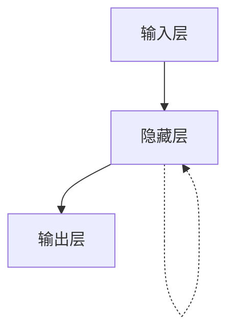

# 循环神经网络(RNN)原理与代码实战案例讲解

## 1. 背景介绍
### 1.1 什么是循环神经网络
### 1.2 循环神经网络的发展历程
### 1.3 循环神经网络的应用领域

## 2. 核心概念与联系 
### 2.1 RNN的网络结构
#### 2.1.1 输入层
#### 2.1.2 隐藏层
#### 2.1.3 输出层
### 2.2 RNN的前向传播与反向传播
#### 2.2.1 前向传播
#### 2.2.2 反向传播与梯度消失问题
### 2.3 RNN与其他神经网络的联系
#### 2.3.1 RNN与前馈神经网络的区别
#### 2.3.2 RNN与卷积神经网络的区别

## 3. 核心算法原理具体操作步骤
### 3.1 基本RNN的前向传播与反向传播
#### 3.1.1 基本RNN的前向传播
#### 3.1.2 基本RNN的反向传播
### 3.2 LSTM的前向传播与反向传播
#### 3.2.1 LSTM的网络结构
#### 3.2.2 LSTM的前向传播
#### 3.2.3 LSTM的反向传播
### 3.3 GRU的前向传播与反向传播 
#### 3.3.1 GRU的网络结构
#### 3.3.2 GRU的前向传播
#### 3.3.3 GRU的反向传播

## 4. 数学模型和公式详细讲解举例说明
### 4.1 基本RNN的数学模型
#### 4.1.1 基本RNN前向传播的数学模型
#### 4.1.2 基本RNN反向传播的数学模型
### 4.2 LSTM的数学模型
#### 4.2.1 遗忘门
#### 4.2.2 输入门
#### 4.2.3 输出门
#### 4.2.4 状态更新
### 4.3 GRU的数学模型
#### 4.3.1 更新门
#### 4.3.2 重置门
#### 4.3.3 状态更新

## 5. 项目实践：代码实例和详细解释说明
### 5.1 基本RNN的代码实现
#### 5.1.1 基本RNN的前向传播代码
#### 5.1.2 基本RNN的反向传播代码
### 5.2 LSTM的代码实现
#### 5.2.1 LSTM的前向传播代码
#### 5.2.2 LSTM的反向传播代码
### 5.3 GRU的代码实现
#### 5.3.1 GRU的前向传播代码
#### 5.3.2 GRU的反向传播代码

## 6. 实际应用场景
### 6.1 自然语言处理
#### 6.1.1 语言模型
#### 6.1.2 机器翻译
#### 6.1.3 情感分析
### 6.2 语音识别
### 6.3 时间序列预测
#### 6.3.1 股票价格预测
#### 6.3.2 天气预测
#### 6.3.3 交通流量预测

## 7. 工具和资源推荐
### 7.1 深度学习框架
#### 7.1.1 TensorFlow
#### 7.1.2 PyTorch
#### 7.1.3 Keras
### 7.2 数据集
#### 7.2.1 Penn Treebank (PTB) 
#### 7.2.2 WikiText
#### 7.2.3 IMDB 电影评论数据集
### 7.3 预训练模型
#### 7.3.1 Word2Vec
#### 7.3.2 GloVe
#### 7.3.3 FastText

## 8. 总结：未来发展趋势与挑战
### 8.1 RNN的局限性
### 8.2 注意力机制与Transformer
### 8.3 图神经网络
### 8.4 强化学习与RNN
### 8.5 RNN在多模态学习中的应用

## 9. 附录：常见问题与解答
### 9.1 RNN中的梯度消失和梯度爆炸问题如何解决？
### 9.2 LSTM和GRU在什么场景下会有更好的表现？
### 9.3 如何处理可变长度的输入序列？
### 9.4 如何加速RNN的训练过程？
### 9.5 如何解释RNN模型的预测结果？

## 1. 背景介绍

循环神经网络（Recurrent Neural Network，RNN）是一种用于处理序列数据的神经网络模型。与传统的前馈神经网络不同，RNN引入了时间的概念，可以处理具有时序关系的数据，如自然语言、语音、时间序列等。RNN在许多领域都取得了巨大的成功，如语言模型、机器翻译、语音识别、图像描述生成等。

RNN的概念最早由Hopfield在1982年提出，但由于训练困难等问题，其发展一度受到限制。直到1997年，Hochreiter和Schmidhuber提出了长短期记忆网络（Long Short-Term Memory，LSTM），有效地解决了梯度消失和梯度爆炸问题，使得RNN重新焕发生机。此后，RNN及其变体如GRU（Gated Recurrent Unit）、BiRNN（Bidirectional RNN）等被广泛应用于各个领域。

近年来，随着深度学习的发展，RNN与其他技术的结合也取得了长足的进步。如注意力机制（Attention Mechanism）与RNN的结合，使得模型能够更好地关注输入序列中的关键信息；Transformer模型的出现，进一步突破了RNN在并行计算方面的瓶颈；图神经网络（Graph Neural Network，GNN）与RNN的结合，使得模型能够同时处理序列数据和图结构数据。

总的来说，RNN是一个非常重要且有潜力的研究方向。深入理解RNN的原理，掌握其应用技巧，对于从事自然语言处理、语音识别、时间序列预测等领域的研究者和工程师来说，都是非常必要的。

## 2. 核心概念与联系

### 2.1 RNN的网络结构

RNN的网络结构主要由三部分组成：输入层、隐藏层和输出层。其中，隐藏层是RNN的核心，它不仅接收当前时刻的输入，还接收上一时刻隐藏层的状态。这种循环连接的结构使得RNN能够在时序数据中捕捉到长距离的依赖关系。

#### 2.1.1 输入层

输入层接收当前时刻的输入数据。对于不同类型的任务，输入数据可以是词向量、音频特征、图像特征等。

#### 2.1.2 隐藏层

隐藏层是RNN的核心，它包含了循环连接的结构。隐藏层的状态不仅取决于当前时刻的输入，还取决于上一时刻隐藏层的状态。通过这种循环连接，RNN能够在时序数据中捕捉到长距离的依赖关系。

隐藏层的状态更新公式如下：

$h_t=f(W_{ih}x_t+W_{hh}h_{t-1}+b_h)$

其中，$h_t$表示当前时刻隐藏层的状态，$x_t$表示当前时刻的输入，$h_{t-1}$表示上一时刻隐藏层的状态，$W_{ih}$和$W_{hh}$分别表示输入到隐藏层和隐藏层到隐藏层的权重矩阵，$b_h$表示隐藏层的偏置项，$f$表示激活函数（通常选择tanh或ReLU）。

#### 2.1.3 输出层

输出层根据当前时刻隐藏层的状态，生成当前时刻的输出。输出层的计算公式如下：

$y_t=g(W_{ho}h_t+b_o)$

其中，$y_t$表示当前时刻的输出，$W_{ho}$表示隐藏层到输出层的权重矩阵，$b_o$表示输出层的偏置项，$g$表示输出层的激活函数（根据任务的不同而选择，如分类任务通常选择softmax函数）。

### 2.2 RNN的前向传播与反向传播

#### 2.2.1 前向传播

RNN的前向传播过程是指根据输入序列计算隐藏层状态和输出的过程。具体来说，对于输入序列$x_1,x_2,...,x_T$，RNN的前向传播过程如下：

1. 初始化隐藏层状态$h_0$（通常初始化为全零向量）。
2. 对于$t=1,2,...,T$：
   - 根据公式$h_t=f(W_{ih}x_t+W_{hh}h_{t-1}+b_h)$计算当前时刻隐藏层的状态$h_t$。
   - 根据公式$y_t=g(W_{ho}h_t+b_o)$计算当前时刻的输出$y_t$。
3. 返回所有时刻的输出$y_1,y_2,...,y_T$。

通过前向传播，RNN可以根据输入序列生成相应的输出序列。

#### 2.2.2 反向传播与梯度消失问题

RNN的训练通常使用反向传播算法（Backpropagation Through Time，BPTT）。与传统的反向传播算法类似，BPTT算法通过计算损失函数关于各个参数的梯度，并使用梯度下降法更新参数，以最小化损失函数。

但是，由于RNN中存在循环连接，梯度在反向传播过程中会不断累乘，这可能导致梯度消失或梯度爆炸问题。具体来说，如果循环连接的权重矩阵的谱半径小于1，那么梯度在反向传播过程中会指数衰减，导致梯度消失；如果循环连接的权重矩阵的谱半径大于1，那么梯度在反向传播过程中会指数增长，导致梯度爆炸。

梯度消失和梯度爆炸问题使得RNN难以捕捉长距离的依赖关系，限制了其在某些任务上的表现。为了解决这一问题，研究者提出了一些改进的RNN结构，如LSTM和GRU，它们引入了门控机制，能够更好地控制信息的流动，从而缓解了梯度消失和梯度爆炸问题。

### 2.3 RNN与其他神经网络的联系

#### 2.3.1 RNN与前馈神经网络的区别

前馈神经网络（Feedforward Neural Network，FNN）是一种没有循环连接的神经网络，其中信息只能从输入层流向输出层。与之不同，RNN引入了循环连接，使得隐藏层的状态不仅取决于当前时刻的输入，还取决于上一时刻隐藏层的状态。这使得RNN能够在时序数据中捕捉到长距离的依赖关系，更适合处理具有时序关系的数据。

#### 2.3.2 RNN与卷积神经网络的区别

卷积神经网络（Convolutional Neural Network，CNN）是一种主要用于处理网格拓扑结构数据（如图像）的神经网络。CNN通过卷积操作和池化操作，能够自动提取数据中的局部特征。与之不同，RNN主要用于处理序列数据，通过循环连接捕捉数据中的时序关系。但是，RNN和CNN并不是互斥的，它们可以结合起来使用。例如，在图像描述生成任务中，可以先使用CNN提取图像的特征，再使用RNN生成描述文本。

## 3. 核心算法原理具体操作步骤

### 3.1 基本RNN的前向传播与反向传播

#### 3.1.1 基本RNN的前向传播

基本RNN的前向传播过程可以分为以下几个步骤：

1. 初始化隐藏层状态$h_0$（通常初始化为全零向量）。
2. 对于$t=1,2,...,T$：
   - 根据公式$h_t=f(W_{ih}x_t+W_{hh}h_{t-1}+b_h)$计算当前时刻隐藏层的状态$h_t$。
   - 根据公式$y_t=g(W_{ho}h_t+b_o)$计算当前时刻的输出$y_t$。
3. 返回所有时刻的输出$y_1,y_2,...,y_T$。

其中，$f$和$g$分别表示隐藏层和输出层的激活函数，$W_{ih}$、$W_{hh}$和$W_{ho