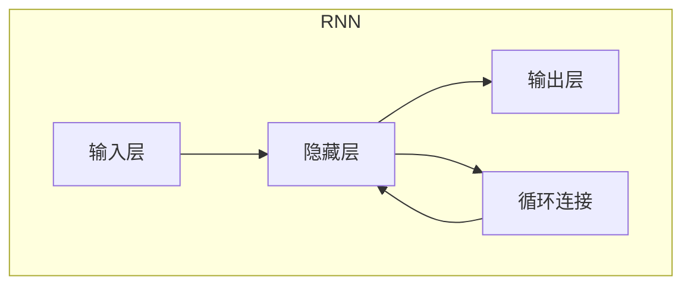

# 循环神经网络RNN原理与代码实例讲解

## 1.背景介绍

### 1.1 神经网络简介

神经网络是一种受生物神经系统启发而设计的计算模型,旨在模拟人脑处理信息的方式。它由大量互连的节点(神经元)组成,这些节点通过加权连接进行信息传递和处理。神经网络具有自适应学习能力,可以从数据中提取模式和特征,并用于各种任务,如分类、回归、聚类和预测等。

### 1.2 传统神经网络的局限性

传统的前馈神经网络(如多层感知器)在处理序列数据(如文本、语音和时间序列)时存在局限性。这些网络假设输入和输出之间是独立的,无法捕捉序列数据中的时间依赖关系。为了解决这个问题,循环神经网络(Recurrent Neural Networks, RNN)应运而生。

### 1.3 循环神经网络的优势

与传统神经网络不同,RNN通过引入循环连接,使得网络能够记住之前的状态,从而捕捉序列数据中的时间依赖关系。这使得RNN在处理序列数据时具有独特的优势,广泛应用于自然语言处理、语音识别、机器翻译等领域。

## 2.核心概念与联系

### 2.1 循环神经网络的基本结构

循环神经网络的基本结构由以下几个关键组成部分构成:

- **输入层(Input Layer)**: 接收当前时间步的输入数据。
- **隐藏层(Hidden Layer)**: 包含循环连接,用于捕捉序列数据的时间依赖关系。隐藏层的输出不仅取决于当前输入,还取决于前一时间步的隐藏状态。
- **输出层(Output Layer)**: 根据当前隐藏状态和输入,计算当前时间步的输出。

下面是RNN基本结构的Mermaid流程图:



### 2.2 RNN的前向传播过程

RNN的前向传播过程可以概括为以下步骤:

1. 在时间步t,接收输入$x_t$。
2. 根据前一时间步的隐藏状态$h_{t-1}$和当前输入$x_t$,计算当前隐藏状态$h_t$。
3. 根据当前隐藏状态$h_t$,计算当前时间步的输出$y_t$。
4. 将$h_t$传递到下一时间步,重复步骤1-3。

数学表示为:

$$h_t = f(W_{hx}x_t + W_{hh}h_{t-1} + b_h)$$
$$y_t = g(W_{yh}h_t + b_y)$$

其中,$f$和$g$分别是隐藏层和输出层的激活函数,如tanh或ReLU。$W$表示权重矩阵,$b$表示偏置向量。

### 2.3 RNN捕捉长期依赖的挑战

虽然RNN理论上可以捕捉任意长度的序列依赖关系,但在实践中,它难以学习到很长时间步之间的依赖关系。这是由于梯度消失或梯度爆炸问题导致的。为了解决这个问题,提出了长短期记忆网络(LSTM)和门控循环单元(GRU)等改进版本。

## 3.核心算法原理具体操作步骤  

### 3.1 RNN的反向传播

与传统神经网络类似,RNN也使用反向传播算法进行训练。但由于引入了循环连接,RNN的反向传播过程需要通过时间展开(Time Unfolding)将网络展开为前馈网络,然后应用反向传播算法计算梯度。

具体步骤如下:

1. 初始化网络权重和偏置。
2. 对于每个时间步:
    a. 进行前向传播,计算隐藏状态和输出。
    b. 计算输出层的损失。
3. 通过时间反向传播误差:
    a. 在最后一个时间步,计算输出层的梯度。
    b. 反向传播到前一时间步,计算隐藏层的梯度。
    c. 重复上一步,直到第一个时间步。
4. 累加所有时间步的梯度,更新网络权重和偏置。
5. 重复步骤2-4,直到收敛或达到最大迭代次数。

### 3.2 RNN的梯度问题

在训练过程中,RNN可能会遇到梯度消失或梯度爆炸的问题,这会导致网络无法有效地学习长期依赖关系。

- **梯度消失**: 由于反向传播过程中的乘积运算,梯度可能会指数级衰减,使得网络无法捕捉到长期依赖关系。
- **梯度爆炸**: 相反,如果权重矩阵中存在较大的值,梯度可能会指数级增长,导致数值不稳定。

为了缓解这些问题,可以采取以下策略:

- 初始化权重时使用较小的值。
- 使用梯度裁剪(Gradient Clipping)技术,限制梯度的范围。
- 使用LSTM或GRU等改进版本的RNN,它们具有更好的长期记忆能力。

## 4.数学模型和公式详细讲解举例说明

### 4.1 RNN的数学表示

RNN可以用以下公式表示:

$$h_t = f(W_{hx}x_t + W_{hh}h_{t-1} + b_h)$$
$$y_t = g(W_{yh}h_t + b_y)$$

其中:

- $x_t$是时间步t的输入向量。
- $h_t$是时间步t的隐藏状态向量。
- $y_t$是时间步t的输出向量。
- $W_{hx}$是输入到隐藏层的权重矩阵。
- $W_{hh}$是隐藏层到隐藏层的权重矩阵(循环连接)。
- $W_{yh}$是隐藏层到输出层的权重矩阵。
- $b_h$和$b_y$分别是隐藏层和输出层的偏置向量。
- $f$和$g$分别是隐藏层和输出层的激活函数,如tanh或ReLU。

### 4.2 LSTM的数学表示

LSTM是RNN的一种改进版本,它通过引入门控机制来解决梯度消失和梯度爆炸的问题。LSTM的数学表示如下:

$$f_t = \sigma(W_f[h_{t-1}, x_t] + b_f)$$ 
$$i_t = \sigma(W_i[h_{t-1}, x_t] + b_i)$$
$$\tilde{C}_t = \tanh(W_C[h_{t-1}, x_t] + b_C)$$
$$C_t = f_t \odot C_{t-1} + i_t \odot \tilde{C}_t$$
$$o_t = \sigma(W_o[h_{t-1}, x_t] + b_o)$$
$$h_t = o_t \odot \tanh(C_t)$$

其中:

- $f_t$是遗忘门(Forget Gate),用于控制保留上一时间步的细胞状态。
- $i_t$是输入门(Input Gate),用于控制当前输入与细胞状态的组合。
- $\tilde{C}_t$是候选细胞状态向量。
- $C_t$是当前时间步的细胞状态向量。
- $o_t$是输出门(Output Gate),用于控制细胞状态对隐藏状态的影响。
- $h_t$是当前时间步的隐藏状态向量。
- $\sigma$是sigmoid激活函数,用于门控值的计算。
- $\odot$表示元素wise乘积运算。

通过引入门控机制,LSTM可以更好地捕捉长期依赖关系,并缓解梯度消失和梯度爆炸的问题。

### 4.3 实例:情感分析

假设我们有一个情感分析任务,需要对给定的文本序列进行正面或负面情感的分类。我们可以使用RNN或LSTM来建模文本序列,并预测情感极性。

假设输入文本序列为"I really enjoyed the movie",我们将每个单词表示为one-hot向量,作为RNN的输入。假设隐藏层大小为4,输出层大小为2(正面和负面)。

初始状态:
$$h_0 = \begin{bmatrix}0\\0\\0\\0\end{bmatrix}, y_0 = \begin{bmatrix}0\\0\end{bmatrix}$$

第一个时间步(输入为"I"):
$$h_1 = \tanh(W_{hx}x_1 + W_{hh}h_0 + b_h)$$
$$y_1 = \text{softmax}(W_{yh}h_1 + b_y)$$

后续时间步以此类推,最终输出$y_T$即为对整个序列的情感预测。通过反向传播算法,我们可以调整网络权重,使其能够更准确地预测情感极性。

## 5.项目实践:代码实例和详细解释说明

在本节中,我们将使用Python和PyTorch库实现一个基本的RNN模型,并应用于情感分析任务。完整代码如下:

```python
import torch
import torch.nn as nn

# 定义RNN模型
class RNNModel(nn.Module):
    def __init__(self, input_size, hidden_size, output_size, num_layers=1):
        super(RNNModel, self).__init__()
        self.hidden_size = hidden_size
        self.num_layers = num_layers
        self.rnn = nn.RNN(input_size, hidden_size, num_layers, batch_first=True)
        self.fc = nn.Linear(hidden_size, output_size)

    def forward(self, x):
        # 初始化隐藏状态
        h0 = torch.zeros(self.num_layers, x.size(0), self.hidden_size)
        
        # 前向传播
        out, _ = self.rnn(x, h0)
        out = self.fc(out[:, -1, :])
        return out

# 准备数据
vocab_size = 10000  # 词汇表大小
input_size = 300    # 词嵌入维度
hidden_size = 128   # 隐藏层大小
output_size = 2     # 输出大小(正面/负面)
num_layers = 1      # RNN层数

# 创建模型实例
model = RNNModel(input_size, hidden_size, output_size, num_layers)

# 定义损失函数和优化器
criterion = nn.CrossEntropyLoss()
optimizer = torch.optim.Adam(model.parameters())

# 训练循环
for epoch in range(num_epochs):
    for inputs, labels in data_loader:
        # 前向传播
        outputs = model(inputs)
        loss = criterion(outputs, labels)
        
        # 反向传播
        optimizer.zero_grad()
        loss.backward()
        optimizer.step()

    # 打印损失
    print(f'Epoch [{epoch+1}/{num_epochs}], Loss: {loss.item():.4f}')
```

代码解释:

1. 我们定义了一个`RNNModel`类,继承自`nn.Module`。它包含一个`nn.RNN`层和一个全连接输出层。
2. `forward`函数实现了RNN的前向传播过程。我们首先初始化隐藏状态`h0`,然后将输入`x`和`h0`传递给`nn.RNN`层,获得输出`out`和最终隐藏状态。最后,我们将最后一个时间步的隐藏状态`out[:, -1, :]`传递给全连接层,得到最终输出。
3. 我们准备了模拟数据,包括词汇表大小、词嵌入维度、隐藏层大小、输出大小和RNN层数。
4. 创建模型实例,定义损失函数(交叉熵损失)和优化器(Adam优化器)。
5. 在训练循环中,我们对每个批次的输入进行前向传播,计算损失,执行反向传播并更新模型参数。
6. 打印每个epoch的损失值,以监控训练进度。

请注意,这只是一个基本的RNN实现示例。在实际应用中,您可能需要进行数据预处理、调整超参数、添加正则化等操作,以获得更好的性能。

## 6.实际应用场景

循环神经网络在各种序列数据处理任务中发挥着重要作用,包括但不限于以下场景:

### 6.1 自然语言处理(NLP)

- **机器翻译**: 将一种语言的句子翻译成另一种语言。
- **文本生成**: 根据给定的上下文,生成连贯的文本内容。
- **情感分析**: 分析文本的情感极性(正面或负面)。
- **