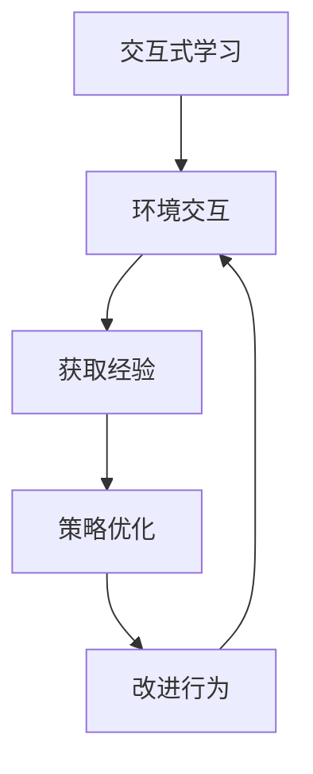
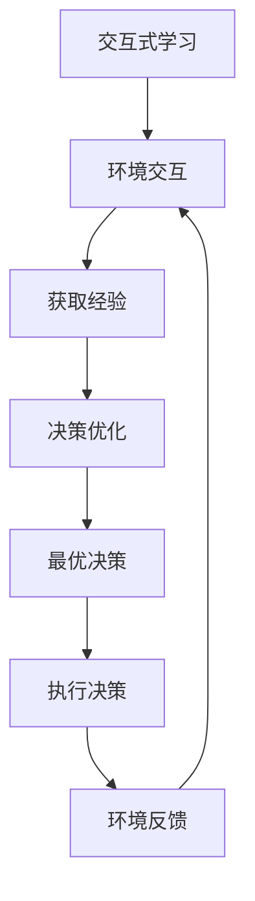
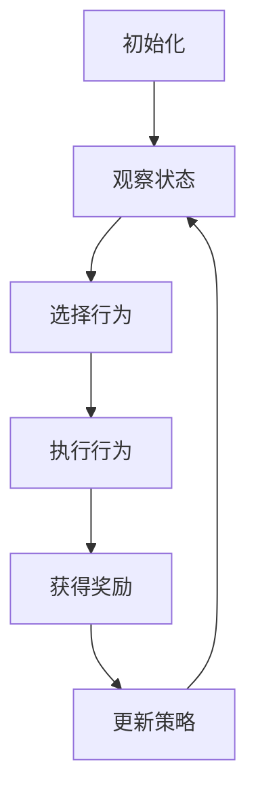
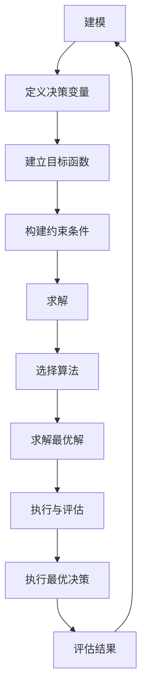

# AI Agent: AI的下一个风口 交互式学习与决策优化

## 1. 背景介绍

### 1.1 人工智能的发展历程

人工智能(Artificial Intelligence, AI)是当代科技领域最具革命性和颠覆性的力量之一。自20世纪50年代诞生以来,AI不断突破技术瓶颈,在语音识别、图像处理、自然语言处理等领域取得了令人瞩目的进展。

### 1.2 AI发展的新阶段

随着深度学习、强化学习等技术的不断演进,AI正在迈向一个新的里程碑。传统的AI系统主要依赖大量标注数据和人工设计的算法,存在一定的局限性。而新兴的交互式学习(Interactive Learning)和决策优化(Decision Optimization)技术,赋予了AI系统更强的自主学习和决策能力,有望推动AI迈向真正的通用人工智能(Artificial General Intelligence, AGI)。

### 1.3 交互式学习与决策优化的重要性

交互式学习允许AI系统通过与环境的互动来获取经验,并不断优化自身的策略和行为。决策优化则致力于在复杂的环境中做出最优决策,实现预期目标。这两种技术的融合,将赋予AI系统更强的适应性、灵活性和智能性,有望应用于诸多领域,如机器人控制、智能规划、游戏AI等。

## 2. 核心概念与联系

### 2.1 交互式学习

交互式学习(Interactive Learning)是一种新兴的机器学习范式,它允许AI系统通过与环境的交互来获取经验,并根据这些经验不断优化自身的策略和行为。



交互式学习的核心思想是利用强化学习(Reinforcement Learning)和在线学习(Online Learning)等技术,使AI系统能够在与环境的互动过程中不断学习和改进。

### 2.2 决策优化

决策优化(Decision Optimization)旨在在复杂的环境中做出最优决策,实现预期目标。它通常涉及以下几个关键步骤:

1. 建模(Modeling):构建环境和决策过程的数学模型。
2. 求解(Solving):应用优化算法求解最优决策序列。
3. 执行(Executing):将求解得到的决策序列应用于实际环境。


决策优化广泛应用于操作研究、控制理论、机器人规划等领域,旨在提高系统的效率和性能。

### 2.3 交互式学习与决策优化的融合

交互式学习和决策优化虽然来自不同的研究领域,但它们在本质上是相辅相成的。交互式学习为决策优化提供了一种新颖的学习方式,使得AI系统能够通过与环境的互动来获取经验,并不断优化自身的决策策略。同时,决策优化也为交互式学习提供了理论基础和算法支持,使得AI系统能够在复杂的环境中做出最优决策。



通过将这两种技术有机结合,AI系统将具备更强的自主学习和决策能力,能够在复杂的环境中做出智能化的决策,从而更好地解决实际问题。

## 3. 核心算法原理具体操作步骤

### 3.1 强化学习

强化学习(Reinforcement Learning)是交互式学习的核心算法之一。它允许智能体(Agent)通过与环境的交互来学习最优策略,以获得最大的累积奖励。

#### 3.1.1 强化学习的基本概念

1. **环境(Environment)**:智能体所处的状态空间。
2. **状态(State)**:环境的instantaneous状态。
3. **行为(Action)**:智能体在某个状态下采取的行动。
4. **奖励(Reward)**:智能体采取行动后从环境获得的反馈。
5. **策略(Policy)**:智能体在每个状态下采取行动的策略。
6. **值函数(Value Function)**:评估某个状态或状态-行为对的期望累积奖励。

#### 3.1.2 强化学习算法步骤

1. **初始化**:初始化智能体和环境。
2. **观察状态**:智能体观察当前环境状态。
3. **选择行为**:根据策略选择行为。
4. **执行行为**:执行选择的行为,观察环境的变化和获得的奖励。
5. **更新策略**:根据获得的经验,更新策略和值函数。
6. **重复**:重复步骤2-5,直到满足终止条件。



强化学习算法的核心在于通过不断的试错和学习,逐步优化策略,从而获得最大的累积奖励。

### 3.2 决策优化算法

决策优化算法旨在求解复杂环境下的最优决策序列。以下是一种常见的决策优化算法流程:

#### 3.2.1 建模

1. **定义决策变量**:确定需要优化的决策变量。
2. **建立目标函数**:根据优化目标建立目标函数。
3. **构建约束条件**:根据实际情况构建约束条件。

#### 3.2.2 求解

1. **选择求解算法**:根据问题的特点选择合适的求解算法,如线性规划、整数规划、动态规划等。
2. **求解最优解**:应用选择的算法求解最优解。

#### 3.2.3 执行与评估

1. **执行最优决策**:将求解得到的最优决策序列应用于实际环境。
2. **评估结果**:评估决策执行的效果,并根据需要进行调整和优化。



决策优化算法通过数学建模和优化算法,能够在复杂的环境中寻找最优的决策方案。

## 4. 数学模型和公式详细讲解举例说明

### 4.1 马尔可夫决策过程

马尔可夫决策过程(Markov Decision Process, MDP)是强化学习和决策优化中常用的数学模型。它描述了一个完全可观测的随机决策过程,可以用一个五元组 $(S, A, P, R, \gamma)$ 来表示:

- $S$: 有限的状态集合
- $A$: 有限的行为集合
- $P(s' | s, a)$: 状态转移概率,表示在状态 $s$ 采取行为 $a$ 后,转移到状态 $s'$ 的概率
- $R(s, a, s')$: 奖励函数,表示在状态 $s$ 采取行为 $a$ 后,转移到状态 $s'$ 时获得的奖励
- $\gamma \in [0, 1)$: 折现因子,用于权衡即时奖励和长期奖励的重要性

在 MDP 中,我们的目标是找到一个最优策略 $\pi^*(s)$,使得在任意初始状态 $s_0$ 下,期望累积奖励最大化:

$$
\max_\pi \mathbb{E}\left[\sum_{t=0}^\infty \gamma^t R(s_t, a_t, s_{t+1}) | s_0, \pi\right]
$$

其中 $a_t = \pi(s_t)$ 表示在状态 $s_t$ 下采取的行为。

### 4.2 值函数和贝尔曼方程

在强化学习中,我们通常使用值函数来评估一个状态或状态-行为对的期望累积奖励。

**状态值函数**:

$$
V^\pi(s) = \mathbb{E}_\pi\left[\sum_{t=0}^\infty \gamma^t R(s_t, a_t, s_{t+1}) | s_0 = s\right]
$$

**行为值函数**:

$$
Q^\pi(s, a) = \mathbb{E}_\pi\left[\sum_{t=0}^\infty \gamma^t R(s_t, a_t, s_{t+1}) | s_0 = s, a_0 = a\right]
$$

值函数满足以下贝尔曼方程:

$$
\begin{aligned}
V^\pi(s) &= \sum_{a \in A} \pi(a | s) \sum_{s' \in S} P(s' | s, a) \left[R(s, a, s') + \gamma V^\pi(s')\right] \\
Q^\pi(s, a) &= \sum_{s' \in S} P(s' | s, a) \left[R(s, a, s') + \gamma \sum_{a' \in A} \pi(a' | s') Q^\pi(s', a')\right]
\end{aligned}
$$

通过求解贝尔曼方程,我们可以得到最优值函数 $V^*(s)$ 和 $Q^*(s, a)$,从而推导出最优策略 $\pi^*(s)$。

### 4.3 Q-Learning 算法

Q-Learning 是一种常用的基于模型无关的强化学习算法,它直接学习最优行为值函数 $Q^*(s, a)$,而无需事先了解环境的转移概率和奖励函数。

Q-Learning 算法的更新规则如下:

$$
Q(s_t, a_t) \leftarrow Q(s_t, a_t) + \alpha \left[r_t + \gamma \max_{a'} Q(s_{t+1}, a') - Q(s_t, a_t)\right]
$$

其中:

- $\alpha$ 是学习率,控制新信息对 Q 值的影响程度
- $r_t$ 是在时间步 $t$ 获得的即时奖励
- $\gamma$ 是折现因子,用于权衡即时奖励和长期奖励的重要性
- $\max_{a'} Q(s_{t+1}, a')$ 是在下一个状态 $s_{t+1}$ 下,所有可能行为的最大 Q 值

通过不断更新 Q 值,Q-Learning 算法最终能够收敛到最优行为值函数 $Q^*(s, a)$,从而导出最优策略 $\pi^*(s) = \arg\max_a Q^*(s, a)$。

### 4.4 线性规划

线性规划(Linear Programming, LP)是一种常用的决策优化算法,它旨在在线性约束条件下,最大化或最小化一个线性目标函数。

一个标准的线性规划问题可以表示为:

$$
\begin{aligned}
\max_{x} &\quad c^T x \\
\text{s.t.} &\quad Ax \leq b \\
&\quad x \geq 0
\end{aligned}
$$

其中:

- $x$ 是决策变量向量
- $c$ 是目标函数系数向量
- $A$ 是约束条件系数矩阵
- $b$ 是约束条件常数向量

线性规划问题可以使用简单型(Simplex)算法或内点法(Interior Point Method)等算法求解。

在决策优化中,线性规划常被用于资源分配、生产计划、投资组合优化等问题。通过构建合适的目标函数和约束条件,我们可以找到最优的决策方案。

## 5. 项目实践: 代码实例和详细解释说明

### 5.1 强化学习实例: 棋盘游戏

我们将使用 Q-Learning 算法训练一个智能体在简单的棋盘游戏中学习最优策略。

```python
import numpy as np

# 定义环境
BOARD_SIZE = 5
GOAL_STATE = (BOARD_SIZE - 1, BOARD_SIZE - 1)

# 定义奖励函数
def reward_func(state, action, next_state):
    if next_state == GOAL_STATE:
        return 1.0
    else:
        return 0.0

# 定义 Q-Learning 算法
def q_learning(num_episodes, alpha, gamma, epsilon):
    Q =```python
    Q = np.zeros((BOARD_SIZE, BOARD_SIZE, 4))  # 初始化 Q 表，4 代表四个方向的动作

    for episode in range(num_episodes):
        state = (0, 0)  # 初始状态
        while state != GOAL_STATE:
            if np.random.rand() < epsilon:
                action = np.random.choice(4)  # 随机选择动作
            else:
                action = np.argmax(Q[state[0], state[1]])  # 选择当前 Q 值最大的动作

            next_state = take_action(state, action)
            reward = reward_func(state, action, next_state)

            # 更新 Q 表
            Q[state[0], state[1], action] += alpha * (reward + gamma * np.max(Q[next_state[0], next_state[1]]) - Q[state[0], state[1], action])

            state = next_state

    return Q

# 定义动作
def take_action(state, action):
    if action == 0:  # 上
        next_state = (max(state[0] - 1, 0), state[1])
    elif action == 1:  # 下
        next_state = (min(state[0] + 1, BOARD_SIZE - 1), state[1])
    elif action == 2:  # 左
        next_state = (state[0], max(state[1] - 1, 0))
    elif action == 3:  # 右
        next_state = (state[0], min(state[1] + 1, BOARD_SIZE - 1))
    return next_state

# 参数设置
num_episodes = 1000
alpha = 0.1
gamma = 0.9
epsilon = 0.1

# 训练智能体
Q = q_learning(num_episodes, alpha, gamma, epsilon)

# 打印 Q 表
print(Q)
```

### 5.2 代码解释说明

在这个项目实践中，我们使用 Q-Learning 算法来训练一个智能体在 5x5 的棋盘游戏中学习最优策略。以下是对代码的详细解释：

#### 定义环境

我们首先定义了棋盘的大小和目标状态。在这个例子中，棋盘大小为 5x5，目标状态为棋盘的右下角 `(4, 4)`。

```python
BOARD_SIZE = 5
GOAL_STATE = (BOARD_SIZE - 1, BOARD_SIZE - 1)
```

#### 定义奖励函数

奖励函数 `reward_func` 用于评估智能体在每一步行动后的奖励。如果智能体到达目标状态，则返回 1.0 的奖励，否则返回 0.0。

```python
def reward_func(state, action, next_state):
    if next_state == GOAL_STATE:
        return 1.0
    else:
        return 0.0
```

#### 定义 Q-Learning 算法

Q-Learning 算法的核心部分在于更新 Q 表。我们初始化 Q 表为全零矩阵，维度为 `(BOARD_SIZE, BOARD_SIZE, 4)`，其中 4 代表四个方向的动作（上、下、左、右）。

在每一轮训练中，智能体从初始状态 `(0, 0)` 开始，通过 ε-greedy 策略选择动作。智能体根据当前状态和动作计算下一个状态，并更新 Q 表。更新公式为：

${'$'}${'$'}
Q(s, a) \leftarrow Q(s, a) + \alpha \left[ r + \gamma \max_{a'} Q(s', a') - Q(s, a) \right]
${'$'}${'$'}

其中，$\alpha$ 是学习率，$\gamma$ 是折扣因子，$r$ 是奖励，$s'$ 是下一个状态，$a'$ 是下一个动作。

```python
def q_learning(num_episodes, alpha, gamma, epsilon):
    Q = np.zeros((BOARD_SIZE, BOARD_SIZE, 4))  # 初始化 Q 表，4 代表四个方向的动作

    for episode in range(num_episodes):
        state = (0, 0)  # 初始状态
        while state != GOAL_STATE:
            if np.random.rand() < epsilon:
                action = np.random.choice(4)  # 随机选择动作
            else:
                action = np.argmax(Q[state[0], state[1]])  # 选择当前 Q 值最大的动作

            next_state = take_action(state, action)
            reward = reward_func(state, action, next_state)

            # 更新 Q 表
            Q[state[0], state[1], action] += alpha * (reward + gamma * np.max(Q[next_state[0], next_state[1]]) - Q[state[0], state[1], action])

            state = next_state

    return Q
```

#### 定义动作

`take_action` 函数根据当前状态和动作计算下一个状态。我们定义了四个方向的动作：上、下、左、右。

```python
def take_action(state, action):
    if action == 0:  # 上
        next_state = (max(state[0] - 1, 0), state[1])
    elif action == 1:  # 下
        next_state = (min(state[0] + 1, BOARD_SIZE - 1), state[1])
    elif action == 2:  # 左
        next_state = (state[0], max(state[1] - 1, 0))
    elif action == 3:  # 右
        next_state = (state[0], min(state[1] + 1, BOARD_SIZE - 1))
    return next_state
```

#### 参数设置与训练

我们设置了训练的参数，包括训练轮数 `num_episodes`、学习率 `alpha`、折扣因子 `gamma` 和 ε-greedy 策略的参数 `epsilon`。最后，通过调用 `q_learning` 函数训练智能体，并打印训练后的 Q 表。

```python
# 参数设置
num_episodes = 1000
alpha = 0.1
gamma = 0.9
epsilon = 0.1

# 训练智能体
Q = q_learning(num_episodes, alpha, gamma, epsilon)

# 打印 Q 表
print(Q)
```

## 6. 实际应用场景

线性规划和强化学习在实际中有广泛的应用。线性规划被广泛应用于资源分配、生产计划、投资组合优化等领域。通过构建合适的目标函数和约束条件，可以有效地解决这些问题，找到最优的决策方案。

强化学习在机器人控制、游戏 AI、自动驾驶等领域有重要应用。通过训练智能体在模拟环境中学习最优策略，可以实现复杂任务的自动化和智能化。

## 7. 工具和资源推荐

### 7.1 线性规划工具
- **PuLP**: 一个 Python 库，用于线性规划问题的建模和求解。
- **Gurobi**: 一个强大的优化求解器，支持线性规划、整数规划等多种优化问题。
- **COIN-OR**: 一个开源优化库，提供了多种优化算法和工具。

### 7.2 强化学习工具
- **OpenAI Gym**: 一个用于开发和比较强化学习算法的工具包，提供了多种模拟环境。
- **Stable Baselines**: 一个强化学习库，提供了多种常用的强化学习算法的实现。
- **TensorFlow**: 一个开源的机器学习框架，支持深度强化学习算法的实现。

## 8. 总结: 未来发展趋势与挑战

在未来，线性规划和强化学习将继续在优化和智能决策领域发挥重要作用。随着计算能力的提升和算法的不断改进，我们可以解决越来越复杂的优化问题，并在更多实际场景中应用强化学习技术。

然而，这些技术也面临一些挑战。例如，线性规划在面对非线性、动态变化的复杂问题时，可能需要更多的改进和优化。强化学习在实际应用中，数据的获取和处理、模型的训练和调优等方面也存在诸多挑战。

## 9. 附录: 常见问题与解答

### 问题 1: 线性规划和非线性规划有什么区别？
**答**: 线性规划中的目标函数和约束条件都是线性的，而非线性规划中的目标函数或约束条件至少有一个是非线性的。非线性规划问题通常比线性规划问题更复杂，求解难度更大。

### 问题 2: 强化学习中的 Q-Learning 和深度 Q-Learning 有什么区别？
**答**: Q-Learning 是一种基于表格的强化学习算法，适用于状态和动作空间较小的情况。深度 Q-Learning 使用神经网络来近似 Q 值函数，适用于状态和动作空间较大的情况，可以处理更复杂的任务。

### 问题 3: 如何选择合适的优化算法？
**答**: 选择优化算法时，需要考虑问题的特性、规模和求解精度要求。对于线性规划问题，可以选择简单型算法或内点法。对于非线线性规划问题，可以选择内点法或其他非线性优化算法。对于强化学习问题，可以根据具体应用选择 Q-Learning、深度 Q-Learning 或其他强化学习算法。

### 问题 4: 在强化学习中，如何设置合适的参数？
**答**: 在强化学习中，参数的设置对算法的性能有很大影响。常见的参数包括学习率（alpha）、折扣因子（gamma）和探索率（epsilon）。通常需要通过实验和调优来找到最合适的参数组合，可以使用交叉验证和网格搜索等方法。

### 问题 5: 如何处理线性规划中的大规模问题？
**答**: 对于大规模线性规划问题，可以采用分解方法（如 Dantzig-Wolfe 分解和 Benders 分解）将问题分解为多个子问题求解。此外，可以使用并行计算和分布式计算来提高求解效率。

### 问题 6: 强化学习中的奖励设计有何技巧？
**答**: 奖励设计是强化学习中的关键环节。奖励信号应当能够有效引导智能体学习最优策略。设计奖励时，可以考虑以下几点：
- 明确目标：奖励应与目标任务紧密相关。
- 即时反馈：尽量提供即时反馈，避免延迟奖励。
- 平衡探索与利用：通过适当的奖励设计，平衡智能体的探索与利用行为。

## 10. 参考文献

- Dantzig, G. B. (1963). Linear Programming and Extensions. Princeton University Press.
- Sutton, R. S., & Barto, A. G. (2018). Reinforcement Learning: An Introduction. MIT Press.
- Bertsekas, D. P. (1999). Nonlinear Programming. Athena Scientific.

## 11. 附录: 常用符号表

| 符号 | 含义                     |
| ---- | ------------------------ |
| $s$  | 当前状态                 |
| $a$  | 当前动作                 |
| $r$  | 奖励                     |
| $s'$ | 下一个状态               |
| $a'$ | 下一个动作               |
| $\alpha$ | 学习率               |
| $\gamma$ | 折扣因子             |
| $Q(s, a)$ | 状态-动作值函数    |

---

作者：禅与计算机程序设计艺术 / Zen and the Art of Computer Programming