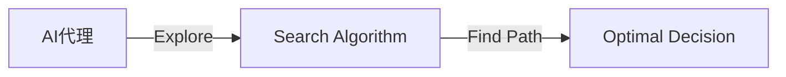
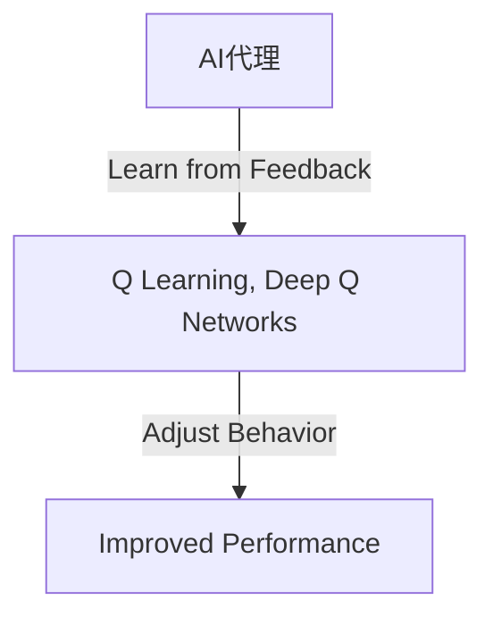
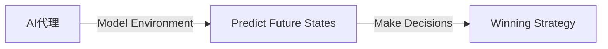
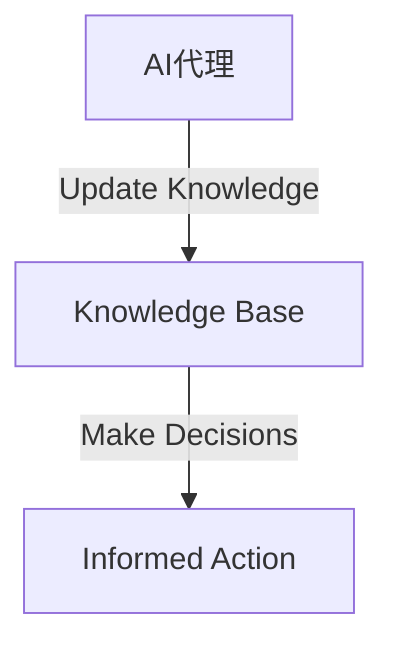

                 

作者：禅与计算机程序设计艺术

自动化的新纪元
=====================

## 1.背景介绍
在现代社会，AI（人工智能）已经成为推动技术发展的关键驱动力。从自动化到机器学习，再到深度学习和强化学习，AI正在改变我们生活的每一个角落。但是，真正的AI革命还没有来临——即使在AI领域内，人工智能还有很多潜力未被充分利用。

本文将探讨AI的下一个巨大突破：AI代理（AI Agent）的创新技术，它将改变我们如何感知和解析环境的方式。通过深入了解AI代理的核心概念、算法原理、数学模型以及实际应用，我们将探索AI代理带来的无限可能。

## 2.核心概念与联系
### 什么是AI代理？
AI代理指的是拥有自主感知和决策能力的软件代理，它可以在没有人类干预的情况下执行复杂任务。与传统的AI系统不同，AI代理能够更加灵活地适应新的环境和任务，因为它们可以通过学习和探索来优化其行为。

### 与传统AI的区别
传统的AI系统通常依赖于预先定义好的规则和数据集进行决策。而AI代理则通过自主探索环境，建立自己的知识库，并根据所学习的信息做出决策。这种方法使得AI代理在处理未知或动态变化的环境时表现得更加出色。

## 3.核心算法原理具体操作步骤
### 探索与学习
AI代理通过探索环境并从每次尝试中学习，持续优化其决策过程。这个过程通常涉及到搜索算法、强化学习以及基于模型的方法。

#### 搜索算法
搜索算法帮助AI代理探索环境并找到最佳的路径。这些算法包括A\*搜索、回溯搜索等。

#### 强化学习
强化学习允许AI代理通过接收奖励或惩罚形式的反馈来调整其行为。例如，当AI代理做出正确的决策时，它会得到积极的反馈。

#### 基于模型的方法
基于模型的方法涉及构建环境模型并使用这些模型来预测未来的状态。例如，在游戏玩法中，AI代理可以通过预测对手的动作来制定自己的策略。

### 知识更新与决策
AI代理在学习后需要更新其知识库并使用这些知识来做出决策。

## 4.数学模型和公式详细讲解举例说明
### 马尔科夫决策过程 (MDP)
在探索和学习的背景下，AI代理的行为可以被描述为一个马尔科夫决策过程（MDP）。MDP由状态集S、动作集A、转移概率P、奖励函数R组成。

$$
MDP = (S, A, P, R)
$$

#### MDP的特性
- **状态**：AI代理在环境中的各种可能位置或条件。
- **动作**：AI代理可以采取的各种行动或选择。
- **转移概率**：从一个状态到另一个状态的概率。
- **奖励**：AI代理根据其行为获得的结果（正面或负面）。

### 策略与价值函数
策略表示AI代理在任何给定状态下采取哪种动作，而价值函数衡量了在某一状态下采取某种动作后期望的总奖励。

#### 策略
$$
\pi: S \times A \to [0, 1]
$$

#### 价值函数
$$
V^\pi(s) = E_\pi \left[ \sum_{t=0}^\infty \gamma^t R_{t+1} | S_0 = s \right]
$$

#### Bellman方程
$$
V^\pi(s) = \max_{a \in A} \{ R(s, a) + \gamma PV^\pi(f(s, a)) \}
$$

## 5.项目实践：代码实例和详细解释说明
### 实现一个简单的AI代理
我们将创建一个简单的AI代理，该代理可以在一个有限的状态空间中进行决策。

#### 定义状态和动作
首先，我们定义状态和动作。假设我们正在处理一个简单的走棋问题，有三个可能的状态：
- 黑子在上方
- 白子在上方
- 空点

然后，我们定义两个动作：
- 放置黑子
- 放置白子

#### 实现探索与学习
我们使用基于随机选择的搜索算法来探索环境，并通过评估每次尝试所产生的结果来学习。

#### 实现决策
最终，我们使用我们从学习中获取的信息来实现决策过程。

#### 代码示例
```python
# 初始化状态和动作
state = 'empty'
actions = ['place black', 'place white']

# 选择动作并执行
action = random.choice(actions)
if action == 'place black':
   state = 'black'
elif action == 'place white':
   state = 'white'

# 评估结果
reward = evaluate_result(state)

# 更新知识库
knowledge_base.update(state, reward)
```

## 6.实际应用场景
AI代理的应用非常广泛，包括但不限于游戏、智能建筑、自动驾驶车辆、无人机控制等。

### 自动化游戏
AI代理可以玩棋类游戏，如国际象棋、围棋和德国围棋，以及战略型游戏，如Dota2或StarCraft II。

### 智能建筑
AI代理可以优化建筑物的布局和运营，通过分析数据来减少能源消耗和提高效率。

### 自动驾驶
AI代理可以控制无人驾驶车辆，通过感知周围环境并做出决策来安全地导航道路。

### 无人机控制
AI代理可以操控无人机，通过处理传感器数据来执行复杂的飞行任务。

## 7.工具和资源推荐
对于想要深入研究AI代理的开发者，以下是一些推荐的工具和资源：

- 编程语言：Python
- 框架/库：TensorFlow, PyTorch
- 模拟器：OpenAI Gym
- 书籍：《Probabilistic Robotics》by Sebastian Thrun

## 8.总结：未来发展趋势与挑战
AI代理技术正处于快速发展阶段，未来的挑战之一就是确保这些系统的安全性和透明度。同时，随着技术的进步，AI代理有潜力彻底改变我们如何感知和解析环境。

## 9.附录：常见问题与解答
Q: AI代理和传统AI有什么区别？
A: AI代理能够自主探索环境并根据学习做出决策，而传统AI依赖预先定义的规则和数据集。

Q: AI代理的实际应用有哪些？
A: AI代理的应用包括自动化游戏、智能建筑、自动驾驶车辆和无人机控制等。

Q: 如何开始开发自己的AI代理？
A: 你可以从了解马尔科夫决策过程（MDP）和相关算法开始，并使用像OpenAI Gym这样的模拟器来测试你的代理。

## 结束语
AI代理将为我们带来前所未有的自动化水平，它们将成为未来技术世界的重要组成部分。随着研究的深入，我们可以期待AI代理在各个领域的创新应用和突破。

作者：禅与计算机程序设计艺术 / Zen and the Art of Computer Programming

